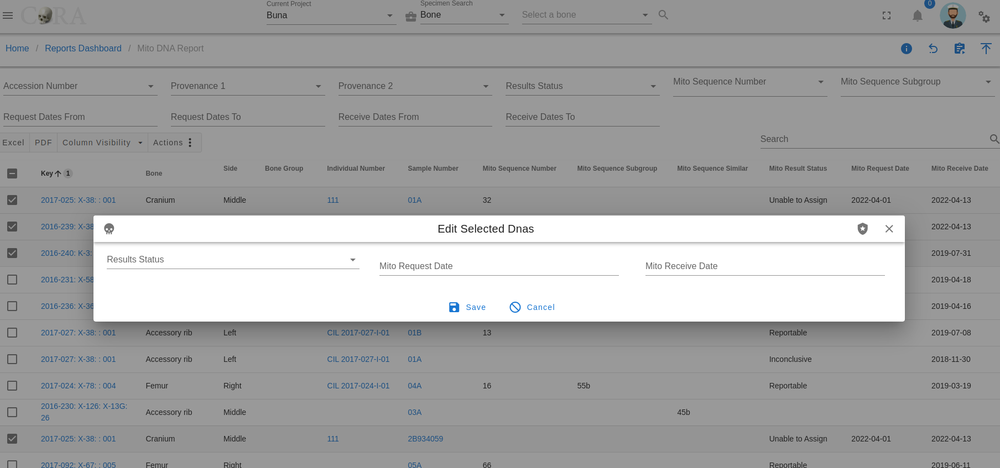

# DNA

DNA can be an important step in the identification process of missing persons. If your project chooses to use DNA analysis
as part of your identification process then you have come to the right place. Here you will learn more about the DNA module 
in CoRA. A critical first step is to cut a sample of the specimen for DNA analysis and then assign a sample number to it
for tracking purposes and after you get results from your DNA lab you can capture DNA information here to create a
DNA Profile for further analysis.

## Create a DNA Sample

The DNA sample and Profile are associated with a specimen, so you must first choose a specimen for which you want to create
a DNA sample for. You can choose a specimen by navigating to the specimen screen from either the specimen search results screen 
or from any data table row that has a specimen link on it. All search and reports screens have specimen links on them. Simply
click these links to navigate to the specimen view/edit screen. Once on the specimen screen you can navigate to the Specimen
Action or Details, and then to the DNA Profile menu.

CoRA's intellisense will automatically take you to the Create DNA sample screen, if this is the first DNA sample you are 
trying to create for this specimen or will take you to the DNA list screen if a DNA Sample was previously created for this
specimen. Note you can create multiple DNA samples for a specimen. 

!!! tip

    CoRA allows you to create multiple DNA samples for a specimen. If you have multiple dna samples, CoRA will create a
    Consensus DNA Profile for you with data from the multiple samples. Consensus DNA Profile is a powerful feature of CoRA.

> The screen fields are shown below. Fields in bold are required.

Attributes           |Data Type      |Size       |Validation Rule                                        |Required/Optional
---------------------|---------------|-----------|-------------------------------------------------------|-------------
**Sample Number**    |Alphanumeric   |8 chars    |an only contain letters and numbers                    |Required
**Lab**              |Id             |id         |valid labs via dropdown setup for the org              |Required
External Case Number |String         |32 chars   |                                                       |Optional

Clicking Save will take you to the DNA Profile screen. You can visit the DNA Profile screen once you have received data from your
DNA processing lab to enter DNA related data.

-------------

## Edit DNA Profile

Specimens which have had a DNA sample successfully created will have an associated DNA Profile. The DNA profile contains all 
the relevant DNA attributes and are editable via action (user must have appropriate role and permissions). 

You can visit the DNA Profile screen once you have received data from your DNA processing lab to enter DNA related data to build
the DNA Profile for the specimen. On this screen click the pencil icon on the top right corner to edit the DNA profile. 

> The screen fields are shown below. Fields in bold are required.

Attributes                 |Data Type      |Size       |Validation Rule                                        |Required/Optional
---------------------------|---------------|-----------|-------------------------------------------------------|-------------
**Lab**                    |Id             |id         |valid labs via dropdown setup for the org              |Required
External Case Number       |String         |32 chars   |                                                       |Optional
BTB Request Date           |Date           |           |                                                       |Optional
BTB Receive Date           |Date           |           |must be greater than BTB Request Date                  |Optional
Disposition                |String         |16 chars   |valid disposition via dropdown                         |Optional
Sample Condition           |String         |16 chars   |valid sample condition via dropdown                    |Optional
Weight Sample Remaining    |Decimal        |           |                                                       |Optional
Recommended for Resampling |Boolean        |           |true/false toggle                                      |Optional

Click on Save if any of the fields were updated

!!! tip

    The DNA profile has attributes to track Mito, autosomal and ystr components of the specimen DNA.

### Mito

Click the pencil icon on the top right corner to update the DNA Mito information. 

> The screen fields are shown below. Fields in bold are required.

Attributes                 |Data Type      |Size       |Validation Rule                                        |Required/Optional
---------------------------|---------------|-----------|-------------------------------------------------------|--------------
**Method**                 |Id             |id         |valid methods via dropdown setup for the org           |Required
Request Date               |Date           |           |                                                       |Optional
Receive Date               |Date           |           |must be greater than Request Date                      |Optional
Results Status             |String         |32 chars   |valid results status via dropdown                      |Optional
Mito Sequence Number       |String         |16 chars   |                                                       |Optional
Mito Sequence Subgroup     |String         |16 chars   |                                                       |Optional
Mito Sequence Similar      |String         |16 chars   |                                                       |Optional
Base Pairs                 |String         |256 chars  |                                                       |Optional
Count                      |Number         |           |                                                       |Optional
Population Frequency       |Number         |           |                                                       |Optional
Confirmed Regions          |String         |256 chars  |                                                       |Optional
Mito Polymorphisms         |String         |256 chars  |                                                       |Optional
Mito Haplogroup            |Id             |id         |valid haplogroups via dropdown setup for the org       |Optional
MCC Date                   |Date           |           |                                                       |Optional

Click on Save if any of the fields were updated

You will be able to see how many fields that were completed under Mito Form. You will see X/14 fields are filled. 

### Auto / AuStr

Click on the auto / austr Tab to update the autosomal DNA fields. 

Click the pencil icon on the top right corner and then click on the auto/austr tab to update the autosomal DNA fields.

> The screen fields are shown below. Fields in bold are required.

Attributes                 |Data Type      |Size       |Validation Rule                                        |Required/Optional
---------------------------|---------------|-----------|-------------------------------------------------------|-------------
**Method**                 |Id             |id         |valid methods via dropdown setup for the org           |Required
Request Date               |Date           |           |                                                       |Optional
Receive Date               |Date           |           |must be greater than Request Date                      |Optional
Results Status             |String         |32 chars   |valid results status via dropdown                      |Optional
Auto Sequence Number       |String         |16 chars   |                                                       |Optional
Auto Sequence Subgroup     |String         |16 chars   |                                                       |Optional
Auto Sequence Similar      |String         |16 chars   |                                                       |Optional
Number of Loci             |String         |256 chars  |                                                       |Optional
Loci                       |String         |256 chars  |                                                       |Optional
MCC Date                   |Date           |           |                                                       |Optional

Click on Save if any of the fields were updated

You will be able to see how many fields that were completed under auto / austr tab. You will see X/10 fields are filled.

### Ystr

Click on the Ystr Tab to the update the Ystr DNA fields. 

Click the pencil icon on the top right corner and then click on the Ystr tab to update the Ystr DNA fields.

> The screen fields are shown below. Fields in bold are required.

Attributes                 |Data Type      |Size       |Validation Rule                                        |Required/Optional
---------------------------|---------------|-----------|-------------------------------------------------------|--------------
**Method**                 |Id             |id         |valid methods via dropdown setup for the org           |Required
Request Date               |Date           |           |                                                       |Optional
Receive Date               |Date           |           |must be greater than Request Date                      |Optional
Results Status             |String         |32 chars   |valid results status via dropdown                      |Optional
Ystr Sequence Number       |String         |16 chars   |                                                       |Optional
Ystr Sequence Subgroup     |String         |16 chars   |                                                       |Optional
Ystr Sequence Similar      |String         |16 chars   |                                                       |Optional
Number of Loci             |String         |256 chars  |                                                       |Optional
Loci                       |String         |256 chars  |                                                       |Optional
Count                      |Number         |           |                                                       |Optional
Population Frequency       |Number         |           |                                                       |Optional
Ystr Haplogroup            |Id             |id         |valid haplogroups via dropdown setup for the org       |Optional
MCC Date                   |Date           |           |                                                       |Optional

Click on Save if any of the fields were updated

You will be able to see how many fields that were completed under auto / austr tab. You will see X/13 fields are filled.

## Batch Edit DNA

Select multiple DNA profiles by clicking on the boxes next to the ones you wish to edit, go to the Actions tab, and select Batch Edit.

In the popup, select the changes you wish to make and then click on the save icon.

