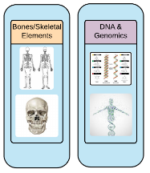

# Modules

## Design Methodology

CoRA is built on an architectural framework consisting of various components including some core components such as the navigational and authentication components. The rest of the site is logically structured around modules, which are plugged into the framework and they interact with each other.

## Modules

CoRA is structured around some core modules such as Specimens, DNA, Isotopes, Dental, Missing Persons and Individuals modules. Each of these modules 
is described in more detail below.

### Specimens

### DNA

### Isotopes

### Dental

### Missing Persons

### Individual

An individual is a collection of specimens that the forensic anthropologist believe should go together and belong to an unknown individual. The selection of specimens that go together is done in blind so as to not introduce any bias towards the segregation process.

