# Individual Analytics Dashboard
## Overview
The Individual Analytics page allows users to view, analyze, and visualize biological and computed data for each individual record in the project. It serves as a centralized workspace for both detailed data tables and summary analytics

Each individual may have multiple specimens, and each specimen may have multiple methods for determining:

* Age
* Sex
* Ancestry
* Stature

The page consists of two main sections:

**1. Biological Information & Computed Statistic** - presented through detailed data table
**2. Dashboard Visualization** - an interactive set of pie chart widgets summarizing specimen-level data.

## Navigation
To access the Individual Analytics, use the left sidebar and select `Individual`. From the individual menu, choose `Individual Analytics` The page will appear with various widgets and visual summaries.

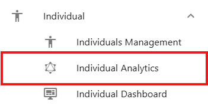{ width="350" }

## Selecting an Individual
### Individual Numbers Dropdown
At the top of the page, users must first select an Individual Number from a dropdown list. 

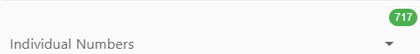{ width="400" }

Once selected, the system automatically:

* Loads all associated specimens and methods for that individual
* Retrieves the latest biological and computed statistics
* Refreshes both the data tables and dashboard charts

If any statistics are outdated or missing (for example, computed age or stature), the system automatically updates them before displaying results.

### Group option
Next to the dropdown is a Group Checkbox.

{ width="100" }

When selected, this option groups together all related individual records (for example: `CIL 2003-116-G-01`, `CIL 2003-116-G-01.1`, `CIL 2003-116-G-01.2`) and show all their specimens combined in one view.

This feature is especially useful when multiple individuals are part of a grouped or related case.

### Run Stats Button
The Run Stats button allows users to manually refresh computed statistics for the selected individual. 

{ width="50" }

Use this when:

* New specimens have been added or removed.
* Methods have been updated.
* You want to ensure you're viewing the most recent computations without reloading the page.

When clicked, it will:

* Recalculate all relevant stats (age, sex, ancestry, stature).
* Refresh both data tables and dashboard widgets.

### Highlight Bar
Located directly below the selection controls, the Highlight Bar summarizes key individual data at a glance. 

{ width="850" }

It includes:

* Total number of specimens
* Identification date
* Remains status
* Remains released date
* Computed and anthropological (anthro) statistics for:

    * Age range
    * Stature range
    * Sex
    * Ancestry

Color coding helps distinguish between computed and anthropological data:

* Computed fields are displayed in green
* Anthro fields are displayed in orange

Each icon in the bar includes a tooltip - hover over it to see what data it represents

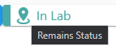{ width="150" }

### Edit an Individual
Clicking an icon in the Highlight Bar opens the Edit Individual form. Within this form, users can update:

* Identification Date
* Remains Status
* Remain Release Date
* All anthropological statistics, including:

    * Minimum Age & Maximum Age
    * Minimum Height & Maximum Height
    * Sex
    * Ancestry

To exit the form, users can either click the Cancel button or click an icon in the Highlight Bar again.

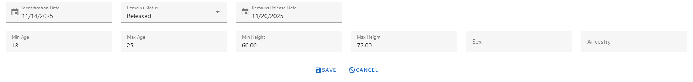{ width="800" }

## Biological Information Data Table
This section displays all biological and computed data for selected individual. It is organized into four data tabs, each corresponding to a key biological dimension:

* Age
* Sex
* Ancestry
* Stature

Each tab contains a data table with a consistent structure, allowing users to customize visible columns.

### Common Table Features
Each table shares the following structure and controls

| Column Name | Description |
|:------------|:------------|
|Specimen Key | Unique identifier for the specimen| 
|Bone / Bone Side / BoneGroup | Anatomical references for each specimen|
|Method Name / Type / Feature | Details about the method used to compute the stat.|
| Computed Statistic | Displays calculated results depending on the tab (age range, sex, ancestry, or stature values).|
| Individual Number | (Optional) Can be show or hidden via the Column Visibility menu.|
| Created At / Updated At | (Optional) Metadata columns for record history.|

Users can toggle optional columns through the Column Visibility Dropdown, located at the top left of each table.

A Last Updated Timestamp is displayed next to the Column Visibility menu, showing when the individual's data was last refreshed.

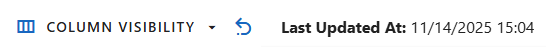{ width="500" }

### Collapse & Expand Table
Users can collapse or expand the data table by clicking the Collapse/Expand button located next to the Column Visibility menu.

* Collapse reduces the table to its header area, giving users more space to focus on other page components or customize their layout.
* Expand restores the table to full view when users need to review or interact with its data again.

This helps users tailor the workspace to their personal viewing preferences.

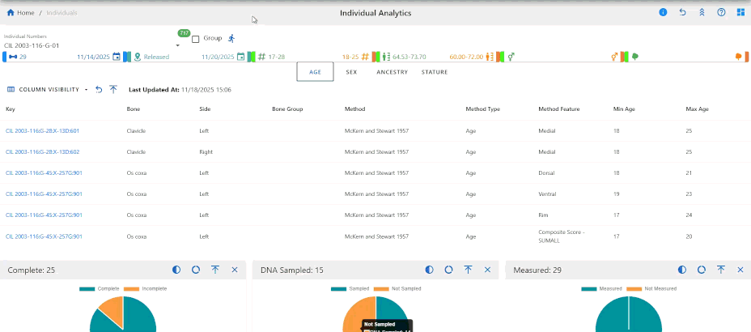{ width="800" }

### Age Tab
This tab displays the computed Minimum and Maximum Age values for each specimen and methods. Each row represents a method used on a specimen, showing the resulting age range derived from the method's parameters. Use this tab to compare multiple age estimation methods and verify consistency across specimens.

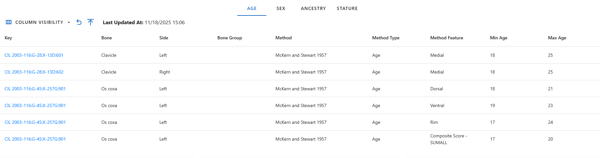{ width="800" }

### Sex Tab
The Sex tab lists all methods used to estimate biological sex and their computed outcomes. Each row displays the specimen and bone analyzed, the method used for determination, and the Computed Sex result. This view helps users quickly assess which specimens have reliable sex determinations and which require further review.

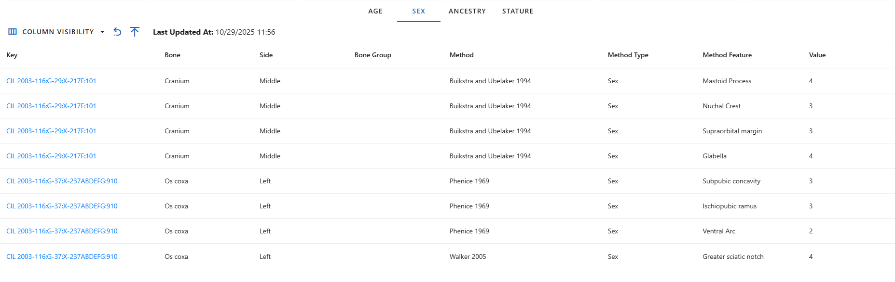{ width="800" }

### Ancestry Tab
This tab shows computed Ancestry results for each specimen and method applied. The ancestry values are derived from various metric and non-metric analyses and can be compared across multiple methods. This helps identify consistency in ancestry determinations and validate the underlying analytical methods.

{ width="800" }
### Stature Tab
The Stature tab is the most detailed, as it contains multiple calculated values per specimen and selected method. It includes minimum, maximum, and average computed height, equation used, and the bone measurement. The absolute minimum and maximum height across all specimens are highlighted in blue, allowing users to quickly identify overall stature range boundaries.

{ width="800" }

When on the Stature tab, three additional dropdown menus appear above the table:

* **Specimens Dropdown** - Show list of specimens that was used to calculate stature.
* **Methods Dropdown** - Choose which calculation method to display. Each project has a predefined default method.
* **Unit Dropdown** - Choose display units for height (default: inches).

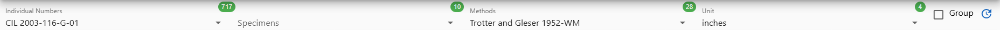{ width="800" }

Beside these dropdowns, the Go to Visualization button appear on the right of the Column Visibility menu, which redirects users to the Stature Estimation Visualization page. All selected filters (individual, specimen, method , and unit) are passed to the visualization page automatically.

{ width="50" }

## Analytics Dashboard
The lower section of the page presents the Individual Dashboard, a visual summary of specimen-related data using pie charts. These charts provide immediate insight into the completeness, sampling, and analytical coverage of all specimens for the selected individual.

### Widget Controls & Interactive Features
The dashboard provides several interactive features that allow users to customize and explore the displayed data widgets according to their preferences. These interactions help users focus on specific insights and personalize their dashboard layout.

#### Rearranging and Removing Widgets
Users can rearrange all widgets on the dashboard by dragging and dropping them to new positions. Additionally, users can remove widgets they do not wish to view. All layout changes, including widget positions and removals, are automatically saved in the browser cache, ensuring that when users return to the dashboard later, their customized layout is preserved.

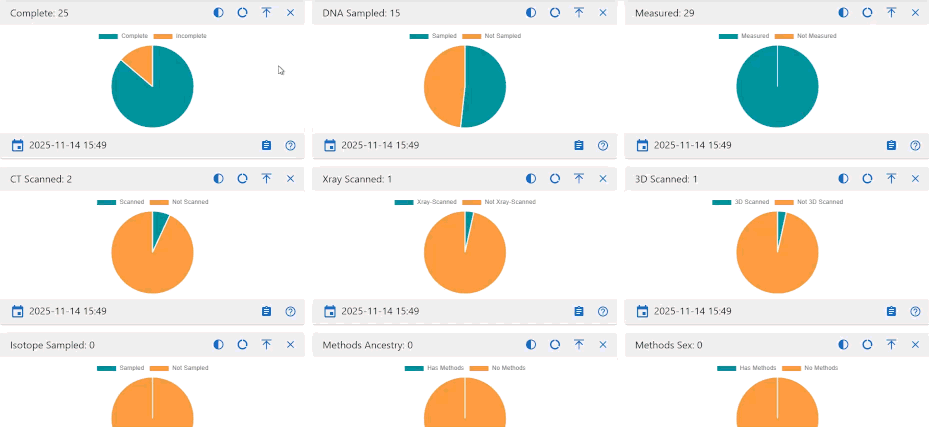{ width="800" }

#### Collapse and Expand Widgets
Each widget includes an option to collapse or expand its view.

* Collapsed View: Minimized the widget to show only its header, helping reduce clutter.
* Expanded View: Restores the full widget for complete data visibility.

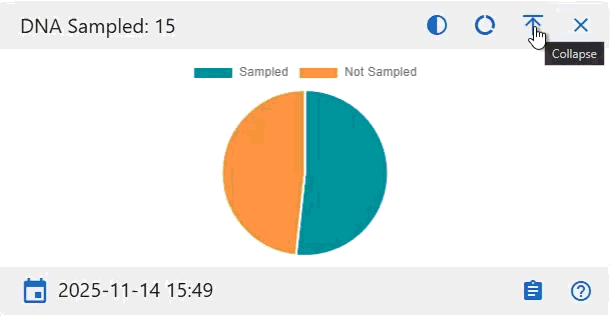{ width="500" }

In addition to per-widget controls, the dashboard provides global `Collapse All` and `Expand All` buttons located at the top-left of the screen, just below the Profile and Settings section. These controls allow user to quickly minimize or restore all widgets simultaneously, making it easier to manage the dashboard's overall layout and focus on specific areas of interest.

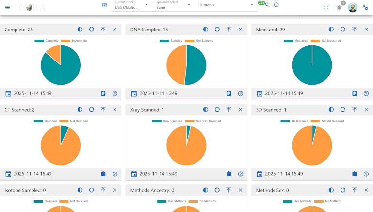{ width="800" }

#### Hover for Details
When users hover over chart elements, additional details appear in a tooltip. This feature provides deeper insight into specific data points without cluttering the main visualization.

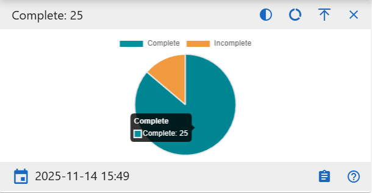{ width="500" }

#### Chart View Customization
Several widgets support changing the chart style to fit user preference or data interpretation needs:

* Full Circle and Semi-Circle Toggle: Users can switch between a full circular chart view and a semi-circular (half-donut) view for a more compact display
* Pie and Donut Toggle: Users can switch between pie and donut chart styles to adjust visualization clarity and style.

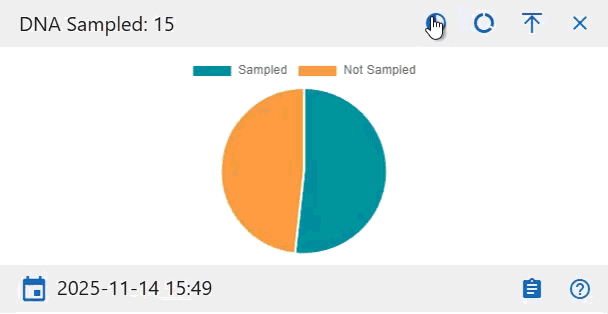{ width="500" }

#### Data Freshness
Each widget displays a Last Updated Timestamp to confirm when the data was last refreshed.

{ width="200" }

#### Detail Views
Each widget includes a Details button that opens a detailed table view. 

{ width="50" }

The Detail Page provides:

* A complete record list for the selected chart category
* Table search and filter capabilities
* Export options (Excel and PDF)
* Column Visibility controls

This allows users to explore specific specimen-level data in depth while maintaining consistency with other dashboards.

### Widget Details
Below are description of each dashboard widget and what it represents. All charts are showing the specimen data for the selected individual.

#### Complete
Show the proportions of specimens marked as Complete vs. Incomplete. Useful for quickly assessing case completion status.

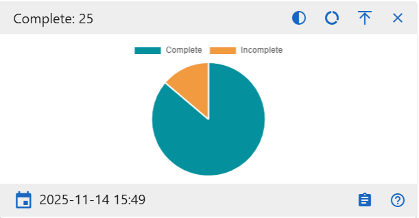{ width="500" }

#### DNA Sampled
Displays how many specimens have DNA samples collected. Use this to identify which specimens still need sampling.

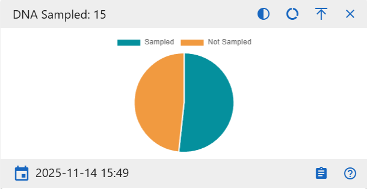{ width="500" }

#### Measured
Visualizes how many specimens have measurement data recorded.

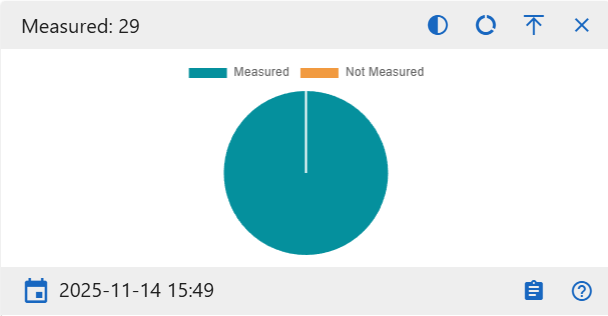{ width="500" }

#### CT Scanned
Show the number of specimens that have undergone CT scanning versus those not scanned.

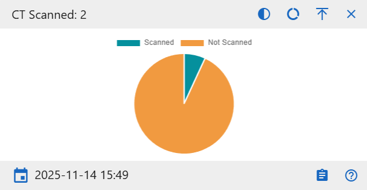{ width="500" }

#### X-ray Scanned
Show the number of specimens that have been X-ray scanned versus those not scanned.

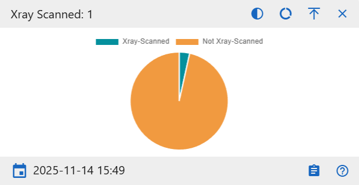{ width="500" }

#### 3D Scanned
Display how many specimens include 3D digital scans. This helps monitor digitization completeness for each individual.

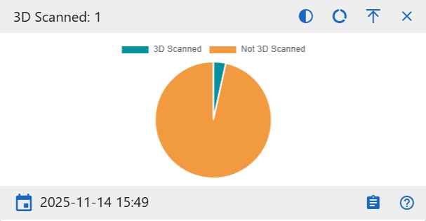{ width="500" }

#### Isotope Sampled
Show how many specimens have isotope data collected for geochemical analysis.

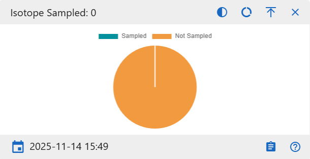{ width="500" }

#### Method Sex
Displays how many specimens that have sex determination methods.

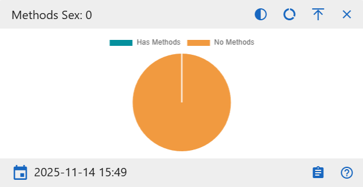{ width="500" }

#### Method Age
Displays how many specimens that have age determination methods.

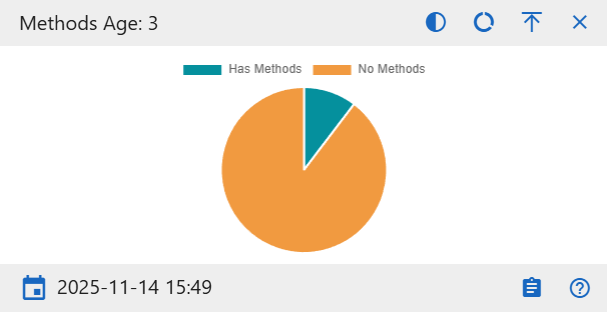{ width="500" }

#### Method Ancestry
Displays how many specimens that have ancestry determination methods.

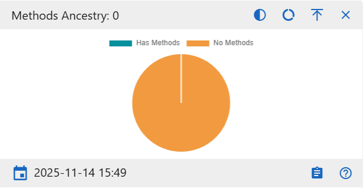{ width="500" }