# Project Analytics Canvas

## Table of Contents
1. [Overview](#overview)
2. [Accessing the Project Canvas](#accessing-the-project-canvas)
3. [Top-Right Corner Icons](#top-right-corner-icons)
4. [Canvas Layout and Columns](#canvas-layout-and-columns)
   - [Specimens Column](#project-specimens-column-left-column)
   - [DNA Column](#dna-mito-sequence-number-column-middle-column)
   - [Individuals Column](#individuals-column-right-column)
5. [Steps to Assign Specimens to an Individual](#assign-specimen-to-individual)
6. [Selection and Drag-and-Drop](#selection-and-drag-and-drop)
7. [Quick Reference Tips](#quick-reference-tips)
8. [Encounter Issues](#encounter-issues)

---

## Overview

The Project Canvas is a powerful interface for managing specimen assignments to individuals in forensic anthropology cases. It provides a visual, drag-and-drop workflow for linking skeletal elements to identified individuals based on anatomical, DNA, and association data.

---

## Accessing the Project Canvas

1. Open the main navigation by clicking the **Burger Menu** (three horizontal lines) in the top-left corner.
2. Select **Project Canvas** from the navigation menu.
3. On the Project Canvas page, select your **Individual** from the far-right column using the dropdown menu.
   - The dropdown displays individual identifiers (e.g., `CIL 2003-116-I-110.1`).
   - You can search within the dropdown by typing to filter the list.

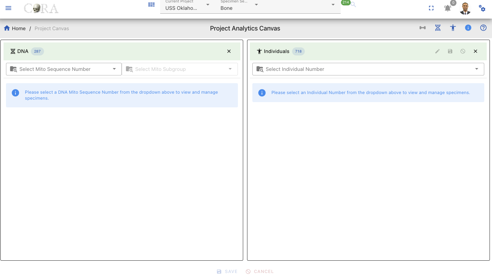

---

## Top-Right Corner Icons

The Project Canvas header contains several action buttons in the top-right corner. Each icon serves a specific function:

| Icon                                                                   | Name                                 | Functionality                                                  |
|------------------------------------------------------------------------|--------------------------------------|----------------------------------------------------------------|
|  | **Expand/Collapse Project Specimen** | Expands and Collapse the Project Specimens box                 |
| 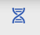     | **Expand/Collapse DNA Specimen**     | Expands and Collapse the DNA Specimens box                     |
|          | **Info Tip**                         | Provides information about the current page                    |
|              | **Help - CoRA Docs**                 | Displays contextual help information and tooltips in CoRA Docs |
|                   | **Show/Hide Lab Table**              | Displays and Hides Individual column                           |

---

## Canvas Layout and Columns

The Project Canvas consists of three main columns arranged horizontally; Individuals, Project Specimens and DNA Mito Sequence Number. Each column serves a distinct purpose and contains specific filtering, sorting, and data display capabilities.

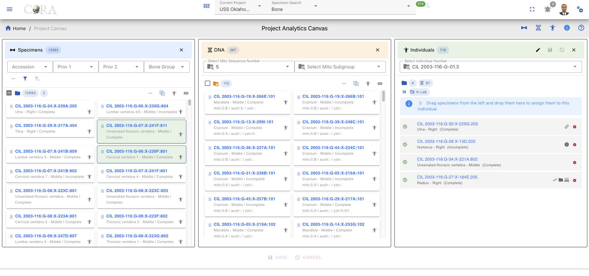
---

### Specimens Column (Left Column)

**Purpose:** Displays all skeletal elements/specimens available in the current project.

#### Column Header
- **Title:** "Project Specimens"
- **Record Count:** Shows the total number of specimens matching current filters (e.g., "Showing 1,247 of 5,832")

#### Search and Filtering
- Located at the top of the column
- Allows searching by specimen Accession, Prov1, Prov2, Bone Group, Bone, Individual # Side, Completness
- For expansion and advanced filtering, Click the **Expand Arrow** (chevron) below the filter row to reveal additional filtering options:
- After completion,click the blue filter icon underneath the filter bars to execute.
- **Reset All (Red Icon)** button clears all filters at once.

#### Specimen Column Display

Each specimen in the list appears as a card containing:
- Specimen key (e.g., `CIL 2003-116:G-07:X-241B:805`)
- The key is clickable to jump to the specimen card where you can view details such as Accession Number, Bone, Side, Designator, etc.
- **Link Icon** (chain link symbol) - Located on the specimen card, click to open the Associations column

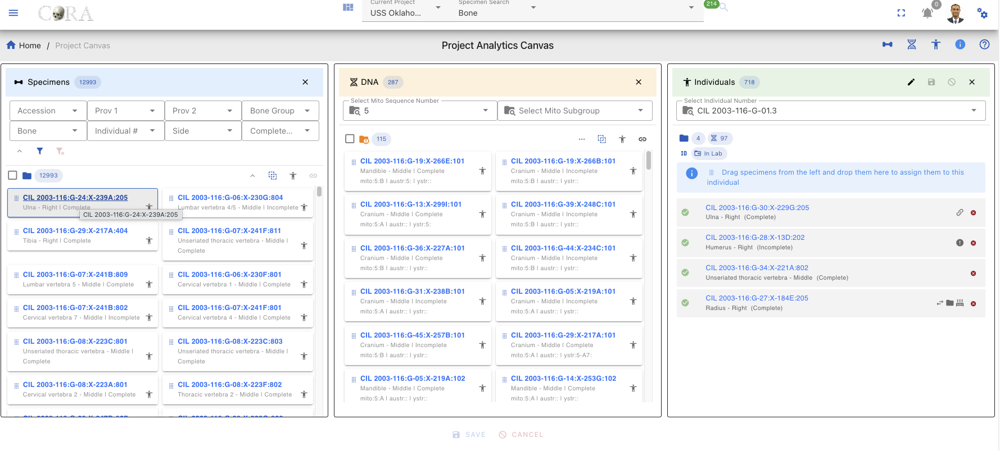

#### Specimen Card View

#### Associations Column (from Project Specimens)

After clicking the **Link Icon** (chain link) on a specimen card in the Project Specimens column, a new **Associations** compartment/popup appears. This compartment provides detailed association information for the selected specimen.

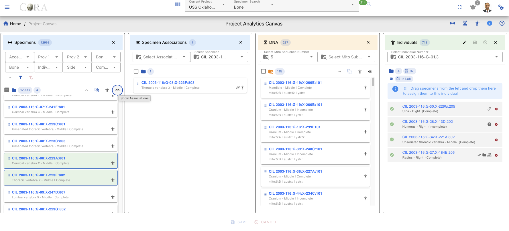

##### Association Type Filter

The column includes an **Association Type** dropdown filter that allows you to view specific types of associations:

| Filter Option    | Description                                                        |
|------------------|--------------------------------------------------------------------|
| **Articulations** | Shows only Articulation specimen                                   |
| **Pair**         | Shows only paired specimens (e.g., left and right bones)           |
| **Refits**       | Shows only refitted fragments that rejoin to form a complete element |
| **Morphology**   | Shows only morphological matches (similar morphological features)  |

##### Associations List Display

Once filters are applied, the column displays:

- **The key of each specimen type**
- **Underneath the specimen key** Bone Name, Location and Status
- **Right side of the specimen key** Type of Relation, Human Icon 

##### Closing the Associations Column

To close the Associations column:
- Click the **X** button in the top-right corner of the column

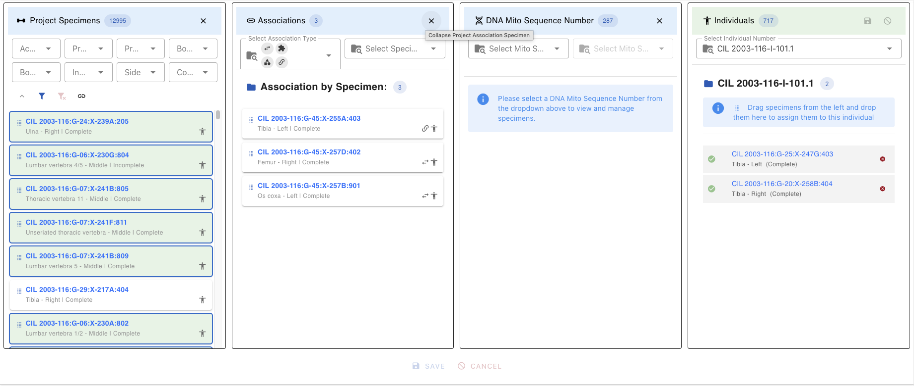

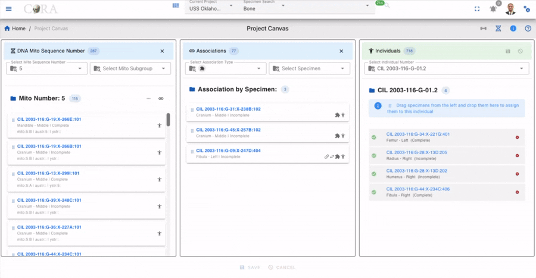
---

### DNA Mito Sequence Number Column (Middle Column)

**Purpose:** Groups specimens by mitochondrial DNA sequence, enabling identification of potential genetic matches.

#### Column Header

- **Title:** "DNA Mito Sequence Number"
- **Record Count:** Shows unique mito sequence numbers or specimens

#### Mito Sequence Dropdown

The primary filter is a **dropdown search** containing all unique mito sequence numbers in the project:
- Click the dropdown to see all available sequence numbers
- **Search within dropdown:** Select to filter the list of sequences
- The selected Mito Number appears in the header with the records filtered to that sequence.

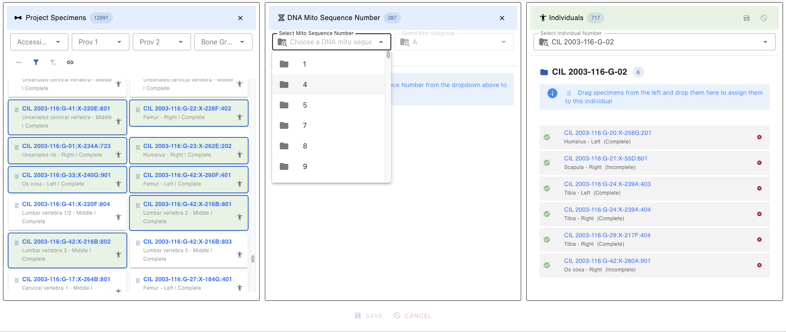

#### Filtering Behavior
When a mito sequence is selected:
1. The Project Specimens column automatically filters to show only specimens with matching mito sequences
2. Specimens are grouped or highlighted by their genetic relationship
3. The Associations column updates to show existing associations for filtered specimens

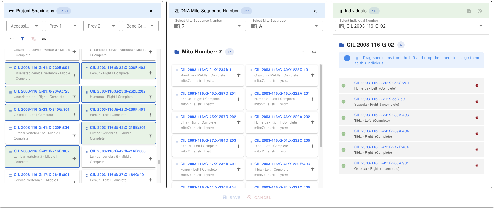

## Functionality Buttons within DNA, Specmens and Associations

| Icon                                                                      | Description                                                                                                                                                                                                                                                                                                                    |
|---------------------------------------------------------------------------|--------------------------------------------------------------------------------------------------------------------------------------------------------------------------------------------------------------------------------------------------------------------------------------------------------------------------------|
|  | Removes duplicate records from DNA Associations that already exist in DNA.                                                                                                                                                                                                                                                     |
|               | Displays the selected hoop degree and visualizes bone connections for the chosen hoop. When the icon is clicked, a hoop can be selected from a dropdown list. The system displays all records up to the selected hoop. Hovering over a hoop number shows the hoop number and its associated specimen ID *(to be implemented)*. |
| 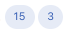                    | For DNA and DNA Associations, the first number indicates the total number of records. The second number represents the number of selected bones *(highlighted with a green background)*.                                                                                                                                       |
|                       | Filters unassigned specimens for the individual. A lighter color indicates only unassigned specimens, while a darker color displays all specimens.                                                                                                                                                                             |
|                 | Highlights associations between DNA and DNA Associations. When enabled, associations are clearly shown. When disabled, DNA Associations are outlined with a red dashed border to remain visible when a DNA specimen is selected.                                                                                               |
|                           | Auto select all from column                                                                                                                                                                                                                                                                                                    |
|                         | DNA is not matching with individual that is selected                                                                                                                                                                                                                                                                           |
|                             | DNA is matching with selected individual                                                                                                                                                                                                                                                                                       |
                             | Show selected Specimens                                                                                                                                                                                                                                                                                                        |

### Association Mito Sequence Number Column Display
Each specimen in the list appears as a card containing:
- **The key of each Mito Sequence Number(e.g., `CIL 2003-116:G-07:X-241B:805`)**
- **Underneath the Mito Sequence Number key** Bone, Side, Completness, Sequence Number
- **Right side of the specimen key** Human Icon
- **Link Icon (chain link symbol) - Located on the Mito Sequence Number column, click to open the Associations column**

*(Screenshot: DNA Mito Sequence dropdown with search functionality)* specimen card click , card view

### Associations Column (From DNA Mito Sequence)
After clicking the Link Icon (chain link) on the DNA Mito Sequence column, a new Associations column will pop up. This column provides detailed association information for the selected specimen.

### Selecting chain between DNA and DNA Associations
Whenever a specimen is selected in the DNA Associations column, it automatically selects the corresponding DNA specimen in both DNA Mito Sequence column and DNA Associations column.

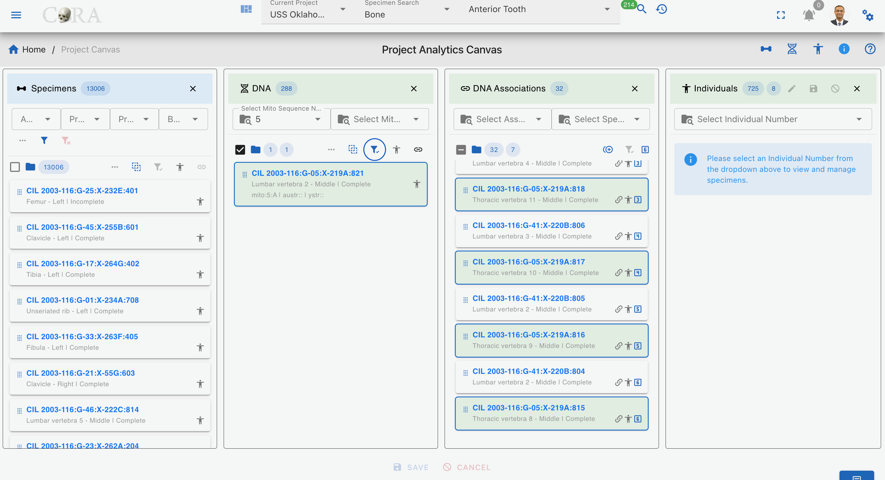

When we hover over the hop number, it shows the hop number and its root parent and immediate parent information *(to be implemented)*.

#### Association Type Filter
The column categorizes specimen relationships into four primary types:

| Filter Option   | Description                                                         |
|-----------------|---------------------------------------------------------------------|
| **Articulations** | Shows only Articulation specimen                                    |
| **Pair**        | Shows only paired specimens (e.g., left and right bones)            |
| **Refits**      | Shows only refitted fragments that rejoin to form a complete element |
| **Morphology**  | Shows only morphological matches (similar morphological features)   |

#### Associations List Display
Once filters are applied, the column displays:
•	The key of each specimen type
•	Underneath the specimen key Bone Name, Location and Status
•	Right side of the specimen key Type of Relation, Human Icon

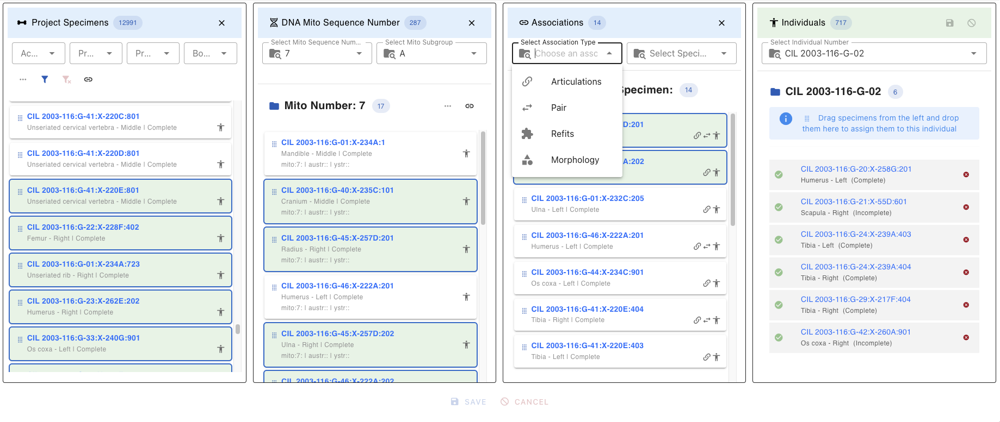

##### Closing the Associations Column

To close the Associations column:
- Click the **X** button in the top-right corner of the column

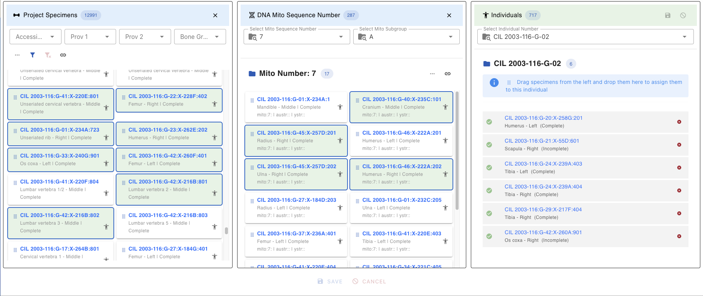

---

### Individuals Column (Right Column)

**Purpose:** Displays the currently selected individual and allows assignment of specimens to that individual.

#### Column Header
- **Title:** Shows individual identifier (e.g., `CIL 2003-116-I-110.1`)

#### Individual Selector

The dropdown at the top allows switching between individuals:
- Search by typing in the dropdown
- Select Individual Number

### Individual Functionality Bar

| Icon                                        | Description |
|---------------------------------------------|-------------|
| 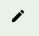       | Enables editing of specimens under the selected individual. |
| 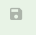        | Saves all edits made to the individual and associated specimens. |
| 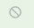     | Cancels the current editing session without saving changes. |
| 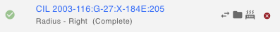 | Displays specimens under the individual. Each specimen shows its number, with reason icons on the right. The red “X” icon removes the specimen from the individual. |
| 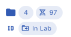         | Displays file status information, including the number of specimens, DNA ID, and the current status of the individual (e.g., in lab or completed). |

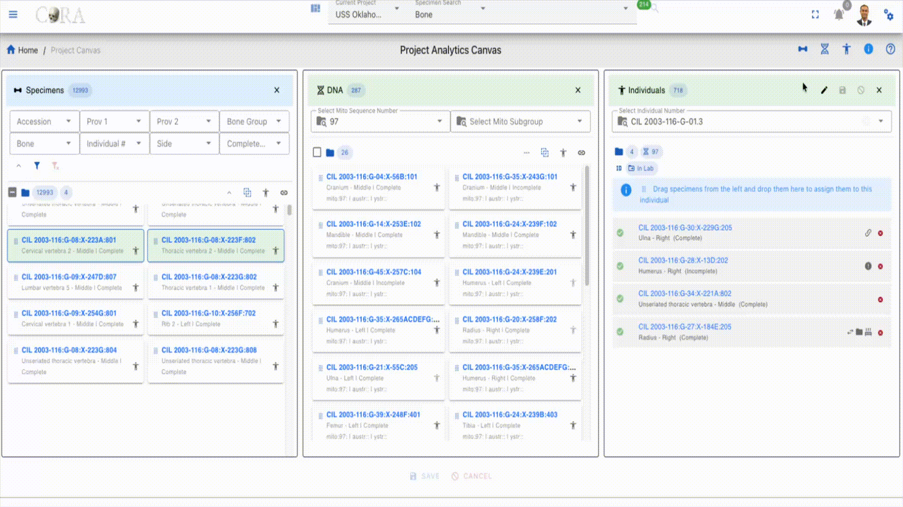

#### Assigned Specimens List

Displays all specimens currently assigned to the selected individual:
- Each specimen shows with a **Green Checkmark** (Complete)
- Can be removed by clicking the X from the right side of the card

## Assign Specimen to Individual
The **Assign Specimen to Individual** feature allows users to associate one or more specimens with a specific individual. This functionality is essential for grouping skeletal elements under a unique individual profile based on forensic analysis. Recent enhancements have introduced several new features to improve usability and functionality.

#### 1. Select Individual:
- Choose the target individual from the dropdown menu on the right panel.
- The selected individual’s details will be displayed.

#### 2. Apply Filters (Optional):
- Use the available filters to refine the list of specimens based on:
  - **Accession**
  - **Provenance 1**
  - **Provenance 2**
  - **Bone Group**
  - **Bone**
  - **Side**
  - **Completeness**
  - **Austr Sequence Number and Subgroup**
  - **Ystr Sequence Number and Subgroup**
- Toggle additional filters for a more refined search.

#### 3. Select DNA Mito Sequence Number (Optional):
- Choose a DNA Mito Sequence Number from the dropdown menu to view and manage specimens associated with that sequence.
- Additional options include filtering by Mito Subgroup, Austr Sequence Number, and Ystr Sequence Number.

#### 4. Select Association Type (Optional):
- Use the dropdown menu to select an association type (e.g., Articulations, Pairs, Refits, Morphology).
- You can also select a specific specimen to view all associated specimens for the chosen association type.

#### 5. Drag and Drop Specimens:
- Select the desired specimens from the list on the left panel.
- Drag and drop the specimens into the individual’s assignment area on the right panel.
- Specimens marked for assignment or removal are visually distinguished with color-coded chips (e.g., orange for pending addition, red for pending removal).

 

#### 6. Select Reason for Assignment:
- For each specimen, select a reason for the assignment from the dropdown menu.

#### 7. Save or Cancel:
- To save the assignments, click the **Save** button.
- To cancel the entire process, click the **Cancel** button.
- You can also remove individual specimens from the assignment area by clicking the **X** icon next to them.

### Key Features 

- **Dynamic Specimen List**: The list updates based on applied filters, ensuring you only see relevant specimens.
- **DNA Mito Sequence Integration**: Manage specimens associated with specific DNA Mito Sequence Numbers.
- **Association Management**: View and manage specimens based on association types such as Articulations, Pairs, Refits, and Morphology.
- **Reason Selection**: Ensure each assignment has a documented reason for traceability.
- **Bulk Assignment**: Assign multiple specimens to an individual in one action using drag-and-drop functionality.
- **Real-Time Updates**: Changes are reflected immediately in the project database after saving.
- **Action Alerts**: Alerts at the bottom of the interface track pending assignments and removals.

### Example Workflow

1. Select an individual from the dropdown menu.
2. Filter specimens by "Accession" and "Bone Group" or apply advanced filters like Austr Sequence Number or Ystr Subgroup.
3. Select a DNA Mito Sequence Number to view related specimens.
4. Choose an association type (e.g., Articulations) and select a specimen to view associated specimens.
5. Drag and drop the filtered specimens into the individual’s assignment area.
6. Click **Save** to save assignments.
7. Select a reason for each assignment from the dropdown menu.
8. Then click **Save** again to finalize the assignments.

## Selection and Drag-and-Drop

### Selecting Multiple Specimens

**Single Selection:**
- Click on a specimen card to select it
- Selected cards are highlighted with a green background color

**Multiple Selection:**

| Method            | Action                                      |
|-------------------|---------------------------------------------|
| Ctrl/Cmd + Click  | Add/remove individual specimens from selection |
| Shift + Click     | Select range of specimens                   |
| Click + Drag      | Draw selection box around multiple specimens |
| Ctrl/Cmd + A      | Select all visible specimens                |

### Drag-and-Drop Assignment

**To assign specimens to an individual:**

1. **Ensure an individual is selected** in the Individuals column
2. **Select one or more specimens** in the Project Specimens or DNA Mito Sequence column
3. **Click and hold** on any selected specimen
4. **Drag** toward the Individuals column
5. **Drop** when the Individuals column highlights/accepts the drop
6. Specimens appear in the Individuals list with **"Pending Add"** status (orange clock icon)

**During Drag:**
- Valid drop zone highlights in green color when dragging over it
- Invalid drops (e.g., no individual selected) show a rejection indicator
- Can drag multiple items at once

### Removing Assignments (Pending Only)

Before saving, you can remove pending assignments:
1. Find the specimen in the Individuals column
2. Click the **X** icon on the right side of the appropriate card
3. Specimen turns in red color, and it reads as "Pending Removal"

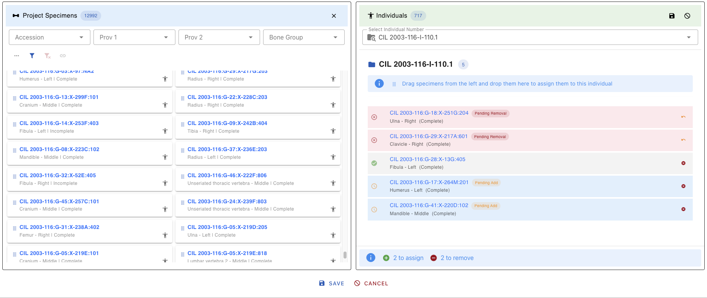

### Saving Assignments

1. **Click the Save button** in the Individuals column header
2. **Confirmation dialog opens** titled "Confirm Specimen Assignments"
3. **Select a reason** for each pending specimen from the dropdown:
4. The **Save button** in the dialog is disabled until all pending items have a reason assigned
5. Once all reasons are selected, click **Save** to complete the assignment

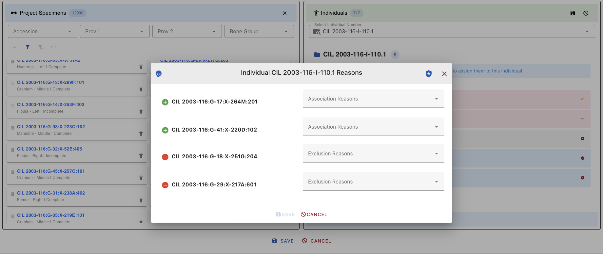

**After Saving:**
- Success notification appears
- Pending status changes to confirmed (human icon turns dark grey)
- Audit trail records the change with timestamp and user

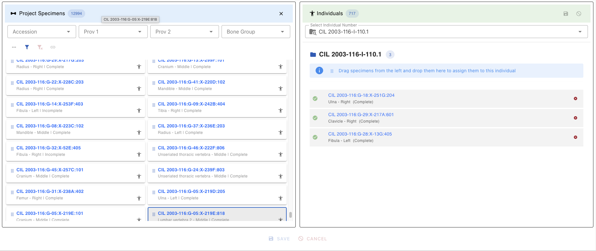

**To discard changes:**
- Click **Cancel** in the confirmation dialog, OR
- Refresh the page before saving

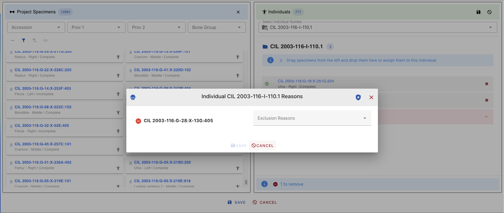

---

## Quick Reference Tips

### Filter and Search
- Use filters first to narrow large datasets before selecting
- Combine filters across columns for precise targeting

### Icons and Status
- **Dark Grey Human:** Already assigned - be careful!
- **Light Grey Human:** Available for assignment
- **Link Icon:** Shows existing specimen connections

### Assignment Process
1. Select specimens → 2. Drag to Individual → 3. Add reasons → 4. Save

### Common Issues
| Issue | Solution |
|-------|----------|
| Can't drop specimen | Ensure an individual is selected |
| Save button disabled | Assign reasons to all pending items |
| Can't see associations | Use the Link Button after selecting specimens |

### Keyboard Shortcuts
| Shortcut | Action |
|----------|--------|
| Ctrl/Cmd + Click | Multi-select specimens |
| Shift + Click | Select range |
| Delete/Backspace | Remove selected from assignment |
| Ctrl/Cmd + S | Save (when in dialog) |
| Escape | Close dialog/cancel action |

---

# Encounter Issues

### Cannot Assign Specimens - Complete Specimen Exists

**Error Message:**
> "Cannot assign these specimens. The individual already has a complete specimen with the same bone and side, so only incomplete specimens are allowed."

**Explanation:**
This error occurs when you try to assign a complete specimen to an individual who already has a complete specimen of the same bone and side. In forensic anthropology, an individual can only have one complete specimen for each unique bone/side combination. However, incomplete specimens can still be assigned to complete the individual's skeletal representation.

**Solution:**
- Select **incomplete specimens** instead of complete ones when assigning to an individual who already has a complete specimen of the same bone and side
- Remove the existing complete specimen from the individual first (requires appropriate permissions), then assign the new complete specimen
- Use the filter to search for incomplete specimens by selecting "Incomplete" in the Completeness filter

**Alternative Approaches:**
1. If you need to replace a complete specimen, first remove the existing complete specimen from the individual
2. Consider if the specimen should be marked as "incomplete" if it's actually missing parts
3. Contact your supervisor or system administrator if you believe the existing assignment is incorrect

*Document Version: 1.0*  
*Last Updated: 2026-04-08*  
*For additional help, click the Help icon in the top-right corner.*
