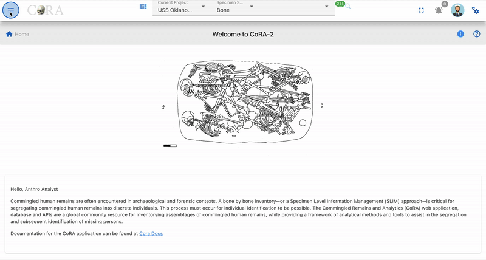
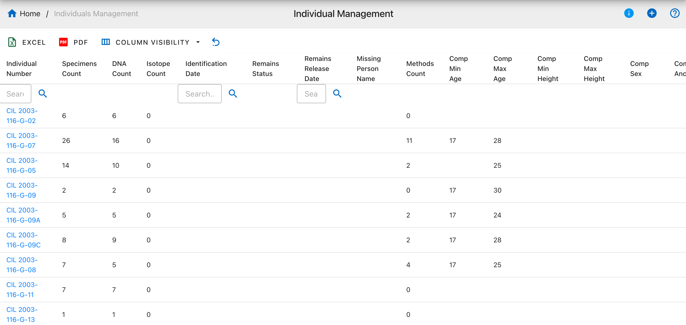
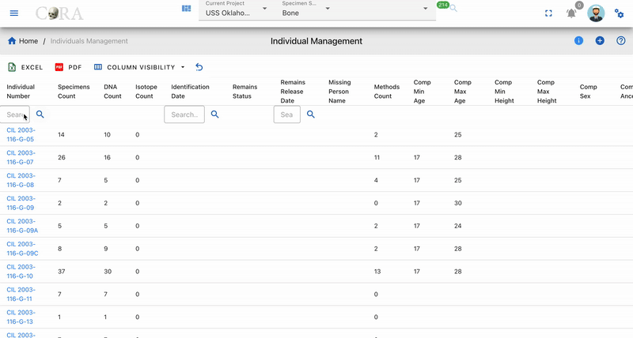
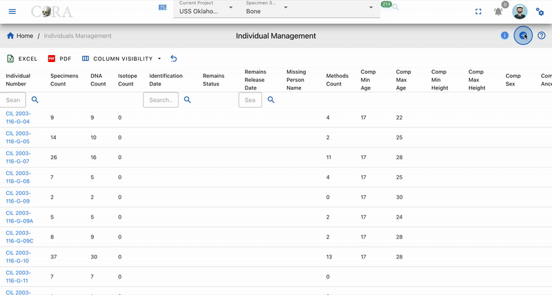
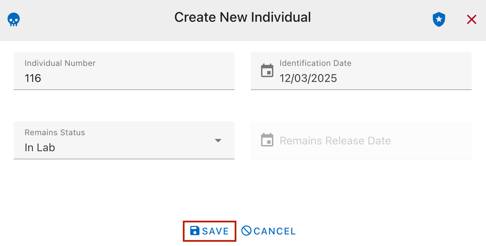

# Individuals

An individual is a collection of specimens that the forensic anthropologist believes should go together and belong to an unknown individual. The selection of specimens that go together is done in a blind manner to avoid introducing bias towards the segregation process.

## Overview

The Individuals module manages the association of skeletal specimens to unknown individuals. Each individual represents a unique unknown person, and specimens can be grouped together to indicate they likely belong to the same individual based on forensic analysis.

### Key Concepts

- Individual Number - Unique identifier assigned to each individual (e.g., I001, I002, I003)
- Specimens - Skeletal elements that are grouped under an individual
- Blind Assignment - The process of assigning specimens without bias
- Individual Profile - Aggregate information (age, sex, ancestry, height) computed from assigned specimens

## Accessing Individuals

Navigate to the Individual section from the main menu. This opens the Individuals Management interface where you can view all individuals in the project and perform various operations.

## Individual Management

### View All Individuals

The Individual Management page displays a list of all individuals in your project with key information:

{width="800"}

- Individual Number - Unique identifier for the individual (e.g., CIL 2003-116-G-02)
- Specimens Count - Total number of skeletal elements assigned to this individual
- DNA Count - Number of DNA analysis records associated with the individual
- Isotope Count - Number of isotope analysis records available for the individual
- Identification Date - Date when the individual was identified or case was resolved
- Remains Status - Current status of remains (In Lab or Released)
- Remains Release Date - Date when remains were released if applicable
- Missing Person Name - Name of missing person if linked to a missing person case
- Methods Count - Number of analysis methods used for this individual
- Comp Min Age - Computed minimum age based on all assigned specimens
- Comp Max Age - Computed maximum age based on all assigned specimens
- Comp Min Height - Computed minimum height estimate based on specimen data
- Comp Max Height - Computed maximum height estimate based on specimen data
- Comp Sex - Computed biological sex determination from specimen analysis
- Comp Ancestry - Computed ancestry assessment from specimen data

**Additional Features:**

- Search - Use the search field to filter individuals by Individual Number
- Column Visibility - Click the Column Visibility dropdown to show/hide columns
- Export - Export the table data to Excel or PDF format
- Refresh - Click the refresh icon to reload the table with current data
- Sort - Click any column header to sort ascending or descending
- Row Actions - Click on an individual row to view details, edit, or delete

### Search Individuals

Use the search functionality to quickly find individuals by:

- Individual Number - Search by ID (e.g., I001)
- Notes - Search by notes or comments
- Filters - Filter by status, sex, ancestry, or other attributes

#### Search Results

The search results display matching individuals with their basic information. Click on any result to view detailed information or edit the record.

## Create Individuals

### Manual Creation

To create a new individual:

1. Click the plus button in the Individual Management interface
2. The Create New Individual form will appear with the following fields:
   - Individual Number (required) - Unique identifier for the individual
   - Identification Date - Date when the individual was identified or case was resolved
   - Remains Status - Current status of remains (dropdown: In Lab / Released)
   - Remains Release Date - Date when remains were released if applicable
3. Fill in the required Individual Number field
4. Optionally enter the identification date, remains status, and release date
5. Click **SAVE** to create the individual, or click **CANCEL** to discard changes

{width="500"}

After creating the individual, you can add additional information by editing the record:
   - Notes - Any observations or comments
   - Minimum Age - Estimated minimum age in years
   - Maximum Age - Estimated maximum age in years
   - Sex - Biological sex determination (if known)
   - Ancestry - Ancestry assessment (if known)
   - Minimum Height - Estimated minimum height
   - Maximum Height - Estimated maximum height

## Individual Analytics

For more information see the [Individual Analytics User Guide](https://docs.coracore.org/en/latest/user-guide/modules/individuals/individual-analytics/)

## Assign Specimen to Individual

The **Assign Specimen to Individual** feature allows users to associate one or more specimens with a specific individual. This functionality is essential for grouping skeletal elements under a unique individual profile based on forensic analysis.

### Steps to Assign Specimens to an Individual

#### 1. Access the Feature:
   Navigate to the left sidebar menu and select **Individuals > Assign Specimen to Individual**.

[Assign Specimen to Individual Navigation](media/assign-specimen-to-individual-nav.gif)

#### 2. Select Individual:
   - Choose the target individual from the dropdown menu on the right panel.
   - The selected individual’s details will be displayed, including the number of currently assigned specimens.

#### 3. Apply Filters (Optional):
   - Use the available filters to refine the list of specimens based on:
     - **Accession**
     - **Provenance 1**
     - **Provenance 2**
     - **Bone Group**
     - **Bone**
     - **Side**
     - **Completeness**

#### 4. Select DNA Mito Sequence Number (Optional):
   - Choose a DNA Mito Sequence Number from the dropdown menu to view and manage specimens associated with that sequence.

#### 5. Select Association Type (Optional):
   - Use the dropdown menu to select an association type (e.g., Articulations, Pairs, Refits, Morphology).
   - You can also select a specific specimen to view all associated specimens for the chosen association type.

#### 6. Drag and Drop Specimens:
   - Select the desired specimens from the list on the left panel.
   - Drag and drop the specimens into the individual’s assignment area on the right panel.

#### 5. Select Reason for Assignment:
   - For each specimen, select a reason for the assignment from the dropdown menu.

#### 8. Save or Cancel:
   - To save the assignments, click the **Save** button.
   - To cancel the entire process, click the **Cancel** button.
   - You can also remove individual specimens from the assignment area by clicking the **X** icon next to them.

### Key Features

- **Dynamic Specimen List**: The list updates based on applied filters, ensuring you only see relevant specimens.
- **DNA Mito Sequence Integration**: Manage specimens associated with specific DNA Mito Sequence Numbers.
- **Association Management**: View and manage specimens based on association types such as Articulations, Pairs, Refits, and Morphology.
- **Reason Selection**: Ensure each assignment has a documented reason for traceability.
- **Bulk Assignment**: Assign multiple specimens to an individual in one action using drag-and-drop functionality.
- **Real-Time Updates**: Changes are reflected immediately in the project database after saving.

### Example Workflow

1. Select an individual from the dropdown menu.
2. Filter specimens by "Accession" and "Bone Group".
3. Select a DNA Mito Sequence Number to view related specimens.
4. Choose an association type (e.g., Articulations) and select a specimen to view associated specimens.
5. Drag and drop the filtered specimens into the individual’s assignment area.
6. Click **Save** to save assignments.
7. Select a reason for each assignment from the dropdown menu.
8. Then click **Save** again to finalize the assignments.

