# Individuals 

An individual is a collection of specimens that the forensic anthropologist believes should go together and belong to an unknown individual. The selection of specimens that go together is done in a blind manner to avoid introducing bias towards the segregation process.

## Overview

The Individuals module manages the association of skeletal specimens to unknown individuals. Each individual represents a unique unknown person, and specimens can be grouped together to indicate they likely belong to the same individual based on forensic analysis.

### Key Concepts

- Individual Number - Unique identifier assigned to each individual (e.g., I001, I002, I003)
- Specimens - Skeletal elements that are grouped under an individual
- Blind Assignment - The process of assigning specimens without bias
- Individual Profile - Aggregate information (age, sex, ancestry, height) computed from assigned specimens

## Accessing Individuals

Navigate to the Individual section from the main menu. This opens the Individuals Management interface where you can view all individuals in the project and perform various operations.

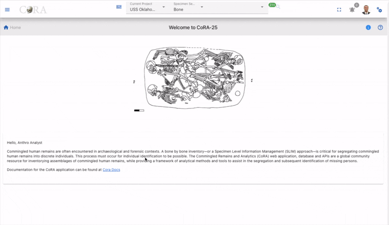{width="800"}

## Individual Management

### View All Individuals

The Individual Management page displays a list of all individuals in your project with key information:

{width="800"}

- Individual Number - Unique identifier for the individual (e.g., CIL 2003-116-G-02)
- Specimens Count - Total number of skeletal elements assigned to this individual
- DNA Count - Number of DNA analysis records associated with the individual
- Identification Date - Date when the individual was identified or case was resolved
- Remains Status - Current status of remains (In Lab or Released)
- Remains Release Date - Date when remains were released if applicable
- Mito Sequence Number - Mitochondrial DNA sequence identifier
- YStr Sequence Subgroup - Displays the Sequence Subgroup
- AuStr Sequence Number - Autosomal Short Tandem Repeat sequence identifier
- Comp Min Age - Estimated minimum age in years
- Comp Max Age - Estimated maximum age in years
- Comp Min Height - Estimated minimum height
- Comp Max Height - Estimated maximum height
- Comp Sex - Display the sex of the individual (if known)
- Comp Ancestry - Ancestry assessment (if known)

**Additional Features:**

- Search - Use the search field to filter individuals by Individual Number, Identification Date,Remains Status, Mito Sequence Number, YStr Sequence Subgroup, or AuStr Sequence Number
- Column Visibility - Click the Column Visibility dropdown to show/hide columns
- Export - Export the table data to Excel or PDF format
- Refresh - Click the refresh icon to reload the table with current data
- Sort - Click columns header to sort ascending or descending
- Row Actions - Click on an individual row to view details, edit, or delete

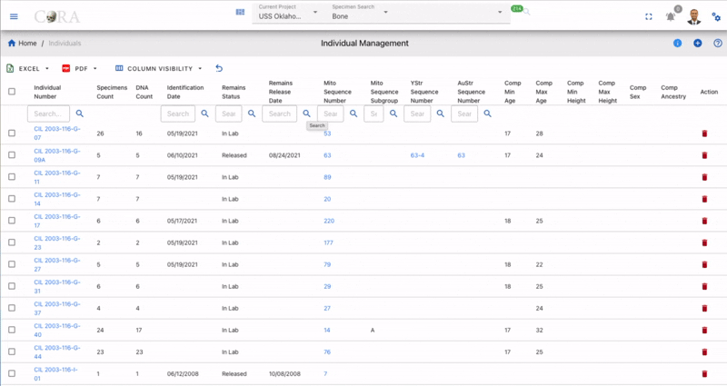{width="800"}

### Search Individuals

Use the search functionality to quickly find individuals by:

- Individual Number - Search by ID (e.g., I001)
- Notes - Search by notes or comments
- Filters - Filter by status, sex, ancestry, or other attributes

#### Search Results

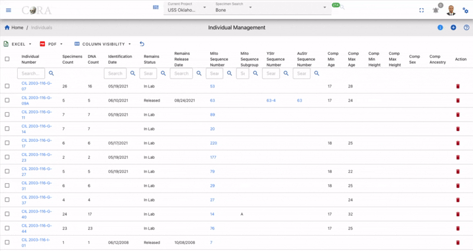{width="800"}

The search results display matching individuals with their basic information. Click on any result to view detailed information or edit the record.

### DNA Sequence Number Links

In the Individual Management table, the following sequence number columns are clickable and redirect to their respective DNA report pages:

| Column | Description | Redirects To |
|--------|-------------|--------------|
| **Mito Sequence Number** | Mitochondrial DNA sequence identifier | Mito DNA Report for the selected individual |
| **YStr Sequence Number** | Y-Chromosome Short Tandem Repeat sequence identifier | YStr DNA Report for the selected individual |
| **AuStr Sequence Number** | Autosomal Short Tandem Repeat sequence identifier | AuStr DNA Report for the selected individual |

#### How to Use

1. Navigate to the Individual Management table
2. Locate the **Mito Sequence Number**, **YStr Sequence Number**, or **AuStr Sequence Number** column
3. Click on any sequence number value in the column
4. The page will redirect to the corresponding DNA report for that individual

#### Example

If an individual has a Mito, Ystr or AuStr Sequence Number of `63-4`, clicking on `63-4` will open the Mito DNA Report page showing all mitochondrial DNA analysis results for that individual.

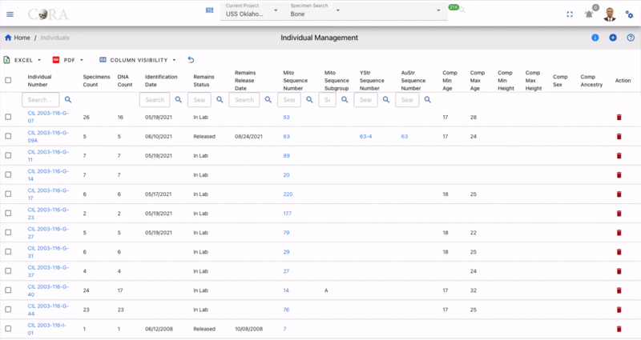

## Create Individuals

### Manual Creation

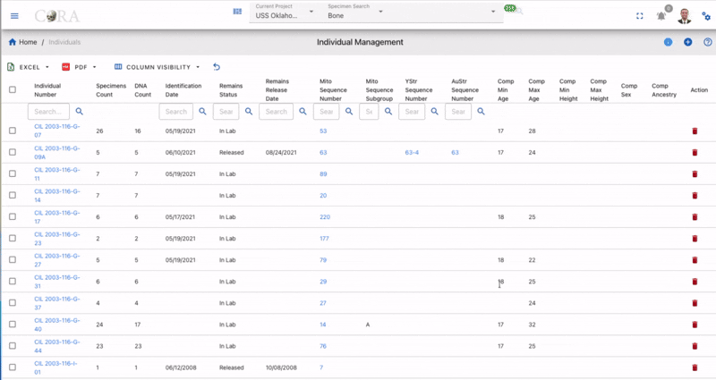{width="800"}

To create a new individual:

1. Click the plus button in the Individual Management interface
2. The Create New Individual form will appear with the following fields:
   - Individual Number (required) - Unique identifier for the individual
   - Identification Date - Date when the individual was identified or case was resolved
   - Remains Status - Current status of remains (dropdown: In Lab / Released)
   - Remains Release Date - Date when remains were released if applicable
3. Fill in the required Individual Number field
4. Optionally enter the identification date, remains status, and release date
5. Click **SAVE** to create the individual, or click **CANCEL** to discard changes

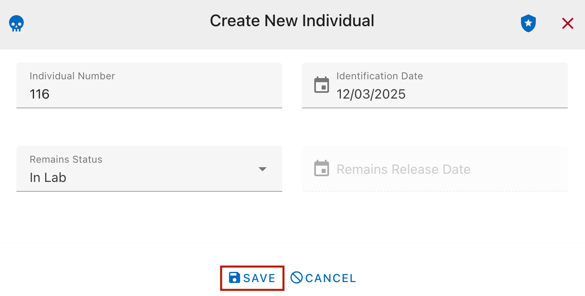{width="800"}

After creating the individual, you can add additional information by editing the record:
   - Notes - Any observations or comments
   - Minimum Age - Estimated minimum age in years
   - Maximum Age - Estimated maximum age in years
   - Sex - Biological sex determination (if known)
   - Ancestry - Ancestry assessment (if known)
   - Minimum Height - Estimated minimum height
   - Maximum Height - Estimated maximum height

## Individual Analytics

The **Individual Analytics** page serves as a centralized dashboard within the CoRA platform. It is designed to aggregate biological profile data and processing status for specific individuals, allowing researchers to visualize skeletal completion and forensic estimations at a glance.

---

### 1. Global Navigation & Context

This section ensures the user knows exactly which set of remains they are analyzing.

- **Individual Selection:** A primary dropdown menu to select the unique identifier (e.g., `2003-116-G-02`).
- **Project Context:** Displays the current project (e.g., `USS Oklahoma`) and specimen category (e.g., `Bone`).
- **Processing Status:** Provides a real-time status tag (e.g., `"In Lab"`) and a timestamp of the last data update.
- **Breadcrumbs:** Path tracking: `Home / Individuals`

---

### 2. Forensic Analysis Tabs

The core of the page is divided into four main biological profile categories. Each tab displays specific methodology and results:

- **Age:** Methods for estimating chronological age at death.
- **Sex:** Indicators and methods used for biological sex determination.
- **Ancestry:** Estimations of biogeographic origin.
- **Stature:** Mathematical estimations of living height based on long bone measurements.

---

### The Stature Calculation Engine

When the **Stature** tab is active (as seen in the recording), the system displays a detailed estimation table. It uses specific osteometric data to calculate height:

| Field               | Description                                                                 |
|---------------------|-----------------------------------------------------------------------------|
| **Specimen Filter** | Allows users to focus on specific bones (e.g., `Tibia-Left`)               |
| **Method**          | The specific forensic standard applied (e.g., `Trotter and Gleser 1952-WM`) |
| **Equation**        | The raw mathematical formula used for the calculation                      |
| **Results**         | Dynamic output showing Min, Max, and Average height (typically in inches/cm) |

## User Guide: Navigating Individual Analytics

### Step 1: Select an Individual

To begin your analysis, you must first load the data for a specific set of remains.

- Click the **Individual Numbers** dropdown menu in the top-left corner.
- Search for or scroll to the desired ID (e.g., `2003-116-G-02`).
- The page will automatically populate with that individual's biological data and processing charts.

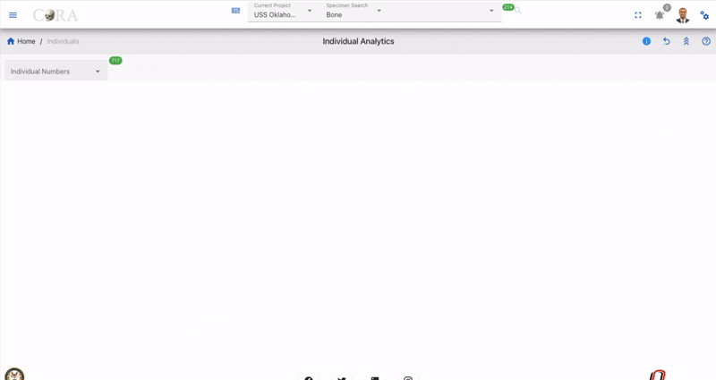

---

### Step 2: Review the Biological Profile

Once the individual is loaded, navigate through the four core analysis tabs to view forensic estimations:

- **Age:** View the estimated age range and the methods used to reach that conclusion.
- **Sex:** Check the determined biological sex and supporting skeletal indicators.
- **Ancestry:** Review the predicted biogeographic group.
- **Stature:** Analyze height estimations.

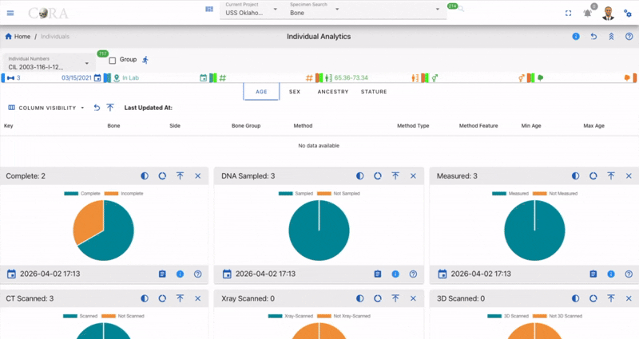
---

### Step 3: Deep Dive into Stature Estimations

The **Stature** tab is the most data-intensive section. To manage this data:

- **Filter Specimens:** Use the **Specimens** dropdown to focus on specific bones (e.g., `Tibia - Left`).
- **Verify Methodology:** Check the **Method** column to see which forensic standard (e.g., `Trotter and Gleser`) is being applied.
- **Analyze Equations:** Review the **Equation** column to see the mathematical formula used to generate the height range.

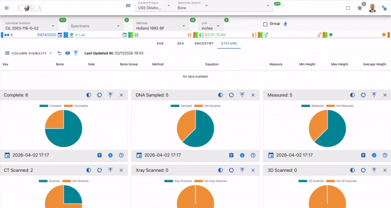
---

### Step 4: Monitor Processing & Completion

Use the interactive pie charts at the bottom to track the lab's progress on the individual:

- **Completion Check:** Hover over the **Complete** chart to see the exact ratio of present vs. missing bones.
- **Sampling Status:** Review the **DNA Sampled** and **Measured** charts to ensure all required protocols have been followed.
- **Digital Imaging:** Check the **Scanned**, **X-ray**, and **3D Scanned** charts to confirm that a digital twin of the remains has been created.

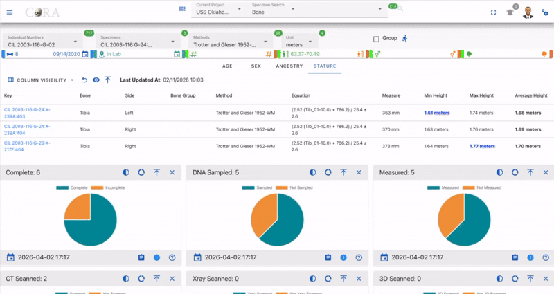
---

### Step 5: Customize Your Workspace

If the screen feels cluttered, you can tailor the view to your needs:

- **Toggle Columns:** Click **Column Visibility** to check or uncheck specific data points (e.g., `Bone Group`, `Method Type`).
- **Switch Layouts:** Use the **List/Grid Toggle** (icon with four squares/lines in the top-right) to switch between the dashboard view and a more condensed data list.
- **Manual Refresh:** If data was recently entered in another module, click the **Refresh/Sync** icon to update the analytics.

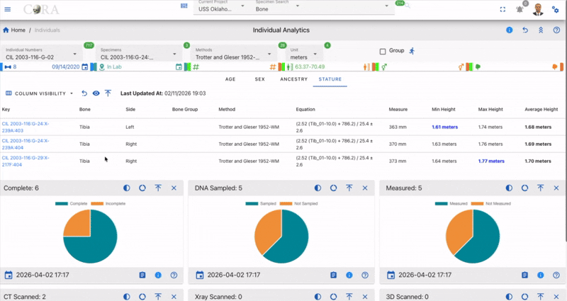

---

!!! tip

    Always check the **Last Updated** timestamp and the **Status Tag** (e.g., `In Lab`) at the top of the page to ensure you are viewing the most current information.

