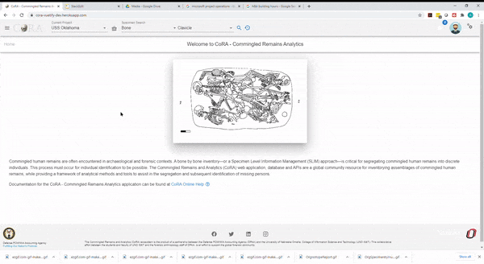
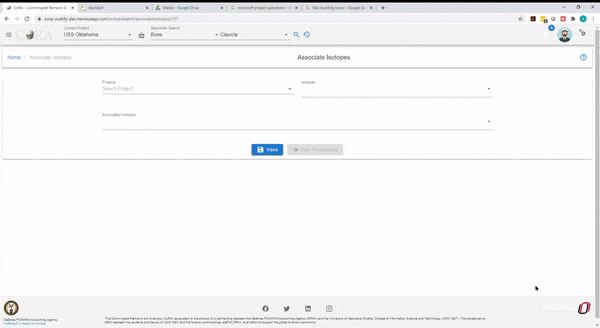
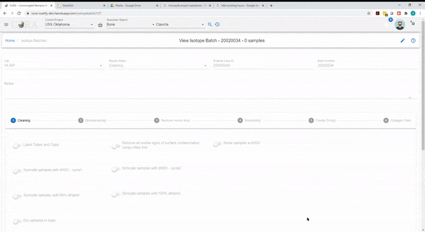
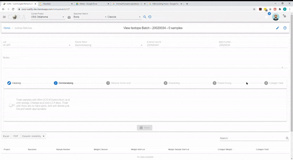
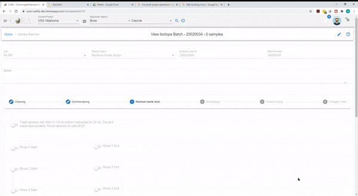
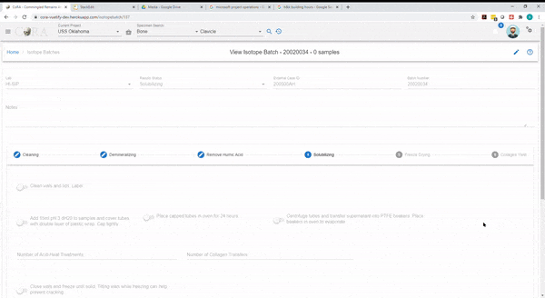
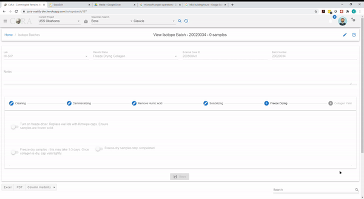
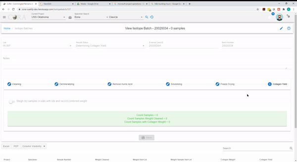

# Isotopes

## Create Isotope Batch

A new isotope batch can be created by navigating to Left Sidebar Menu -\> Isotope -\> New Isotope Batch.

This will allow an Isotope Analyst to first create an isotope batch with a batch number and then associate specimen isotope samples that 
belong to that batch. After all the isotopes samples are added to the batch we can start processing the isotope batch. The isotope batch 
will step through multiple processing steps which as detailed below. 

We can track the progress throughout the processing cycle of an isotope batch. This functionality will allow the Isotope Analyst digitally
document at which step the Isotope Batch is currently in and tracks its' progress and status. 

!!! tip
    You must be logged in as an Isotope Analyst in order to create a new isotope batch.
       

> The screen fields are shown below. Fields in bold are required.

Attributes           |Data Type      |Size       | Validation Rule                                       | Required/Optional
---------------------|---------------|-----------|-------------------------------------------------------| -------------
**Batch Number**     |Alphanumeric   |8 chars    |an only contain letters and numbers                    | Required
**Lab**              |Id             |id         |valid labs via dropdown setup for the org              | Required
External Case Number |String         |32 chars   |                                                       | Optional

Clicking Save will create the isotope batch in the database and will allow you to now associate isotope samples to this batch

### Associate Isotopes Samples

Once an isotope batch has been created the user will be allowed to associate isotope samples to this batch.
In order to assocaite isotope samples to this batch the user must first select the project, this will then show you all
the specimen isotope samples that are available to be added to this batch. Selecting the isotope sample and clicking the assocaite 
button will move the sample into the associated isotopes list, meaning that the sample has now been added to this batch.

> The screen fields are shown below. Fields in bold are required.

Attributes             |Data Type      |Size       | Validation Rule                                       | Required/Optional
-----------------------|---------------|-----------|-------------------------------------------------------| -------------
**Project**            |Id             |id         |valid projects via dropdown setup for the org          | Required
**Isotopes Sample**    |String         |32 chars   |                                                       | Required
**Associated Samples** |String         |32 chars   |                                                       | Required

!!! note
    An isotope batch must have at least one isotope sample associated with it.

## Start Batch Processing

The start processing button will be enable once isotope samples are assocaited with the isotope batch.
The batch processing has multiple steps and the following sections describe each of these steps in the order
they are to be performed. You cannot move forward unless all the tasks in a given step are completed, you can move
back to look the data in the previous steps. Only when all steps have been completed can you close out the
batch processing. Lets begin by following the steps below.

!!! note
    Each of these steps might take anywhere from a few minutes to multiple hours.

### Cleaning

Click the pencil icon on the top right corner to edit the fields in this step. 

Each toggle switch must be enabled before moving forwards to the next tab (Demineralizing)

Toggles must be enabled for the following processes:
- Label Tubes and Caps
- Remove all visible signs of surface contamination using rotary tool
- Rinse samples w/dH20
- Sonicate samples with dH20 - cycle 1
- Sonicate samples with dH20 - cycle 2
- Sonicate samples with 95% ethanol
- Sonicate samples with 100% ethanol
- Dry samples in oven

Click Save

After the toggles have been enabled and saved, you will see "Start Date" for Sonicate samples with dH20 - cycle 1, Sonicate samples with 95% ethanol, Dry samples in oven, Sonicate samples with dH20 - cycle 2, Removed cooled samples from tubes, weigh, and return. 

***Note: Dates cannot be edited, the dates are taken from when the toggle switch was enabled.***

After you save the above one new field will appear, enable this toggle once completed and then click save

- Remove cooled samples from tubes, weigh, and return

Click Save

***If you are not able to go to the next tab, please check and ensure all fields and toggles are filled out properly*** 

### Demineralizing

Click the pencil icon on the top right corner to edit the fields in this step. 

Each toggle switch must be enabled before moving forwards to the next tab (Remove Humic Acid)

Toggle must be enabled for:
- Treat samples with 40ml 0.25 M hydrochloric acid until spongy. Change acid every 2-4 days. Treat until there are no hard spots; test with dental pick. Discard waste appropriately.

click Save

Two new fields will appear, click the pencil icon again to edit to enable the toggle switches

Toggles must be enabled for:
- Treatment of samples with 40ml 0.25 M hydrochloric acid complete

***Note: Dates cannot be edited, the dates are taken from when the toggle switch was enabled.***

Click Save

One new field will appear, click the pencil icon again to edit to enable the toggle switch

Toggles must be enabled for:
- Rinse demineralized samples 3x with dH20

Click Save

***You will be moved to the next tab, "Remove Humic Acid", if you are not able to go to the next tab, please check and ensure all fields and toggles are filled out properly***

### Remove Humic Acid

Click the pencil icon on the top right corner to edit the fields in this step. 

Each toggle switch must be enabled before moving forwards to the next tab (Solubilizing). 

Toggles must be enabled for:

- Treat samples with 40ml 0.125 M sodium hydroxide for 24 hrs. Discard waste appropriately. Rinse samples 5x with dH20. 
- Rinse 1 Start
- Rinse 1 End
- Rinse 2 Start
- Rinse 2 End
- Rinse 3 Start
- Rinse 3 End
- Rinse 4 Start
- Rinse 4 End
- Rinse 5 Start
- Rinse 5 End

Click Save

One new field will appear, click the pencil icon again to edit to enable the toggle switches. 

***Note: Dates cannot be edited, the dates are taken from when the toggle switch was enabled.***

- Treatment and Rinse Completed

Click Save

***You will be moved to the next tab, "Solubilizing", if you are not able to go to the next tab, please ensure all fields and toggles are filled out properly***

### Solubilizing

Click the pencil icon on the top right corner to edit the fields in this step. 

Each toggle switch must be enabled before moving forwards to the next tab (Freeze Drying). 

Toggle must be enabled and fields entered for:

- Clean vials and lids. Label. 
- Add 15ml pH 3 dH20 to samples and cover tubes with double layer of plastic wrap. Cap tightly. 
- Place capped tubes in oven for 24 hours. 
- Centrifuge tubes and transfer supernatant into PTFE beakers. Place beakers in oven to evaporate
- Number of Acid-Heat Treatments
- Number of Collagen Transfers
- Close vials and freeze until solid. Tilting vials while freezing can help prevent cracking. 

Click Save

***You will be moved to the next tab, "Freeze Drying", if you are not able to go to the next tab, please ensure all fields and toggles are filled out properly.***

### Freeze Drying

Click the pencil icon on the top right corner to edit the fields in this step. 

Each toggle switch must be enabled before moving forwards to the next tab (Collagen Yield).

Toggles must be enabled for:  

- Turn on freeze-dryer. Replace vial lids with Kimwipe caps. Ensure samples are frozen solid. 
- Freeze-dry samples - this may take 1 - 3 days. Once collagen is dry, cap vials tightly. 
- Freeze-dry samples step completed

Click Save

***Note: Dates cannot be edited, the dates are taken from when the toggle switch was enabled.***

***You will be moved to the next tab, "Collagen Yield", if you are not able to go to the next tabl, please ensure all fields and toggles are filled out properly.***

### Collagen Yield

Click the pencil icon on the top right corner to edit the fields in this step. 

Each toggle switch must be enabled before the Isotope Batch can be saved. 

Toggle must be enabled for: 

- Weigh dry samples in vials with lids and record combined weight. 

Click Save 

You should see "Result Status" field on the top showing that it is Completed. 

## Isotope Batch Fields

> The screen fields are shown below. Fields in bold are required.

!!! tip
    dH~2~O is Distilled Water
       
 
Attributes                                            |Data Type     |Size       |Validation Rule                           |Required/Optional 
------------------------------------------------------|--------------|-----------|------------------------------------------|--------------------
**Lab**                                               |Id            |id         |Can choose from the option available      |Required
External Case #                                       |Alphanumeric  |32 chars   |Can only contain letters and numericals   |Optional
**Isotope Batch Number**                              |Alphanumeric  |32 chars   |Can only contain letters and numericals   |Required
**Status**                                            |String        |32 chars   |valid statuses are Open, Associating Isotopes, Cleaning, Demineralizing, Removal Humic Acids, Solubilizing, Freeze Drying Collagen, Determining Collagen Yield and closed                                          |Required
**Cleaning start date**                               |Date          |           |                                          |Required
**Label tubes and caps**                              |Boolean       |           |true/false toggle                         |Required
**Remove all visible signs of surface contaminatio**n |Boolean       |           |true/false toggle                         |Required
**Ringes sample with dH~2~O**                         |Boolean       |           |true/false toggle                         |Required
**Sonicate samples with dH~2~O-cycle1**               |Boolean       |           |true/false toggle                         |Required
**Sonicate samples with dH~2~O-cycle1 Start Date**    |Date          |           |                                          |Required
**Sonicate samples with dH~2~O-cycle2**               |Boolean       |           |true/false toggle                         |Required
**Sonicate samples with dH~2~O-cycle2 Start Date**    |Date          |           |                                          |Required
**Sonicate samples with 95% ethanol**                 |Boolean       |           |true/false toggle                         |Required
**Sonicate samples with 95% ethanol Start Date**      |Date          |           |                                          |Required
**Sonicate samples with 100% ethanol**                |Boolean       |           |true/false toggle                         |Required
**Sonicate samples with 100% ethanol Start Date**     |Date          |           |                                          |Required
**Dry samples start**                                 |Boolean       |           |true/false toggle                         |Required
**Dry sample start date**                             |Date          |           |                                          |Required
**Dry samples end**                                   |Boolean       |           |true/false toggle                         |Required
**Dry sample end date**                               |Date          |           |                                          |Required
**Cleaning initials**                                 |Alphanumeric  |32 chars   |Can only contain letters and numericals   |Required
**Demineralizing Treatment Start**                    |Boolean       |           |true/false toggle                         |Required
**Demineralizing Treatment End**                      |Boolean       |           |true/false toggle                         |Required
**Demineralizing Treatment Start Date**               |Date          |           |                                          |Required
**Demineralizing Treatment End Date**                 |Date          |           |                                          |Required
**Rinse Demineralized Samples**                       |Boolean       |           |true/false toggle                         |Required
**Removal Humic Acids treatment start**               |Boolean       |           |true/false toggle                         |Required
**Removal Humic Acids treatment End**                 |Boolean       |           |true/false toggle                         |Required
**Removal Humic Acids treatment start Date**          |Date          |           |                                          |Required
**Removal Humic Acids treatment End Date**            |Date          |           |                                          |Required
**Removal Humic Acids treatment rinse 1 start**       |Boolean       |           |true/false toggle                         |Required
**Removal Humic Acids treatment rinse 1 End**         |Boolean       |           |true/false toggle                         |Required
**Removal Humic Acids treatment rinse 1 start Date**  |Date          |           |                                          |Required
**Removal Humic Acids treatment rinse 1 End Date**    |Date          |           |                                          |Required
**Removal Humic Acids treatment rinse 2 start**       |Boolean       |           |true/false toggle                         |Required
**Removal Humic Acids treatment rinse 2 End**         |Boolean       |           |true/false toggle                         |Required
**Removal Humic Acids treatment rinse 2 start Date**  |Date          |           |                                          |Required
**Removal Humic Acids treatment rinse 2 End Date**    |Date          |           |                                          |Required
**Removal Humic Acids treatment rinse 3 start**       |Boolean       |           |true/false toggle                         |Required
**Removal Humic Acids treatment rinse 3 End**         |Boolean       |           |true/false toggle                         |Required
**Removal Humic Acids treatment rinse 3 start Date**  |Date          |           |                                          |Required
**Removal Humic Acids treatment rinse 3 End Date**    |Date          |           |                                          |Required
**Removal Humic Acids treatment rinse 4 start**       |Boolean       |           |true/false toggle                         |Required
**Removal Humic Acids treatment rinse 4 End**         |Boolean       |           |true/false toggle                         |Required
**Removal Humic Acids treatment rinse 4 start Date**  |Date          |           |                                          |Required
**Removal Humic Acids treatment rinse 4 End Date**    |Date          |           |                                          |Required
**Removal Humic Acids treatment rinse 5 start**       |Boolean       |           |true/false toggle                         |Required
**Removal Humic Acids treatment rinse 5 End**         |Boolean       |           |true/false toggle                         |Required
**Removal Humic Acids treatment rinse 5 start Date**  |Date          |           |                                          |Required
**Removal Humic Acids treatment rinse 5 End Date**    |Date          |           |                                          |Required
**Solubilizing clean vials and lids**                 |Boolean       |           |true/false toggle                         |Required
**Solubilizing clean vials and lids date**            |Date          |           |                                          |Required
**Solubilizing add solubale**                         |Boolean       |           |true/false toggle                         |Required
**Solubilizing place in oven**                        |Boolean       |           |true/false toggle                         |Required
**Solubilizing centrifuge tubes**                     |Boolean       |           |true/false toggle                         |Required
**Solubilizing num acid heat treatment**              |Number        |32 chars   |numeric                                   |Required
**Solubilizing num collagen transfers**               |Number        |32 chars   |numeric                                   |Required
**Solubilizing freeze vials**                         |Boolean       |           |true/false toggle                         |Required
**Solubilizing freeze vials date**                    |Date          |           |                                          |Required
**Freeze Drying Collagen on**                         |Boolean       |           |true/false toggle                         |Required
**Freeze Drying Collagen Start**                      |Boolean       |           |true/false toggle                         |Required
**Freeze Drying Collagen End**                        |Boolean       |           |true/false toggle                         |Required
**Freeze Drying Collagen Start Date**                 |Date          |           |                                          |Required
**Freeze Drying Collagen End Date**                   |Date          |           |must be greater than start date           |Required
Combined Sample Weight                                |Boolean       |           |true/false toggle                         |Optional
Notes                                                 |String        |256 chars  |Can contains a string alphanumeric values |Optional

