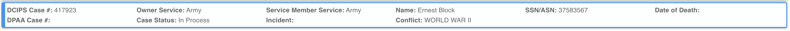
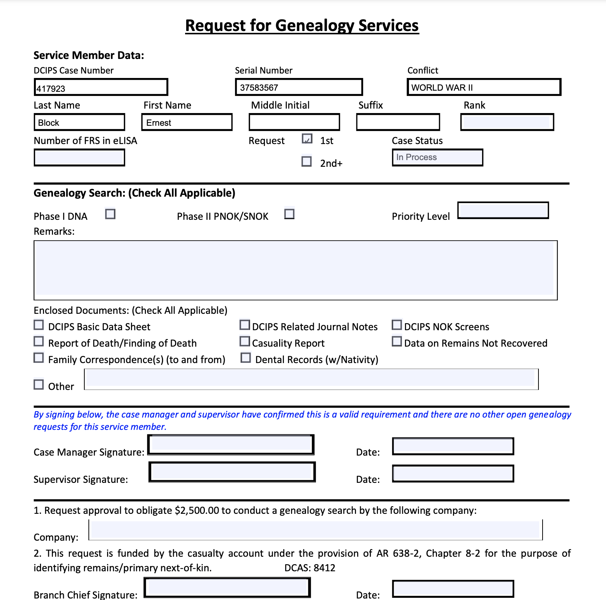
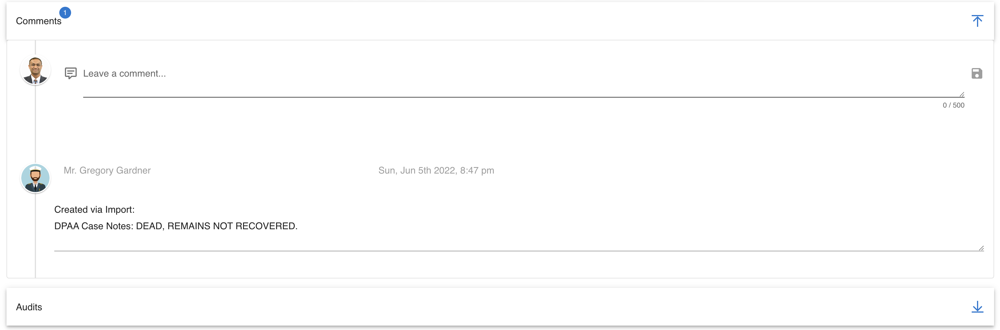

# Missing Persons

The missing persons module in CoRA is where you create and manage records of missing persons. In CoRA there are two roles that manage this module. The role of missing persons administrator (mp admin) and missing persons case manager (mp case manager) administer and manage the missing person cases.

!!! warning

    This page is work in progress.

## Searching Cases

Users can search missing persons cases by navigate to Left Sidebar Menu -\> Missing Persons-\> Advanced Search.

You are now in the advanced search for the Missing Persons section of the CoRA application. 

The Missing Persons module of the CoRA application comes with a powerful searching tool, you can use this generate an advanced search of missing persons cases 
using a wide array of criteria.

### Advanced Search

The advanced search allows you to find missing person cases with a variety of different filters. Any filters set will be combined to find records that match all of the criteria.

The fields to search a missing person case are as follows:

- Case Status
- Owner Service - Filters by service that owns the record in DCIPS
- Service Member Service - Filters by the service that the service member belonged to
- Conflict
- Incident - Case insensitive search for any incident containing the value entered.
- DPAA Case Status - Whether the case is marked as resolved or unresolved
- DPAA Priority - Numeric value for any priority.
- Case Number - Finds any records containing the value specified in the DCIPS Case Number field.
- Name - Case insensitive search for any name containing the value specified. Searches first, middle, and last name fields along with the suffix.
- Project - Projects available for filtering are limited to those two which the logged in user is assigned.
- Case Manager - Allows selection of any PCRB administrator or case manager for filtering cases assigned.
- PCRB Priority - Case insensitive search of PCRB Priority for any record containing the value specified.
- Genealogy Status - Filters by status of the genealogy request assigned to the missing persons case.
- Updated At - Users are prompted to specify a start and end date to filter by the updated at date field of the missing persons case record.
- DPAA Prioritized Only - Activating this filter excludes all missing persons cases without a DPAA priority set.
- Followed Up - Whether the record has been followed up on or not 
- Updated DCIPS - Whether the record has been updated in DCIPS

When searching for cases, use some or all of the fields to narrow down the results. Filters are used in combination, so specifying multiple filters will limit the results to those records matching all criteria specified.

*Note: In order to search for all of the missing persons cases, leave all fields empty.*

Once you have inputted your search criteria, select the "Generate" button from the toolbar to search.

### Working with Search results

After generating search results, you can further refine, filter, and sort your results.

#### Sorting

Sorting the search results is as simple as clicking on the column header. Clicking once will cause the data to be sorted into ascending order based on the column selected. Clicking the same column header again will cause the data to be sorted in descending order. To clear the filter, click the column header a third time.

Sorting by multiple columns is also possible. To do this, select the column header of the first column by which you wish to sort. Then select the second column header. Numbers will appear next to the column headers allowing you to see which columns are being used to sort.

#### Searching

Instantly search your advanced search results for any keyword with the search bar on the right side of the page. Simply enter the key you wish to search with and the advanced search results will update accordingly.

Searching advanced search results is robust and will match items that are exact or partial to what you have entered into the search bar.

For example, searching advanced search results for "Smit" would bring up any results that contain "Smit", like "Smith", "Smitty", and "Smite".

#### Column Visibility

The search results will return the following columns if available. Additional columns are available and can be selected from the "Column Visibility" button above the search results.

- Case Number
- Case Status
- Owner Service
- Service Member Service
- Full Name
- Conflict
- Case Manager
- Priority DPAA
- Updated
- Updated By

#### Download Result Cases

Once you have your advanced search results refined in a way that you like, export this list with the export buttons on the left hand side.

Available export options are:

- PDF
- Excel

Selecting this option will export the search results in the selected file format for download onto your computer.

### Batch Edit

Making changes to many cases at the same time can be performed with the batch editing feature. Once you select multiple cases using the check boxes on the left side of the results of an advanced search an actions menu will appear.

Here you will be able to select "Batch Edit" and update one or more fields for each of the selected cases.

## Managing Cases

CoRA allows you to look at and manage missing person cases with ease and flexibility. Select a specific case by selecting the case number underlined in blue. Once you select the case, a page will open with the details of the selected case.

Once you have the case open, interact with the different fields to make the changes you need.

*Note: Some of the fields may be grayed out, these are fields that you cannot change and are changed in the system of record or by an individual with more access*

Case information is separated into several different categories:

- Basic Case Information
- DPAA
- FRS Status
- Checklist

### Basic Case Information

At the top of the page, you will notice the essential information is grouped together:

- DCIPS Case Number
- Owner Service
- Service Member Service
- Service Member Name
- SSN/ASN
- Date of Death (if available)
- DPAA Case Number
- Case Status
- Incident
- Conflict

The card is also outlined in a color to represent the status. These colors correspond with the following statuses:

| Status | Color | 
| -- | -- |
| Completed | Green |
| In Process | Blue |
| Exhausted | Yellow |
| Not Started | No Color |

### DPAA

The DPAA section of the case detail page is dedicated to DPAA. The following fields can be found here and modified:

- Project
- DPAA Priority
- Possible Remains in Lab
- XFile
- Field Grave
- Temp Field Grave

### FRS Status

The FRS Status section of the case detail page is dedicated to tracking of Family Reference Samples (FRS). The following fields can be found here and modified:

- 1st mtDNA
- 2nd mtDNA
- 3rd mtDNA
- 1st yDNA
- 2nd yDNA
- 1st nuclear
- 2nd nuclear

### Checklist

The Checklist section of the case detail page is dedicated to keeping track of the tasks to perform in reference to the specific case being viewed. The following fields can be found here and modified:

- Add Family members from Geno Report to DCIPS
- Attempt contact of family members in DCIPS
- Send Outreach letters to family members unreachable by phone
- Records sent to family

This section of the case details also provides the status for the various records relating to the case:

- IDPF Status
- OMPF Status
- CSR Status
- Awards Status

### Genealogy Request 

The case manager for a case, the missing persons administrator, and the system administrator may generate a genealogy request. Those with permission to generate a genealogy request will see a blue Genealogy Request button to the left of the Save and Cancel buttons.

Clicking on this button will generate and download a pdf titled Request for Genealogy Services. 

The pdf will have two sections of information, Service Member Data and Genealogy Search, and three authorization sections with signature and date fields. Even though some of the fields are pre-filled, they are editable.

### Comments

The Comments section of the case detail page is dedicated to viewing and logging the comments and notes related to the specific case.

To leave a comment, type the comment into the comment text box and click the save icon on the right side. 

This will save the comment with your username as well as the date and time the comment is made. The comment can be edited or deleted by a system administrator.

### Audits
The Audits section allows users to view all changes made to a missing persons record. This will show the detail of what, who, and when changes were made in the system.

To view the audit data, select the arrow on the right side of the Audits section to view any relevant audit records.

### Tags
The tags section enables users to associate additional information (aka Tags) to missing persons records.

## Importing Data

Importing case changes and new cases from DCIPS is made easy with CoRA's robust import capability. To start the file import process, navigate to Left Sidebar Menu -\> File Export/Import-\> File Import.

### Import File

Using the correct template for importing data is important, CoRA makes it easy to ensure your existing files match files that system will accept without error.

1. Select the drop down
2. Select the file type you would like to import
3. Upon selecting the file template you would like to import, a sample of the file will be downloaded to your computer. Use this sample template to ensure that the information you are importing will be accepted without error.
4. You will then be able to upload the file you want into the system.

Once the file you wish to import is in the correct format, you may import the file into the system.

1. Select "Choose File"
2. Choose the correct file from your system's file explorer
3. Select "Upload"

Your file will now be uploaded into the system and updates will be made.
