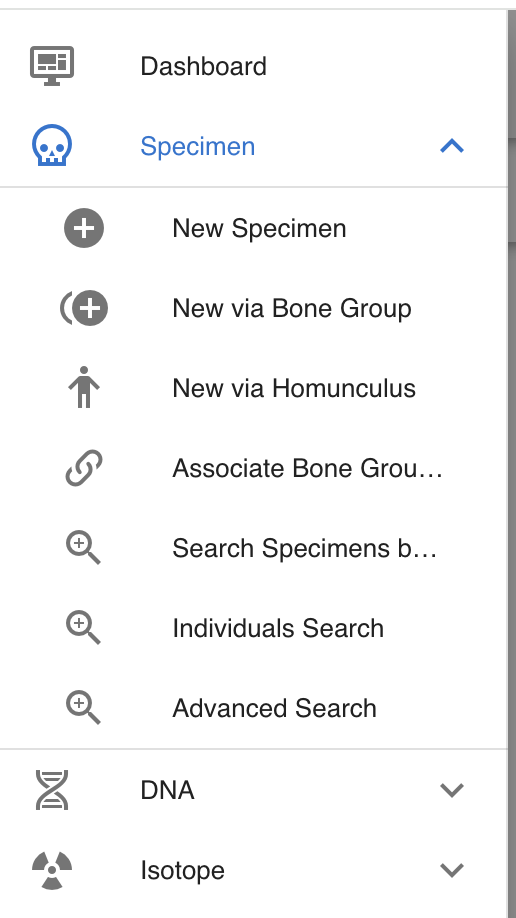
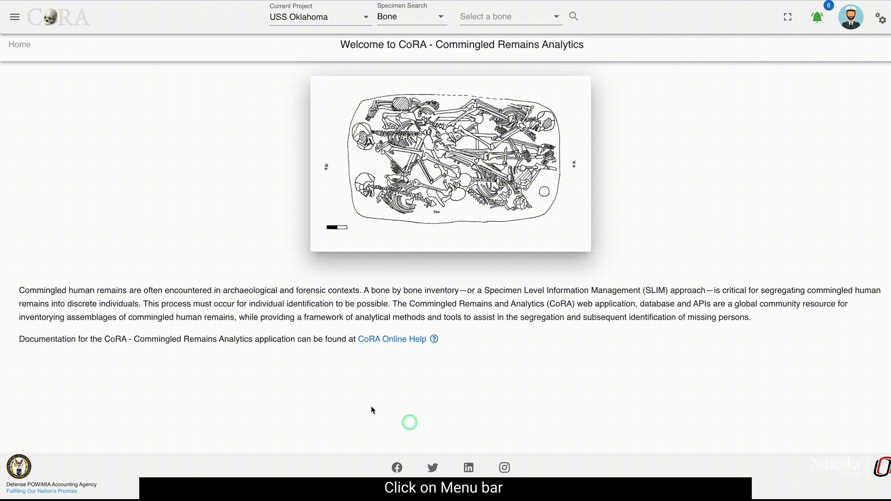
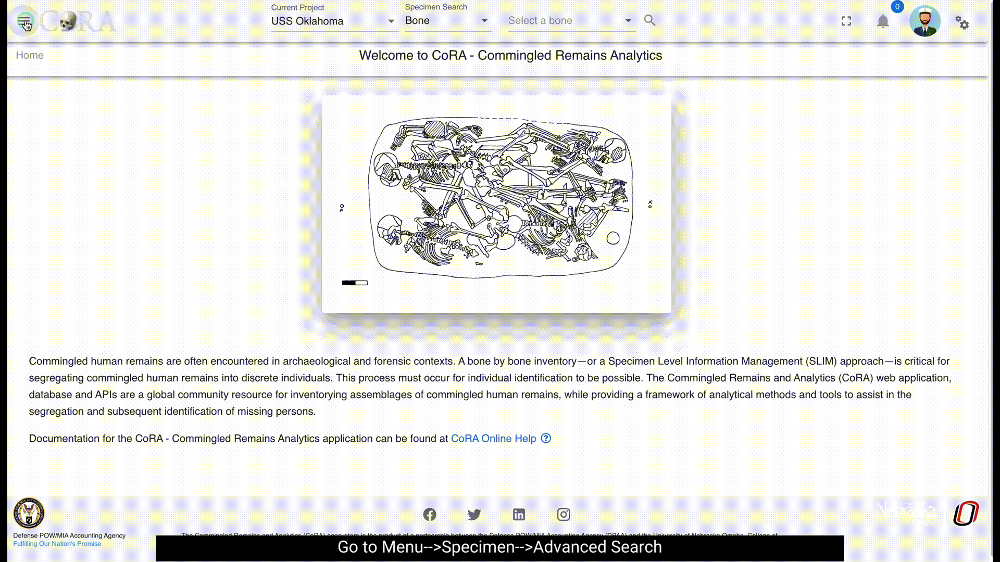
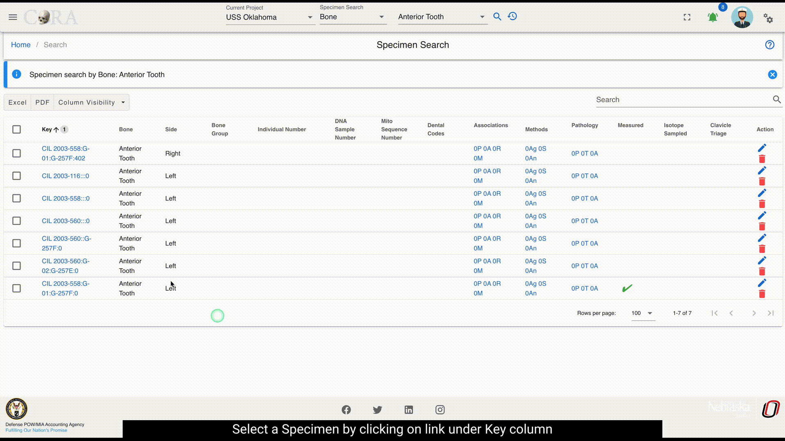
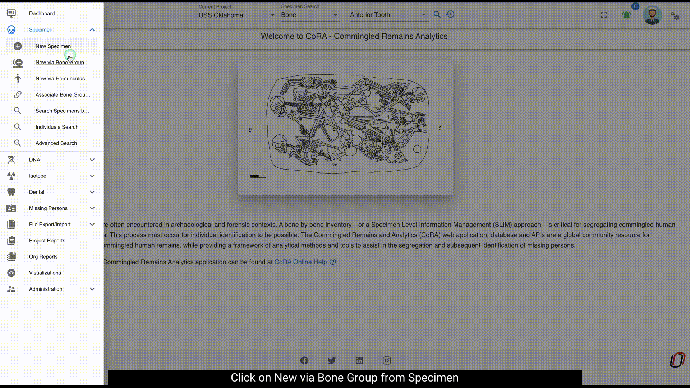
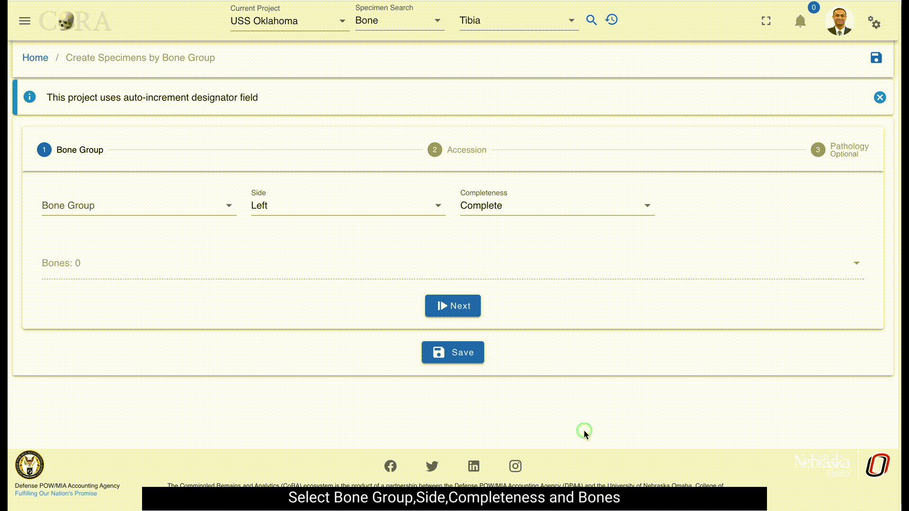
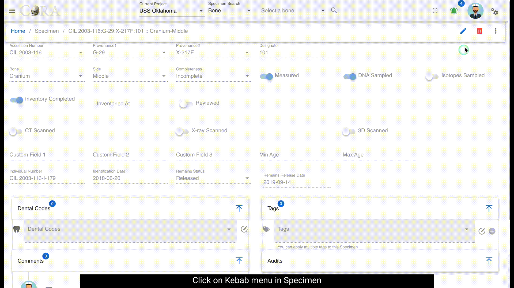

# Specimens or Skeletal Elements
Specimen are individual human remains which can be categorized. Many of the modules on the site are focused on specimens and their association details such as Biological Profile, DNA Profile, Measurements, Zones, Articulation, Pair Matching, Refits, Morphology, Pathology, Trauma, Taphonomy, etc.
This section will explore navigating the specimens and their associations screen related characteristics.

- Specimen Navigation
- Creating a New Specimen 
- Creating a New Specimen Group
- Specimen Search
- Specimen Details

## Specimen Navigation

On the left side bar - you can access the main options for specimens. For Report Dashboard - please see the **Reports** documentation.

## Creating Specimens

You can create a new specimen in multiple ways. For example you can create a a single specimen or multiple specimens belonging to a bone group such as
Arm, Shoulder, Vertebral Column, Hand, Feet, etc. In the future we plan to include specimen creation via a Homunculus. I know I'm getting ahead of myself
but that is on our dream list.

### Single Specimen

To create a new specimen navigate to the Left Sidebar Menu -\> Specimen -\> New Specimen.
You will be taken to the new specimen screen as shown below. 

> The screen fields are shown below. Fields in bold are required.

Attributes       | Data Type    |Size       | Validation Rule                                                               | Required/Optional
-----------------|--------------|-----------|-------------------------------------------------------------------------------| -------------
**Accession**    | String       |32 chars   | Can only contain letters, numbers, dash and space and should have min 3 chars | Required
Provenance1      | String       |32 chars   | Can only contain letters, numbers, dash and space                             | Optional
Provenance2      | String       |32 chars   | Can only contain letters, numbers, dash and space                             | Optional
**Designator**   | Alphanumeric |32 chars   | Can only contain letters and numbers                                          | Required
**External ID**  | String       |32 chars   | Can only contain numbers and decimals                                         | Required
**Bone**         | Id           |id         | valid bones via dropdown                                                      | Required
**Side**         | String       |8 chars    | valid sides via dropdown (Left, Right, Middle, Unsided)                       | Required
**Completeness** | String       |16 chars   | valid completeness via dropdown (Complete, Incomplete)                        | Required

Once these details are filled and the user can either select 'SAVE AND EDIT' or 'SAVE AND ADD'. If the user selects 'SAVE AND EDIT', a new specimen with an appropriate `id` is generated and the user is navigated to the below screen. The screen is in View state.

1.  Edit button enables the user to edit the specimen.
2.  The Kebab menu button consists of DNA profile, Isotope Analysis, Zone Classification, Taphonomy, all specimen associations and pathology, and Review.

To edit a specimen, you can search for it using the advanced search feature under specimen menu or the search function available on the home page.

Edit a specimen via the home page search

Edit specimen via Specimen-->Advanced Search

> The screen fields are shown below. Fields in bold are required.

Attributes          |Data Type      |Size       | Validation Rule                                                               | Required/Optional
--------------------|---------------|-----------|-------------------------------------------------------------------------------| -------------
**Accession**       |String         |32 chars   | Can only contain letters, numbers, dash and space and should have min 3 chars | Required
Provenance1         |String         |32 chars   | Can only contain letters, numbers, dash and space                             | Optional
Provenance2         |String         |32 chars   | Can only contain letters, numbers, dash and space                             | Optional
**Designator**      |Alphanumeric   |32 chars   | Can only contain letters and numbers                                          | Required
**External ID**     |Alphanumeric   |32 chars   | Can only contain numbers and decimals                                         | Required
**Bone**            |Id             |id         | valid bones via dropdown                                                      | Required
**Side**            |String         |8 chars    | valid sides via dropdown (Left, Right, Middle, Unsided)                       | Required
**Completeness**    |String         |16 chars   | valid completeness via dropdown (Complete, Incomplete)                        | Required
Measured            |Boolean        |           | true/false toggle                                                             | Optional
DNA Sampled         |Boolean        |           | true/false toggle                                                             | Optional
Isotope Sampled     |Boolean        |           | true/false toggle                                                             | Optional
Inventory Completed |Boolean        |           | true/false toggle                                                             | Optional
Reviewed            |Boolean        |           | true/false toggle                                                             | Optional
CT Scanned          |Boolean        |           | true/false toggle                                                             | Optional
X-ray Scanned       |Boolean        |           | true/false toggle                                                             | Optional
3D Scanned          |Boolean        |           | true/false toggle                                                             | Optional
Individual Number   |String         |32 chars   | can only contain letters, numbers, dash and space                             | Optional
Remain Status       |String         |16 chars   | valid sides via dropdown (In Lab, Released)                                   | Optional

Click "Save" When you are done making changes. 

A specimen can be deleted by clicking on the delete icon and then confirming the deletion in the pop-up. 

### Multiple via Bone Group

To create a multiple specimens via bone group - navigate to the Left Sidebar Menu -\> Specimen -\> New via Bone Group. You will be taken to the new specimens via bone group screen. Here you can create multiple specimens that belong to the same bone group. 

!!! tip

    This is the preferred way to create multiple specimens within a bone group as CoRA will automatically create articulation 
    relationship amongst them. You can also apply Pathology, Trauma and Taphonomy to these specimens at the time of creation 
    simplifying and speeding up the data entry process.

The fields to create a new bone group are:

- Bone Group
    - **Grouping**
    - Bones
    - **Side** (defaulted to 'Left')
    - **Completeness** (defaulted to 'Complete')
- Accession
    - **Accession Number**
    - Provenance 1
    - Provenance 2
    - **Designator**
- Pathology
    - Traumas
    - Pathologies
    - Taphonomies
    
The bolded fields are required. Once you have created a new bone group, you can edit the fields and click "Save" to update the bone group.
 
Attributes              |Data Type      |Size           |Validation Rule                                                               | Required/Optional
------------------------| ------------- | --------------|------------------------------------------------------------------------------| -------------
Bone Group              |String         |64 chars       |can only contain letters                                                      | Required
Bone Group Id           |String         |64 chars       |valid UUID, auto generated                                                    | Required
**Side**                |String         |8 chars        |valid sides via dropdown (Left, Right, Middle, Unsided)                       | Required
**Completeness**        |String         |16 chars       |valid completeness via dropdown (Complete, Incomplete)                        | Required
**Accession**           |String         |32 chars       |can only contain letters, numbers, dash and space and should have min 3 chars | Required
Provenance1             |String         |32 chars       |can only contain letters, numbers, dash and space                             | Optional
Provenance2             |String         |32 chars       |can only contain letters, numbers, dash and space                             | Optional
**Starting Designator** |Alphanumeric   |32 chars       |can only contain letters and numbers                                          | Required
**Bone**                |Id             |id             |valid bones via dropdown                                                      | Required
                             
Once you have created a new bone group, you can edit the fields and click "Save" to update the bone group.

!!! tip

    When creating specimens via bone groups, you only have to specify the starting designator and CoRA will automatically create the specimens 
    with that starting designator and increment it for subsequent specimens within the bone group.

### Multiple via Homunculus

To create a multiple specimens via homunculus - click the "New via homunculus" link on the Specimens left navigation bar. You will be taken to the new specimens via homunculus screen.

!!! warning

    :material-flask-outline: This is an experimental feature and is work in progress. We will keep you posted when this feature is available.

## Specimen Actions or Details

The screenshot below shows the Actions or Details menu for the selected specimen. Here you can enter association data for the specimen.
Each of the Action or Details menu option is explained in the following section.

### Biological Profile

The Biological Profile is where you can record the various methods and method features for method type Age, Ancestry, Sex, and Stature.
CoRA's intellisense engine will automatically provide you the available methods for each method type which are currently registered in CoRA.
The user can add, edit or delete a method.

#### Age

#### Sex

#### Ancestry

#### Stature

!!! warning

    This section needs to be documented

### DNA Profile

The DNA Profile screen displays the following elements about a bone:

- DNA Sample Number
- Lab
- External Case #
- BTB Request Date
- BTB Results Date
- Disposition
- Sample Condition
- Weight Sample Remaining

On this screen, you can also view the "Mito", "auSTR", and "Y-STR" forms and navigate by clicking the form name or by clicking the Next button.

### Isotope Analysis

The 'Create Isotope' section allows to create a isotope for the given bone. This section has the following elements. 
- Lab
- External Case # 
- Isotope Sample Number

After you create the Isotope, you will receive the "success" message. By selecting the sample number, the Isotope screen pops up. Click on the Edit button to edit the information under each section.Click on the Save button under each section saves the information and navigates the user to the next section of information. All the updated information can be saved at once by clicking on the ‘Save All’ button.

### Taphonomy

The Taphonomies section allows you to view Taphonomies for the given bone. To add Taphonomy, click the pencil icon to edit and select Taphonomies. Click the Save icon to save the changes.

### Zonal Classification

The Zones pane displays various zones of the bone. For example below are the following zones about the Cervical Vertebra:

- Body
- Right Transverse Process
- Left Transverse Process
- Spinous Process

These fields are read only - to edit then click the pencil icon. Multiple zones can be selected. All the listed Zones can be selected or deselected by clicking the ‘Select all’ check box. Click the save icon to save the changes.

### Measurements

The measurements pane displays various measurements of the given bone.
Only the specimens associated with a bone that is measured will have measurements for that bone. Bones associated with a specimen that are not measured will not have any measurements.
The measurements generally vary from one bone to another and following are the measurements for a given bone Femur:

- Fem_01 Maximum Length
- Fem_02 Bicondylar Length
- Fem_03 Epicondylar Breadth
- Fem_04 Maximum Head Diameter
- Fem_05 Medial-Lateral (Transverse) Subtrochanteric Diameter
- Fem_06 Anterior-Posterior (Sagittal) Subtrochanteric Diameter
- Fem_07 Anterior-Posterior (Sagittal) Midshaft Diameter
- Fem_08 Medial-Lateral (Transverse) Midshaft Diameter
- Fem_09 Maximum Midshaft Diameter of the Femur
- Fem_10 Minimum Midshaft Diameter of the Femur
- Fem_11 Midshaft Circumference
- Fem_12 Maximum Anterio-posterior Length of the Lateral Condyle
- Fem_13 Maximum Anterio-posterior Length of the Medial Condyle
- Fem_14 Minimum Anterior-Posterior Diameter of the Diaphysis
- Fem_15 Minimum Medial-Lateral Diameter of the Diaphysis
- Fem_16 Minimum Superior-Inferior Neck Diameter
- Fem_17 Maximum Diameter along the Linea Aspera
- Fem_18 Upper Breadth of Femur
- Fem_19 Lateral Condyle Height

These fields are read only - to edit, click the pencil icon. the minimum value, threshold limit and maximum limit are indicated to the user through the alerts. Click the save icon to save the changes or ‘Undo’ icon to undo all the changes made. The blue badge on top of the bone name indicates the number of measurements filled out of the total number of available measurements for that particular bone.  The pane can be expanded or collapsed by clicking on the arrow icon.

### Association

There are four types of associations. Process of adding each association is shown below. After the association is added, refresh the page to see the Details button updated. The details button opens a data table of all available associations under that specimen.

#### Pair Matching

#### Refits

#### Articulations

#### Morphology

### Pathology, Anomaly & Trauma

Pathology, Trauma and Anomaly can be accessed on one screen as different tabs. The user can create a new item by clicking on the create button.

#### Pathology

#### Anomaly

#### Trauma

## Specimen Review

The review tab is a pane which displays all other sub reports in one area. All reports are editable in the pane. For information on individual reports - see their detailed documentation.

## Specimen Bulk Edit

Several specimen fields can be bulk-edited. To bulk edit, select multiple specimens by clicking in the boxes next to the specimens you want to edit, click on the Actions tab, and then select Batch Edit.

In the popup, select the changes you wish to make. When you mark a specimen as scanned, completed, or reviewed, the date for the change is auto-filled to the current date. 

If the remains are marked as in the lab, there is no corresponding date.

If the remains are marked as released, there is a date field.

## Specimen Search

The easiest way to search for specimens is to use the top search bar in the header. To find out more visit the [search documentation](../../search/index.md#specimen-search)
