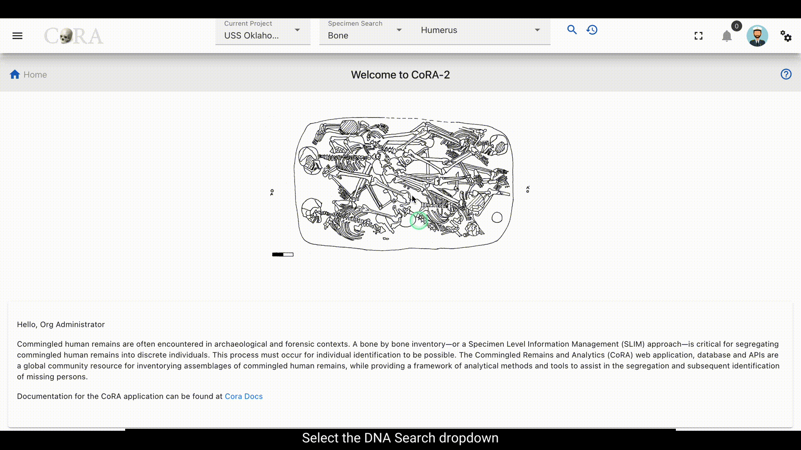
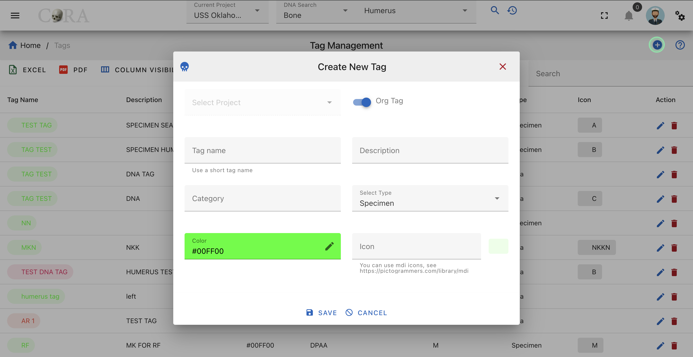

# Tags

Tags are used to organize and categorize, specimens and DNA samples, allowing for efficient data retrieval and analysis. By associating relevant attributes with each specimen or DNA sequence, tags facilitate tracking, filtering, and sharing of data across research workflows.

Currently Tags can be created of the following types:

1. Specimen
2. DNA
3. Isotope
4. Media

## Create Tags

### Create Tags via Specimen

Tags can be created and assigned to individuals skeletal elements using the Specimen Screen. Follow the steps below to do it:

1. **Navigate to the Specimen edit screen:**

- It display multiple sections for modifications.

for example you can locate the specimen as below:

2. **Navigate to the Tags Section and Create a New Tag:**

- Scroll down to find the **Tags** section on the editing page. Here, you will see options like **Save**, **Reset/Undo**, **New**, and a dropdown for selecting tags.
- Click the **New** button to open the Create New Tag dialog box. Enter the required and optional information for the tag:

| Field           | Description                                                | Required/Optional  |
|-----------------|------------------------------------------------------------|--------------------|
| **Tag Name**    | Name for the tag (letters and numbers, max 32 chars)       | Required           |
| **Description** | Brief description (alphanumeric, max 255 chars)            | Required           |
| **Category**    | Specify the category (letters and numbers, max 32 chars)   | Required           |
| **Type**        | Define the type of tag (letters and numbers, max 32 chars) | Required           |
| **Color**       | Hex code for the tag color                                 | Required           |
| **Icon**        | Material Design Icon (mdi) code for visual representation  | Required           |

- After entering all required and optional details, click **Save**. A success message, *\"Tag successfully added,\"* will appear at the top of the screen.

3. **Assign the Tag and Save Changes:**

- In the Tags section, select the newly created tag (or an existing one) from the dropdown menu.
- Attach it to the skeletal element.
- Click **Save** on the editing page to finalize the changes. A confirmation message will indicate that the tag has been successfully assigned to the specimen.

### Create Tags Through DNA

Tags can be created and assigned to individuals skeletal elements using the DNA Screen. Follow the steps below to do it:

1. **Navigate to the DNA edit screen:**

- It display multiple sections for modifications.

for example you can locate the DNA as below:

2. **Navigate to the Tags Section and Create a New Tag:**

- Scroll down to find the **Tags** section on the editing page. Here, you will see options like **Save**, **Reset/Undo**, **New**, and a dropdown for selecting tags.
- Click the **New** button to open the Create New Tag dialog box. Enter the required and optional information for the tag:

| Field           | Description                                                | Required/Optional  |
|-----------------|------------------------------------------------------------|--------------------|
| **Tag Name**    | Name for the tag (letters and numbers, max 32 chars)       | Required           |
| **Description** | Brief description (alphanumeric, max 255 chars)            | Required           |
| **Category**    | Specify the category (letters and numbers, max 32 chars)   | Required           |
| **Type**        | Define the type of tag (letters and numbers, max 32 chars) | Required           |
| **Color**       | Hex code for the tag color                                 | Required           |
| **Icon**        | Material Design Icon (mdi) code for visual representation  | Required           |

- After entering all required and optional details, click **Save**. A success message, *"Tag successfully added,"* will appear at the top of the screen.

3. **Assign the Tag and Save Changes:**

- In the Tags section, select the newly created tag (or an existing one) from the dropdown menu.
- Attach it to the skeletal element.
- Click **Save** on the editing page to finalize the changes. A confirmation message will indicate that the tag has been successfully assigned to the specimen.

## Search via tags

### Specimen Search via Tags

Users can search for specimen which are associated with the particular tag in the application using the **Specimen Search** functionality.

1. **Navigate to Specimen Search**:

- Locate the **Tags** dropdown on the application interface.

2. **Select Tags**:

- Open the tags dropdown menu and select the tag for which you need the associated specimens.

3. **Search and View Results**:

- Hit the **Search** button to execute the query.
- A results sheet will be displayed, showing the selected specimens for the selected tag.

### DNA Search via Tags

## Tag Management

The **Org Administrator** has the ability to browse tags list, create and manage the tags along with the ability to assign tags to projects and Organizations. The tags management screen provides a data table of all the tags in the current organization with information such as **Name**, **Description**, **Category**, **Type**, **Color**, and **Icon**. The tags list will be initially sorted on the name. The data table also has an **Actions** column with buttons to edit the tag.

**tip**

- You can edit the tag by clicking the name link.
- The column visibility will allow you to add more columns/details to the data table list.
- The Search box can be used to search any details in the data table list.

## Create Tag from Tag Management

On the tag management screen, click the **Create** button/icon to create a new tag. Navigation to the tag management screen is shown below.

The **Create** button opens a dialog box to prompt to create a new tag. Enter the information for the new tag record.
Once all information is entered, click **Save**, and a success message `Tag successfully added` will appear at the top.

### Screen Fields

Fields in **bold** are required.

| Attributes   | Data Type | Size      | Validation Rule                           | Required/Optional                  |
|--------------|-----------|-----------|-------------------------------------------|------------------------------------|
| Project      | Id        |           | valid option via dropdown                 | Required (Default current project) |
| Tag Name     | String    | 32 chars  | contains letters and numbers              | Required                           |
| Description  | String    | 255 chars | contains alphanumeric                     | Required                           |
| Category     | String    | 32 chars  | contains letters and numbers              | Optional                           |
| Type         | String    | 32 chars  | contains letters and numbers              | Optional                           |
| Color        | String    | 32 chars  | color hex number                          | Optional                           |
| Icon         | String    | 32 chars  | mdi icon (see material design icon codes) | Optional                           |

## Edit Tag

To edit an existing tag information, simply click on the **Name**, and the edit dialog box will open for editing the existing tag information.
The following fields are available for update. Click **Save** when finished editing, or **Close** to cancel the changes.

### Screen Fields

Fields in **bold** are required.

| Attributes   | Data Type | Size      | Validation Rule                           | Required/Optional                  |
|--------------|-----------|-----------|-------------------------------------------|------------------------------------|
| Project      | Id        |           | valid option via dropdown                 | Required (Default current project) |
| Tag Name     | String    | 32 chars  | contains letters and numbers              | Required                           |
| Description  | String    | 255 chars | contains alphanumeric                     | Required                           |
| Category     | String    | 32 chars  | contains letters and numbers              | Optional                           |
| Type         | String    | 32 chars  | contains letters and numbers              | Optional                           |
| Color        | String    | 32 chars  | color hex number                          | Optional                           |
| Icon         | String    | 32 chars  | mdi icon (see material design icon codes) | Optional                           |

## Delete Tag

## Moving Project tags to Org tags

If particular tag is required at organization level, it can be moved from project level to Org level.

