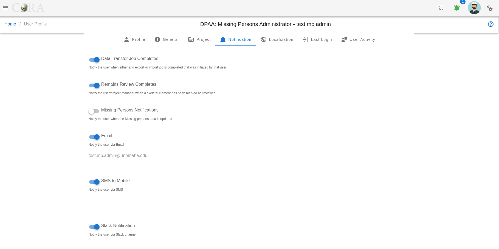

# Org Users Projects

The CoRA application is structured around the concept of organization, users and projects. What does this mean for you?
CoRA was designed to be used by both organizations and single users. Organizations can be government organizations, non-profits, 
universities or any entity that deals with the identification of missing persons, or segregation of human remains. Single users could be
any single individual who wants to use CoRA for their own project (although this is rarely the case), a use case might be for university students
of forensic anthropology. 

## Organizations

:material-office-building-outline: Organizations or simply "Orgs" in CoRA is a top level container. Orgs will usually have Users and Projects and Org Administrators can create these users and projects within that org and most importantly assign users to projects. The org administrator is also responsible to managing and updating the org profile which are attributes and settings that apply to all projects and users as well can control settings within CoRA.

## Users

:material-account: Users in CoRA belong to a org and user accounts are created are typically assigned to projects by the org administrator.
Anyone who uses CoRA must have a user account and must be assigned a role (such as org administrator, anthropologist, dna analyst, isotope analyst, dentist, historian, etc). Each role provide a specific level of authorization to features wothin CoRA. The users are responsible for managing and updating their user profile which are attributes that can control user settings within CoRA.

## Projects

:fontawesome-solid-briefcase-medical: Projects in CoRA is a container that holds spcimens. In CoRA specimens must belong to a project and projects themselves belong to an org. Project attributes and settings can be controlled and managed by the project manager who is typically an anthropologist who is also assigned to that project. 

## Org Administrator
Every Org must have an Org Administrator (Org Admin for short) who is one of the Users with a privilaged role. The Org Admin has the ability to create and manage the Users, Projects, Accession, Instruments, Haplogroups etc. Users with the Org Administrator role will be presented with the Administration menu to perform these functions. Lets look at some of these functions
                                                                                      

### User Management

The Org Administrator has the ability to browse users list, create and manage the users along with the ability to assign users to projects.
The user management screen provides a data table of all the users with information such as Name, Role, Email, Cell Phone, Active Status, Country, Language, Time Zone, IP Address, Last Activity, etc. The users list will be initially sorted on the user name and email. The data table also has an "Actions" column with buttons to reset the password, reset in-activity lock and edit the user record.

!!! tip

    1. You can edit the user by clicking the user name link.
    2. The column visibility will allow you to add more columns/details to the data table list.
    3. The Search box can be used to search any details in the data table list.

#### Create User

On the user management screen, click the Create button/icon to create a new user. Navigation to the user Management screen is shown below. 
    
The Create button opens a dialog box to prompt to create a new user. Enter the information for the new user record, including the the "Role" field. Various user roles can be selected such as Org Admin, Anthropologist, Manager, DNA Analyst, Historian, Isotope Analyst. Intern, etc. Once all information is entered, click "Save", and a success message *“User successfully added”* will appear at the top.

> The screen fields are shown below. Fields in bold are required.
 
Attributes           |Data Type      |Size         |Validation Rule                                       | Required/Optional
---------------------|---------------|-------------|------------------------------------------------------|-----------------
**First Name**       |String         |32 chars     |contains letters                                      |Required
**Last Name**        |String         |32 chars     |contains letters and dash                             |Required
**Email**            |String         |255 chars    |max 255, unique                                       |Required
**Role**             |Id             |             |valid option via dropdown                             |Required (Default Anthropologist)
**Active Status**    |Boolean        |             |true/false toggle                                     |Required (Default Active)
Cell phone           |String         |32 chars     |contains numbers and dash                             |Optional
Alternate phone      |String         |32 chars     |contains numbers and dash                             |Optional
**Password**         |String         |64 chars     |min 10, at least 1 letter, 1 cap, 1 number, 1 special |Required
**Confirm Password** |String         |64 chars     |min 10, at least 1 letter, 1 cap, 1 number, 1 special |Required

!!! note
    Users will be able to change their password once they have logged in. Ensure to check the Active box so that the user account is active and the user can login.

!!! note
    After the user has been created the Org Administrator must assign that user to at least one project.

#### Edit User

To edit an existing users information, simply click on the Name and the edit dialog box will open for editing the existing user information. The following fields are available for update, click "Save" when finished editing, or "Close" to cancel the changes.

> The screen fields are shown below. Fields in bold are required.
 
Attributes           |Data Type      |Size         |Validation Rule                                       | Required/Optional
---------------------|---------------|-------------|------------------------------------------------------|-----------------
**First Name**       |String         |32 chars     |contains letters                                      |Required
**Last Name**        |String         |32 chars     |contains letters and dash                             |Required
Last Name            |String         |32 chars     |contains letters and dash                             |Optional
**Email**            |String         |255 chars    |max 255, unique                                       |Required
**Active Status**    |Boolean        |             |true/false toggle                                     |Required (Default Active)
**Role**             |Id             |             |valid option via dropdown                             |Required (Default Anthropologist)
Cell phone           |String         |32 chars     |contains numbers and dash                             |Optional
Alternate phone      |String         |32 chars     |contains numbers and dash                             |Optional
**Country**          |String         |             |valid option via dropdown                             |Required (Default United Stated)
**Language**         |String         |             |valid option via dropdown                             |Required (Default English)
**Timezone**         |String         |             |valid option via dropdown                             |Required (Default UTC-06:00 Chicago)
Instruments          |Id             |             |valid options via dropdown                            |Optional
**Projects**         |Id             |             |valid options via dropdown                            |Required (at least one)
API Token            |String         |255 chars    |valid token string                                    |Optional/Required for API

#### Batch Edit Users

The user management screen allows for batch editing of multiple user records. This can be useful to administrators for passwords resets, change user active status flag, etc. To batch edit, select multiple users by clicking on the boxes to the left of their names, this will show the "Actions" menu in the top-left menu, select the **Actions \> Batch Edit** menu.

In the popup, For example, type the new password twice to set and confirm, then click on reset password in the popup.  

#### User Access

If a user has too many incorrect login attempts, the user will be unable to log in for the lockout period. Currently, the number of incorrect login attempts is set to 3, and the lockout period is 10 minutes.

If a user is inactive for too many days (configured by organization), their account will be suspended, and a lock icon will appear next to their last activity date in the User Management screen. The default value for inactive days resulting in suspension is 60 days.

To reactivate their account, click on the Reset Inactivity Lock icon, an open the padlock, on the far right side of the user row. 

To reactivate multiple accounts, select multiple users by clicking on the boxes to the left of their names. Then, select Actions in the top-left menu, then click on Batch Edit. In the popup, click on Reset Inactivity Lock.

### Project Management

The Org Administrator has the ability to browse project list, create and manage the projects along with the ability to assign users to projects.
The project management screen provides a data table of all the projects with information such as Name, Description, Manager, Start Date, Status and whether it is Public or not. The projects list will be initially sorted on the project name. The data table also has an "Actions" column with buttons to edit the project.

!!! tip

    1. You can edit the project by clicking the project name link. 
    2. The column visibility will allow you to add more columns/details to the data table list. 
    3. The Search box can be used to search any details in the data table list.

#### Create Project

On the project management screen, click the Create button/icon to create a new project. Navigation to the project management screen is shown below. 

The Create button opens a dialog box to prompt to create a new project. Enter the information for the new project record, including the the "Manager" field. Once all information is entered, click "Save", and a success message *“Project successfully added”* will appear at the top.

> The screen fields are shown below. Fields in bold are required.

Attributes                            |Data Type    |Size         |Validation Rule                                          |Required/Optional
--------------------------------------|-------------|-------------|---------------------------------------------------------|-------------
**Name**                              |String       |255 chars    |contains letters and numbers, min:3 and max:255          |Required
Description                           |String       |255 chars    |contains letters and numbers                             |Required
**Status**                            |Id           |             |valid option via dropdown                                |Required (Default Open)
**Manager**                           |Id           |             |valid option via dropdown                                |Required
**Geo latitude**                      |Decimal      |             |valid lat/long upto 7 decimal precision                  |Required
**Geo Longitude**                     |Decimal      |             |valid lat/long upto 7 decimal precision                  |Required
**Start Date**                        |Date         |             |valid date                                               |Required
**Public**                            |Boolean      |             |true/false toggle                                        |Required (Default false)
**Zones Auto Complete**               |Boolean      |             |true/false toggle                                        |Required (Default true)
**Allow Users to Create Accessions**  |Boolean      |             |true/false toggle                                        |Required (Default true)
**Uses Auto Incrementing Designator** |Boolean      |             |true/false toggle                                        |Required (Default true)
**Isotope Analysis**                  |Boolean      |             |true/false toggle                                        |Required (Default false)
Slack Channel                         |String       |255 chars    |valid url                                                |Optional

!!! warning

    If the project is flagged as **Public**, your project will be visible to all. 
    This option is rarely used and is only avaialble in case you want to share your project with others not part of your organization.

#### Edit Project

To edit an existing projects information, simply click on the Name and the edit dialog box will open for editing the existing project information. The following fields are available for update, click "Save" when finished editing, or "Close" to cancel the changes.

> The screen fields are shown below. Fields in bold are required.

Attributes                            |Data Type    |Size         |Validation Rule                                          |Required/Optional
--------------------------------------|-------------|-------------|---------------------------------------------------------|-------------
**Name**                              |String       |255 chars    |contains letters and numbers, min:3 and max:255          |Required
Description                           |String       |255 chars    |contains letters and numbers                             |Required
**Status**                            |Id           |             |valid option via dropdown                                |Required (Default Open)
**Manager**                           |Id           |             |valid option via dropdown                                |Required
**Geo latitude**                      |Decimal      |             |valid lat/long upto 7 decimal precision                  |Required
**Geo Longitude**                     |Decimal      |             |valid lat/long upto 7 decimal precision                  |Required
**Start Date**                        |Date         |             |valid date                                               |Required
**Public**                            |Boolean      |             |true/false toggle                                        |Required (Default false)
Slack Channel                         |String       |255 chars    |valid url                                                |Optional
**Zones Auto Complete**               |Boolean      |             |true/false toggle                                        |Required (Default true)
**Allow Users to Create Accessions**  |Boolean      |             |true/false toggle                                        |Required (Default true)
**Uses Auto Incrementing Designator** |Boolean      |             |true/false toggle                                        |Required (Default true)
**Isotope Analysis**                  |Boolean      |             |true/false toggle                                        |Required (Default false)
Latest MCC Date*                      |Date         |             |valid date                                               |Optional
Assigned Users                        |Id           |             |valid options via dropdown                               |Required (at least one)
Assigned Instruments                  |Id           |             |valid options via dropdown                               |Optional

### Accession Management

The Org Administrator has the ability to browse accession list, create and manage the accessions along with the ability to assign accessions to projects.
The accession management screen provides a data table of all the accessions in the current project with information such as Project Name, Key, Number, Provenance 1, and Provenance 2. The accessions list will be initially sorted on the project name. The data table also has an "Actions" column with buttons to edit the accession.

!!! tip

    1. You can edit the accession by clicking the accession key link. 
    2. The column visibility will allow you to add more columns/details to the data table list. 
    3. The Search box can be used to search any details in the data table list.

#### Create Accession

On the accession management screen, click the Create button/icon to create a new accession. Navigation to the accession management screen is shown below. 

The Create button opens a dialog box to prompt to create a new accession. Enter the information for the new accession record, the "Project" field is defaulted to current project. Once all information is entered, click "Save", and a success message *Accession successfully added”* will appear at the top.

> The screen fields are shown below. Fields in bold are required.

Attributes               |Data Type    |Size         |Validation Rule                                          |Required/Optional
-------------------------|-------------|-------------|---------------------------------------------------------|-------------
**Project**              |Id           |             |valid option via dropdown                                |Required (Default current project)
**Number**               |String       |32 chars     |contains letters and numbers                             |Required
**Provenance1**          |String       |32 chars     |contains letters and numbers                             |Optional
**Provenance2**          |String       |32 chars     |contains letters and numbers                             |Optional

#### Edit Accession

To edit an existing accession information, simply click on the Key and the edit dialog box will open for editing the existing accession information. The following fields are available for update, click "Save" when finished editing, or "Close" to cancel the changes.

> The screen fields are shown below. Fields in bold are required.

Attributes               |Data Type    |Size         |Validation Rule                                          |Required/Optional
-------------------------|-------------|-------------|---------------------------------------------------------|-------------
**Project**              |Id           |             |valid option via dropdown                                |Required (Default current project)
**Number**               |String       |32 chars     |contains letters and numbers                             |Required
**Provenance1**          |String       |32 chars     |contains letters and numbers                             |Optional
**Provenance2**          |String       |32 chars     |contains letters and numbers                             |Optional

!!! note

    If there are specimens under an accession, then the specimens and their count are displayed along with a message "This accession is currently in use, you cannot edit/delete it."

!!! tip

    If you want to edit or delete an accession please make sure that all speciemns under that accession have first been reassigned and another accession and the current coutn is 0 before attempting to edit or delete an accession.

### Instrument Management

The Org Administrator has the ability to browse instrument list, create and manage the instruments along with the ability to assign instruments to users.
The instrument management screen provides a data table of all the instruments in the current organization with information such as Code, Module, Active Status, Category, Reference and Assigned Users. The instruments list will be initially sorted on the code and module. The data table also has an "Actions" column with buttons to edit the instrument.

!!! tip

    1. You can edit the instrument by clicking the code link. 
    2. The column visibility will allow you to add more columns/details to the data table list. 
    3. The Search box can be used to search any details in the data table list.

#### Create Instrument

On the instrument management screen, click the Create button/icon to create a new instrument. Navigation to the instrument management screen is shown below. 

The Create button opens a dialog box to prompt to create a new instrument. Enter the information for the new instrument record, the "Active Status" field is defaulted to true. Once all information is entered, click "Save", and a success message *Instrument successfully added”* will appear at the top.

> The screen fields are shown below. Fields in bold are required.

Attributes               |Data Type      |Size         |Validation Rule                                          |Required/Optional
-------------------------|---------------|-------------|---------------------------------------------------------|-------------
**Code**                 |String         |16 chars     |contains letters and numbers                             |Required
**Module**               |String         |32 chars     |contains letters and numbers                             |Required
**Active Status**        |Boolean        |             |true/false toggle                                        |Required (Default true)
**Category**             |String         |255 chars    |contains letters and numbers                             |Required
Reference                |String         |255 chars    |contains alphanumebric values                            |Optional

#### Edit Instrument

To edit an existing instrument information, simply click on the Code and the edit dialog box will open for editing the existing instrument information. The following fields are available for update, click "Save" when finished editing, or "Close" to cancel the changes.

> The screen fields are shown below. Fields in bold are required.

Attributes               |Data Type      |Size         |Validation Rule                                          |Required/Optional
-------------------------|---------------|-------------|---------------------------------------------------------|-------------
**Code**                 |String         |16 chars     |contains letters and numbers                             |Required
**Module**               |String         |32 chars     |contains letters and numbers                             |Required
**Active Status**        |Boolean        |             |true/false toggle                                        |Required (Default true)
**Category**             |String         |255 chars    |contains letters and numbers                             |Required
Reference                |String         |255 chars    |contains alphanumebric values                            |Optional
Assigned Users           |Id             |             |valid options via dropdown                               |Optional

### Halpogroup Management

The Org Administrator has the ability to browse halpogroup list, create and manage the halpogroups.
The halpogroup management screen provides a data table of all the halpogroups in the current organization with information such as Type, Letter, Subgroup, and Ancestry. The halpogroups list will be initially sorted on the type and letter. The data table also has an "Actions" column with buttons to edit the halpogroup.

!!! tip

    1. You can edit the halpogroup by clicking the letter link. 
    2. The column visibility will allow you to add more columns/details to the data table list. 
    3. The Search box can be used to search any details in the data table list.

#### Create Halpogroup

On the halpogroup management screen, click the Create button/icon to create a new halpogroup. Navigation to the halpogroup management screen is shown below. 

The Create button opens a dialog box to prompt to create a new halpogroup. Enter the information for the new halpogroup record. Once all information is entered, click "Save", and a success message *Haplogroup successfully added”* will appear at the top.

> The screen fields are shown below. Fields in bold are required.

Attributes               |Data Type      |Size         |Validation Rule                                          |Required/Optional
-------------------------|---------------|-------------|---------------------------------------------------------|-------------
**Type**                 |Strin          |32 chars     |valid options via dropdown (Mito, YStr)                  |Required
**Letter**               |String         |1 char       |contains letter, one char from A-Z                       |Required
Subgroup                 |String         |32 chars     |contains alphanumebric values                            |Optional
Ancestry                 |String         |32 chars     |valid options via dropdown                               |Optional

#### Edit Halpogroup

To edit an existing halpogroup information, simply click on the Letter and the edit dialog box will open for editing the existing halpogroup information. The following fields are available for update, click "Save" when finished editing, or "Close" to cancel the changes.

> The screen fields are shown below. Fields in bold are required.

Attributes               |Data Type      |Size         |Validation Rule                                          |Required/Optional
-------------------------|---------------|-------------|---------------------------------------------------------|-------------
**Type**                 |Strin          |32 chars     |valid options via dropdown (Mito, YStr)                  |Required
**Letter**               |String         |1 char       |contains letter, one char from A-Z                       |Required
Subgroup                 |String         |32 chars     |contains alphanumebric values                            |Optional
Ancestry                 |String         |32 chars     |valid options via dropdown                               |Optional

### Tag Management

The Org Administrator has the ability to browse tags list, create and manage the tags along with the ability to assign tags to projects.
The tags management screen provides a data table of all the tags in the current organization with information such as Name, Description, Category, Type, 
Color and Icon. The tags list will be initially sorted on the name. The data table also has an "Actions" column with buttons to edit the tag.

!!! tip

    1. You can edit the tag by clicking the name link. 
    2. The column visibility will allow you to add more columns/details to the data table list. 
    3. The Search box can be used to search any details in the data table list.

#### Create Tag

On the tag management screen, click the Create button/icon to create a new tag. Navigation to the tag management screen is shown below. 

The Create button opens a dialog box to prompt to create a new tag. Enter the information for the new tag record. Once all information is entered, click "Save", and a success message *Tag successfully added”* will appear at the top.

> The screen fields are shown below. Fields in bold are required.

Attributes               |Data Type      |Size         |Validation Rule                                          |Required/Optional
-------------------------|---------------|-------------|---------------------------------------------------------|-------------
**Project**              |Id             |             |valid option via dropdown                                |Required (Default current project)
**Tag Name**             |Strin          |32 chars     |contains letters and numbers                             |Required
**Description**          |String         |255 chars    |contains alphanueric                                     |Required
Category                 |String         |32 chars     |contains letters and numbers                             |Optional
Type                     |String         |32 chars     |contains letters and numbers                             |Optional
Color                    |String         |32 chars     |color hex number                                         |Optional
Icon                     |String         |32 chars     |mdi icon (see material design icon codes)                |Optional

#### Edit Tag

To edit an existing tag information, simply click on the Name and the edit dialog box will open for editing the existing tag information. The following fields are available for update, click "Save" when finished editing, or "Close" to cancel the changes.

> The screen fields are shown below. Fields in bold are required.

Attributes               |Data Type      |Size         |Validation Rule                                          |Required/Optional
-------------------------|---------------|-------------|---------------------------------------------------------|-------------
**Project**              |Id             |             |valid option via dropdown                                |Required (Default current project)
**Tag Name**             |Strin          |32 chars     |contains letters and numbers                             |Required
**Description**          |String         |255 chars    |contains alphanueric                                     |Required
Category                 |String         |32 chars     |contains letters and numbers                             |Optional
Type                     |String         |32 chars     |contains letters and numbers                             |Optional
Color                    |String         |32 chars     |color hex number                                         |Optional
Icon                     |String         |32 chars     |mdi icon (see material design icon codes)                |Optional

### Org Profile

CoRA has a very powerful and flexible design which allows every organization to customize how they would like to use CoRA for their projects. The Org Profile screen is where you manage these settings. The information here is organized within tabs, each of these tabs is discussed below.

#### About

In the About tab the org administrator can edit the Organization Name, Description, Address, Website URL, Phone, Fax, Contact Name, Contact Email, GeoLatitude and GeoLongitude

#### General

In the General tab the org administrator can configure the URL for the welcome screen that is displayed to the user on startup when the user logs into the application and turn on a switch to automatically add the CoRA Demo project for new users created in their organization.

#### Unit of Measure

In the Unit of Measure tab the org administrator can configure the unit of measure used for mass/weight and length/measurement fields within all projects in their organization.

#### Localization

In the Localization tab the org administrator can configure to set the default county, Language and Timezone for all new users created in their organization.

#### API Keys

In the API Keys tab the org administrator can configure the following for their organization

1. Slack Webhook API URL, this is required to send messages via slack. 
2. Slack Channel, this is the channel that the orgnization slack messages will be sent to.
3. Google Maps API Key, this is required to display project location information on a map.

### User Profile

CoRA has a very powerful and flexible design which allows every user to customize how they would like to use CoRA for their projects. Creating a good and friendly user experience is what CoRA strives for. Users can navigate to the user profile by clicking on the avatar icon on the top right corner. The User Profile screen is where you manage these settings. The information here is organized within tabs, each of these tabs is discussed below.

#### About Profile

In the About tab the user can view their current details and can edit the Name, Cell Phone, Alternative Phone, Slack Channel. The Email and the Organization name are readonly.

#### General

In the General tab the user can update the following

1. Lines per page, this will control the numbers of rows to display in data tables within CoRA. 
2. Welcome Screen, user can choose to display the Welcome Screen on startup when the user logs into the application. 
3. Help Slideout, user can choose to have help slide out the right sidebar with help on screens such as Specimen measurements, zones and methods.

#### Project

In the Projects tab the user can update the following within expansion panels.

1. Project: 
    1. User can set the default project to use when the user logs into the application.
2. Specimen: 
    1. User can set the accession, provenance1 , provenance2 number that will be auto-populated on New Specimen screen. 
    2. The MRU List specimen is the number of Most Recently Used/Accessed (MRU List) Specimens to keep track of. 
    3. User can set a page direct to any Specimen association module after the creation of a new Specimen.
3. DNA
    1. The user can set the lab to be auto-populated on the DNA association screen for Specimen.
    2. Users can add a configurable default search option to use for quick search. 
    3. The DNA method will be auto-populated on Y-STR, auSTR DNA associations for Specimens based on the selections in the tab. 
    4. Also the user can choose to select an option that will use older DNA sample record information if a new DNA sample record exists but has NULL values.
4. Search: 
    1. User can set a default search option. 
    2. User can an save the last used Search By criteria and the search will be defaulted to this saved Search By criteria. 
    3. User can choose to open the Specimen screen in a new tab via the Search resulst screen.

#### Notification

In the Notification tab the user can choose to receive a notification when 
1. Either an export or import job is completed that was initiated by that user.
2. When a specimen has been marked as reviewed,
3. When changes are made to the DPAA Priority field in Missing Persons records.
4. User can select which methods for notification they want to use. The notification can be through Email, SMS, or Slack.

#### Localization

In the Localization tab the user can update their default County, Language and Timezone.

#### Last Login

In the Last Login tab the user can view information such as last login time, Device, Total Number of logins, IP address and Password last changed.

#### User Activity

In the User Activity tab the user can view the user activity feed for specimens as a table with columns such as Key, Name, Side, Completeness and Updated At details. Also there is the user activity feed table for DNA with the fields such as key, Mito sequence Number, Mito sequence subgroup and Update at columns with details.

