# User Creation & Roles

User accounts can be created by Org Admins, and can be set up under various roles. Certain roles provide specific level of access to
features on the website.

## User Roles

1. Org Administrator
2. Org Manager
3. Anthropologist
4. DNA Analyst
5. Anthropologist - Project Lead
6. Isotope Analyst
7. Historian 
8. Dentist
9. Intern

##Org Administrator
Org Administrator is one of the Users. Below image shows the screen of Org Administrator. The left side bar includes the various modules of the CoRA web application that the Org Administrator can select.  It consists of Dashboard, Specimens, DNA, Isotope and Administration
                                                                                      

The Org Admin takes the responsibility of creating and managing the <b> Users, <b> Projects, <b> Accession, <b> Instruments </b> and <b> Haplogroup </b>.

### User Management 

#### User Creation

1.2.1 Login as Org Administrator

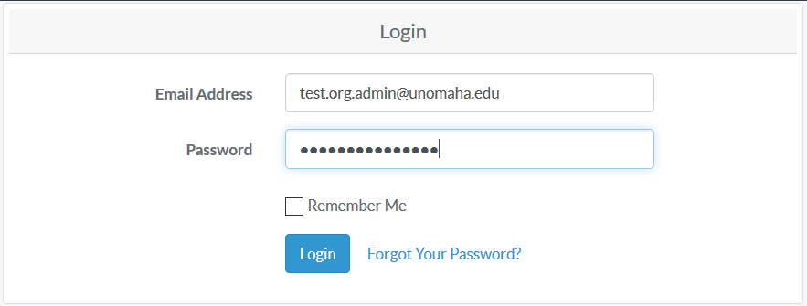

1.2.2 On the left navigation bar, click on the Administration

1.2.3 Under Administration, click on User Management

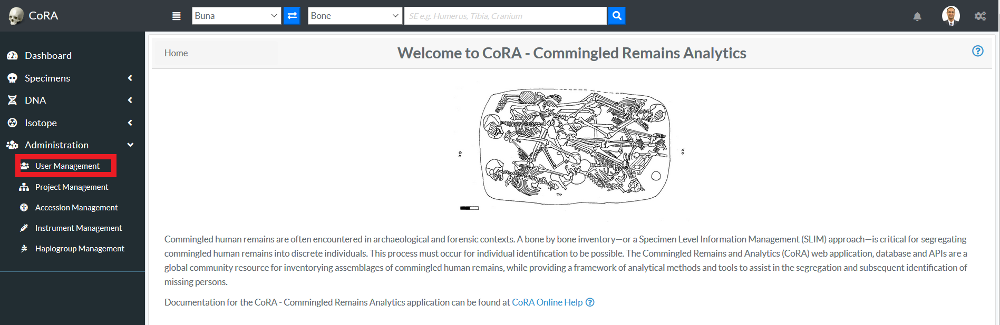

1.2.4 After you click on User Management, you will see list of all users

The user list screen provides the information related to the user such as its Name, Role, Email, Cell Phone, Active Status, Country, Language, Time Zone, IP Address and Last Activity.
In the image above we can see some users have been inactive since a year and some are still active.

1.2.5 On the User Management page, click on Actions, then Create

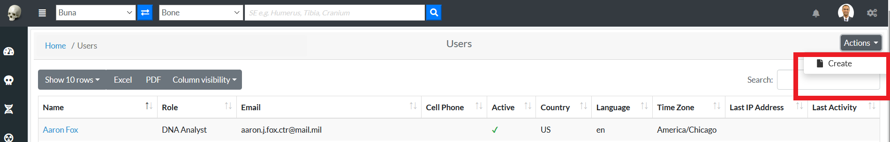

1.2.6 Enter the information on the New User creation page (required fields are marked 
with a red asterisk*)

Users will be able to change their password once they have logged in. Ensure to check the Active box so that the user account is active and the user can login. Through the "Roles" field, various user roles can be selected such as Org Admin, Anthropologist, Manager, DNA Analyst, Historian, Intern, Isotope Analyst.

1.2.7 Once all information is entered, click Save, and a message will appear at the top informing the user that the *“User successfully added”*

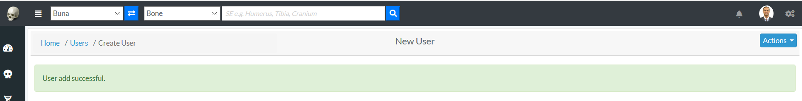

### Edit an Existing User

Click on their name in all user list. You will be taken to a read only page of their user profile. 

To Edit their Profile Information - Click "Actions" - "Edit". 
 
 
The following fields are available on the user edit screen:

 - **Organization**
 - Projects
 - **First Name**
 - **Last Name**
 - Display Name
 - **Email Address**
 - Cell Phone
 - Alt Phone
 - **Active Profile Flag**
 - **Roles**
 - Default Country
 - Default Language
 - Default Time Zone
 - Instruments
 
Required fields are marked with a red asterisk*. Click save when finished editing.
  
To Reset their Password - Click "Reset Password".
 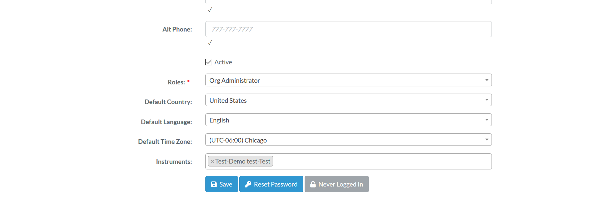
 
Enter the new password in both the fields and change password.
  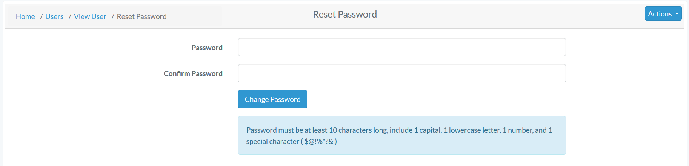
  

### Project Management

#### Project Creation

1.3.1 Login as Org Administrator

1.3.2 Under Administration, click Project Management

1.3.3 After you click on Project Management, you will see list of all Projects

The Project list screen provides the information related to the project such as its Name, Description, Manager, Start Date, Status and whether it is Public or not.

1.3.4 On the Project Management Page, click on Actions, then Create

1.3.5 Enter the information on the New Project creation page (required fields are marked 
      with a red asterisk*)

<small>*The public option enables the public to view the project *</small>

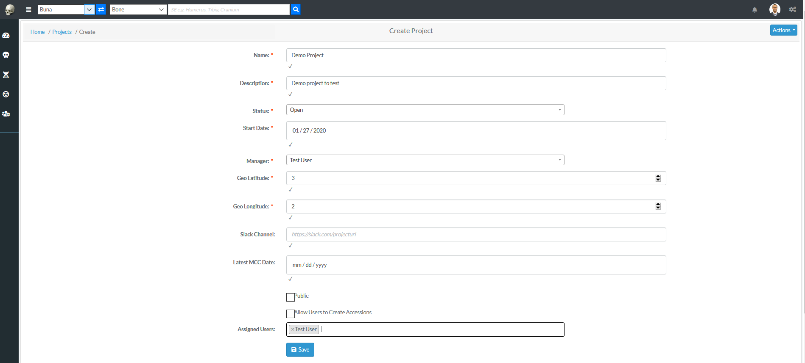

#####Adding Users to a Project
The Org Admin will be able to add users to specific projects through 'Assigned Users' field. From the dropdown box, the OrgAdmin adds users to the project and clicks save option.

#### Edit Project
1.3.6 After the creation of a Project and adding Users to a Project, the Org Admin can edit the Project.
On the Project Management page, click on Actions, then Edit

1.3.7 Edit the needed information on the Project page, and click save
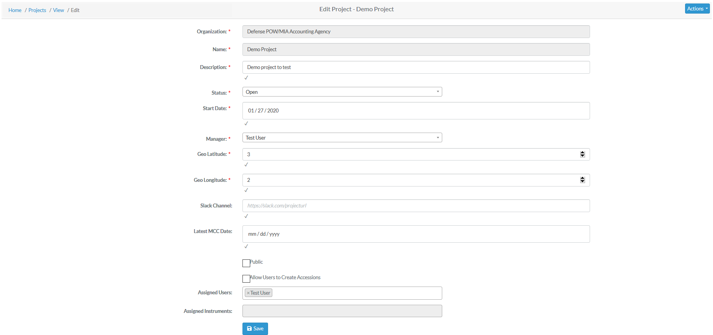

### Accession Management

#### Creating Accession
1.4.1 Login as Org Administrator

1.4.2 Under Administration, click Accession Management

1.4.3 After you click on Accession Management, you will see list of all Projects along with Key, Accession number, Provenance 1 and Provenance 2 fields.

1.4.4 On the Accession Management page, click on actions, and then click create

1.4.2 On the create accession page, the Org Admin can choose a specific project from the drop down option to assign the accession details.

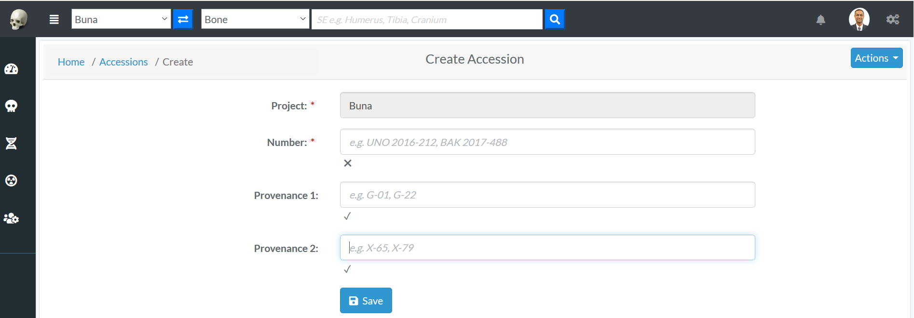

On the create accessions page, enter the required information (*required fields are marked with a red asterisk*) for a particular project and click save
After clicking save, the Org Admin will be redirected to the page displaying accession details associated with a specific project.

### Instrument Management 

#### Creating Instrument
1.5.1 Login as Org Administrator

1.5.2 Under Administration, click Instrument Management

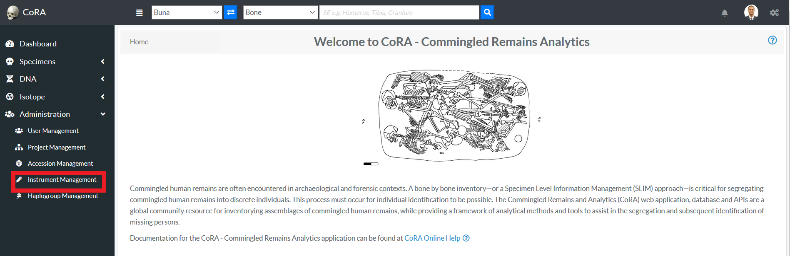

1.5.3 After you click on Instrument Management, you will see list of all Instruments with Code, Module, Category, Reference and Assigned Users fields.
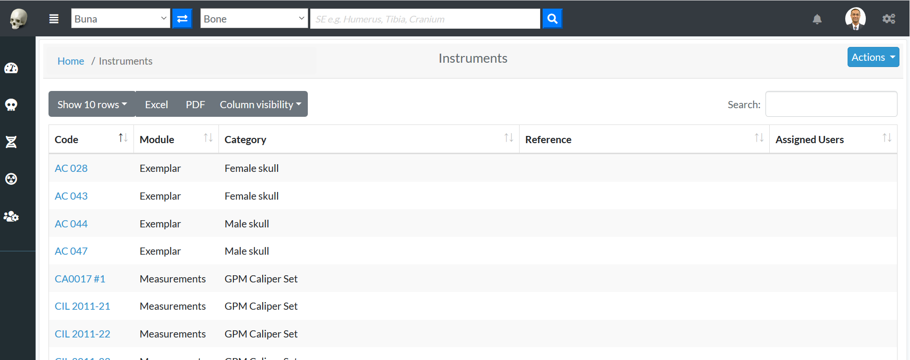

1.5.4 On the Instrument Management page, click on Actions and then click Create.

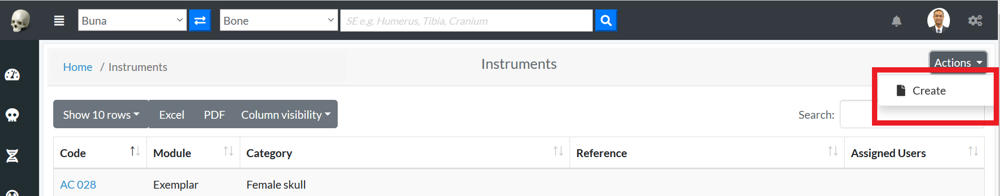

1.5.5 On the create Instrument page, enter the required information and click save (required fields are marked 
 with a red asterisk*)

The Org Admin will also be able to edit the users associated with the instrument by clicking the dropdown "Assigned Users"

#### Edit Instrument
1.5.6 After the creation of a Instrument, the Org Admin can edit the Instrument.
On the Instrument Management page, click on Actions, then Edit

1.5.7 Edit the needed information on the page, and click save
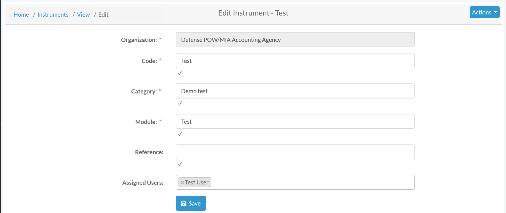

### Haplogroup Management 
#### Creating Haplogroup

1.6.1 Login as Org Administrator

1.6.2 Under Administration, click Haplogroup Management

1.6.3 After you click on Haplogroup Management, you will see list of all Haplogroups with their columns such as Type, Letter, Subgroup and Ancestry.

1.6.4 On the Haplogroup Management page, click on Actions and then click Create.

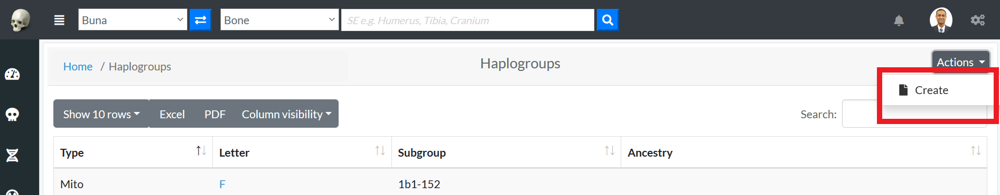

1.6.5 On the create Haplogroup page, enter the required information and click save (required fields are marked 
 with a red asterisk*)

#### Edit Haplogroup
1.6.6 After the creation of a Haplogroup, the Org Admin can edit the Haplogroup.
On the Haplogroup Management page, click on Actions, then Edit

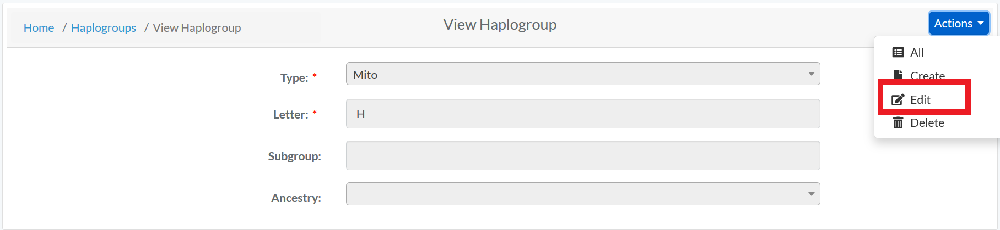

1.6.7 Edit the needed information on the page, and click save

##Org Manager
Org Manager is one of the Users. Below image shows the screen of Org Manager. The left side bar includes the various modules of the CoRA web application that the Org Manager can select.  It consists of Dashboard, Specimens, DNA and Isoptope
 

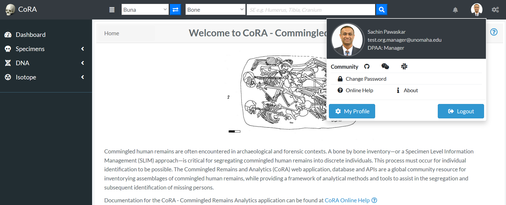

##Anthropologist
Anthropologist is one of the Users. Below image shows the screen of Anthropologist. The left side bar includes the various modules of the CoRA web application that the Anthropologist can select.  It consists of Dashboard, Specimens and DNA
                                                                                      
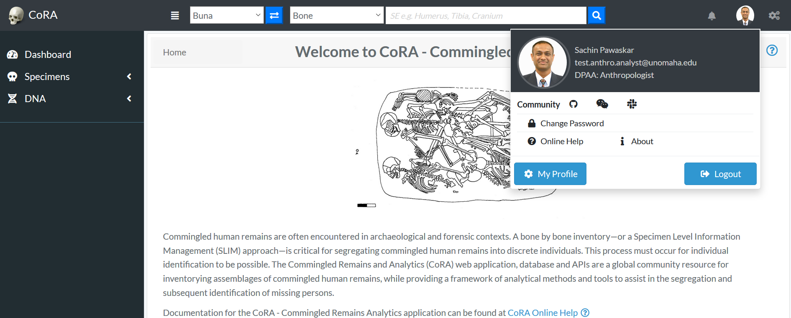

##DNA Analyst
DNA Analyst is one of the Users. Below image shows the screen of DNA Analyst. The left side bar includes the various modules of the CoRA web application that the DNA Analyst can select.  It consists of Dashboard, Specimens and DNA
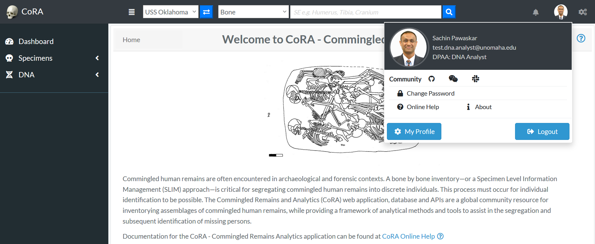

##Anthropologist Lead
Anthropologist Lead is one of the Users. Below image shows the screen of Anthropologist Lead. The left side bar includes the various modules of the CoRA web application that the Anthropologist Lead can select.  It consists of Dashboard, Specimens and DNA
                                                                                      
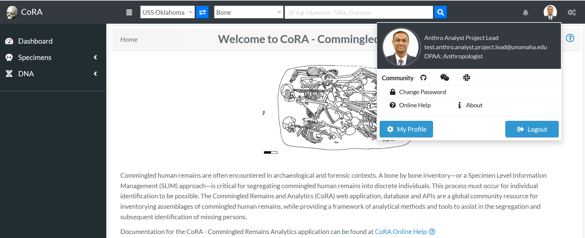

##Isotope Analyst
Isotope Analyst is one of the Users. Below image shows the screen of Isotope Analyst. The left side bar includes the various modules of the CoRA web application that the Isotope Analyst can select.  It consists of Dashboard, Specimens and Isotope
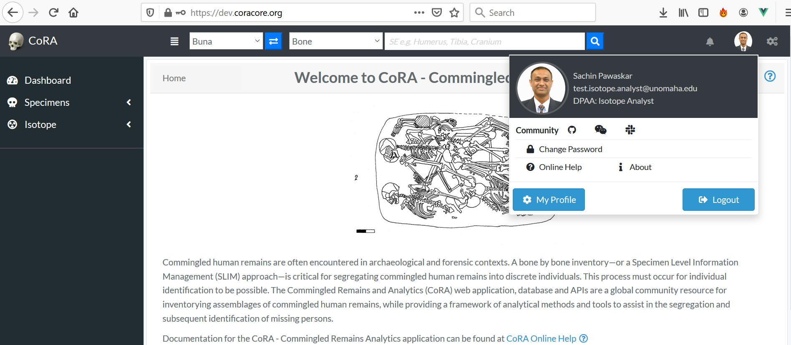

