# User Creation & Roles

User accounts can be created by Org Admins, and can be set up under various roles. Certain roles provide specific level of access to features on the website.

## User Roles

1. Org Administrator
2. Org Manager
3. Anthropologist
4. DNA Analyst
5. Anthropologist - Project Lead
6. Isotope Analyst
7. Historian 
8. Dentist
9. Intern

## Org Administrator
Org Administrator is one of the Users. Below image shows the screen of Org Administrator. The left side bar includes the various modules of the CoRA web application that the Org Administrator can select.  It consists of Dashboard, Specimens, DNA, Isotope and Administration
                                                                                      

The Org Admin takes the responsibility of creating and managing the  Users,  Projects,  Accession,  Instruments and Haplogroup.

### User Management 

#### User Creation

- Login as Org Administrator
- On the left navigation bar, click on the Administration
- Under Administration, click on User Management
- After you click on User Management, you will see list of all users

The user list screen provides the information related to the user such as its Name, Role, Email, Cell Phone, Active Status, Country, Language, Time Zone, IP Address and Last Activity.
In the gif above we can see some users have been inactive since a year and some are still active.

- On the User Management page, click on Actions, then Create
- Enter the information on the New User creation page (required fields are marked with a red asterisk*)
- Through the "Roles" field, various user roles can be selected such as Org Admin, Anthropologist, Manager, DNA Analyst, Historian, Intern, Isotope Analyst.
- Once all information is entered, click Save, and a message will appear at the top informing the user that the *“User successfully added”*

Users will be able to change their password once they have logged in. Ensure to check the Active box so that the user account is active and the user can login. 
 
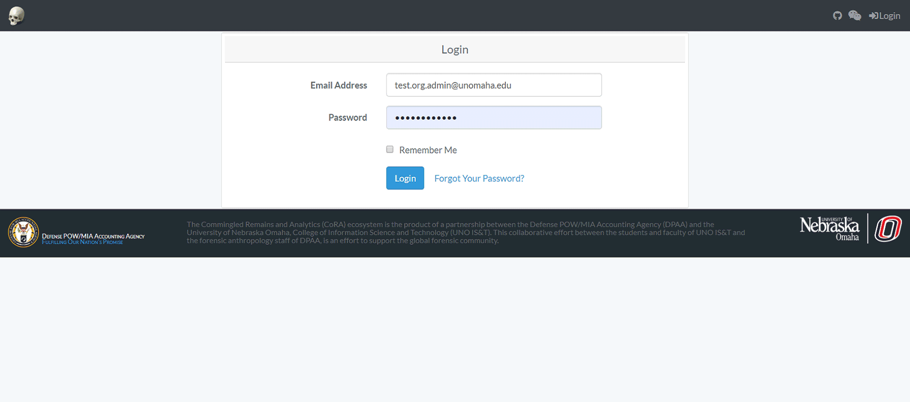

Below are some fields with some validation rule
 
 Attributes  | Data Type |Size |Validation Rule  | Required/Optional
 ------------- | ------------- | -------------|-------------| -------------
 First Name  |  String| 32 chars|Can only contain letters | Required
 Last Name | String| 32 chars|Can only contain letters and  dash | Required
 Email  |  String| 255 chars|Should be unique with 255 max chars | Required
 Cell phone | String| 32 chars|Can only contain numbers and dash | Optional
 Role | NA|NA|Choose from the dropdown | Required
 Active Status | Boolean |NA|True or False| Optional
 Password | String| 64 chars|Should fulfill all the password requirements | Required

####  Edit an Existing User

Click on their name in all user list. You will be taken to a read only page of their user profile. 

To Edit their Profile Information - Click "Actions" - "Edit". 
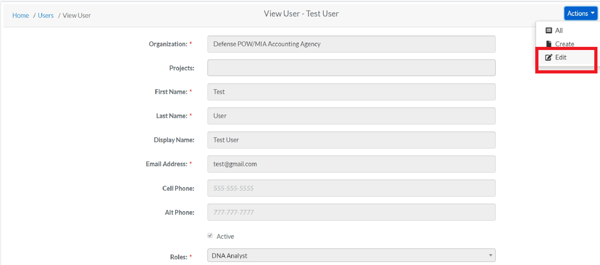
 
The following fields are available on the user edit screen:

 - **Organization**
 - Projects
 - **First Name**
 - **Last Name**
 - Display Name
 - **Email Address**
 - Cell Phone
 - Alt Phone
 - **Active Profile Flag**
 - **Roles**
 - Default Country
 - Default Language
 - Default Time Zone
 - Instruments
 
Required fields are marked with a red asterisk*. Click save when finished editing. To Reset their Password - Click "Reset Password". Enter the new password in both the fields and change password.

### Project Management

#### Project Creation

- Login as Org Administrator
- Under Administration, click Project Management
- After you click on Project Management, you will see list of all Projects

The Project list screen provides the information related to the project such as its Name, Description, Manager, Start Date, Status and whether it is Public or not.

- On the Project Management Page, click on Actions, then Create
- Enter the information on the New Project creation page (required fields are marked with a red asterisk*)
<small>*The public option enables the public to view the project *</small>
- Adding Users to a Project  
The Org Admin will be able to add users to specific projects through 'Assigned Users' field. From the dropdown box, the OrgAdmin adds users to the project and clicks save option.

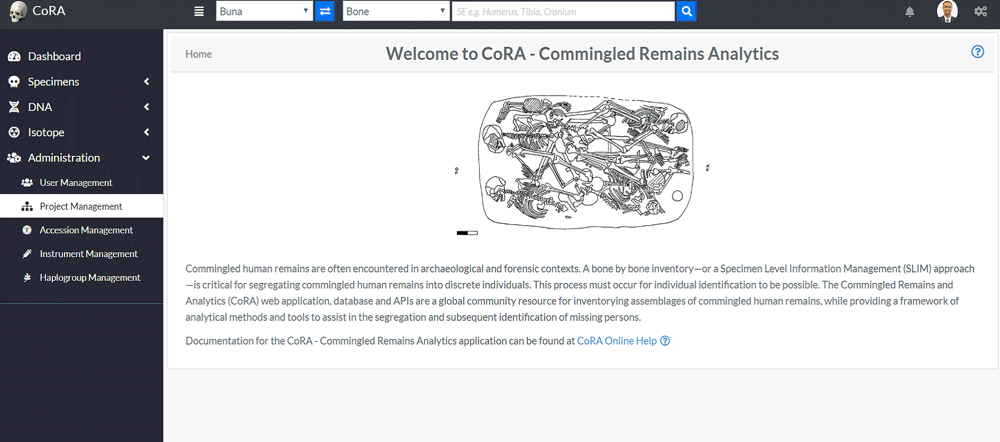

Below are some fields with some validation rule
 
Attributes  |  Data Type |Size |Validation Rule  | Required/Optional
------------- | ------------- | -------------|-------------| -------------
Name  |  String|255 chars|Can only contain letters and numbers, min:3 and max:255 chars | Required
Description |String|255 chars|Can contain minimum 3 chars and 255 max chars | Required
Status Id |  Numeric| 32 chars|Can only contain numbers| Required
Start Date | Date|NA|Can only contain date| Required
Manager Id | Numeric| 32 chars|Can only contain numbers | Required
Geo latitude | Numeric| 32 chars|Can only contain numeric value| Required
Geo Longitude | Numeric| 32 chars|Can only contain numeric value | Required
Slack Channel | Alphanumeric| 32 chars|Can only contain numbers and letters | Optional
Latest MCC Date |Date|NA|Can only contain date | Optional
Public | Boolean |NA|True or False| Optional
Allow users To create Accessions | Boolean |NA|True or False| Optional
Isotope Analysis |Boolean |NA|True or False| Optional
Zones Autocomplete | Boolean |NA|True or False| Optional

#### Edit Project

- After the creation of a Project and adding Users to a Project, the Org Admin can edit the Project.
On the Project Management page, click on Actions, then Edit

- Edit the needed information on the Project page, and click save
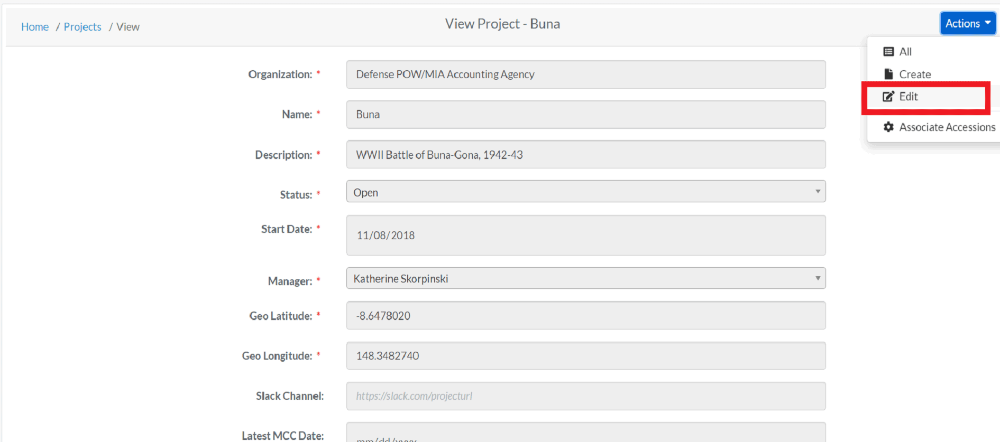

### Accession Management

#### Creating Accession

- Login as Org Administrator
- Under Administration, click Accession Management
- After you click on Accession Management, you will see list of all Projects along with Key, Accession number, Provenance 1 and Provenance 2 fields.
- On the Accession Management page, click on actions, and then click create
- On the create accession page, the Org Admin can choose a specific project from the drop down option to assign the accession details.

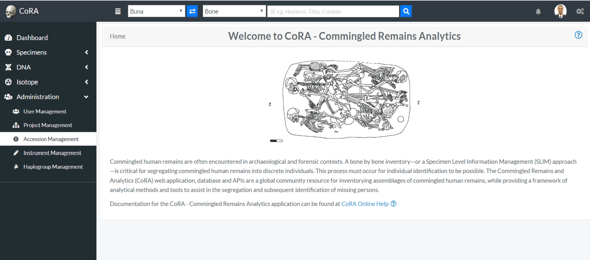

On the create accessions page, enter the required information (*required fields are marked with a red asterisk*) for a particular project and click save. After clicking save, the Org Admin will be redirected to the page displaying accession details associated with a specific project.

Below are some fields with some validation rule
 
Attributes  |Data Type |Size | Validation Rule  | Required/Optional
------------- | ------------- | -------------|-------------| -------------
Number  | String|32 chars| Can only contain letters, numbers, dash and space | Required
Provenance 1 |String|32 chars| Can only contain letters, numbers, dash and space | Optional
Provenance 2 | String|32 chars| Can only contain letters, numbers, dash and space  | Optional

#### Edit Accession

- After the creation of a Accession, the Org Admin can edit the Accession. On the Accession list page, click on Actions, then Edit

- Edit the needed information on the Accession edit page, and click save
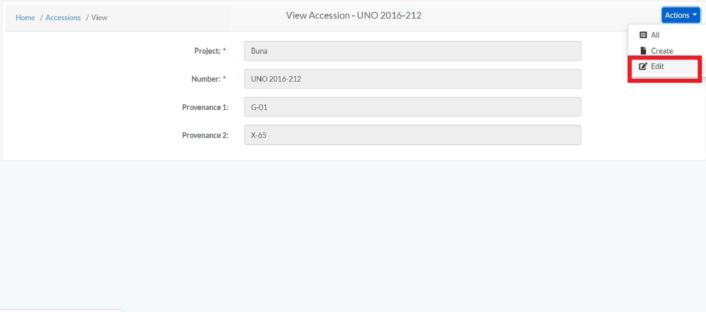

### Instrument Management 

#### Creating Instrument

- Login as Org Administrator
- Under Administration, click Instrument Management
- After you click on Instrument Management, you will see list of all Instruments with Code, Module, Category, Reference and Assigned Users fields.
- On the Instrument Management page, click on Actions and then click Create.
- On the create Instrument page, enter the required information and click save (required fields are marked 
 with a red asterisk*)

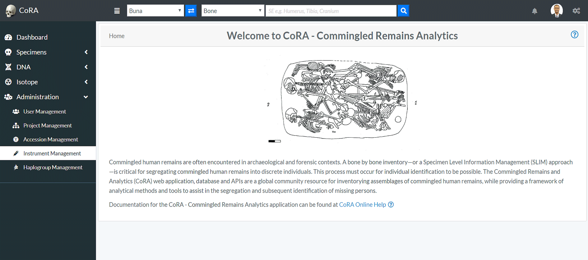

Attributes  |Data Type |Size | Validation Rule  | Required/Optional
------------- |  ------------- | -------------|-------------| -------------
Code | String|255 chars|Can have max 255 chars | Required
Category |  String|255 chars|Can have max 255 chars| Required
Module|String|255 chars|Can have max 255 chars| Required
Reference |String|255 chars| Can have max 255 chars| Optional
Assigned Users | NA|NA|Can choose from the options available| Optional

The Org Admin will also be able to edit the users associated with the instrument by clicking the dropdown "Assigned Users"

#### Edit Instrument

- After the creation of a Instrument, the Org Admin can edit the Instrument.
On the Instrument Management page, click on Actions, then Edit

- Edit the needed information on the page, and click save
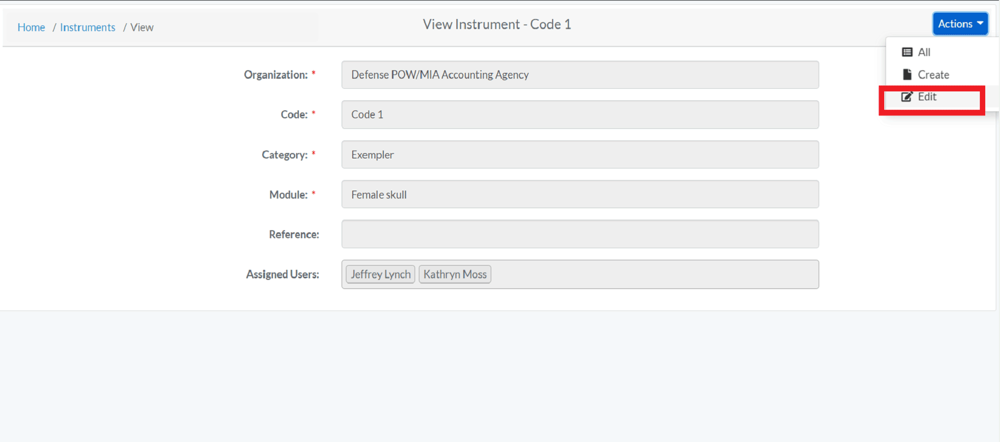

### Haplogroup Management

#### Creating Haplogroup

- Login as Org Administrator
- Under Administration, click Haplogroup Management
- After you click on Haplogroup Management, you will see list of all Haplogroups with their columns such as Type, Letter, Subgroup and Ancestry.
- On the Haplogroup Management page, click on Actions and then click Create.
- On the create Haplogroup page, enter the required information and click save (required fields are marked with a red asterisk*)

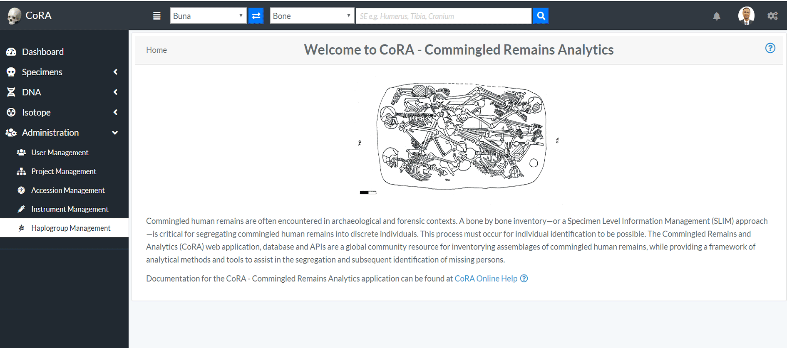

Below are some fields with some validation rule
 
Attributes  |Data Type |Size | Validation Rule  | Required/Optional
------------- | ------------- | -------------|-------------| -------------
Type | NA|NA|Can choose from the option available | Required
Letter |  String|1 char|Can only contain one character from A-Z| Required
Subgroup|String|32 chars|No specified rule| Optional
Ancestry | NA|NA|Can choose from the option available| Optional
 

#### Edit Haplogroup

- After the creation of a Haplogroup, the Org Admin can edit the Haplogroup.
On the Haplogroup Management page, click on Actions, then Edit

- Edit the needed information on the page, and click save
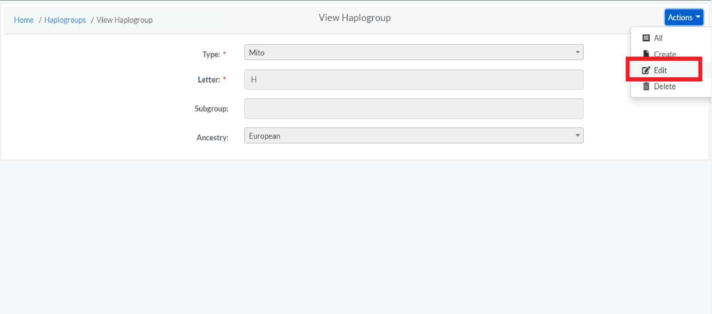

## Manager

Manager is one of the Users. Below image shows the screen of Manager. The left side bar includes the various modules of the CoRA web application that the Manager can select.  It consists of Dashboard, Specimens, DNA and Isotope
 
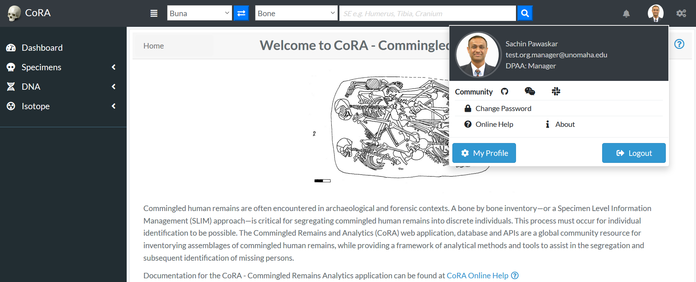

## Anthropologist

Anthropologist is one of the Users. Below image shows the screen of Anthropologist. The left side bar includes the various modules of the CoRA web application that the Anthropologist can select.  It consists of Dashboard, Specimens and DNA
                                                                                      
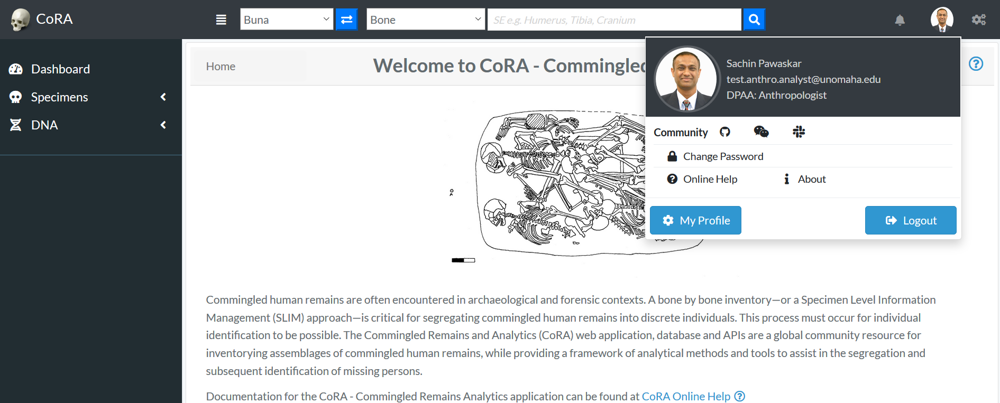

## Anthropologist Lead

Anthropologist Lead is one of the Users. Below image shows the screen of Anthropologist Lead. The left side bar includes the various modules of the CoRA web application that the Anthropologist Lead can select.  It consists of Dashboard, Specimens and DNA
                                                                                      
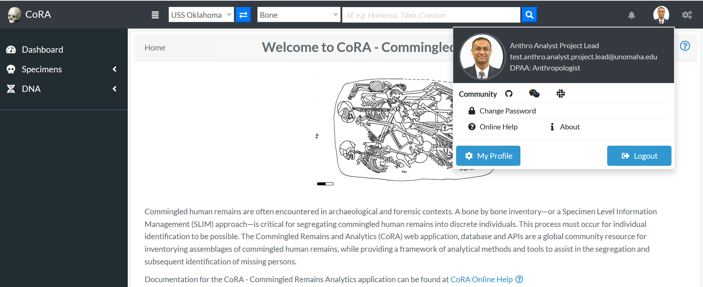

## DNA Analyst

DNA Analyst is one of the Users. Below image shows the screen of DNA Analyst. The left side bar includes the various modules of the CoRA web application that the DNA Analyst can select.  It consists of Dashboard, Specimens and DNA

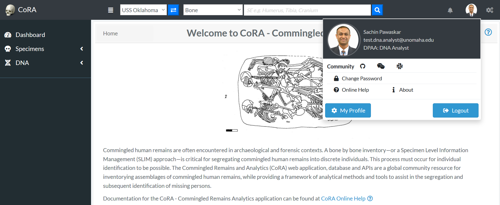

## Isotope Analyst

Isotope Analyst is one of the Users. Below image shows the screen of Isotope Analyst. The left side bar includes the various modules of the CoRA web application that the Isotope Analyst can select.  It consists of Dashboard, Specimens and Isotope

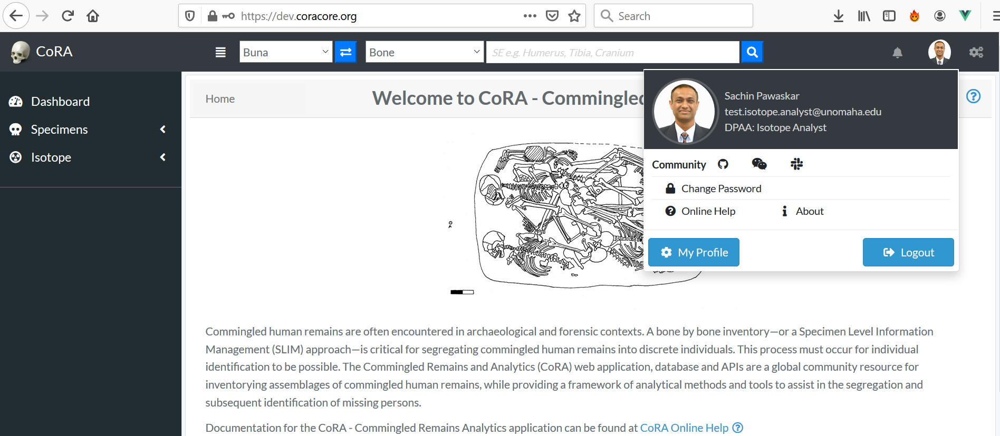

