# User Creation & Roles

User accounts can be created by Org Admins, and can be set up under various roles. Certain roles provide specific level of access to
features on the website.

## User Roles

1. Org Administrator
2. Org Manager
3. Anthropologist
4. DNA Analyst
5. Anthropologist - Project Lead
6. Isotope Analyst
7. Historian 
8. Dentist
9. Intern

##Org Administrator
Org Administrator is one of the Users. Below image shows the screen of Org Administrator. The left side bar includes the various modules of the CoRA web application that the Org Administrator can select.  It consists of Dashboard, Specimens, DNA, Isotope and Administration
                                                                                      

The Org Admin takes the responsibility of creating and managing the  Users,  Projects,  Accession,  Instruments and Haplogroup.

### User Management 

#### User Creation

- Login as Org Administrator
- On the left navigation bar, click on the Administration
- Under Administration, click on User Management
- After you click on User Management, you will see list of all users

The user list screen provides the information related to the user such as its Name, Role, Email, Cell Phone, Active Status, Country, Language, Time Zone, IP Address and Last Activity.
In the gif above we can see some users have been inactive since a year and some are still active.

- On the User Management page, click on Actions, then Create
- Enter the information on the New User creation page (required fields are marked 
with a red asterisk*)
- Through the "Roles" field, various user roles can be selected such as Org Admin, Anthropologist, Manager, DNA Analyst, Historian, Intern, Isotope Analyst.
- Once all information is entered, click Save, and a message will appear at the top informing the user that the *“User successfully added”*

 Users will be able to change their password once they have logged in. Ensure to check the Active box so that the user account is active and the user can login. 
 
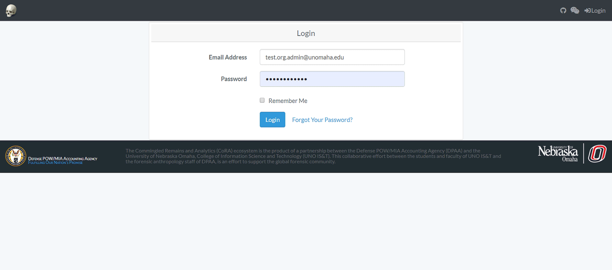

Below are some fields with some validation rule
 
 Element  | Validation Rule  | Required/Optional
 ------------- | -------------| -------------
 First Name  |  Can only contain letters | Required
 Last Name | Can only contain letters and  dash | Required
 Email  |  Should be unique with 255 max char | Required
 Cell phone | Can only contain numbers and dash | Optional
 Role | Choose from the dropdown | Required
 Active Status | Boolean (True or False) | Optional
 Password | Should fulfill all the password requirements | Required

####  Edit an Existing User

Click on their name in all user list. You will be taken to a read only page of their user profile. 

To Edit their Profile Information - Click "Actions" - "Edit". 
 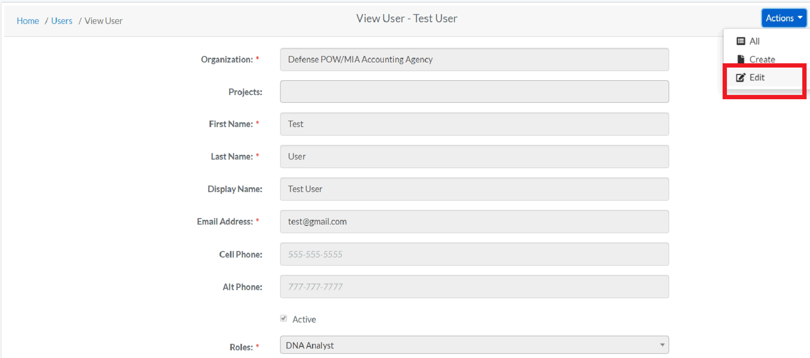
 
The following fields are available on the user edit screen:

 - **Organization**
 - Projects
 - **First Name**
 - **Last Name**
 - Display Name
 - **Email Address**
 - Cell Phone
 - Alt Phone
 - **Active Profile Flag**
 - **Roles**
 - Default Country
 - Default Language
 - Default Time Zone
 - Instruments
 
Required fields are marked with a red asterisk*. Click save when finished editing. To Reset their Password - Click "Reset Password". Enter the new password in both the fields and change password.

  

### Project Management

#### Project Creation

- Login as Org Administrator
- Under Administration, click Project Management
- After you click on Project Management, you will see list of all Projects

The Project list screen provides the information related to the project such as its Name, Description, Manager, Start Date, Status and whether it is Public or not.

- On the Project Management Page, click on Actions, then Create
- Enter the information on the New Project creation page (required fields are marked 
      with a red asterisk*)
<small>*The public option enables the public to view the project *</small>
- Adding Users to a Project  
The Org Admin will be able to add users to specific projects through 'Assigned Users' field. From the dropdown box, the OrgAdmin adds users to the project and clicks save option.

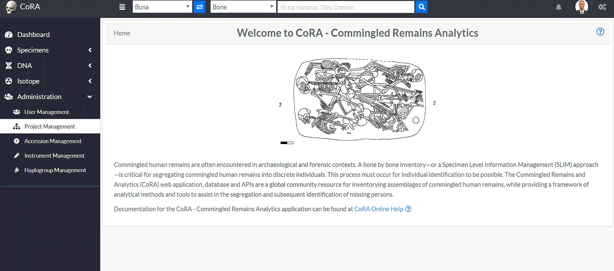

Below are some fields with some validation rule
 
 Element  | Validation Rule  | Required/Optional
 ------------- | -------------| -------------
 Name  |  Can only contain letters and numbers, min:3 and max:255 chars | Required
 Description |Can minimum 3 chars and 255 max chars | Required
 Status Id |  Can only contain numbers| Required
 Start Date | Can only contain date| Required
 Manager Id | Can only contain numbers | Required
 Geo latitude | Can only contain numeric value| Required
 Geo Longitude | Can only contain numeric value | Required
 Slack Channel | Can only contain numbers and letters | Optional
 Latest MCC Date | Should fulfill all the password requirements | Optional
 Public | Boolean (True or False)| Optional
 Allow users To create Accessions | Boolean (True or False) | Optional
 Isotope Analysis | Boolean (True or False) | Optional
 Zones Autocomplete | Boolean (True or False) | Optional

#### Edit Project
- After the creation of a Project and adding Users to a Project, the Org Admin can edit the Project.
On the Project Management page, click on Actions, then Edit

- Edit the needed information on the Project page, and click save
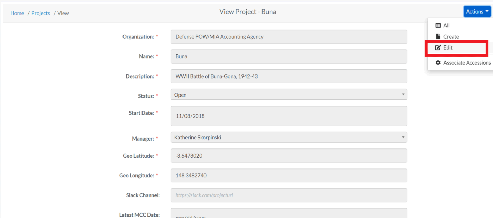

### Accession Management

#### Creating Accession
- Login as Org Administrator
- Under Administration, click Accession Management
- After you click on Accession Management, you will see list of all Projects along with Key, Accession number, Provenance 1 and Provenance 2 fields.
- On the Accession Management page, click on actions, and then click create
- On the create accession page, the Org Admin can choose a specific project from the drop down option to assign the accession details.

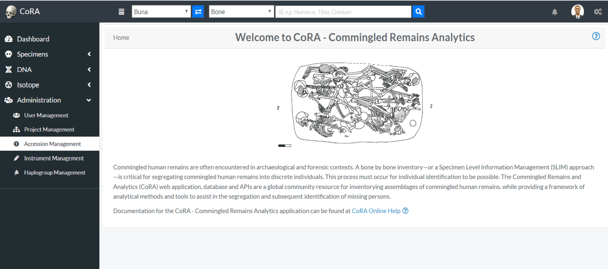

On the create accessions page, enter the required information (*required fields are marked with a red asterisk*) for a particular project and click save
After clicking save, the Org Admin will be redirected to the page displaying accession details associated with a specific project.

Below are some fields with some validation rule
 
 Element  | Validation Rule  | Required/Optional
 ------------- | -------------| -------------
 Number  |  Can only contain letters, numbers, dash and space | Required
 Provenance 1 | Can only contain letters, numbers, dash and space | Optional
 Provenance 2 |  Can only contain letters, numbers, dash and space  | Optional

#### Edit Accession
- After the creation of a Accession, the Org Admin can edit the Accession.
On the Accession list page, click on Actions, then Edit

- Edit the needed information on the Accession edit page, and click save
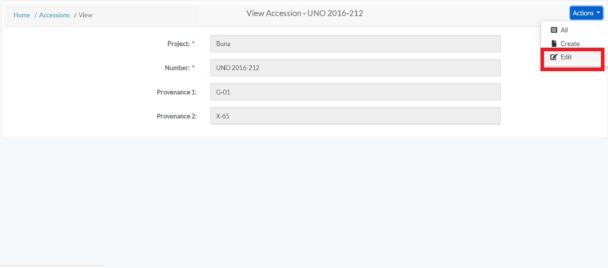

### Instrument Management 

#### Creating Instrument
- Login as Org Administrator
- Under Administration, click Instrument Management
- After you click on Instrument Management, you will see list of all Instruments with Code, Module, Category, Reference and Assigned Users fields.
- On the Instrument Management page, click on Actions and then click Create.
- On the create Instrument page, enter the required information and click save (required fields are marked 
 with a red asterisk*)

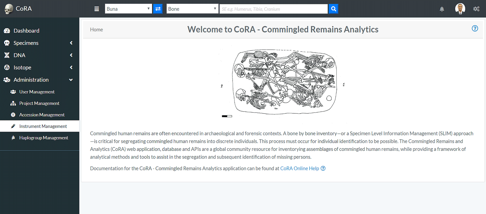

 Element  | Validation Rule  | Required/Optional
 ------------- | -------------| -------------
 Code | Can have max 255 chars | Required
 Category |  Can have max 255 chars| Required
 Module|Can have max 255 chars| Required
 Reference | Can have max 255 chars| Optional
 Assigned Users | Can choose from the options available| Optional

The Org Admin will also be able to edit the users associated with the instrument by clicking the dropdown "Assigned Users"

#### Edit Instrument
- After the creation of a Instrument, the Org Admin can edit the Instrument.
On the Instrument Management page, click on Actions, then Edit

- Edit the needed information on the page, and click save
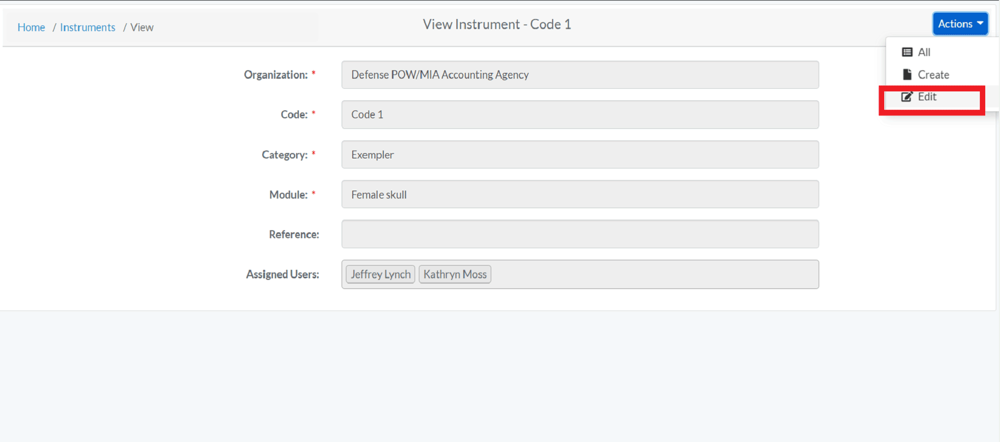

### Haplogroup Management 
#### Creating Haplogroup

- Login as Org Administrator
- Under Administration, click Haplogroup Management
- After you click on Haplogroup Management, you will see list of all Haplogroups with their columns such as Type, Letter, Subgroup and Ancestry.
- On the Haplogroup Management page, click on Actions and then click Create.
- On the create Haplogroup page, enter the required information and click save (required fields are marked 
 with a red asterisk*)

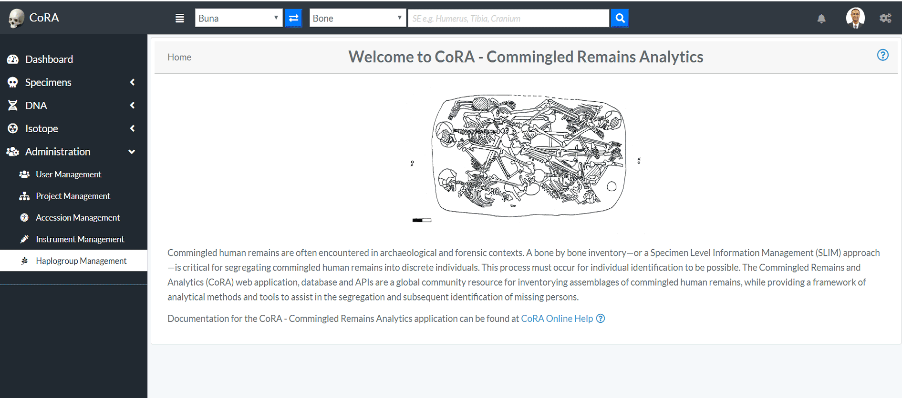

Below are some fields with some validation rule
 
 Element  | Validation Rule  | Required/Optional
 ------------- | -------------| -------------
 Type | Can choose from the option available | Required
 Letter |  Can only contain one character from A-Z| Required
 Subgroup|No specified rule| Optional
 Ancestry | Can choose from the option available| Optional
 

#### Edit Haplogroup
- After the creation of a Haplogroup, the Org Admin can edit the Haplogroup.
On the Haplogroup Management page, click on Actions, then Edit

- Edit the needed information on the page, and click save
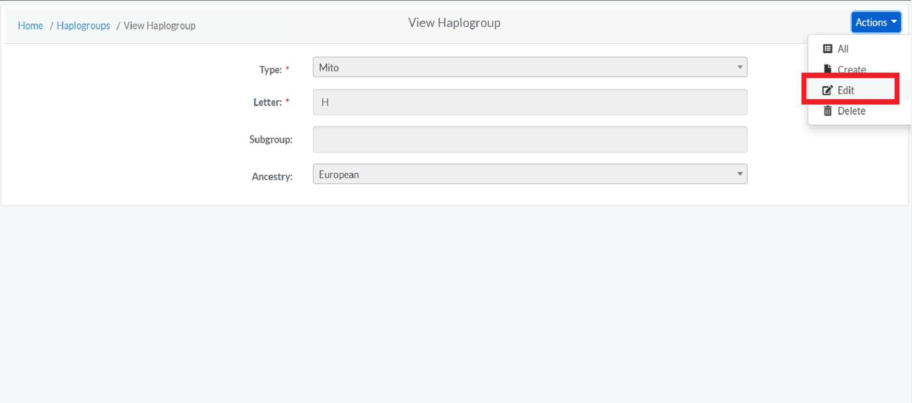

##Org Manager
Org Manager is one of the Users. Below image shows the screen of Org Manager. The left side bar includes the various modules of the CoRA web application that the Org Manager can select.  It consists of Dashboard, Specimens, DNA and Isotope
 

##Anthropologist
Anthropologist is one of the Users. Below image shows the screen of Anthropologist. The left side bar includes the various modules of the CoRA web application that the Anthropologist can select.  It consists of Dashboard, Specimens and DNA
                                                                                      

##DNA Analyst
DNA Analyst is one of the Users. Below image shows the screen of DNA Analyst. The left side bar includes the various modules of the CoRA web application that the DNA Analyst can select.  It consists of Dashboard, Specimens and DNA

##Anthropologist Lead
Anthropologist Lead is one of the Users. Below image shows the screen of Anthropologist Lead. The left side bar includes the various modules of the CoRA web application that the Anthropologist Lead can select.  It consists of Dashboard, Specimens and DNA
                                                                                      

##Isotope Analyst
Isotope Analyst is one of the Users. Below image shows the screen of Isotope Analyst. The left side bar includes the various modules of the CoRA web application that the Isotope Analyst can select.  It consists of Dashboard, Specimens and Isotope

##Isotope 

You can create/view Isotope Batches as an Admin and Manager. In order to view the isotope batches, click on 'Isotope Batches' on left navigation bar
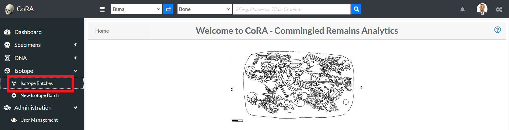

In order to create a new isotope batch, click on 'New Isotope Batch'

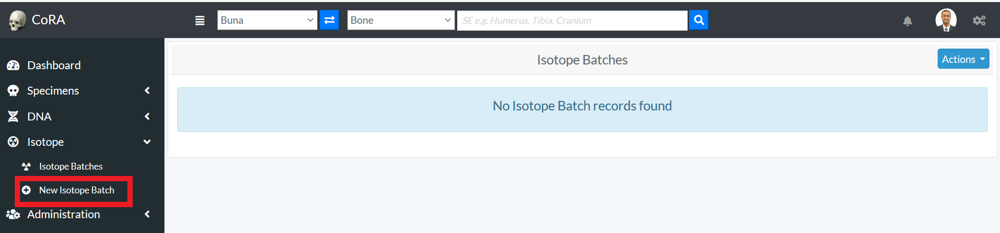

On the Create Isotope Batch page, enter the required information and click save (required fields are marked 
 with a red asterisk*)

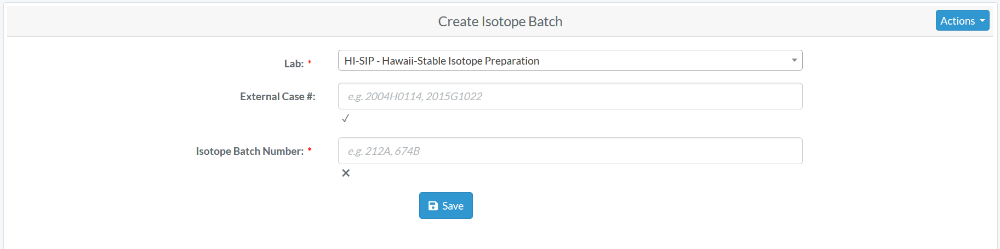

After the isotope batch is created successfully, you 
will receive success message as given  below
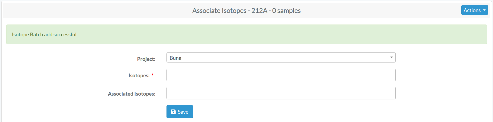

#### Edit Isotope Batch
After the creation of a Isotope Batch, the Org Admin and Manager can edit the Isotope Batch.
On the Isotope Batches page, click on the batch number to edit

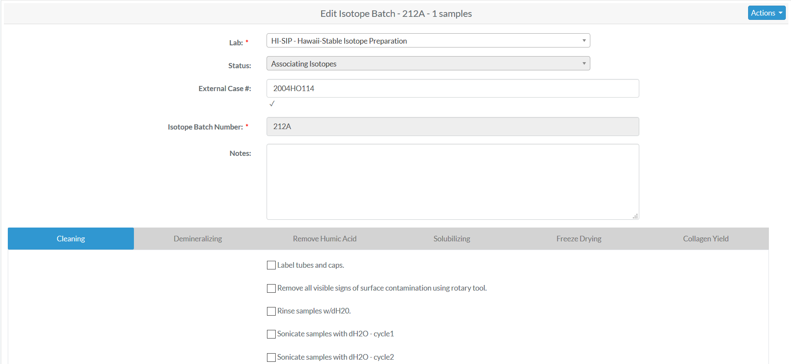

Edit the needed information on the page, and click save
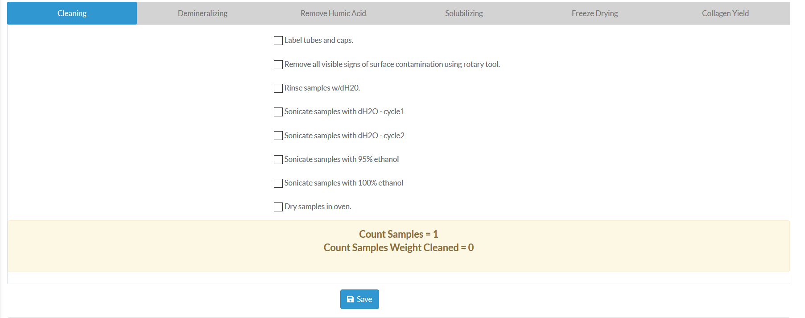

Below are some validation rules associated with Isotope Batch
 
 Element  | Validation Rule  | Required/Optional
 ------------- | -------------| -------------
 Lab | Can choose from the option available | Required
 External Case # |  Can only contain letters and numbers| Optional
 Isotope Batch Number|Can only contain letters and numbers| Required
 Status|Either Open, Associating Isotopes, Cleaning, Demineralizing, Removal Humic Acids, Solubilizing, Freeze Drying Collagen, Determining Collagen Yield and closed|Optional
 Cleaning start date | Can only contain Date | Optional
 Label tubes and caps| Boolean (True or False) | Optional
 Remove all visible signs of surface contamination |Boolean (True or False) | Optional
 Ringes sample with dH20 | Boolean (True or False) | Optional
 Sonicate samples with dh2o-cycle1 | Boolean (True or False) | Optional
 Sonicate samples with dh2o-cycle1 Start Date | Date | Optional
 Sonicate samples with dh2o-cycle2 | Boolean (True or False) | Optional
 Sonicate samples with dh2o-cycle2 Start Date | Date | Optional
 Sonicate samples with 95% ethanol | Boolean (True or False) | Optional
 Sonicate samples with 95% ethanol Start Date | Date | Optional
 Sonicate samples with 100% ethanol | Boolean (True or False) | Optional
 Sonicate samples with 100% ethanol Start Date | Date | Optional
 Dry samples start | Boolean (True or False) | Optional
 Dry sample start date | Date | Optional
 Dry samples end | Boolean (True or False) | Optional
 Dry sample end date | Date | Optional
 Cleaning initials | Can only contain letters and numbers | Optional
 Demineralizing Treatment Start | Boolean (True or False) | Optional
 Demineralizing Treatment End | Boolean (True or False) | Optional
 Demineralizing Treatment Start Date | Date | Optional
 Demineralizing Treatment End Date | Date | Optional
 Rinse Demineralized Samples | Boolean (True or False) | Optional
 Removal Humic Acids treatment start | Boolean (True or False) | Optional
 Removal Humic Acids treatment End | Boolean (True or False) | Optional
 Removal Humic Acids treatment start Date | Date | Optional
 Removal Humic Acids treatment End Date | Date| Optional
 Removal Humic Acids treatment rinse 1 start | Boolean (True or False) | Optional
 Removal Humic Acids treatment rinse 1 End | Boolean (True or False) | Optional
 Removal Humic Acids treatment rinse 1 start Date | Date | Optional
 Removal Humic Acids treatment rinse 1 End Date | Date| Optional
 Removal Humic Acids treatment rinse 2 start | Boolean (True or False) | Optional
 Removal Humic Acids treatment rinse 2 End | Boolean (True or False) | Optional
 Removal Humic Acids treatment rinse 2 start Date | Date | Optional
 Removal Humic Acids treatment rinse 2 End Date | Date| Optional
 Removal Humic Acids treatment rinse 3 start | Boolean (True or False) | Optional
 Removal Humic Acids treatment rinse 3 End | Boolean (True or False) | Optional
 Removal Humic Acids treatment rinse 3 start Date | Date | Optional
 Removal Humic Acids treatment rinse 3 End Date | Date| Optional
 Removal Humic Acids treatment rinse 4 start | Boolean (True or False) | Optional
 Removal Humic Acids treatment rinse 4 End | Boolean (True or False) | Optional
 Removal Humic Acids treatment rinse 4 start Date | Date | Optional
 Removal Humic Acids treatment rinse 4 End Date | Date| Optional
 Removal Humic Acids treatment rinse 5 start | Boolean (True or False) | Optional
 Removal Humic Acids treatment rinse 5 End | Boolean (True or False) | Optional
 Removal Humic Acids treatment rinse 5 start Date | Date | Optional
 Removal Humic Acids treatment rinse 5 End Date | Date| Optional
 Solubilizing clean vials and lids | Boolean (True or False) | Optional
 Solubilizing clean vials and lids date| Date | Optional
 Solubilizing add solubale | Boolean (True or False) | Optional
 Solubilizing place in oven | Boolean (True or False) | Optional
 Solubilizing centrifuge tubes | Boolean (True or False) | Optional
 Solubilizing num acid heat treatment | Can only contain numbers | Optional
 Solubilizing num collagen transfers| Can only contain numbers | Optional
 Solubilizing freeze vials| Boolean (True or False) | Optional
 Solubilizing freeze vials date| Date | Optional
 Freeze Drying Collagen on| Boolean (True or False) | Optional
 Freeze Drying Collagen Start| Boolean (True or False) | Optional
 Freeze Drying Collagen End| Boolean (True or False) | Optional
 Freeze Drying Collagen Start Date| Date | Optional
 Freeze Drying Collagen End Date| Date| Optional
 Combined Sample Weight| Boolean (True or False) | Optional