# 1. User Creation & Roles

User accounts can be created by Org Admins, and can be set up under various roles. Certain roles provide specific level of access to
features on the website.

## 1.1 User Roles

1. Org Administrator
2. Manager
3. Amthropologist
4. DNA Analyst
5. Historian 
6. Dentist
7. Intern

The Org Admin takes the responsibility of creating and managing the <b> Users, <b> Projects, <b> Accession,
and <b> Instruments </b>.

### 1.2 User Management 

#### User Creation

1.2.1 Login as Org Administrator

1.2.2 On the left navigation bar, click on the Administration

1.2.3 Under Administration, click on User Management

1.2.4 On the User Management page, click on Actions, then Create

1.2.5 Enter the information on the New User creation page (required fields are marked 
with a red asterisk*)

<small>*Users will be able to change their password once they have logged in*</small>

<small>*Ensure to check the Active box so that the user account is active and the user can login*</small>

1.2.6 Once all information is entered, click Save, and a message will appear at the top informing the user that the *“User successfully added”*

### 1.3 Project Management

#### Project Creation

1.3.1 Login as Org Administrator

1.3.2 On the homepage, click on the left navigation bar and click Administration

1.3.3 Under Admnistration, click Project Management

1.3.4 On the Project Management Page, click on Actions, then Create

1.3.5 Enter the information on the New Project creation page (required fields are marked 
      with a red asterisk*)

<small>*The public option enables the public to view the project *</small>

1.3.6 Once all information is entered, click Save, and a message will appear at the bottom informing the OrgAdmin to *“Add users to this project”*

#### Adding Users to a Project

1.3.7 To add users to the current project, click on Add users to this project

1.3.8 In the add users page, the Org Admin will be able to add users to specific projects.

1.3.9 From the dropdown box, the OrgAdmin adds users to the project and clicks save option.

1.3.10 Once the save option is clicked, a message will appear at the top informing the Org Admin *“User(s) successfully associated*
       
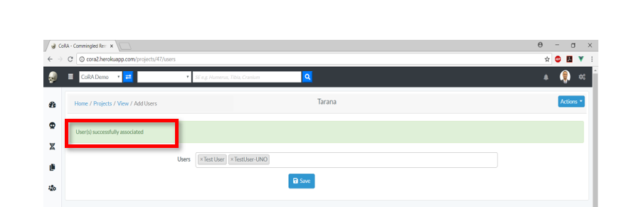

1.3.11 After the creation of a Project and adding Users to a Project, the Org Admin can perform other actions on the Project.

#### Edit Project

1.3.12 On the Project Management page, click on Actions, then Edit
       
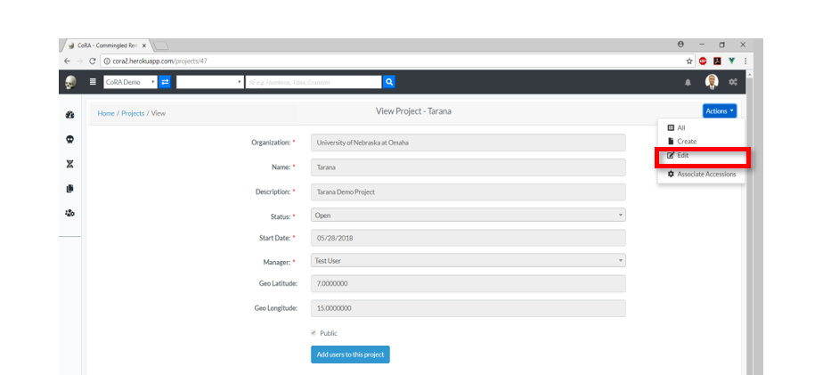

1.3.13 Edit the needed information on the Project page, and click save
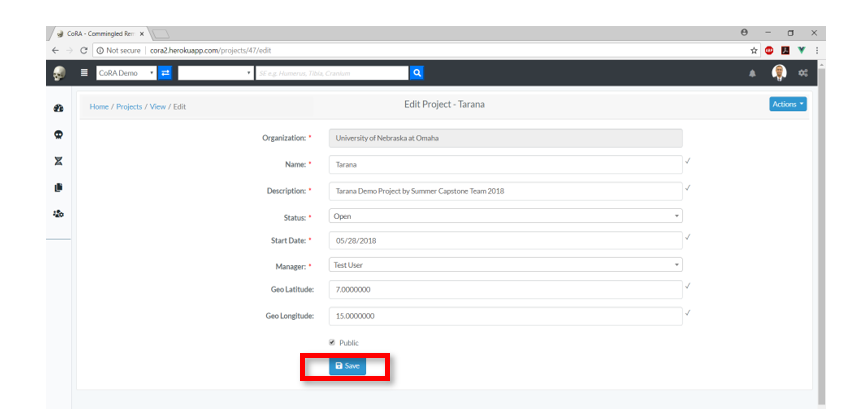

#### Edit Users

1.3.14 After clicking the save option, the Org Admin can edit the users associated with a project by clicking "Add users to this project"
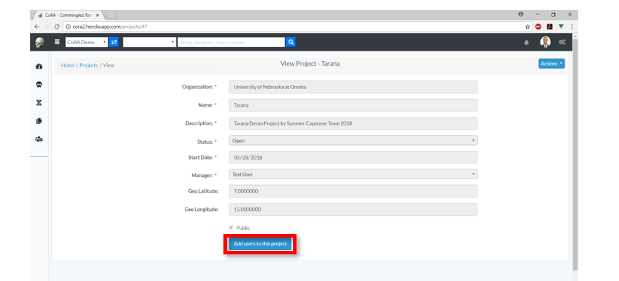

1.3.15  On the add user page, add/remove users and click save.

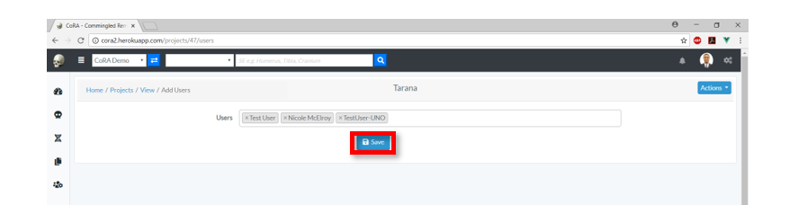

1.3.16 Once the save option is clicked, a message will appear at the top informing the Org Admin *“User(s) successfully associated"*
              
 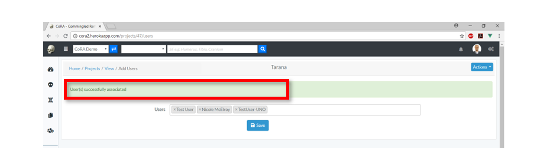
 
 #### Associate Accessions to a Project
 
 1.3.17 On the Project Management page, click on a particular project, click on actions and then click Associate Accessions.
 
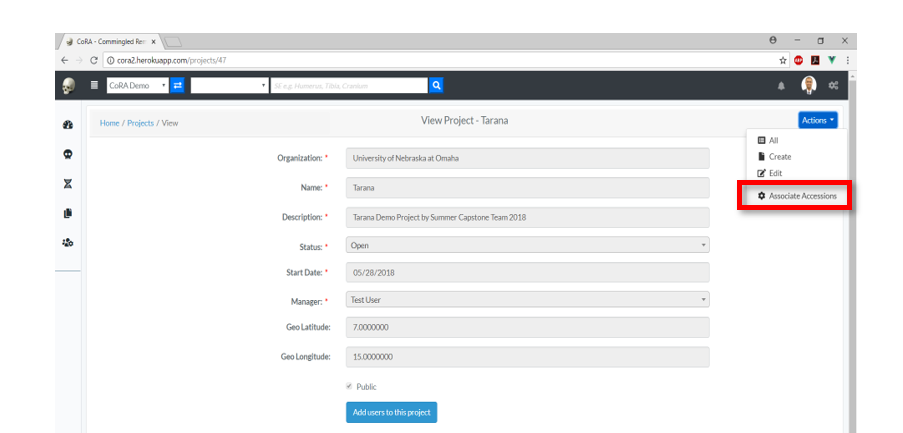

1.3.18 On the accession management page, click on actions, and then click create

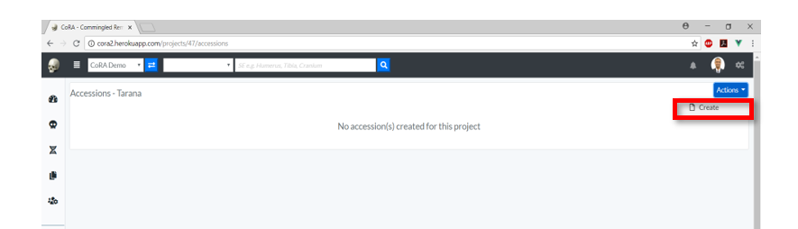

1.3.19 On the create accessions page, enter the required information (*required fields are marked with a red asterisk*) and click save

1.3.20 After clicking save, the Org Admin will be redirected to the page displaying accession details associated with a specific project.

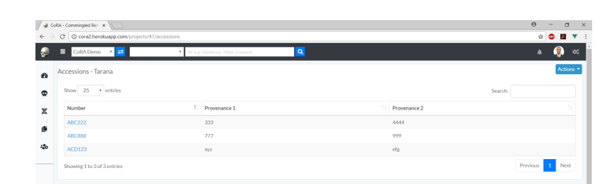

### 1.4 Accession Management

#### Creating Accession

1.4.1 On the Accession Management page, click on actions, and then click create

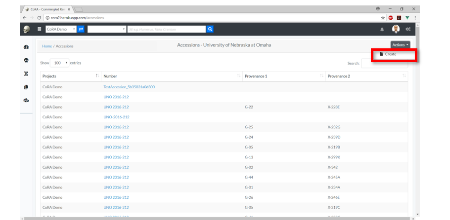

1.4.2 On the create accession page, the Org Admin can choose a specific project from the drop down option to assign the accession details.

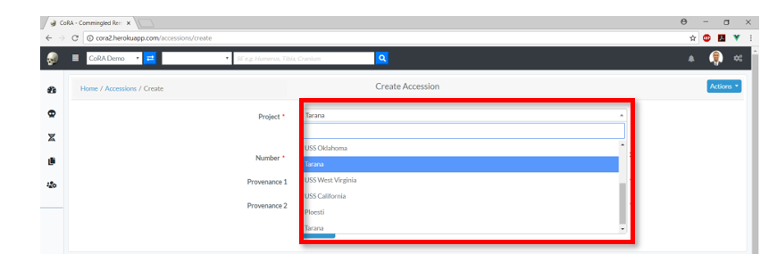

1.4.3 On the create accessions page, enter the required information (*required fields are marked with a red asterisk*) for a particular project and click save

1.4.4 After clicking save, the Org Admin will be redirected to the page displaying accession details associated with a specific project.

### 1.5    Instrument Management 

#### Instrument Management

1.5.1 On the Instrument Management page, click on Actions and then click Create.

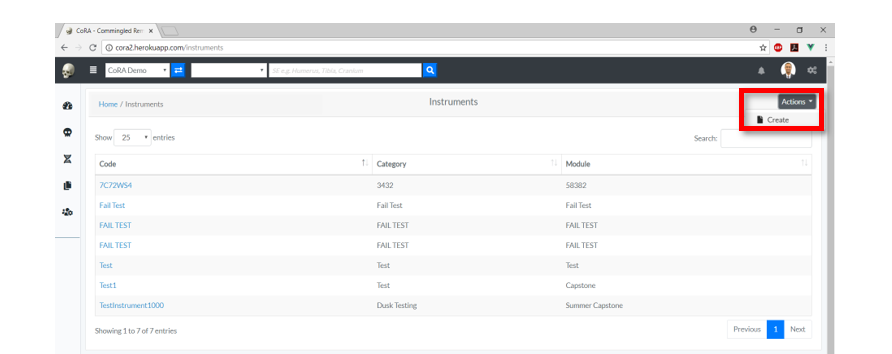

1.5.2 On the create instrument page, enter the required information and click save

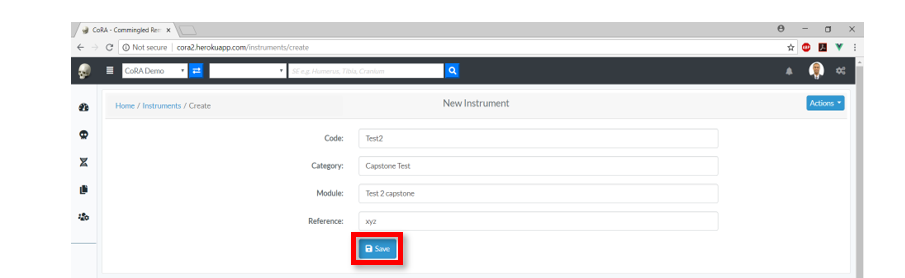

1.5.3 After clicking save, the Org Admin will be able to edit the users associated with the instrument by clicking "Assign users to this instrument"

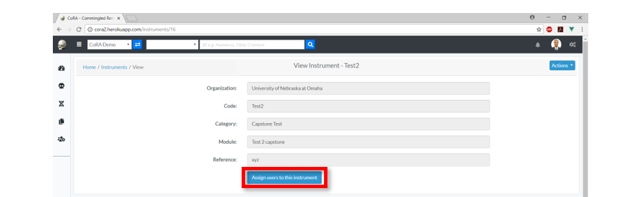

1.5.4  On the add user page, add/remove users and click save.

  

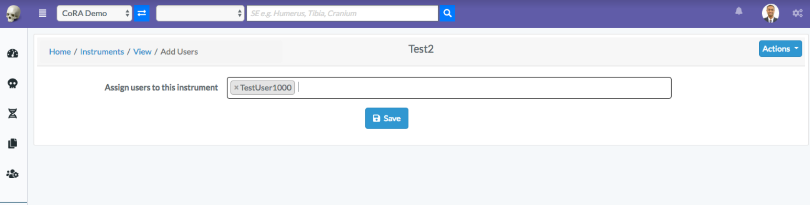

1.5.5 Once the save option is clicked, a message will appear at the top informing the Org Admin *“User(s) successfully associated"*
              
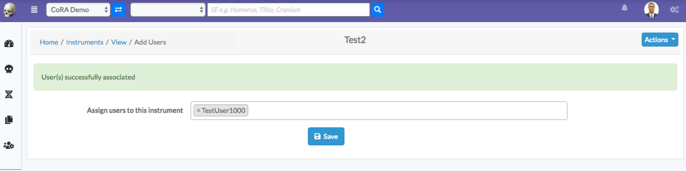

