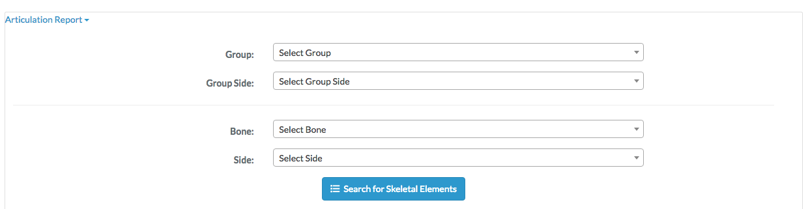
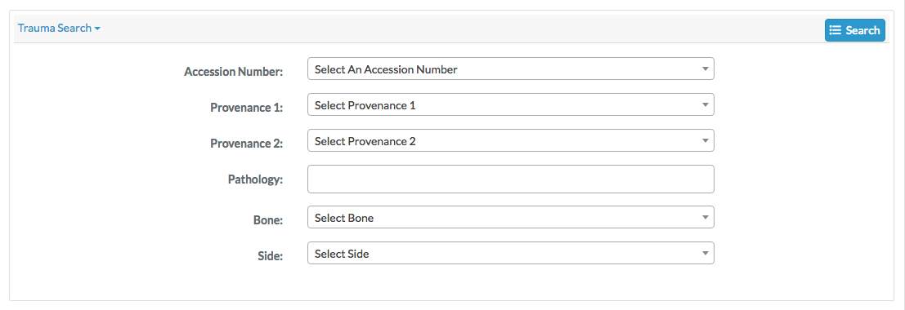

# Reports

The report page allows a user to search different skeletal elements by another categories.
The categories currently available for search are:

- mtDNA
- Zones
- Methods
- Measurements
- Articulations
- Individual Numbers
- Trauma
- Anomaly
- Pathology

For all reports, you have several export options.

- Copy results in a tabular format to the clipboard
- Download an Excel file
- Download a PDf file

Additionally, on each report results table, you can select how many results should be displayed, and visible columns.

## Sample Report Output

Here you can view the export and table view options for a set of results

Each report will be outlined in detail.

### Advanced Report

The Advanced Report is the most comprehensive search available for a given skeletal element. It allows the user to search by the following fields.

- Bone Name
- Bone Side
- Bone Completeness
- Who created the record 
- Who reviewed the record
- Status of the bone, including:
  - Measured Status
  - DNA Sampled Status
  - CT Scanned Status
  - Xray Scanned Status
  - Clavicle Triage Status
  - Inventory Completed Status
  - Reviewed Status

This report has no required fields.

### mtDNA Report

The mtDNA report is designed to allow a user to locate bones by a specific mtDNA or mtDNA subgroup. The search fields available are:

- Mito Sequence Number
- Mito Sequence Subgroup

Multiple Mito Sequence Numbers and Subgroups can be searched at one time.

The user is required to select at least one Mito sequence number or subgroup.

### Zones Report

The Zones Report is designed to allow a user to locate bones by a specific zone. The search fields available are:

- Accession Number
- Provenance Number 1
- Provenance Number 2
- Bone
- Side
- Zones

You can also select from one of 5 search types:

- Inclusive
- Exclusive
- Inclusive Only
- Exclusive Only
- Exclusive Or

The user is required to select a Bone and a Zone for this report.

### Methods Report

The Method Report allows a user to search by bones by a specific method. The search fields available are:

- Accession Number
- Provenance Number 1
- Provenance Number 2
- Bone
- Method Type
- Method
- Method Feature
- Score
- Range

The user is required to select a bone and a method for this report.

### Measurements Report

The Measurements Report allows a user to select by individual number and side of a bone. The search fields available are:

 - Accession Number
 - Provenance Number 1
 - Provenance Number 2
 - Bone
 - Side
 - Individual Number
 - Side
 
 No fields are required for this report.

### Articulations Report

The Articulations Report allows a user to select by Group and Group Side. The search fields available are:

- Group
- Group Side
- Bone
- Side

A Group or Bone is required for this report.

## Individual Number Report

The Individual Number Report allows a user to select by an individual bone number. The search fields available are:

- Accession Number
- Provenance Number 1
- Provenance Number 2
- Individual Number
- Bone
- Side

An Individual Number is required to run this report.

## Trauma Report

The Trauma Report allows a user to select by an trauma category. The search fields available are:

- Accession Number
- Provenance Number 1
- Provenance Number 2
- Trauma
- Bone
- Side

You must select a trauma category to run this report.

## Anomaly Report

The Anomaly Report allows a user to select by an anomaly category. The search fields available are:
  
- Anomaly
- Bone
- Side

An anomaly category must be selected to run this report.

## Pathology Report

The Pathology Report allows a user to select by an pathology category. The search fields available are:
  
- Accession Number
- Provenance Number 1
- Provenance Number 2
- Pathology
- Bone
- Side

A pathology category must be selected to run this report.