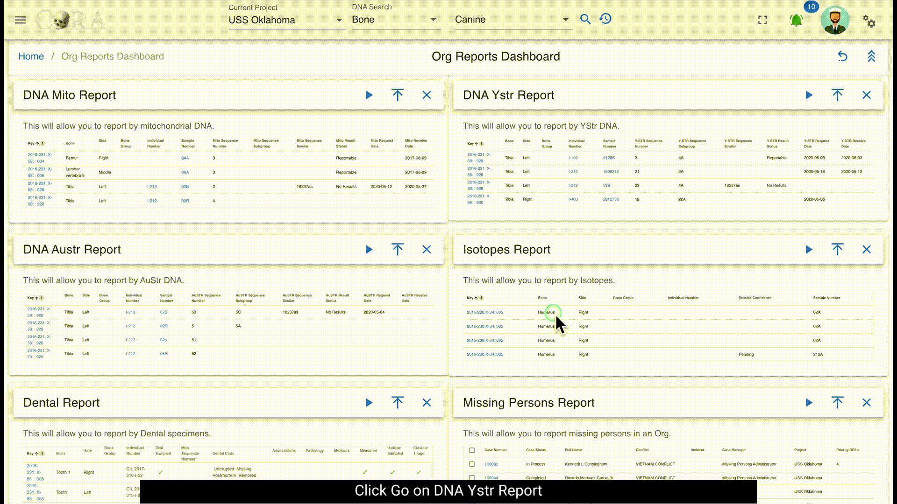

# Org Reports

This dashboard has a card view listing of all the org reports.

## Customize Dashboard

The org reports dashboard is highly customizable. You can expand/collapse all the report tabs or individual tabs and also drag and rearrange the tab arrangement. This arrangement is saved even after the user logs out. This state is saved in your local storage until browser cache is cleared. Each report pane displays an image of its respective sample report showing column names of that report.  

### Common Actions

Each report has a set of search/report criteria that the user can select before generating a report. Once the report is generated the user can perform the following actions that are common across all the reports.
- Collapse or expand the report criteria.  
- Choose visible columns on the report  
- Export as PDF or Excel  
- Reset the whole report  

## DNA Austr Report

The DNA Austr Report allows a user to select by Projects, Lab, Priority, Result Status, Austr Sequence Number, and Austr Sequence Subgroup. 

***There are no fields required to generate the report.***

The search fields that are available are: 

* Projects
* Lab
* Priority
* Results Status
* Austr Sequence Number
* Austr Sequence Subgroup
* Request Dates From
* Request Dates To
* Receive Dates From
* Receive Dates To

The report will return the following results if available: 

* Project
* Key
* Bone
* Side
* Bone Group
* Individual Number
* Sample Number
* Austr Sequence Number
* Austr Sequence Subgroup
* Austr Sequence Similar
* Austr Result Status
* Austr Request Date
* Austr Receive Date

## DNA Mito Report

The DNA Mito Report allows a user to select by Projects, Lab, Priority, Result Status, Mito Sequence Number, and Mito Sequence Subgroup. 

***There are no fields required to generate the report.***

The search fields that are available are: 

* Projects
* Lab
* Priority
* Results Status
* Mito Sequence Number
* Mito Sequence Subgroup
* Request Dates From
* Request Dates To
* Receive Dates From
* Receive Dates To

The report will return the following results if available: 

* Project
* Key
* Bone
* Side
* Bone Group
* Individual Number
* Sample Number
* Mito Sequence Number
* Mito Sequence Subgroup
* Mito Sequence Similar
* Mito Result Status
* Mito Request Date
* Mito Receive Date

## DNA Ystr Report

The DNA Ystr Report allows a user to select by Projects, Lab, Priority, Result Status, Ystr Sequence Number, and Ystr Sequence Subgroup. 

***There are no fields required to generate the report.***

The search fields that are available are: 

* Projects
* Lab
* Priority
* Results Status
* Ystr Sequence Number
* Ystr Sequence Subgroup
* Request Dates From
* Request Dates To
* Receive Dates From
* Receive Dates To

The report will return the following results if available: 

* Project
* Key
* Bone
* Side
* Bone Group
* Individual Number
* Sample Number
* Ystr Sequence Number
* Ystr Sequence Subgroup
* Ystr Sequence Similar
* Ystr Result Status
* Ystr Request Date
* Ystr Receive Date
* 

## Isotopes Report

The Isotope Report allows a user to select by project, lab, result status, and batch ID. 

***There are no fields required to generate the report.***

The search fields that are available are: 

 - Accession Number
 - Provenance 1
 - Provenance 2
 - Designator
 - Batch ID
 - Lab
 - Results Status
 - Collagen Yield From/To
 - Collagen Weight From/To
 - Carbon Weight From/To
 - Nitrogen Weight From/To
 - Oxygen Weight From/To
 - Sulfur Weight From/To
 - Carbon Percentage From/To
 - Nitrogen Percentage From/To
 - Oxygen Percentage From/To
 - Sulfur Percentage From/To
 - Carbon-to-Nitrogen Ratio From/To
 - Carbon-to-Oxygen Ratio From/To

The report will return results of of the following if it is available: 
 - Project
 - Key
 - Bone
 - Side
 - Bone Group
 - Individual Number
 - Result Confidence
 - Sample Number
 - Collagen Yield
 - Collagen Weight
 - Carbon Weight
 - Nitrogen Weight
 - Oxygen Weight
 - Sulfur Weight
 - Carbon Percentage
 - Nitrogen Percentage
 - Oxygen Percentage
 - Sulfur Percentage
 - Carbon-to-Nitrogen Ratio
 - Carbon-to-Oxygen Ratio

## Missing Persons Report

The Missing Persons Report allows a user to select by case status, owner service, service member service, conflict, indident, DPAA case status, DPAA priority, case number, name, project, case manager, PCRB priority, genealogy status, updated date, and toggles for the fields DPAA prioritized only, followed up, and updated DCIPS.

***There are no fields required to generate the report.***

The search fields that are available are: 

 - Case Status
 - Owner Service
 - Service Member Service
 - Conflict
 - Incident
 - DPAA Case Status
 - DPAA Priority
 - Case Number
 - Name
 - Project
 - Case Manager
 - PCRB Priority
 - Genealogy Status
 - Updated At
 - DPAA Prioritized Only
 - Followed Up
 - Updated DCIPS

The report will return results of of the following if it is available: 
 - Case Number
 - Owner Service
 - Service Member Service
 - Case Status
 - Full Name
 - Conflict
 - Incident
 - Case Manger
 - Project
 - Priority DPAA
 - DPAA Case Status
 - Followed Up
 - Updated DCIPS
 - Priority PCRB
 - Genealogy Status

## Missing Persons Report

!!! warning

     The following section on this page is work in progress.
