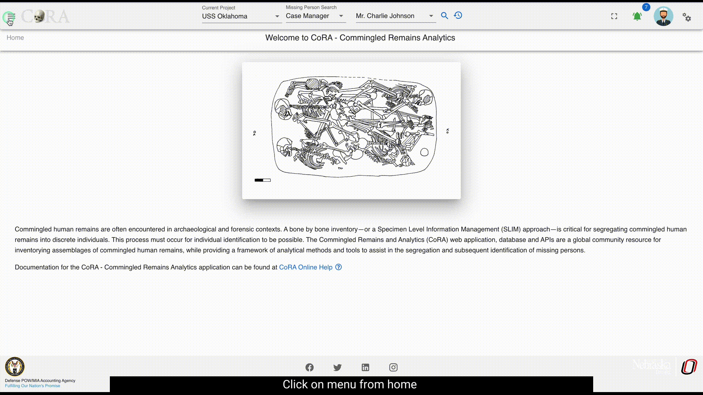
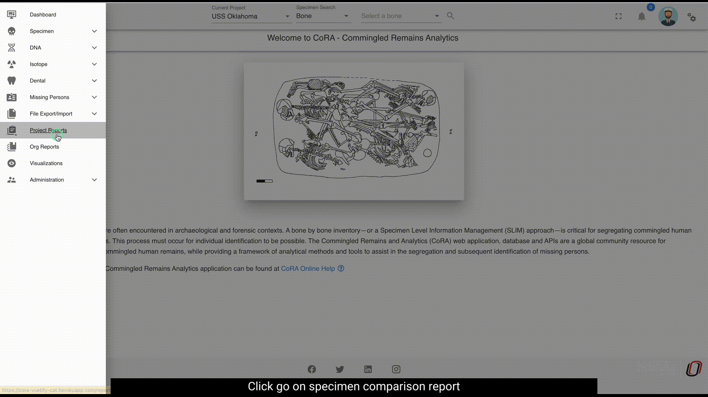
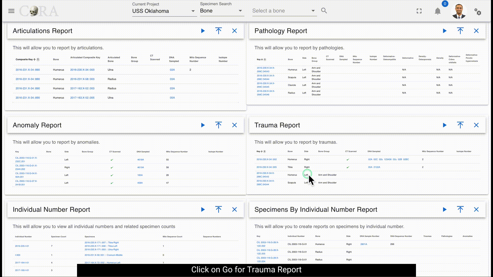

# Project Reports

The project reports dashboard is accessible by all users who have access to specimens. This dashboard has a card view listing of all the project reports.

## Customize Dashboard

The project reports dashboard is highly customizable. You can expand/collapse all the report tabs or individual tabs and also drag and rearrange the tab arrangement. This arrangement is saved even after the user logs out. This state is saved in your local storage until browser cache is cleared. Each report pane displays an image of its respective sample report showing column names of that report.  

### Common Actions

Each report has a set of search/report criteria that the user can select before generating a report. Once the report is generated the user can perform the following actions that are common across all the reports.
- Collapse or expand the report criteria.  
- Choose visible columns on the report  
- Export as PDF or Excel  
- Reset the whole report  
  
## Advanced Specimen Report

The Advanced Specimen Report is the most comprehensive report that is available for a skeletal element. 

***There are no fields required to generate this report.***

The search fields that are available are: 

* Accession Number
* Provenance 1
* Provenance 2
* Bone
* Side
* Completeness
* Created By
* Reviewed By
* Inventoried By

The status of the bone toggle buttons that you can enable as part of the search function are:

* Measured
* DNA Sampled
* CT Scanned
* Clavicle Triage
* Xray Scanned
* Inventory Completed
* Reviewed

## Anomaly Report

The Anomaly Report allows a user to select by an anomaly category.

***The fields in bold are required fields in order to generate the report. The user is required to select an anomaly for this report.***

The search fields that are available are: 

* Accession Number
* Provenance 1
* Provenance 2
* Bone
* Side
* **Anomaly**

## Articulations Report

The Articulations Report allows a user to select by articulations. 

***The fields in bold are required fields in order to generate the report. The user is required to select a group and a bone for this report.***

The search fields that are available are: 

* **Group**
* Group Side
* Accession Number
* Provenance 1
* Provenance 2
* **Bone**
* Side

## DNA Mito Report

The DNA Mito Report allows a user to select DNA mitochondrial sequence numbers and subgroups. 

***There are no fields required to generate this report.***

The search fields that are available are: 

* Accession Number
* Provenance 1
* Provenance 2
* Results Status
* Mito Sequence Number
* Mito Sequence Subgroup
* Request Dates From
* Request Dates To
* Receive Dates From
* Receive Dates To

## DNA Austr Report

The DNA Austr Report allows a user to select DNA Austr sequence numbers and subgroups.

***There are no fields required to generate this report.***

The search fields that are available are:

* Accession Number
* Provenance 1
* Provenance 2
* Results Status
* Austr Sequence Number
* Austr Sequence Subgroup
* Request Dates From
* Request Dates To
* Receive Dates From
* Receive Dates To

## DNA Ystr Report

The DNA Ystr Report allows a user to select DNA Ystr sequence numbers and subgroups.

***There are no fields required to generate this report.***

The search fields that are available are:

* Accession Number
* Provenance 1
* Provenance 2
* Results Status
* Ystr Sequence Number
* Ystr Sequence Subgroup
* Request Dates From
* Request Dates To
* Receive Dates From
* Receive Dates To

## Individual Number Report

The Individual Number Report allows a user to view all individual numbers and related specimen counts. 

No fields are chosen on the main page, instead you can choose the individual number on the left column to be taken to the "Specimens by Individual Numbers Report" report. The following fields are available once you arrive the "Specimen by Individual Numbers Report" page: 

* Accession Number
* Provenance 1
* Provenance 2
* Individual Number (This will be pre-populated for you from the previous page)
* Bone
* Side

Alternatively, you can click on the specimen data in the middle column to see more information about the skeletal element and whether the element was measured, DNA sampled, Isotopes sampled, CT Scanned, CT Scanned At date, X-ray Scanned, 3D Scanned, Inventory Completed status, and Inventory Date. 

You can edit the skeletal element by clicking the pencil icon on the upper right corner and update the necessary fields. 

## Isotopes Report

The Isotope Report allows a user to select by project, lab, result status, and batch ID. 

***There are no fields required to generate the report.***

The search fields that are available are: 

 - Accession Number
 - Provenance 1
 - Provenance 2
 - Batch ID
 - Lab
 - Results Status
 - Collagen Yield From/To
 - Collagen Weight From/To
 - Carbon Weight From/To
 - Nitrogen Weight From/To
 - Oxygen Weight From/To
 - Sulfur Weight From/To
 - Carbon Percentage From/To
 - Nitrogen Percentage From/To
 - Oxygen Percentage From/To
 - Sulfur Percentage From/To
 - Carbon-to-Nitrogen Ratio From/To
 - Carbon-to-Oxygen Ratio From/To

The report will return results of of the following if it is available: 
 - Project
 - Key
 - Bone
 - Side
 - Bone Group
 - Individual Number
 - Sample Number
 - Collagen Yield
 - Collagen Weight
 - Carbon Weight
 - Nitrogen Weight
 - Oxygen Weight
 - Sulfur Weight
 - Carbon Percentage
 - Nitrogen Percentage
 - Oxygen Percentage
 - Sulfur Percentage
 - Carbon-to-Nitrogen Ratio
 - Carbon-to-Oxygen Ratio

## Measurements Report

The Measurements Report allows a user to select by individual number or bone. Either individual number or bone is required to run the report. 

***The fields in bold are required fields in order to generate the report. The user is required to select either Bone or Individual Number for this report. Only one or the other can be chosen.***

The search fields that are available are: 

 - Accession Number
 - Provenance Number 1
 - Provenance Number 2
 - **Bone**
 - Side
 - **Individual Number**
 - Side

The bolded fields are required. The user is required to select a bone or an individual number for this report. 

The report will return results of of the following if it is available: 

 - Key
 - Bone
 - Side
 - Various measurements for the bone that is chosen

## Methods Report

The Method Report allows a user to search by bones by a specific method. 

The search fields that are available are: 
  
***The bolded fields are required. The user is required to select a bone and a method for this report.***
  
- Accession Number  
- Provenance 1  
- Provenance 2  
- **Bone**  
- Method Type  
- **Method**  
- Method Feature  
- Score  
- Range  

## Pathology Report

The Pathology Report allows a user to select by a pathology category. 

***The bolded fields are required. The user is required to select a Pathology for this report.***

The search fields that are available are: 

* Accession Number
* Provenance 1
* Provenance 2
* **Pathology**
* Bone
* Side

## Specimens by Individual Number Report

The Specimens by Individual Number Report allows a user to generate a report by Individual Numbers which will return results of an Individual Number's bone, side, DNA Sample Number, DNA Sequence Number, Traumas, Pathologies, and Anomalies. 

***The bolded fields are required. The user is required to select a Individual Number for this report.***

The search fields that are available are: 

* Accession Number
* Provenance 1
* Provenance 2
* **Individual Number**
* Bone
* Side

## Specimen Comparison Report

The Specimen Comparison Report allows a user to compare more than two specimens side by side. The report return results of bone group, individual number, remains status, Mito Seq Number, Zones, Trauma, Pathology, Taphonomy, Paired, Refit, and Articulated. 

***The bolded fields are required. The user is required to select Bone and Bone Side for this report.***

The search fields that are available are: 

* Accession Number
* Provenance 1
* Provenance 2
* **Bone**
* **Bone Side**

## Trauma Report

The Trauma Report allows a user to select by an trauma category. 

***The bolded fields are required. The user is required to select Trauma for this report.***

The search fields that are available are:

-   Accession Number
-   Provenance 1
-   Provenance 2
-   **Trauma**
-   Bone
-   Side

## Zones Report

The Zones Report is designed to allow a user to locate bones by specific zones. 

***The bolded fields are required. The user is required to select Bone, Zones, and Search Select type.***

The search fields that are available are: 

-   Accession Number
-   Provenance Number 1
-   Provenance Number 2
-   **Bone**
-   Side
-   **Zones**
-   **Search Select Type**

You can also select from one of following search types:

-   Inclusive
-   Exclusive
-   Inclusive Only
-   Exclusive Only
-   Exclusive Or
-   Not Present

The user is required to select a Bone, Zones and Search Select Type for this report.

