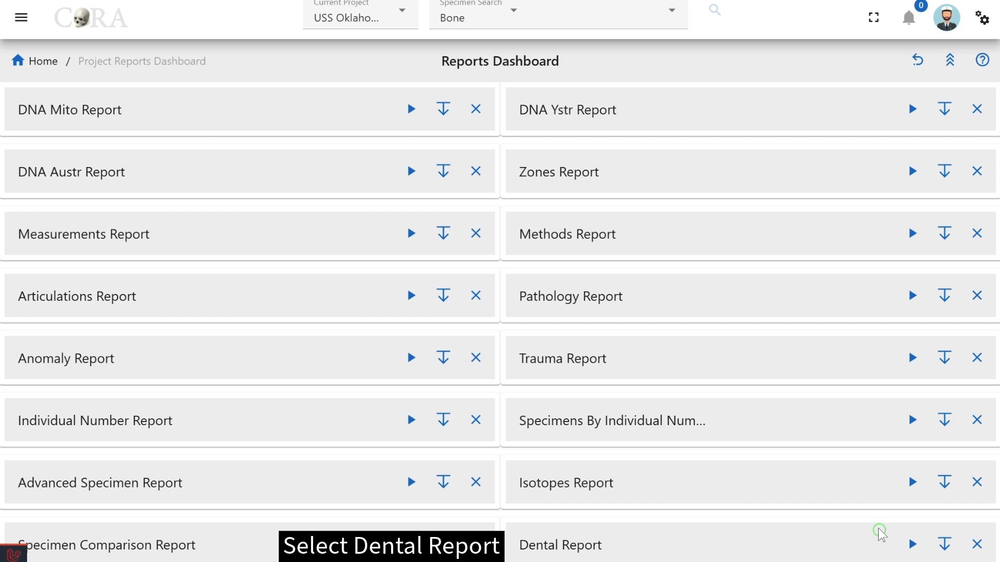

# Project Reports

The project reports dashboard is accessible by all users who have access to specimens. This dashboard has a card view listing of all the project reports.

## Customize Dashboard
The project reports dashboard is highly customizable. You can expand/collapse all the report tabs or individual tabs and also drag and rearrange the tab arrangement. This arrangement is saved even after the user logs out. This state is saved in your local storage until browser cache is cleared. Each report pane displays an image of its respective sample report showing column names of that report.  

## Common Actions
Each report has a set of search/report criteria that the user can select before generating a report. Once the report is generated the user can perform the following actions that are common across all the reports.
- Collapse or expand the report criteria.  
- Choose visible columns on the report  
- Export as PDF or Excel  
- Reset the whole report  

## Project Specific Reports
Below you will find the list of project specific reports available in CoRA.

!!! question

    If you feel like there is a project specific report that is missing or not available, please create a new issue with your report requirements and we will review it and add it to the list of project specific reports.

### Advanced Specimen Report

The Advanced Specimen Report is the most comprehensive report that is available for a skeletal element.

***There are no fields required to generate this report.***

The search fields that are available are:

* Accession Number
* Provenance 1
* Provenance 2
* Bone
* Side
* Completeness
* Created By
* Reviewed By
* Inventoried By

The status of the bone toggle buttons that you can enable as part of the search function are:

* Measured
* DNA Sampled
* CT Scanned
* Clavicle Triage
* Xray Scanned
* Inventory Completed
* Reviewed

On Click of generate the advanced specimen report page will show the results based on the fields selected.

The generated report will include the following details in the result:

* Key
* Bone
* Side
* Bone Group
* Individual Number
* DNA Sampled
* Mito Sequence number
* Measured
* Isotope Sampled
* Clavicle Triage
* CT Scanned
* XRay Scanned

### Anomaly Report

The Anomaly Report allows a user to select by an anomaly category.

On the Projects dashboard, click on the Go button for Anomaly report.

***The fields in bold are required fields in order to generate the report. The user is required to select an anomaly for this report.***

The search fields that are available are:

* Accession Number
* Provenance 1
* Provenance 2
* Bone
* Side
* **Anomaly**

On Click of generate the Anomaly report page will show the results based on the fields selected.

The generated report will include the following details in the result:

* Key
* Bone
* Side
* Bone Group
* Individual Number
* DNA Sampled
* Mito Sequence number

### Articulations Report

The Articulations Report allows a user to select by articulations.

***The fields in bold are required fields in order to generate the report. The user is required to select a group and a bone for this report.***

The search fields that are available are:

* Group
* Group Side
* Accession Number
* Provenance 1
* Provenance 2
* **Bone**
* Side

On Click of generate the articulations report page will show the results based on the fields selected.

The generated report will include the following details in the result:

* Composite Key
* Bone
* Articulated Composite Key
* Articulated Bone
* Bone Group

### DNA Mito Report

The DNA Mito Report allows a user to select DNA mitochondrial sequence numbers and subgroups.

***There are no fields required to generate this report.***

The search fields that are available are:

* Accession Number
* Provenance 1
* Provenance 2
* Results Status
* Mito Sequence Number
* Mito Sequence Subgroup
* Request Dates From
* Request Dates To
* Receive Dates From
* Receive Dates To

On Click of generate the DNA Mito report page will show the results based on the fields selected.

The generated report will include the following details in the result:

* Key
* Bone
* Side
* Bone Group
* Individual Number
* Sample Number
* Mito Sequence Number
* Mito Sequence Subgroup
* Mito Sequence Similar
* Mito Request Date
* Mito Receive Date

### DNA Austr Report

The DNA Austr Report allows a user to select DNA Austr sequence numbers and subgroups.

***There are no fields required to generate this report.***

The search fields that are available are:

* Accession Number
* Provenance 1
* Provenance 2
* Results Status
* Austr Sequence Number
* Austr Sequence Subgroup
* Request Dates From
* Request Dates To
* Receive Dates From
* Receive Dates To

On Click of generate the DNA Austr report page will show the results based on the fields selected.

The generated report will include the following details in the result:

* Key
* Bone
* Side
* Bone Group
* Individual Number
* Sample Number
* Austr Sequence Number
* Austr Sequence Subgroup
* Austr Sequence Similar
* Austr Result Status
* Austr Request Date
* Austr Receive Date

### DNA Ystr Report

The DNA Ystr Report allows a user to select DNA Ystr sequence numbers and subgroups.

***There are no fields required to generate this report.***

The search fields that are available are:

* Accession Number
* Provenance 1
* Provenance 2
* Results Status
* Ystr Sequence Number
* Ystr Sequence Subgroup
* Request Dates From
* Request Dates To
* Receive Dates From
* Receive Dates To

On Click of generate the Org DNA Ystr report page will show the results based on the fields selected.

The generated report will include the following details in the result:

* Project
* Key
* Bone
* Side
* Bone Group
* Individual Number
* Sample Number
* Ystr Sequence Number
* Ystr Sequence Subgroup
* Ystr Sequence Similar
* Ystr Result Status
* Ystr Request Date
* Ystr Receive Date

### Individual Number Report

The Individual Number Report allows a user to view all individual numbers and related specimen counts. 

No fields are chosen on the main page, instead you can choose the individual number on the left column to be taken to the "Specimens by Individual Numbers Report" report. The following fields are available once you arrive the "Specimen by Individual Numbers Report" page: 

* Individual Number
* Specimen Count
* Specimens
* Mito Sequence Count
* Sequence Numbers

### Isotopes Report

The Isotope Report allows a user to select by project, lab, result status, and batch ID.

***There are no fields required to generate the report.***

The search fields that are available are:

- Accession Number
- Provenance 1
- Provenance 2
- Batch ID
- Lab
- Results Status
- Collagen Yield From/To
- Collagen Weight From/To
- Carbon Weight From/To
- Nitrogen Weight From/To
- Oxygen Weight From/To
- Sulfur Weight From/To
- Carbon Percentage From/To
- Nitrogen Percentage From/To
- Oxygen Percentage From/To
- Sulfur Percentage From/To
- Carbon-to-Nitrogen Ratio From/To
- Carbon-to-Oxygen Ratio From/To

On Click of generate the isotopes report page will show the results based on the fields selected.

The generated report will include the following details in the result:

- Project
- Key
- Bone
- Side
- Bone Group
- Individual Number
- Sample Number
- Collagen Yield
- Collagen Weight
- Carbon Weight
- Nitrogen Weight
- Oxygen Weight
- Sulfur Weight
- Carbon Percentage
- Nitrogen Percentage
- Oxygen Percentage
- Sulfur Percentage
- Carbon-to-Nitrogen Ratio
- Carbon-to-Oxygen Ratio

### Measurements Report

The Measurements Report allows a user to select by individual number or bone.

On the Projects Dashboard, click on the Go button for Measurements Report

Either individual number or bone is required to run the report.

***The fields in bold are required fields in order to generate the report. The user is required to select either Bone or Individual Number for this report. Only one or the other can be chosen.***

The search fields that are available are:

- Accession Number
- Provenance Number 1
- Provenance Number 2
- **Bone**
- Side
- **Individual Number**
- Side

On Click of generate the Measurements report page will show the results based on the fields selected.

The generated report will include the following details in the result:

- Key
- Bone
- Side
- Various measurements for the bone that is chosen

### Methods Report

The Method Report allows a user to search by bones by a specific method.

The search fields that are available are:

***The bolded fields are required. The user is required to select a bone and a method for this report.***

- Accession Number
- Provenance 1
- Provenance 2
- **Bone**
- Method Type
- **Method**
- Method Feature
- Score
- Range

Choose the bone in the filters to determine the Method type and Method dropdown options that will be populated. Depending on the selected Method, the Method feature dropdown fields will be populated.

Once the required fields are selected, click on the generate button at the top to view the report.

On Click of generate the methods report page will show the results based on the fields selected.

The generated report will include the following details in the result:

- Key
- Bone
- Side
- Bone Group
- Individual Number
- DNA Sample Number
- Mito Sequence Number
- Method
- Method Feature
- Score
- 

### Pathology Report

The Pathology Report allows a user to select by a pathology category.

***The bolded fields are required. The user is required to select a Pathology for this report.***

The search fields that are available are:

* Accession Number
* Provenance 1
* Provenance 2
* **Pathology**
* Bone
* Side

On Click of generate the Pathology Report page will show the results based on the fields selected.

The generated report will include the following details in the result:

* Key
* Bone
* Side
* Bone Group
* Individual Number
* DNA Sample number
* Mito Sequence Number
* Density

### Specimens by Individual Number Report

The Specimens by Individual Number Report allows a user to generate a report by Individual Numbers which will return results of an Individual Number's bone, side, DNA Sample Number, DNA Sequence Number, Traumas, Pathologies, and Anomalies.

***The bolded fields are required. The user is required to select a Individual Number for this report.***

The search fields that are available are:

* Accession Number
* Provenance 1
* Provenance 2
* **Individual Number**
* Bone
* Side

On Click of generate the Specimens by Individual Number Report page will show the results based on the fields selected.

The generated report will include the following details in the result:

* Key
* Individual Number
* Bone
* Side
* DNA Sample Number
* DNA Sequence number
* Traumas
* Pathologies
* Anomalies

### Specimen Comparison Report

The Specimen Comparison Report allows a user to compare more than two specimens side by side. The report return results of bone group, individual number, remains status, Mito Seq Number, Zones, Trauma, Pathology, Taphonomy, Paired, Refit, and Articulated.

***The bolded fields are required. The user is required to select Bone and Bone Side for this report.***

The search fields that are available are:

* Accession Number
* Provenance 1
* Provenance 2
* **Bone**
* **Bone Side**

On Click of generate the specimen comparison report page will show the results based on the fields selected.

The generated report will include the following details in the result:

* Key
* Bone
* Side
* Bone Group
* Individual Number
* Remains Status
* Mito Sequence number
* Zones
* Trauma
* Pathology
* Taphonomy
* Paired
* Refit
* Articulated

### Trauma Report

The Trauma Report allows a user to select by an trauma category.

***The bolded fields are required. The user is required to select Trauma for this report.***

The search fields that are available are:

-   Accession Number
-   Provenance 1
-   Provenance 2
-   **Trauma**
-   Bone
-   Side

On Click of generate the traumas report page will show the results based on the fields selected.

The generated report will include the following details in the result:

- Composite Key
- Bone
- Side
- Bone Group
- Individual Number
- DNA Sample Number
- Mito Sequence Number
- Antemortem

### Zones Report

The Zones Report is designed to allow a user to locate bones by specific zones. 

***The bolded fields are required. The user is required to select Bone, Zones, and Search Select type.***

The search fields that are available are: 

-   Accession Number
-   Provenance Number 1
-   Provenance Number 2
-   **Bone**
-   Side
-   **Zones**
-   **Search Select Type**

You can also select from one of following search types:

-   Inclusive
-   Exclusive
-   Inclusive Only
-   Exclusive Only
-   Exclusive Or
-   Not Present

On Click of generate the zones report page will show the results based on the fields selected.

The generated report will include the following details in the result:

* Key
* Bone
* Side
* Bone Group
* Individual Number
* 1-Head
* 2 -Rib angle including tubercle
* 3 -Corpus
* 4 -Sternal end

### Missing Person Dental Comparison Report

Missing person dental comparison report allows a user to generate a report for the missing person dental records which will return results of Missing Person, Bone, Dental Code, Type, Subtype, Root, Tooth, Occlusal, Mesial, Facial, Distal, Lingual.

The search fields that are available are:

* Tooth
* Dental Code

The toggle button can be used to set the table view or dental chart of the missing person.

On click of generate the Missing Person Dental Comparison report page will show the results based on the fields selected.

The generated report will include the following details in the result:

* Missing Person ID
* Bone ID
* Dental Code
* Type
* Subtype
* Root
* Tooth
* Occlusal
* Mesial
* Facial
* Distal
* Lingual

### Dental Report

The Dental Report allows a user to generate report for the tooth and the selected dental code.

On Project Reports Dashboard, Click on Go button for Dental Report to view the report.

***The bolded fields are required. The user is required to select Tooth and Dental Code for this report.***

The search fields that are available are:

* Accession Number
* Provenance 1
* Provenance 2
* **Tooth**
* **Dental Code**
* Request Dates From
* Request Dates To
* Receive Date From
* Receive Dates To

Once the required fields are selected, click on the generate button at the top to view the report.

The generated report will include the following details in the result:

* Key
* Bone
* Side
* Bone Group
* Individual Number
* DNA Sampled
* Mito Sequence Number
* Dental Code
* Associations
* Pathology
* Methods
* Measured
* Isotope
* Sampled
* Clavicle Triage

### Report of Segregation

The report of segregation allows a user to generate report for the associated specimen and their degree of segregation by mito sequence number.

***There are no fields required to generate the report.***

The search fields that are available are:

* Accession Number
* Provenance 1
* Provenance 2
* Mito Sequence Number
* Level of Association

On Click of generate the report of segregation page will show the results based on the fields selected.

The generated report will include the following details in the result:

* Key
* Individual Number
* Bone
* Side
* DNA Sample Number
* DNA Sequence Number
* Associations
* Key::Bone::Side
* Level

