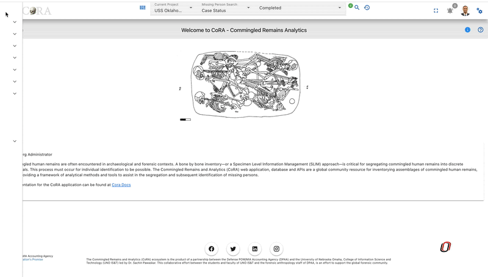
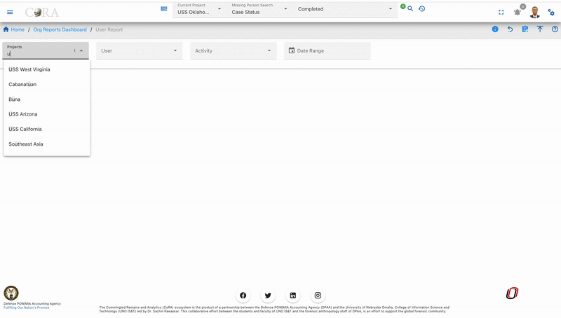
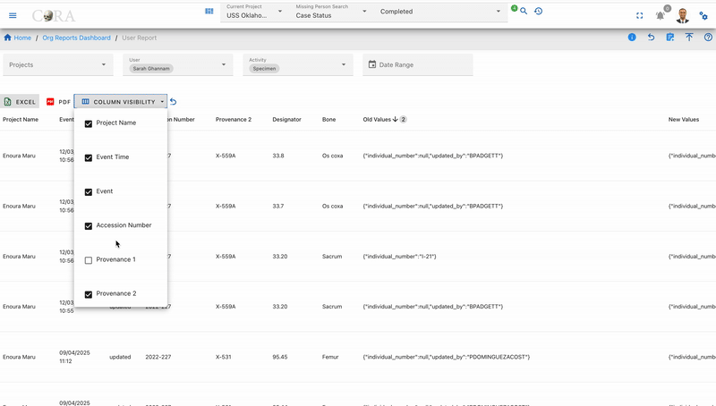

# User Reports

## Overview

The User Reports feature provides a comprehensive activity tracking system that allows administrators and users to monitor and analyze user activities across the entire CoRA application. This powerful reporting tool tracks various types of user interactions including specimen management, DNA analysis, isotope analysis, and more.

## Key Features

- **Multi-Activity Tracking**: Monitor activities across 8 different categories
- **Dynamic Columns**: Report columns adapt based on the selected activity type
- **Advanced Filtering**: Filter by user, project, activity type, and date range
- **Export Capability**: Download reports in Excel format
- **Customizable Views**: Show/hide columns based on your needs

## Accessing User Reports

1. Navigate to **Reports** in the main menu
2. Click on **User Reports**
3. The User Reports dashboard will load with default filters

## Search Filters

### Available Filters

- **Users**: Select one or more users to track their activities
- **Projects**: Filter activities by specific project(s)
- **Activity Type**: Choose the type of activity to monitor:
  - Specimen
  - DNA
  - Isotope
  - Individual
  - Missing Person
  - Project
  - Org (Organization)
  - User
- **Date Range**: 
  - Start Date: Beginning of the date range
  - End Date: End of the date range

### How to Use Filters

1. Click on any filter dropdown to select your criteria
2. You can select multiple users or projects
3. Choose an activity type to see relevant data
4. Set a date range to narrow down results
5. Click **Search** to apply filters
6. Click **Reset** to clear all filters

## Dynamic Columns

The User Report table displays different columns based on the selected **Activity Type**. This ensures you see only relevant information for each activity.

### Common Columns (All Activity Types)

- **User**: The user who performed the activity
- **Project**: The project associated with the activity
- **Activity Type**: Type of activity performed
- **Created At**: Date and time when the activity was logged
- **Updated At**: Last update date and time

### Specimen Activity Columns

When **Activity Type = Specimen**, additional columns include:

- **Specimen Key**: Unique identifier (e.g., "CIL 2003-116-D-21-A")
- **Accession Number**: Associated accession number
- **Provenance 1**: First level of provenance
- **Provenance 2**: Second level of provenance
- **Designator**: Specimen designator
- **Bone**: Type of bone
- **Side**: Bone side (Left/Right)
- **Completeness**: Completeness percentage
- **Individual Number**: Associated individual number

### DNA Activity Columns

When **Activity Type = DNA**, additional columns include:

- **Specimen Key**: Associated specimen
- **Sample Number**: DNA sample identifier
- **Lab**: Laboratory name
- **External Case**: External case reference
- **Mito Sequence Number**: Mitochondrial sequence number
- **Mito Sequence Subgroup**: Sequence subgroup
- **Mito Request Dates**: Dates of requests
- **Mito Receive Dates**: Dates received

### Isotope Activity Columns

When **Activity Type = Isotope**, additional columns include:

- **Specimen Key**: Associated specimen
- **Isotope Sample Number**: Sample identifier
- **Lab**: Laboratory conducting analysis
- **External Case**: External reference
- **Isotope Results**: Analysis results

### Individual Activity Columns

When **Activity Type = Individual**, additional columns include:

- **Individual Number**: Unique individual identifier
- **First Name**: Individual's first name
- **Last Name**: Individual's last name
- **Date of Birth**: Birth date
- **Date of Death**: Death date (if applicable)

### Missing Person Activity Columns

When **Activity Type = Missing Person**, additional columns include:

- **Case Number**: Missing person case number
- **First Name**: Person's first name
- **Last Name**: Person's last name
- **Middle Name**: Middle name
- **Status**: Current case status
- **Conflict**: Associated conflict
- **Incident**: Incident details

### Project Activity Columns

When **Activity Type = Project**, additional columns include:

- **Project Name**: Name of the project
- **Project Description**: Project details
- **Start Date**: Project start date
- **Manager**: Project manager name
- **Status**: Current project status

### Org Activity Columns

When **Activity Type = Org**, additional columns include:

- **Organization Name**: Name of the organization
- **Organization Type**: Type of organization
- **Description**: Organization description
- **Country**: Organization's country

### User Activity Columns

When **Activity Type = User**, additional columns include:

- **User Name**: Username
- **Email**: User's email address
- **Role**: User's role in the system
- **Last Login**: Last login date and time
- **Active Status**: Whether user is active

## Report Actions

### Export Report

1. Click the **Export** button (Excel icon) in the top right
2. The report will download as an Excel file
3. File name format: `user-report-YYYY-MM-DD.xlsx`

### Column Visibility

1. Click the **Column Visibility** button (eye icon)
2. Check/uncheck columns to show or hide them
3. Your preferences are saved for the current session

## Tips and Best Practices

1. **Start Broad, Then Narrow**: Begin with wider filters, then narrow down to specific users or dates
2. **Use Date Ranges**: Always set realistic date ranges to improve performance
3. **Export Regularly**: Download reports periodically for record-keeping
4. **Check Multiple Activity Types**: User activities may span across different types
5. **Combine Filters**: Use multiple filters together for precise results

### Permissions

- **Org Admin**: Can view all users in their organization
- **Project Manager**: Can view users in their projects
- **Regular Users**: Can view their own activities only
