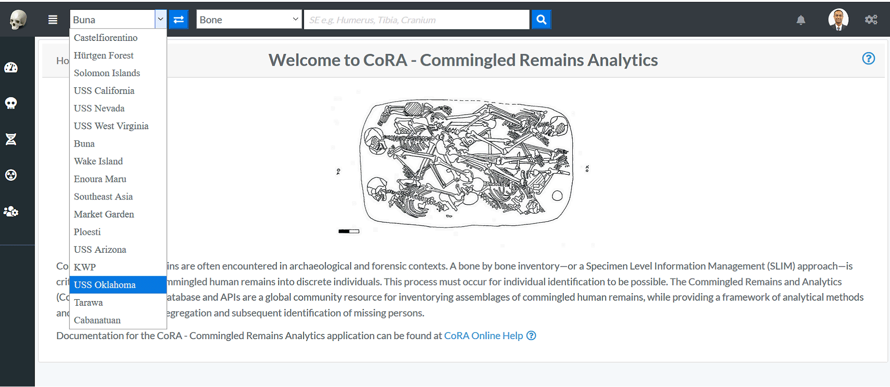

# Search

!!! warning

    This page is work in progress.

CoRA provides a powerful search engine allowing you to search any modules such as Specimens, DNA, Isotopes, Dental, Missing Persons. 
Each module can be searched using multiple criteria which are related to that module. 

## Search History and Favorites
The search capability also comes with a search history and favorites, which allows the user to look at their search history and
create favorites from their search history. This allows the user to quick access previous searches they may have done in a project.

## Quick Search
The quick search capability in CoRA is available in the header. It has 3 main components, the project, the search module, search criteria.

### Project Selector
The project selector displays the current project that the user is working on and all searches are done within the context of the currently selected project.
You can change your project anytime you want via the project dropdown by selecting a different project.

### Module Selector
The module or model selector displays the models that the user can search along with the most frequently used criteria for that model.
You can change your model criteria anytime you want via this dropdown.

### Search String/Value
The search string or value is provided by the user by either typing the search string or selecting a value from a the dropdown.
The values in the dropdown will change based on the module selected iby the user. CoRA has a built in `intellisense engine` that will provide 
the user with the most appropriate or valid search options for the selected project and module.

!!! tip "Intellisense Engine"

    CoRA has a built in `intellisense engine` that will provide context sensitive information, options and values for the selected project and model.

## Specimen Search

The easiest way to search for specimens is to use the top search bar in the nav bar.
To complete a search, first select the project you wish to search on the left-most select field, you will only be able to view projects which are assigned to your user profile. 

By default, "Bone" is selected as the search option. Select the desired search category before typing your search text into the search bar. Then click the magnifying glass to execute your search.

Once you complete your search, you are taken to the Specimens search screen. The following columns are visible for all the specimens search:

- Key
- Bone
- Side
- Bone Group
- Individual Number
- DNA Sampled
- Mito Sequence Number
- Measured
- Isotope Sampled
- Clavicle Triage
- CT Scanned
- Xray Scanned

There are some columns which are not displayed at the screen but can be made visible by checking the column visibility section. The names of those columns are given below:
- Inventoried
- Reviewed
- Inventoried By
- Inventoried At
- Reviewed By
- Reviewed At
- Created By
- Created At
- Updated By
- Updated At

On this page you can filter how many results are shown per page, as well as search the results.
To view the details of a skeletal elements, click on the key in the search results. You can also export the search results in Excel and PDF format. 

### Search Options
Two search options are available to the user inside the User Profile Project tab.

*Client-Side Pagination - **Ideal for small projects***

**Max Search Limit 500**

The server renders all results queried from the project search bar request, allowing the user to paginate and search through the entire response. Limitations with this search options, include longer response times or application overload for projects with large sets of data.  

*Server-Side Pagination (Default) - **Ideal for large projects***

**Max Search Limit 250**

The server will render only the selected quantity of data provided by show rows options at the top left corner of the page. 

Each tab will generate a new call to the server and retrieve the next set of data. This search option is ideal for project with larger sets of data. Search result filter is not available with this option.  

---------------

## DNA Search

## Isotope Search

## Dental Search

## Missing Persons Search

## Advanced Search & Reporting

Along with the quick search capability CoRA also provides an advanced search and reporting capability via the reports dashboard feature. 
The reports dashboard has many reports and each report provides the ability to search using multiple search criteria. See the documentation
on the [reports dashboard](../reports/index.md)
