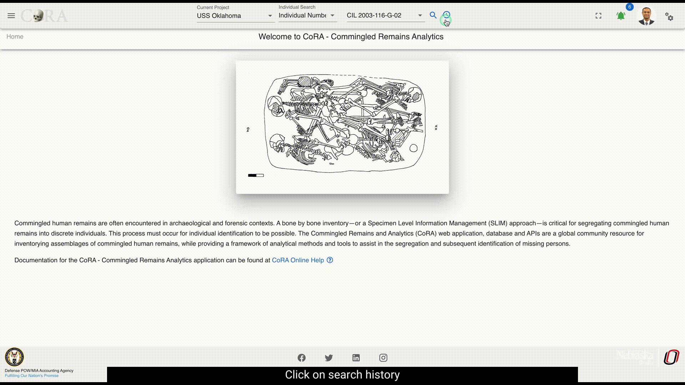

# Search

CoRA provides a powerful search engine allowing you to search any modules such as Specimens, DNA, Isotopes, Dental, Missing Persons. 
Each module can be searched using multiple criteria which are related to that module. 

## Search History and Favorites
The search capability also comes with a search history and favorites, which allows the user to look at their search history and create favorites from their search history. This allows the user to quick access previous searches they may have done in a project.

The searched type can be added to favorites. By clicking on the favorites from the history tab.

To delete the favorites history from favorites tab click on delete

## Quick Search
The quick search capability in CoRA is available in the header. It has 3 main components, the project, the search module, search criteria.

### Project Selector
The project selector displays the current project that the user is working on and all searches are done within the context of the currently selected project.
You can change your project anytime you want via the project dropdown by selecting a different project.

### Module Selector
The module or model selector displays the models that the user can search along with the most frequently used criteria for that model.
You can change your model criteria anytime you want via this dropdown.

### Search String/Value
The search string or value is provided by the user by either typing the search string or selecting a value from a the dropdown.
The values in the dropdown will change based on the module selected iby the user. CoRA has a built in `intellisense engine` that will provide 
the user with the most appropriate or valid search options for the selected project and module.

!!! tip "Intellisense Engine"

    CoRA has a built in `intellisense engine` that will provide context sensitive information, options and values for the selected project and model.

## Specimen Search

The easiest way to search for specimens is to use the top search bar in the nav bar.

To complete a search, first select the project you wish to search on the left-most select field, you will only be able to view projects which are assigned to your user profile.

By default, "Bone" is selected as the search option. Select the desired search category before typing your search text into the search bar. Then click the magnifying glass to execute your search.

The different search category for Specimen search are:

* If the selected Specimens search is Bone, Select a Bone from the dropdown to search for.
* If the selected Specimens search is Composite Key, Type the Composite Key into search bar.
* If the Selected Specimens search is Accession, Select Accession from the dropdown to search for.
* If the Selected Specimens search is Provenance 1, Select provenance 1 from the dropdown to search for.
* If the Selected Specimens search is Provenance 2, Select provenance 2 from the dropdown to search for.
* If the Selected Specimens search is Designator, Type the Designator into search bar.
* If the Selected Specimens search is Individual Number, Select Individual Number from the dropdown to search for.
* If the Selected Specimens search is Tags, Select a Tag from the dropdown to search for.

Once you complete your search, you are taken to the Specimens search screen. The following columns are visible for all the specimens search:

- Key
- Bone
- Side
- Bone Group
- Individual Number
- DNA Sample Number
- Mito Sequence Number
- Dental Codes
- Associations
- Methods
- Pathology
- Measured
- Isotope Sampled
- Clavicle Triage
- CT Scanned
- Xray Scanned

There are some columns which are not displayed at the screen but can be made visible by checking the column visibility section. The names of those columns are given below:
- Count
- Mass
- Min Age
- Max Age
- Custom Field 1
- Custom Field 2
- Custom Field 3
- Inventoried
- Reviewed
- Inventoried By
- Inventoried At
- Reviewed By
- Reviewed At
- Created By
- Created At
- Updated By
- Updated At

**These fields will change depending on the search criteria**

On this page you can filter how many results are shown per page, as well as search the results.
To view the details of a skeletal elements, click on the key in the search results. You can also export the search results in Excel and PDF format. 

## DNA Search

The easiest way to search for DNA is to use the top search bar in the nav bar.

To complete a search, first select the project you wish to search on the left-most select field, you will only be able to view projects which are assigned to your user profile.

By default, "Bone" is selected as the search option. Select the desired search category before typing your search text into the search bar. Then click the magnifying glass to execute your search.

The different search category for DNA search are:

* If the selected DNA search is Bone, Select a Bone from the dropdown to search for.
* If the selected DNA search is Composite Key, Type the Composite Key into search bar.
* If the Selected DNA search is Accession, Select Accession from the dropdown to search for.
* If the Selected DNA search is Provenance 1, Select provenance 1 from the dropdown to search for.
* If the Selected DNA search is Provenance 2, Select provenance 2 from the dropdown to search for.
* If the Selected DNA search is Designator, Type the Designator into search bar.
* If the selected DNA search is Mito Sequence Number, Type the Mito Sequence Number into search bar.
* If the Selected DNA search is Sample Number, Type Sample Number into search bar.
* If the Selected DNA search is External, Type External into search bar.
* If the Selected DNA search is Tags, Select a Tag from the dropdown to search for.

Once you complete your search, you are taken to the DNA search screen. The following columns are visible for all the DNA search:

- Key
- Bone
- Side
- Bone Group
- Individual Number
- DNA Sample Number
- External Case ID
- Result Status
- Mito Sequence Number
- Mito Sequence Subgroup
- Mito Sequence Similar
- Receive Date

There are some columns which are not displayed at the screen but can be made visible by checking the column visibility section. The names of those columns are given below:
- Created By
- Created At
- Updated By
- Updated At

**These fields will change depending on the search criteria**

On this page you can filter how many results are shown per page, as well as search the results.
To view the details of a DNA, click on the key in the search results. You can also export the search results in Excel and PDF format.

---------------

## Isotope Search

The easiest way to search for Isotope is to use the top search bar in the nav bar.

To complete a search, first select the project you wish to search on the left-most select field, you will only be able to view projects which are assigned to your user profile.

By default, "Bone" is selected as the search option. Select the desired search category before typing your search text into the search bar. Then click the magnifying glass to execute your search.

The different search category for Isotope search are:

* If the selected Isotope search is Bone, Select a Bone from the dropdown to search for.
* If the selected Isotope search is Composite Key, Type the Composite Key into search bar.
* If the Selected Isotope search is Accession, Select Accession from the dropdown to search for.
* If the Selected Isotope search is Provenance 1, Select provenance 1 from the dropdown to search for.
* If the Selected Isotope search is Provenance 2, Select provenance 2 from the dropdown to search for.
* If the Selected Isotope search is Designator, Type the Designator into search bar.
* If the Selected Isotope search is Sample Number, Type Sample Number into search bar.
* If the Selected Isotope search is Tags, Select a Tag from the dropdown to search for.

Once you complete your search, you are taken to the Isotope search screen. The following columns are visible for all the Isotope search:

- Key
- Bone
- Side
- Isotope ID
- Batch ID
- Bone Group
- DNA Sample Number
- External Case ID
- WeightSample Cleaned
- Yield Collagen
- Lab ID
- Demineralization start Date
- Demineralization End Date

There are some columns which are not displayed at the screen but can be made visible by checking the column visibility section. The names of those columns are given below:
- O Percent
- O Weight
- S Delta
- S Percent
- s Weight
- Created By
- Created At
- Updated By
- Updated At

**These fields will change depending on the search criteria**

On this page you can filter how many results are shown per page, as well as search the results.
To view the details of a DNA, click on the key in the search results. You can also export the search results in Excel and PDF format.

---------------

## Dental Search

The easiest way to search for Dental is to use the top search bar in the nav bar.

To complete a search, first select the project you wish to search on the left-most select field, you will only be able to view projects which are assigned to your user profile.

By default, "Bone" is selected as the search option. Select the desired search category before typing your search text into the search bar. Then click the magnifying glass to execute your search.

The different search category for Dental search are:

* If the selected Dental search is Tooth, Select a Tooth from the dropdown to search for.
* If the selected Dental search is Dental Code, Select a Dental Code from the dropdown to search for.

Once you complete your search, you are taken to the Dental search screen. The following columns are visible for all the Dental search:

- Key
- Bone
- Side
- Bone Group
- Individual Number
- DNA Sample Number
- Mito Sequence Number
- Dental Codes
- Associations
- Methods
- Pathology
- Measured
- ISotope Sampled
- Clavicle Triage

There are some columns which are not displayed at the screen but can be made visible by checking the column visibility section. The names of those columns are given below:
- Count
- Mass
- Min Age
- Max Age
- Custom Field 1
- Custom Field 2
- Custom Field 3
- Inventoried
- Reviewed
- Inventoried By
- Inventoried At
- Reviewed By
- Reviewed At
- Created By
- Created At
- Updated By
- Updated At

**These fields will change depending on the search criteria**

On this page you can filter how many results are shown per page, as well as search the results.
To view the details of a DNA, click on the key in the search results. You can also export the search results in Excel and PDF format.

---------------

## Missing Persons Search

The easiest way to search for Missing Person is to use the top search bar in the nav bar.

To complete a search, first select the project you wish to search on the left-most select field, you will only be able to view projects which are assigned to your user profile.

By default, "Bone" is selected as the search option. Select the desired search category before typing your search text into the search bar. Then click the magnifying glass to execute your search.

The different search category for missing person search are:

* If the selected Missing Person search is Case Manager, Select a Case Manager from the dropdown to search for.
* If the selected Missing Person search is Case Status, Select a Case Status from the dropdown to search for.
* If the Selected Missing person search is Conflict, Select a Conflict from the dropdown to search for.
* If the Selected Missing person search is Genealogy Status, Select a Genealogy Status from the dropdown to search for.
* If the Selected Missing person search is First Name, Type the First Name into search bar.
* If the Selected Missing person search is Last Name, Type the Last Name into search

Once you complete your search, you are taken to the Dental search screen. The following columns are visible for all the Dental search:

- Case Number
- Case Status
- Full Name
- Conflict
- Incident
- Case Manager
- Project
- Priority DPAA
- Priority PCRB
- Genealogy Status

There are some columns which are not displayed at the screen but can be made visible by checking the column visibility section. The names of those columns are given below:
- 1st mtDNA
- 2nd mtDNA
- 3rd mtDNa
- 1st ytDNA
- 2nd yDNA
- 1st Nuclear
- 2nd Nuclear
- IDPF Status
- OMPF Status
- CSR Status
- Awards Status
- Updated 
- Updated by

**These fields will change depending on the search criteria**

On this page you can filter how many results are shown per page, as well as search the results.
To view the details of a DNA, click on the key in the search results. You can also export the search results in Excel and PDF format.

---------------

## Individual Search

The easiest way to search for Individual is to use the top search bar in the nav bar.

To complete a search, first select the project you wish to search on the left-most select field, you will only be able to view projects which are assigned to your user profile.

By default, "Bone" is selected as the search option. Select the desired search category before typing your search text into the search bar. Then click the magnifying glass to execute your search.

The different search category for Individual Number search are:

* If the selected Isotope search is Individual Number, Select a Individual Number from the dropdown to search for.

Once you complete your search, you are taken to the Individual search screen. The following columns are visible for all the Dental search:

- Key
- Bone
- Side
- Bone Group
- Individual Number
- DNA Sample Number
- Mito Sequence Number
- Measured
- Isotope Sampled
- Clavicle Triage
- CT Scanned
- Xray Scanned

There are some columns which are not displayed at the screen but can be made visible by checking the column visibility section. The names of those columns are given below:
- Inventoried
- Reviewed
- Inventoried By
- Inventoried At
- Reviewed By
- Reviewed At
- Created By
- Created At
- Updated By
- Updated At

**These fields will change depending on the search criteria**

On this page you can filter how many results are shown per page, as well as search the results.
To view the details of a DNA, click on the key in the search results. You can also export the search results in Excel and PDF format.

---------------

### Search Options

**Max Search Limit 500**

The server renders all results queried from the project search bar request, allowing the user to paginate and search through the entire response. Limitations with this search options, include longer response times or application overload for projects with large sets of data.

Each tab will generate a new call to the server and retrieve the next set of data. This search option is ideal for project with larger sets of data. Search result filter is not available with this option.

## Advanced Search & Reporting

Along with the quick search capability CoRA also provides an advanced search and reporting capability via the reports dashboard feature. 
The reports dashboard has many reports and each report provides the ability to search using multiple search criteria. See the documentation
on the [reports dashboard](../reports/project-reports.md)  
