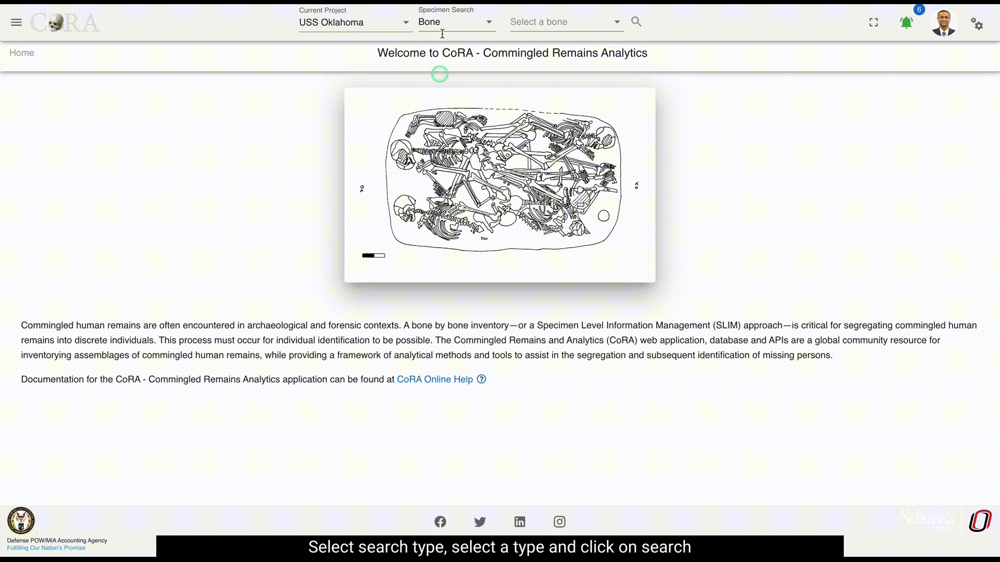
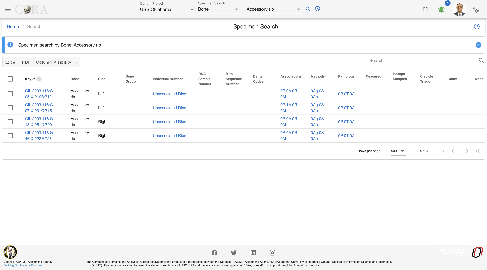

# Search

CoRA provides a powerful search engine allowing you to search any modules such as Specimens, DNA, Isotopes, Dental, Missing Persons.
Each module can be searched using multiple criteria which are related to that module.

## Search History and Favorites
The search capability also comes with a search history and favorites, which allows the user to look at their search history and create favorites from their search history. This allows the user to quick access previous searches they may have done in a project.

{width="400"}

The searched type can be added to favorites. By clicking on the favorites from the history tab.

To delete the favorites history from favorites tab click on delete

## Quick Search
The quick search capability in CoRA is available in the header. It has 3 main components, the project, the search module, search criteria.

### Project Selector
The project selector displays the current project that the user is working on and all searches are done within the context of the currently selected project.
You can change your project anytime you want via the project dropdown by selecting a different project.

### Module Selector
The module or model selector displays the models that the user can search along with the most frequently used criteria for that model.
You can change your model criteria anytime you want via this dropdown.

### Search String/Value
The search string or value is provided by the user by either typing the search string or selecting a value from a the dropdown.
The values in the dropdown will change based on the module selected iby the user. CoRA has a built in `intellisense engine` that will provide
the user with the most appropriate or valid search options for the selected project and module.

!!! tip "Intellisense Engine"

    CoRA has a built in `intellisense engine` that will provide context sensitive information, options and values for the selected project and model.

#### Search by Specimen

The user can search by the below Specimen search options under the Specimen Section in the search dropdown. Below you will see some examples of how to complete searches.

**Specimen Search Options:**

- Bone
- External Specimen ID
- Composite Key
- Accession
- Provenance 1
- Provenance 2
- Designator
- Individual Number
- Tags

{ width="200"}

##### Bone

With the Bone option, an user can search specimens by selecting a bone name. As seen in the image above, user can search for the specimen by the bone names such as Humerus, Tiba etc.
The SE eg Humerus, Tibia, Cranium indicates you are searching for the Skeletal elements either by bone Humerus or Tiba or Cranium etc.
At one time, you can only search for one bone name in this search category.

{ width="400"}

1. Make sure you are on the project you want to search the specimen in.
2. Under the Specimen Search select the 'Bone' option.
3. Then select the bone you would like to search for.
4. Next click on the magnifying glass search icon to show the search results.

Below is the search result obtained from specimen search by bone 'Accessory Rib'.

##### External Specimen ID

With the 'External Specimen ID' option, the user can search specimens by typing in the 'External Specimen ID'. 

{ width="800"}

1. Make sure you are on the project you want to search the specimen in.
2. Under the Specimen Search select the 'External Specimen ID' option.
3. Then enter in the 'External Specimen ID' (e.g. 333.1).
4. Next click on the magnifying glass search icon to show the search results.

Search results by External Specimen ID equal to 333.1.

 

##### Composite key

When searching by composite key, use the comma separator "," to differentiate between accession number, provenance1, provenance2 and designator fields.

 

1. Make sure you are on the project you want to search the specimen in.
2. Under the Specimen Search select the 'Composite key' option.
3. Then enter in the 'Composite key' (includes key of specimen, accession number, provenance1, provenance2, designator, etc, fields).
4. Next click on the magnifying glass search icon to show the search results.

Below is the search result obtained from specimen search by composite key **'CIL 2003-116,G-03,,,712'**.

 

The pattern for the composite search is 'Accession,Provenance1,Provenance2,Designator'. 
If any of fields are not there or if you want to skip some fields, then you can keep the fields empty and use the comma separator.

For example, in the below search criteria, we do not have Provenance 2. So we can lookup for the specimens with accession number, provenance 1 and designator with empty field for provenance 2 with ',' separator.
**CIL 2003-116,,X-219B,712**

 

Similarly, in the screenshot below you can see we have excluded provenance 1 and provenance 2 from our search but have kept the comma separator for them.

 
   
##### Accession

With the Accession option, the user can search specimens by choosing the their Accession number from the drop down menu. A user can search for the specimen from the Accession numbers such as 'CIL 2003-116', 'CIL 2018-337' etc, a drop down list of available accession numbers will appear.At one time, you can only search for one accession number in this search category.

1. Make sure you are on the project you want to search the specimen in.
2. Under the Specimen Search select the 'Accession' option.
3. Then from the drop down select the accession number you would like to search for.
4. Next click on the magnifying glass search icon to show the search results.

Below is the search result obtained from specimen search by Accession number 'CIL 2003-116'.
   

##### Provenance 1
      
With the Provenance 1 option, the user can search specimens by writing their Provenance 1. As seen in the image above, user can search for the specimen by providing the Provenance 1 such as G-21, G-212 etc.
The SE eg G-21 0r G-212 indicates you are searching for the Skeletal elements either by Provenance 1 'G-21' or 'G-212'
At one time, you can only search for one Provenance 1 in this search category.
Below is the search result obtained from specimen search by Provenance 1 'G-57E'.
   
##### Provenance 2
         
With the Provenance 2 option, the user can search specimens by writing their Provenance 2. As seen in the image above, user can search for the specimen by providing the Provenance 2 such as X-1 etc.
The SE eg X-1 0r Trench 3 indicates you are searching for the Skeletal elements either by Provenance 2 'X-1' or 'Trench 3'
At one time, you can only search for one Provenance 2 in this search category.
Below is the search result obtained from specimen search by Provenance 2 'X-299C'.

   
##### Designator
            
With the Designator option, the user can search specimens by writing their Designator. As seen in the image above, user can search for the specimen by providing the Designator such as 201, 602 etc.
The SE eg 201 or 602 indicates you are searching for the Skeletal elements either by Designator '201' or '602'.
At one time, you can only search for one Designator in this search category.

##### Individual Number
               
With the Individual Number option, the user can search specimens by writing their Individual Number. As seen in the image above, user can search for the specimen by providing the Individual Number such as I-01 etc.
While searching for the specimen using individual number, one has to add its Accession number together with the individual.
For example, in order to search for the specimen having I-01 individual number one has to type '2016-235-I-01' or 'CIL 2003-116-I-01'. 
At one time, you can only search for one Individual Number in this search category.

##### Tags
               
With the Tags option, the user can search specimens by their Tag from the dropdown. As seen in the image above, user can search for the specimen by providing the Tag such as "Specimen".

At one time, you can select multiple Tags to search by in this search category.

#### Search by DNA
   
The user can search by the below DNA search options under the DNA Section in the search dropdown. The DNA search options are similar to the Specimen search options. 

**DNA Search Options:**

- Bone
- Composite Key
- Accession
- Provenance 1
- Provenance 2
- Designator
- Sample Number
- Mito Sequence Number
- External Case ID
- External Sample Number
- Tags

{ width="200"}

##### Sample Number

With the Sample Number option, the user can search DNA by their Sample numbers. As seen in the image above, user can search for the DNA by the sample numbers such as 68A or 4619A.
The DNA eg 68A or 4619A indicates you are searching for the DNA either by sample numbers '68A' or '4619A' etc.
At one time, you can only search for one sample number in this search category.

1. Make sure you are on the project you want to search in.
2. Under the DNA Search select the 'Sample Number' option.
3. Then type in the sameple number you would like to search for.
4. Next click on the magnifying glass search icon to show the search results.

Below is the search result obtained from DNA search by sample number '68A'.

 

##### Mito Seq Number
 
With the Mito Seq Number option, the user can search DNA by their Mito Seq Numbers. As seen in the image above, user can search for the DNA by the Mito Seq Number such as 1 or 76.
The DNA eg 1 or 76 indicates you are searching for the DNA either by mito seq numbers '1' or '76' etc.
At one time, you can only search for one mito seq number in this search category.

 

1. Make sure you are on the project you want to search in.
2. Under the DNA Search select the 'Mito Seq Number' option.
3. Then type in the mito seq number you would like to search for.
4. Next click on the magnifying glass search icon to show the search results.
         
Below is the search result obtained from DNA search by mito seq number '76'.

 

##### External Case ID
 
With the External Case ID option, the user can search DNA by their External IDs. As seen in the image above, user can search for the DNA by the External ID such as 2004H201 or 2015HO860.
The DNA eg. AFDIL # like 2004H2001 or 2015HO860 indicates you are searching for the DNA either by external id '2004H2001' or '2015HO860' etc. In order to search for the DNA, you just have to give the external id without the lab name as shown below.

At one time, you can only search for one external case id in this search category.

            
Below is the search result obtained from DNA search by external id '2015H1002'.

 

#### Search by Isotope
   
The user can search by the below Isotope search options under the Isotope Section in the search dropdown. The options are similar to the Specimen and DNA searh options.

**Isotope Search Options:**

- Bone
- Composite Key
- Accession
- Provenance 1
- Provenance 2
- Designator
- Sample Number
- Tags

{ width="200"}

##### Sample Number

With the Sample Number option, the user can search Isotopes by a Sample number. As seen in the image above, user can search for the Isotope by the sample numbers such as 38B.

The Isotope eg 38B indicates the user is searching for the Isotope by sample number.
At one time, the user can only search for one sample number.
   
Below is the search result obtained from DNA search by sample number '38B'.

#### Search by Dental

The user can search by the below Dental search options under the Dental Section in the search dropdown. 

**Dental Search Options:**

- Tooth
- Dental Code

{ width="200"}

##### Tooth
!!! 
      This section is a work in progress

##### Dental Code
!!!
      This section is a work in progress

#### Search by Missing Person

The user can search by the below Missing Person search options under the Missing Person Section in the search dropdown. 

**Missing Person Search Options:**

- Case Manager
- Case Status
- Conflict
- Genealogy Status
- First Name
- Last Name

{ width="200"}

##### Case Manager

With the Case Manager option, the user can select different case managers associated under the project and click on the search button will display missing person details under that selected case manager.

{ width="400"}

1. Make sure you are on the project you want to search the missing person in.
2. Under the Missing Person Search select the 'Case Manager' option.
3. Then from the drop down select the name of the case manager you would like to search for.
4. Next click on the magnifying glass search icon to show the search results.

Below displays missing person details assigned for case manager named as **Mr. Charlie Johnson**

##### Case Status

With the Case Status option, the user can select different case status associated under the project and click on the search button will display missing person details under that selected case status.

{ width="400"}

1. Make sure you are on the project you want to search the missing person in.
2. Under the Missing Person Search select the 'Case Status' option.
3. Then from the drop down select the case status you would like to search for.
4. Next click on the magnifying glass search icon to show the search results.

Below displays missing person details whose case status is **completed**.

##### Conflict

With the Conflict option, the user can select different Conflict associated under the project and click on the search button will display missing person details under that selected conflict.

{ width="400"}

1. Make sure you are on the project you want to search the missing person in.
2. Under the Missing Person Search select the 'Conflict' option.
3. Then from the drop down select the conflict you would like to search for.
4. Next click on the magnifying glass search icon to show the search results.

Below displays missing person details assigned to conflict named **World War I**.

##### Genealogy Status

With the Genealogy Status option, the user can select different Genealogy status associated under the project and click on the search button will display missing person details under that selected genealogy status.

{ width="400"}

1. Make sure you are on the project you want to search the missing person in.
2. Under the Missing Person Search select the 'Genealogy Status' option.
3. Then from the drop down select the genealogy status you would like to search for.
4. Next click on the magnifying glass search icon to show the search results.

Below displays missing person details of genealogy status as **requested**.

##### First and Last Name

With the First/Last Name option, the user can search for different case numbers associated with the given first/last name under a project and click on the search icon will display missing person details for that selected first/last name.

{ width="400"}

1. Make sure you are on the project you want to search the missing person in.
2. Under the Missing Person Search select the 'First or Last Name' option.
3. Then type in the first or last name you would like to search for.
4. Next click on the magnifying glass search icon to show the search results.

Below displays missing person details of first name as **Charlie**

#### Search by Individuals

The user can search by the below Individuals search options under the Individuals Section in the search dropdown. 

**Individuals Search Options:**

- Individual Number
- Identification Date
- Remains Status
- Remains Release Date

{ width="200"}

##### Indentification Date

With the Indentification Date option, the user can search for a range of indentification dates under a project.

1. Make sure you are on the project you want to search the missing person in.
2. Under the Individual Search select the 'Identification Date' option.
3. Then select or type in the start and end dates you would like to search for.
4. Next click on the magnifying glass search icon to show the search results.

Below displays the individuals that have an indentification date range of **11/01/2017 - 11/30/2017**.

##### Remains Status

With the Remains Status option, the user can search for a remains status under a project.

1. Make sure you are on the project you want to search the missing person in.
2. Under the Individual Search select the 'Remains Status' option.
3. Then select the remains status you would like to search for.
4. Next click on the magnifying glass search icon to show the search results.

Below displays the individuals that have a remains status of **In Lab**.

### Search Options

**Max Search Limit 500**

The server renders all results queried from the project search bar request, allowing the user to paginate and search through the entire response. Limitations with this search options, include longer response times or application overload for projects with large sets of data.

Each tab will generate a new call to the server and retrieve the next set of data. This search option is ideal for project with larger sets of data. Search result filter is not available with this option.

## Advanced Search & Reporting

Along with the quick search capability CoRA also provides an advanced search and reporting capability via the reports dashboard feature.
The reports dashboard has many reports and each report provides the ability to search using multiple search criteria. See the documentation
on the [reports dashboard](../reports/project-reports.md)  
