# Search Skeletal Elements

##### Skeletal Element Search

The easiest way to search for skeletal elements is to use the top search bar in the nav bar. To complete a search, first select the project you wish to search on the left-most select field, you will only be able to view projects which are assigned to your user profile. 

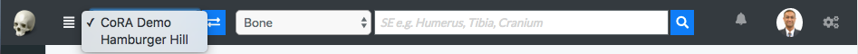

By default, "Bone" is selected as the search option. Select the desired search category before typing your search text into the search bar. Then click the magnifying glass to execute your search.

Once you complete your search, you are taken to the skeletal elements search screen. The following Bone elements are displayed all the skeletal elements search screen:

- Key
- Bone
- Side
- Bone Group
- Measured
- DNA Sampled
- Isotope Sampled
- Clavicle Triage
- CT Scanned
- Xray Scanned
- Created By
- Reviewed By

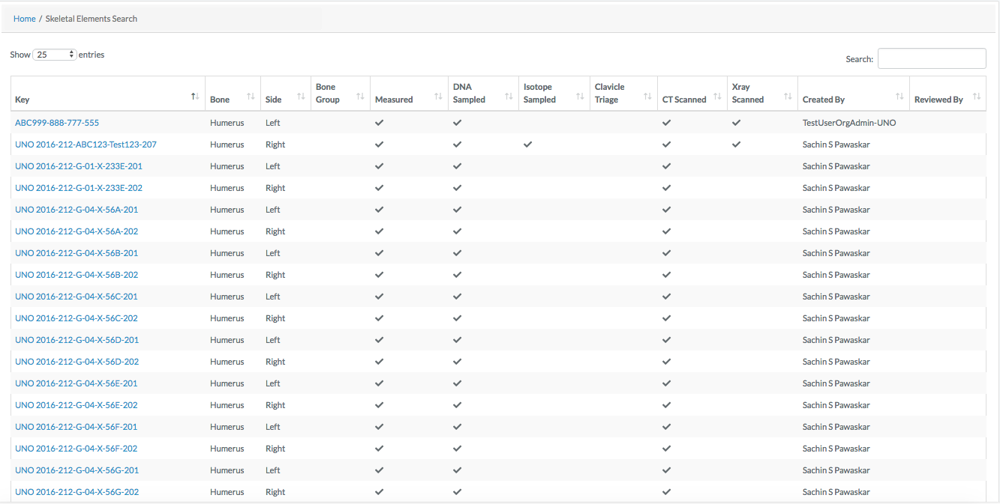

On this page you can filter how many results are shown per page, as well as search the results.

The search function in the top right of the page searches all strings in all cells of the table. Strings are search in a substring manner - for instance the above if you search "56B", 2 rows will be returned that contain the substring "56B". 

The view the details of a skeletal elements, click on the key in the search results.

##### Skeletal Element Detail View
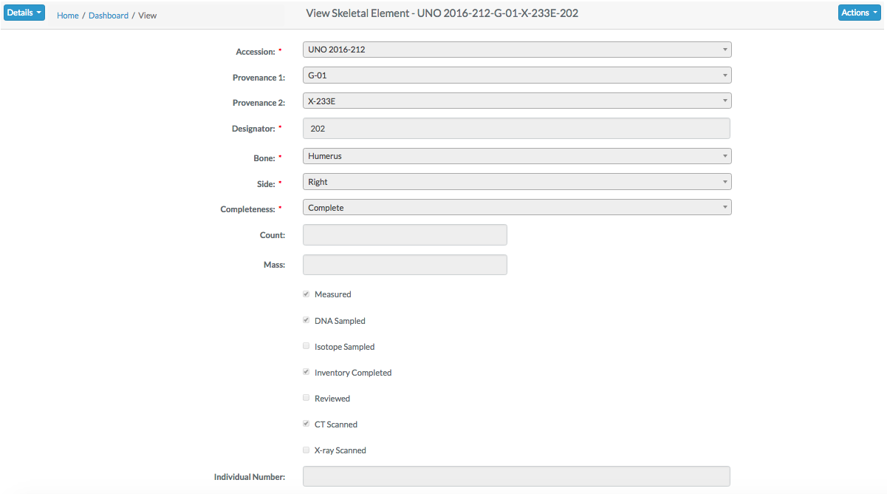
 
 The skeletal elements detail view consists of the same fields when a new skeletal element is created:
 
 - Accession
 - Provenance Number 1
 - Provenance Number 2
 - Designator
 - Bone
 - Side
 - Completeness
 - Count
 - Mass
 - Status of the bone, including:
   - Measured Status
   - DNA Sampled Status
   - CT Scanned Status
   - Xray Scanned Status
   - Clavicle Triage Status
   - Inventory Completed Status
   - Reviewed Status
 - Individual Number
 - Consolidated Accession Number

If you have correct permissions, you can click in actions button in the top left to either edit the skeletal element, or create a new one. (See Creating Skeletal Elements)

### Skeletal Element Details  
When you are view the details of a skeletal element, you can click "Details" in the top left to select a skeletal element detail drilldown. Each of these selections will be described in detail.  
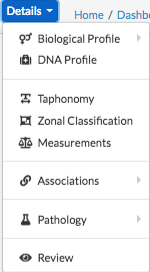

##### Biological Profile

There are 4 Biological Profile subcategories. 

##### Age

The biological profile age search is broken down in the "Element Highlights" and "Methods" sections. The element highlights section is read only and displays the following information about the selected bone:
- Bone
- Side
- Completeness
- Status of the bone, including:
   - Measured Status
   - DNA Sampled Status
   - Inventory Completed Status
   - Reviewed Status
 
The "Methods" section of the pane displays the age of the bone by chosen method. This requires that you have selected a method from the "Applicable Methods" select box. If no age is present, select the desired method in the "Applicable Methods" select box and click "Create". You will be taken to the Create Age Method page.

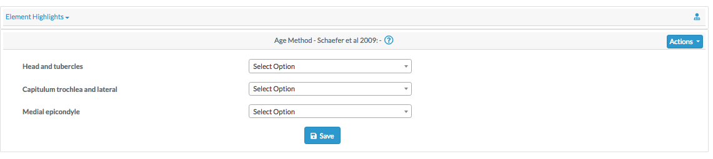

Fill in the desired fields for your selected Bone Age Method and click "Save". When you return to the Bone Age page you will see the age of the bone in the selected method.

##### Sex

The biological profile sex search is broken down in the "Element Highlights" and "Methods" sections. The element highlights section is read only and displays the following information about the selected bone:
- Bone
- Side
- Completeness
- Status of the bone, including:
   - Measured Status
   - DNA Sampled Status
   - Inventory Completed Status
   - Reviewed Status
 
 If no bone sex table is present under the "Methods" tab - click on "Create" after choosing the Desired sex method from the "Applicable Method" dropdown. You will be taken to the "Create Method" screen.
 

Select the desired options, and click "Save". You will be taken back to the Sex Biological Profile screen with the chosen method appearing in the "Methods" dropdown.

##### Stature

The biological profile stature search is broken down in the "Element Highlights" and "Methods" sections. The element highlights section is read only and displays the following information about the selected bone:
- Bone
- Side
- Completeness
- Status of the bone, including:
   - Measured Status
   - DNA Sampled Status
   - Inventory Completed Status
   - Reviewed Status

The bone stature detail shows the stature detail of the chosen bone. You must select a stature method for a stature to appear in the "Methods" tab.

##### Ancestry

The biological profile ancestry search is broken down in the "Element Highlights" and "Methods" sections. The element highlights section is read only and displays the following information about the selected bone:
- Bone
- Side
- Completeness
- Status of the bone, including:
   - Measured Status
   - DNA Sampled Status
   - Inventory Completed Status
   - Reviewed Status

The bone ancestry detail shows the stature detail of the chosen bone. You must select a stature method for a stature to appear in the "Methods" tab.

##### DNA Profile
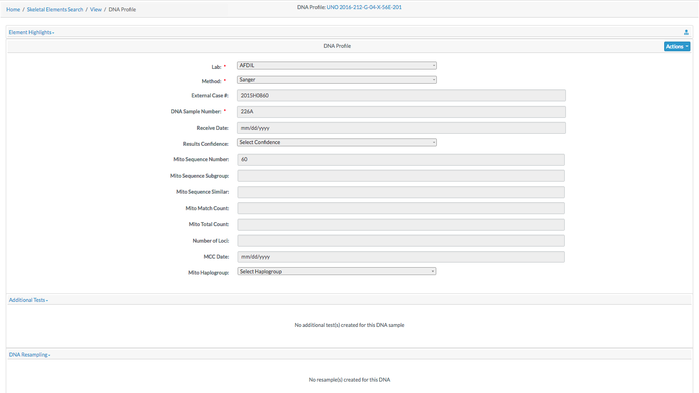

The DNA Profile screen displays the following elements about a bone:

- Lab
- Method
- External Case #
- DNA Sample Number
- Receive Date
- Results Confidence
- Mito Sequence Number
- Mito Sequence Subgroup
- Mito Sequence Similar
- Mito Match Count
- Mito Total Count
- Number of Loci
- MCC Date
- Mito Haplogroup

On this screen, you can also view the "Additional Test" and "DNA Resampling" tabs.

##### Taphonomy

The taphonomy search is broken down in the "Element Highlights" and "Taphonomies" sections. The element highlights section is read only and displays the following information about the selected bone:
- Bone
- Side
- Completeness
- Status of the bone, including:
   - Measured Status
   - DNA Sampled Status
   - Inventory Completed Status
   - Reviewed Status

The Taphonomies section allows you to view Taphonomies for the given bone. To add Taphonomies, click the "Actions" button and then "Edit". 

After you click "Save" you will be taken to the Taphonomies 
##### Zonal Classification

The zonal search is broken down in the "Element Highlights" and "Zones" sections. The element highlights section is read only and displays the following information about the selected bone:

- Bone
- Side
- Completeness
- Status of the bone, including:
   - Measured Status
   - DNA Sampled Status
   - Inventory Completed Status
   - Reviewed Status
   
The Zones pane displays the following information about the bone:

- Lateral half of radial head
- Medial half of radial head
- Lateral portion of distal articulation
- Medial portion of distal articulation
- Proximal diaphysis
- Lateral half of diaphysis
- Medial half of diaphysis
- Superior half of distal third
- Lateral distal third
- Medial distal third
- Styloid process

These fields are read only - to edit then click "Actions" - then "Edit".
When you are finished making changes click save on the bottom of the page.

##### Measurements

The measurement search is broken down in the "Element Highlights" and "Measurements" sections. The element highlights section is read only and displays the following information about the selected bone:

- Bone
- Side
- Completeness
- Status of the bone, including:
   - Measured Status
   - DNA Sampled Status
   - Inventory Completed Status
   - Reviewed Status
  
  The measurements pane display the following measurements for a given bone:
- Rad_01 Maximum Length
- Rad_02 Maximum Diameter of the Radius at Midshaft
- Rad_03 Minimum Diameter of the Radius at Midshaft
- Rad_04 Maximum Diameter of the Head
- Rad_05 Anterior-Posterior (Sagittal) Diameter at Midshaft
- Rad_06 Medial-Lateral (Transverse) Diameter at Midshaft
- Rad_07 Maximum Diameter at the Radial Tuberosity
- Rad_08 Maximum Diameter of the Diaphysis Distal to the Radial Tuberosity
- Rad_09 Minimum Diameter of the Diaphysis Distal to the Radial Tuberosity
- Rad_10 Breadth of the Distal Epiphysis
  
  These fields are read only - to edit then click "Actions" - then "Edit".
  When you are finished making changes click save on the bottom of the page.

### Associations   
##### Articulations

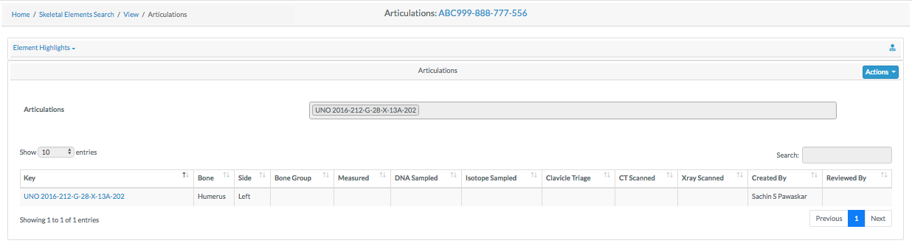

The Articulations search is broken down in the "Element Highlights" and "Articulations" sections. The element highlights section is read only and displays the following information about the selected bone:

- Bone
- Side
- Completeness
- Status of the bone, including:
   - Measured Status
   - DNA Sampled Status
   - Inventory Completed Status
   - Reviewed Status
  
  The articulations section is read-only, and shows articulation information for a given bone. To make edits to go "Actions" "Edit". Click Save when finished adding articulation to be returned to the articulations page.
  
##### Pair Matching

The Pair Matching search is broken down in the "Element Highlights" and "Pair Matches" sections. The element highlights section is read only and displays the following information about the selected bone:

- Bone
- Side
- Completeness
- Status of the bone, including:
   - Measured Status
   - DNA Sampled Status
   - Inventory Completed Status
   - Reviewed Status
  
  The Pair Matching section is read-only, and shows Pair Matches information for a given bone. To make edits to go "Actions" "Edit". Click Save when finished adding pair matches to be returned to the Pair Matching page.
  
##### Refits
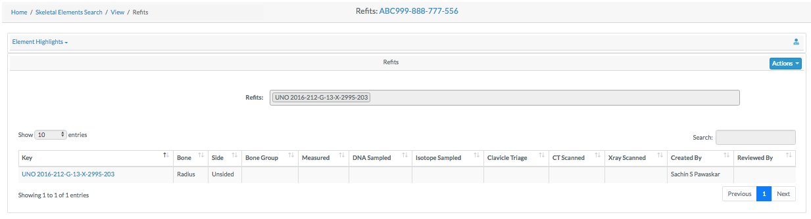

The Refits search is broken down in the "Element Highlights" and "Refits" sections. The element highlights section is read only and displays the following information about the selected bone:

- Bone
- Side
- Completeness
- Status of the bone, including:
   - Measured Status
   - DNA Sampled Status
   - Inventory Completed Status
   - Reviewed Status
  
  The Refits section is read-only, and shows Refits information for a given bone. To make edits to go "Actions" "Edit". Click Save when finished adding Refits to be returned to the Refits page.
### Pathology   

##### Trauma
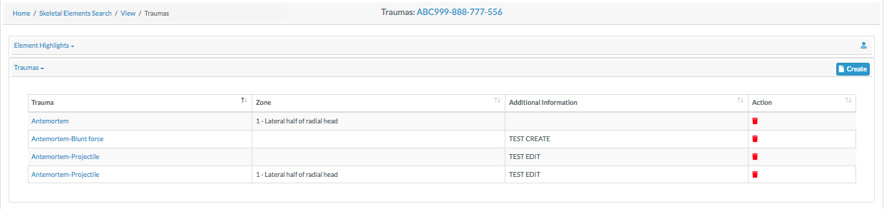
The Trauma search is broken down in the "Element Highlights" and "Trauma" sections. The element highlights section is read only and displays the following information about the selected bone:

- Bone
- Side
- Completeness
- Status of the bone, including:
   - Measured Status
   - DNA Sampled Status
   - Inventory Completed Status
   - Reviewed Status
  
The Trauma section is read-only, and shows Trauma information for a given bone. To make edits to go "Create". 

Click Save when finished adding Trauma to be returned to the Trauma page.

##### Pathology

The Pathology search is broken down in the "Element Highlights" and "Pathology" sections. The element highlights section is read only and displays the following information about the selected bone:

- Bone
- Side
- Completeness
- Status of the bone, including:
   - Measured Status
   - DNA Sampled Status
   - Inventory Completed Status
   - Reviewed Status
  
The Pathology section is read-only, and shows Pathology information for a given bone. To make edits to go "Actions" "Edit". 

Click Save when finished adding Trauma to be returned to the Trauma page.

##### Anomaly
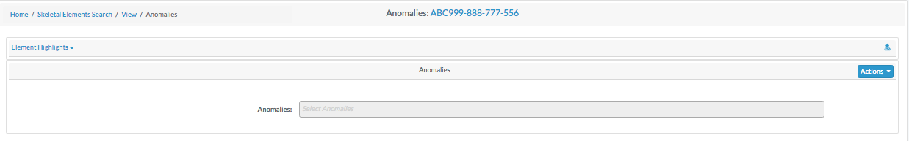
The Anomaly search is broken down in the "Element Highlights" and "Anomaly" sections. The element highlights section is read only and displays the following information about the selected bone:

- Bone
- Side
- Completeness
- Status of the bone, including:
   - Measured Status
   - DNA Sampled Status
   - Inventory Completed Status
   - Reviewed Status
  
The Anomaly section is read-only, and shows Anomaly information for a given bone. To make edits to go "Actions" "Edit". 
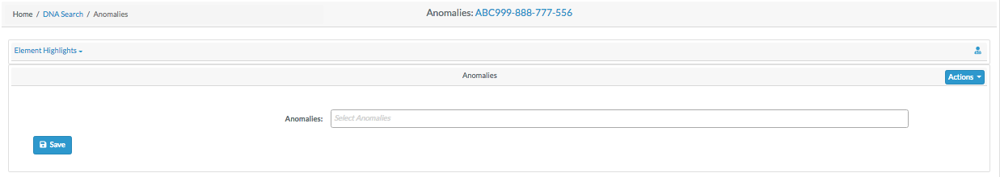
Click Save when finished adding Anomalies to be returned to the Anomaly page.

### Review

The review tab is a pane which displays all other sub reports in one area. All reports are editable in the pane.
For information on individual reports - see their detailed documentation in this document.

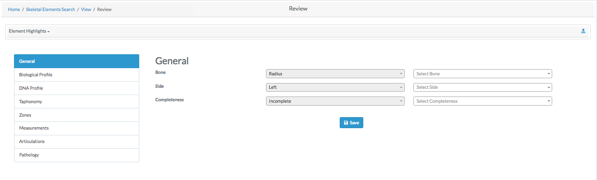

