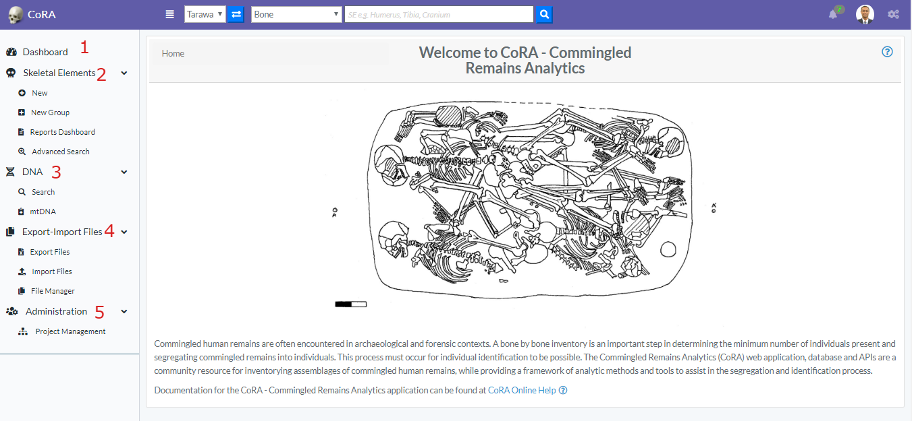

In this section we present the basic site navigation. This section provides you with the screenshots of the site and what the icons and symbols mean.
The CoRA web application consists of the four basic components. These are-

  1. Top Navigation Bar (1)
  2. Left Side Bar (2)
  3. Right Side Bar (3)
  4. Application Container (4)

   
   
   
* ## Top Navigation Bar -
     The navigation bar consists of the CoRA icon, toggle the left sidebar button, project switcher dropdown, advance search bar, the notifications icon, user profile avatar, and the right sidebar button.
       
   
   
   1. CoRA (1) - The CoRA icon take the user to the home page of the site.
   2. Toggle the Left Side bar (2) - The Toggle button opens and close the left sidebar.
   3. Project Switcher (3) - The Project switcher button allows the user to select the different projects the user is a part of.
   4. Advance Search bar (4) - The Advance search bar allows the user to search the Skeletal Elements and DNA. The user can search the Skeletal Elements by - Bone, Composite key, Accession Number, Provenance 1, Provenace 2, Designator, External ID, Individual Number.
          The DNA can be searched by the Bone, Composite Number, Accession, Sample Number, Mito seq Number, Haplogroup, External Id, Individual Number.                            
   5. Search Input (5) - Once the search type is selected the user can enter the value in the search input.
   6. Notification Icon (6) - The Notification icon show the notifications of the Export file, Import file, job completion and other user specific notification.
   7. User Avatar (7) - The user avatar shows the user drop down. The user drop down has User Image, User Name and Role (1), the github CoRA docs (2), CoRA Forum (3), change password link (4), the CoRA-Docs (5), the About (6), the My Profile button (7) and the Logout button (9). The Org Profile button will only be available to the Org admin in which the Org Admin can change the settings of the project.    
         
     The header (1) shows the User Image, User Name, email and Role. Github CoRA docs (2) opens the github repo on which the user can check the documentation code. CoRA Forum (3) allows the user to leave comments and other related information about the cora eco system. 
     The change password link (4) allows the user to change the current password. Online help (5) opens the online help documentation of the CoRA web application, it includes the user manual and other important docs.
     The About (6) displays the meta data of the application and the browser.
     The My Profile button (7) open the user profile page in which the user can save the settings of their choice.
     The Logout button (9) logs out the user out of CoRA Web Application.
        
   8. Right Sidebar Toggle Button (8) - The Right sidebar buttons toggles between the open and closed state of right sidebar.  
   
   
* ## Left Side Bar - 
     The left side bar includes the various modules of the CoRA web application that the user can select. The left side bar will have modules according to the role of the user. The following section shows the left side bar for Anthropologist-
   
    
         
   1. The Dashboard icon (1) takes the user to the dashboard based on the user-role. If the user is Anthropologist then the Anthropologist dashboard will open and if the user iss Org-Admin the Org-Admin Dashboard will open.
     The dashboard page contains data visualization of the skeletal elements data and dna module. 
     The data visualization has pie charts, bar charts, stacked bar charts and other visualization
     The view details button on each visualization shows the data associated with that visualization.
     
   2. The Skeletal Elements icon (2) open the skeletal elements module features like New Skeletal Elements, New Bone Group, Skeletal Elements Reports. The New Skeletal Elements opens the page to add the new skeletal element. The New Bone Group opens the page that allows the user to add new skeletal element bone group.
        The Reports dashboard opens the reports dashboard page which allows the user to generate the reports based on the skeletal elements details.
        
     3. The DNA icon (3) open the DNA features like Search the skeletal element by DNA and Mitochondrial DNA - Advanced Report page. 
        
     4. The Export-Import Files (4) open the drop down for the user to show the export and import features. The Export Files icon opens the export page that allows the user to select from various export options.
        The Import files icon opens the import page which allows the user to import the files in the database.
        The File Manager Icon opens the file manager page which allows the user to choose from various files that can be exported and view details of the files.
        
     5. The Administration icon (5) opens the administration drop down which includes the Project Management icon. The Project Management icon opens the project page.
    
    The Left side bar for the Org Admin includes-
        
      
        
     1. The Dashboard icon (1) takes the user to the dashboard based on the user-role. If the user is Anthropologist then the Anthropologist dashboard will open and if the user iss Org-Admin the Org-Admin Dashboard will open.
             The dashboard page contains data visualization of the skeletal elements data and dna module. 
             The data visualization has pie charts, bar charts, stacked bar charts and other visualization
             The view details button on each visualization shows the data associated with that visualization.
             
     2. The Skeletal Elements icon (2) open the skeletal elements module features like New Skeletal Elements, New Bone Group, Skeletal Elements Reports. The New Skeletal Elements opens the page to add the new skeletal element. The New Bone Group opens the page that allows the user to add new skeletal element bone group.
                The Reports dashboard opens the reports dashboard page which allows the user to generate the reports based on the skeletal elements details.
                
     3. The DNA icon (3) open the DNA features like Search the skeletal element by DNA and Mitochondrial DNA - Advanced Report page. 
                
     4. The Export-Import Files (4) open the drop down for the user to show the export and import features. The Export Files icon opens the export page that allows the user to select from various export options.
                The Import files icon opens the import page which allows the user to import the files in the database.
                The File Manager Icon opens the file manager page which allows the user to choose from various files that can be exported and view details of the files.
                
     5. The Administration icon (5) opens the administration drop down which includes the User Management icon, Project Management icon, Accession Management, and Instrument Management icon.
         The user Management icon opens the user page and allows to manage the user associated with the project. The Project Management icon opens the project page. The Accession Management icon opens the Accession associated with the Project in which the Org Admin can view all the accessions, can create and edit the Accession. 
         The Instrument Management icon open the Instrument page in which the Org Admin can view all the instrument associated with the project, can create and edit the instrument.
            
        
   *  ## Right Side Bar -    
       The Right side bar includes the 5 different tabs and each of the tabs includes the user specific settings. The following are the tabs in the right side bar -
         
         
         * (1) Layout and Skin Tab
         * (2) Media Tab
         * (3) Help Tab
         * (4) Activity Feed Tab
         * (5) General Settings Tab
     
   1. Layout and Skin Tab (1) - The Layout tab includes the Layout Option (2) and Skins (3).        
      
      
      The Layout Options (2) allows the user to make changes in the layout of the app. The following are the description of the options in layout-
      
      
      
      1. Toggle Side Bar (1)- The Toggle Sidebar checkbox open and close the left sidebar. If checked the left side bar will open and if unchecked the left sidebar will be closed.
      2. Left Sidebar Expand on Hover (2)- This option allows the user to allow the user to show the left sidebar menu on mouseover.
      3. Toggle Right Sidebar Slide (3)- This options allows the app container to move left. It allows the user to work simultaneously on right side bar tabs and the main app content.
      4. Toggle Right Sidebar Skin (4)- This options allows the user to toggle between the light and dark background theme on right side bar.
      
      
      
      The Skins option allows the user to select between the dark theme (1), light theme (4) and the custom theme(3) color. The default theme (1) is standard theme. The dark theme color changes the top navigation bar color. The light theme changes the top navigation
      color and the left side bar theme color to light. The custom theme color picker allows the user to pick the color from the custom theme color selector.
   
   2. Media Tab - The media tab allows the user to watch the videos and view the Images.   
       
           
   The Video (1) allows the user to play the video. The Image (2) shows the slide show of the images present in the gallery. The image can be clicked to open a pop-up modal to show the selected image in center of the screen.
   
   3. Help Tab - The Help tab allows the user to access the CoRA-Docs inside the right side bar.
      
          
   The documentation of the CoRA application along with the user manual can be found in this tab. The Menu button (1) can be clicked to select the different sections of the documentation.
   
   4. Activity Feed - The Activity feed tab shows the 10 recent Skeletal Elements and DNA created and updated by the user.
       
               
   The key can be of the skeletal element can be clicked which takes the user to the selected skeletal element so, that the user can easily access the recently added skeletal elements and update it if needed. This activity feed can also be found in user profile under the activity feed tab.
   
   5. General Tab - The General Tab allows the user to customize the user settings. 
   
      
       
   
   The Lines per page (1) allows the user to select the number of rows to be display for views with table. The user can set this value from the user profile as well.
   
   The Skeletal Element setting (2) allows the user to set the Accession Number, Provenance 1 and Provenance 2. This value will auto fill the value whenever new skeletal element is created.
  
   The DNA Profile settings (3) in the Gerenal tab allows the user to update the default laboratory and Default DNA Method. Once the user enter the value it will auto-populate the DNA association screen for Skeletal Elements.
   
   
   * ## Application Container - 
       The Application container is the main area which includes all the CoRA-Modules.
        
       
        
       The Application container has Breadcrumbs (1) on the top left which shows on which page the user is currently working on. It helps the user to go back to the last page.
        
       The Title of the page (2) the user is working on.
        
       The Action button group (3). This button may or may not be present based on the page the user is working on. If the page has no action this button will not be present.
        
   
