# Site Navigation

In this section we present the basic site navigation. This section provides you with the screenshots of the site and what the icons and symbols mean. The CoRA web application consists of the five basic site navigation layout components.

1. Header/Top Navigation
2. Left Side Drawer 
3. Right Side Drawer 
4. Application Container
5. Footer
6. Project Dashboard

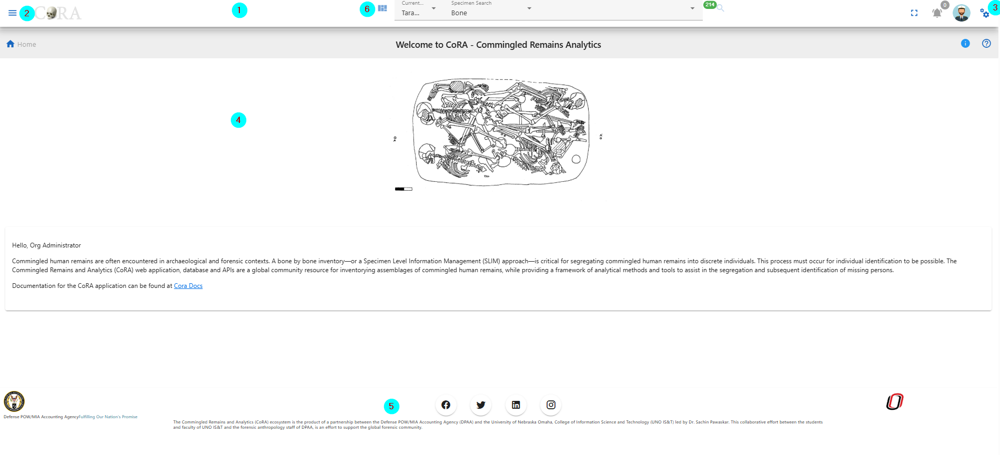{ width="800"}

## Header

### Components
The navigation bar consists of the CoRA icon, toggle the left sidebar button, project switcher dropdown, advance search bar, the notifications icon, user profile avatar, and the right sidebar button.
       
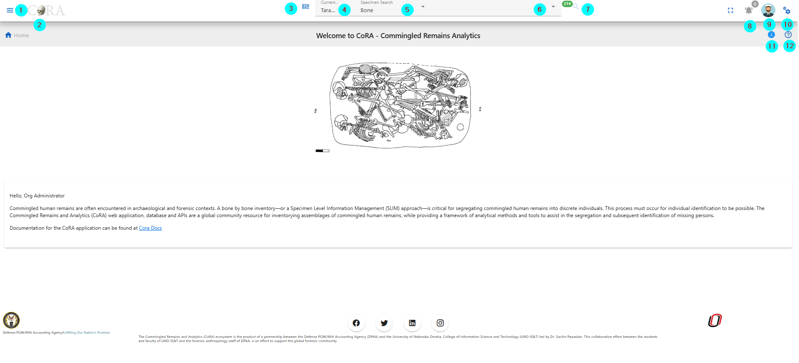{ width="800"}

1. CoRA (1) - The CoRA icon take the user to the home page of the site.
2. Toggle the Left Side bar (2) - The Toggle button opens and close the left sidebar.
3. Project Dashboard (3) - This takes you to the project dashboard page.
4. Project Switcher (4) - The Project switcher button allows the user to select the different projects the user is a part of.
5. Advance Search bar (5) - The Advance search bar allows the user to search the Skeletal Elements,DNA, Dental, Missing Person, Isotope and Individual Number. The user can search the Skeletal Element by - Bone, Composite key, Accession, Provenance 1, Provenace 2, Designator, External ID, Individual Number. The DNA can be searched by the Bone, Composite Key, Accession, Sample Number, Mito seq Number, Haplogroup, External Id, Individual Number. The Isotope can be searched  by Bone, Composite key, Accession, Provenance 1, Provenace 2, Designator, External ID, Individual Number. The Dental can be searched by Tooth and Dental Code. The Missing Person can be searched by Case manager, Case Status, Conflict, Genealogy status, First Name, Last Name. The Individual can be searched by Individual Number.                    
6. Search Input (6) - Once the search type is selected the user can enter the value in the search input.
7. Then click on the search icon, to go to the search page.
8. Notification Icon (8) - The Notification icon show the notifications of the Export file, Import file, job completion and other user specific notification.
9. User Avatar (9) - The user avatar shows the user drop down. The user drop down has User Image, User Name and Role (1), the github CoRA docs (2), CoRA Forum (3), CoRA Slack (4), change password link (5), the CoRA-Docs (6), the About (7), the My Profile button (8), Org Profile button (9) and the Logout button (10). The Org Profile button will only be available to the Org admin in which the Org Admin can change the settings of the project.    
   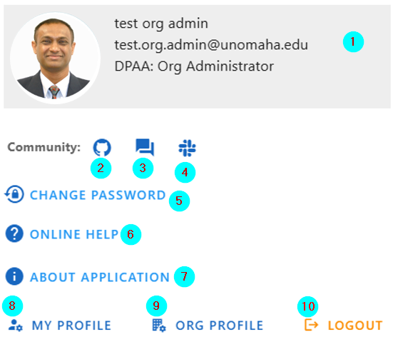{ width="500"}    
   *The header (1) shows the User Image, User Name, email and Role. Github CoRA docs (2) opens the github repo on which the user can check the documentation code. CoRA Forum (3) allows the user to leave comments and other related information about the cora eco system. CoRA Slack (4) allows users and developers to communicate and have private group discussion. The change password link (5) allows the user to change the current password. Online help (6) opens the online help documentation of the CoRA web application, it includes the user manual and other important docs. The About (7) displays the meta data of the application, the browser and the ability to clear the application cache. The My Profile button (8) open the user profile page in which the user can save the settings of their choice. The Org Progile button (9) shows information about the org. The Logout button (10) logs out the user out of CoRA Web Application.*
   &nbsp;
10. Right Sidebar Toggle Button (10) - The Right sidebar buttons toggles between the open and closed state of right sidebar. 
11. Info tip for page the user is on.
12. Help page for the page the user is on. 

### Search Capability

As a user you can search by the main categories listed below. Once an option and criteria are selected, the user can then click the search function (magnifyinging glass icon). The user will then be taken to the correct results page with detialed information, or the page will display 'No Data' if their search didn't bring back any information. 

**Search Categories:**

- Specimen
- DNA
- Isotope
- Dental
- Missing Person
- Individuals 

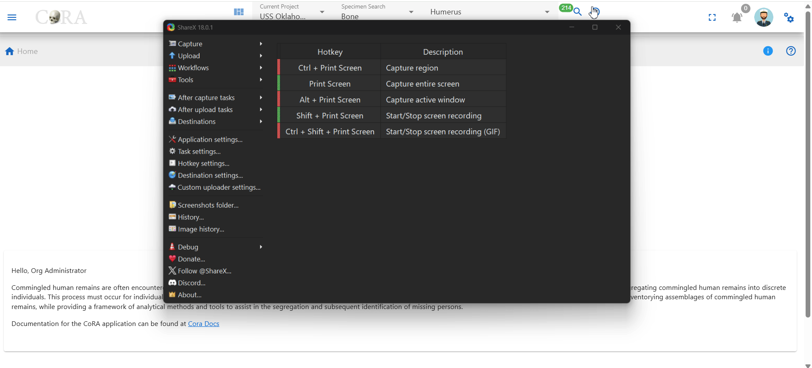

!!! Tip The search results will only show data for the project the user currently has selected. All search results are limited to the user permissions to view or access the data.

For more information on search [Search User Guide](https://docs.coracore.org/en/latest/user-guide/search/)

## Left Side Drawer

### Module Navigaion Menu

The left side bar includes the various modules of the CoRA web application that the user can select. The left side bar will have modules according to the role of the user. The following section shows the left side bar, each menu section is driven by role permissions.
   
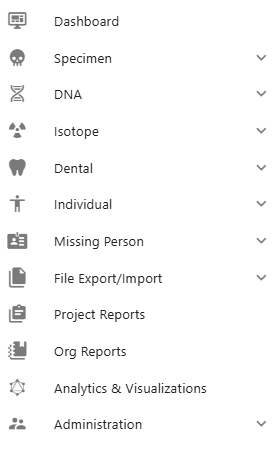 
      
1. The Dashboard icon takes the user to the dashboard based on the user-role. If the user is Anthropologist then the Anthropologist dashboard will open and if the user iss Org-Admin the Org-Admin Dashboard will open.
   The dashboard page contains data visualization of the specimens data and dna module. 
   The data visualization has pie charts, bar charts, stacked bar charts and other visualization
   The view details button on each visualization shows the data associated with that visualization.
   
2. The Specimen icon open the specimen elements module features like New Specimen Elements, New Bone Group, Skeletal Elements Reports. The New Skeletal Elements opens the page to add the new skeletal element. The New Bone Group opens the page that allows the user to add new skeletal element bone group.
   The Reports dashboard opens the reports dashboard page which allows the user to generate the reports based on the skeletal elements details.
      
3. The DNA icon opens the DNA features like Search the specimen element by DNA and Mitochondrial DNA - Advanced Report page. 
4. The Isotope icon opens up the Isotope features like view isotopes, isotope batches, create a new isotope batch and the isotope dashboard.
5. The Dental icon opens the Dental features like create a new dental specimen, by new tooth, multiple via bone group and multiple via dental chart and view by missining person comparison report. 
6. The Individual icon opens up the Individual features like view by individual management report, and view the individual analytic dashbaord.
7. The Missing Person icon opens up the Missing Person features like advance reporting, and Missing Person dashboard.
8. The File Export/Import icon opens up the File Export/Import features like file export, file import, and file manager.
9. The Project Reports icon opens up the Project Reports for the project you are currently viewing.
10. The Org Reports icon opens up the Org Reports for the org you are currently viewing.
11. The Analytics & Visualizations icon opens up the Analytics & Visualizations dashboard with visualizations and analytics.
12. The Administration icon opens up the Administration features for the role of the user.
          
## Right Side Drawer

The Right side bar includes the 4 different sections and each of the section includes the user specific settings. The following are the sections in the right side bar.

 1. Layout Options 
 2. Help
 3. Activity Feed
 4. General Settings  

   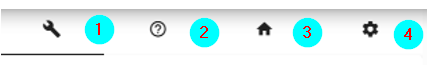
 
### Layout Options  
   
Layout Options Section  includes the Scheme(1), Drawer(2) and Footer (3).      
  
  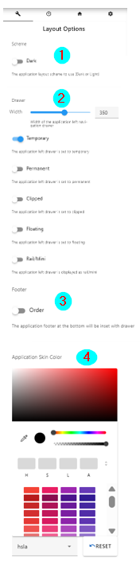{ width="250"}

The Scheme option allows the user to select between the dark theme or light theme. The default theme is light theme. The dark theme color changes the top navigation bar color. The light theme changes the top navigation
color and the left side bar theme color to light.

The Layout Options (2) allows the user to make changes in the layout of the app. The following are the description of the options in layout-

   Toggle Side Bar (1)- The Toggle Sidebar checkbox open and close the left sidebar. If checked the left side bar will open and if unchecked the left sidebar will be closed.
   Left Sidebar Expand on Hover (2)- This option allows the user to allow the user to show the left sidebar menu on mouseover.
   Toggle Right Sidebar Slide (3)- This options allows the app container to move left. It allows the user to work simultaneously on right side bar tabs and the main app content.
   Toggle Right Sidebar Skin (4)- This options allows the user to toggle between the light and dark background theme on right side bar.

### Help
   
Help section (2) - The Help section allows the user to access the CoRA-Docs inside the right side bar.

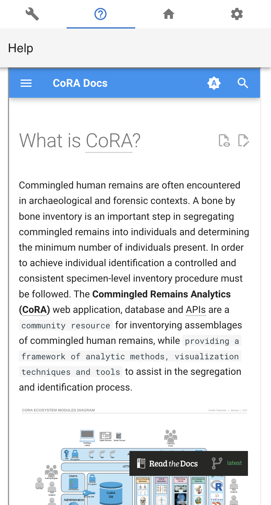{ width="300"}    
The documentation of the CoRA application along with the user manual can be found in this tab. The Menu button can be clicked to select the different sections of the documentation.
   
### Activity Feed

The Activity feed section shows the 10 recent Skeletal Elements and DNA created and updated by the user.
       
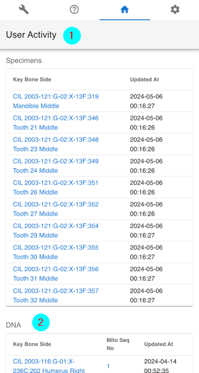  
&nbsp;
      
The key can be of the skeletal element can be clicked which takes the user to the selected skeletal element so, that the user can easily access the recently added skeletal elements and update it if needed. This activity feed can also be found in user profile under the activity feed tab.
   
### General

The General section allows the user to customize the user settings. 
   
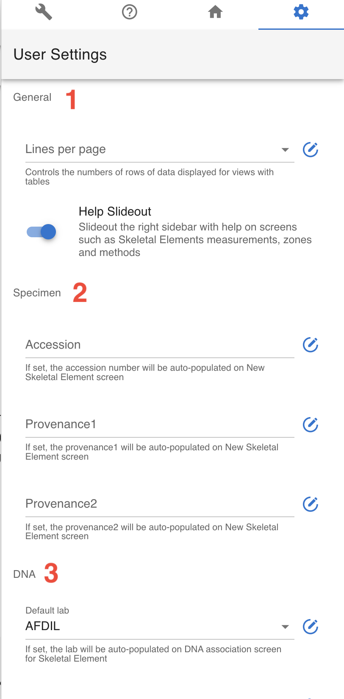
   
The Lines per page (1) allows the user to select the number of rows to be display for views with table. The user can set this value from the user profile as well.

The Skeletal Element setting (2) allows the user to set the Accession Number, Provenance 1 and Provenance 2. This value will auto fill the value whenever new skeletal element is created.

The DNA Profile settings (3) in the Gerenal tab allows the user to update the default laboratory and Default DNA Method. Once the user enter the value it will auto-populate the DNA association screen for Skeletal Elements.
   
   
## Application Container

The Application container is the main area which includes all the CoRA-Modules.

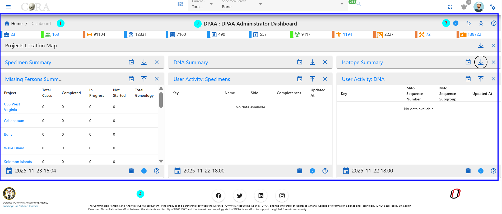

### Breadcrumbs
The Application container has Breadcrumbs (1) on the top left which shows on which page the user is currently working on. It helps the user to go back to the last page.
      
### Page title
The Title of the page (2) the user is working on.
      
### Action button group
The Action button group (3). This button may or may not be present based on the page the user is working on. If the page has no action this button will not be present.
        
### Footer
The footer (4) consists of the logos and product information
