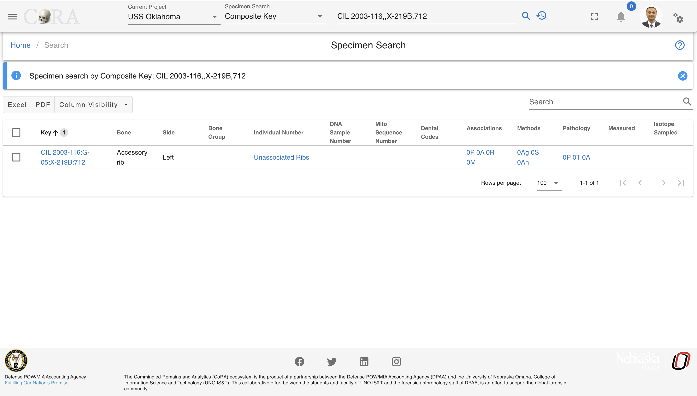

# Site Navigation

In this section we present the basic site navigation. This section provides you with the screenshots of the site and what the icons and symbols mean. The CoRA web application consists of the five basic site navigation layout components.

1. Header/Top Navigation
2. Left Side Drawer 
3. Right Side Drawer 
4. Application Container
5. Footer
6. Project Dashboard

## Header

### Components
The navigation bar consists of the CoRA icon, toggle the left sidebar button, project switcher dropdown, advance search bar, the notifications icon, user profile avatar, and the right sidebar button.
       

1. CoRA (1) - The CoRA icon take the user to the home page of the site.
2. Toggle the Left Side bar (2) - The Toggle button opens and close the left sidebar.
3. Project Dashboard (3) - This takes you to the project dashboard page.
4. Project Switcher (4) - The Project switcher button allows the user to select the different projects the user is a part of.
5. Advance Search bar (5) - The Advance search bar allows the user to search the Skeletal Elements,DNA, Dental, Missing Person, Isotope and Individual Number. The user can search the Skeletal Element by - Bone, Composite key, Accession, Provenance 1, Provenace 2, Designator, External ID, Individual Number. The DNA can be searched by the Bone, Composite Key, Accession, Sample Number, Mito seq Number, Haplogroup, External Id, Individual Number. The Isotope can be searched  by Bone, Composite key, Accession, Provenance 1, Provenace 2, Designator, External ID, Individual Number. The Dental can be searched by Tooth and Dental Code. The Missing Person can be searched by Case manager, Case Status, Conflict, Genealogy status, First Name, Last Name. The Individual can be searched by Individual Number.                    
6. Search Input (6) - Once the search type is selected the user can enter the value in the search input.
7. Then click on the search icon, to go to the search page.
8. Notification Icon (8) - The Notification icon show the notifications of the Export file, Import file, job completion and other user specific notification.
9. User Avatar (9) - The user avatar shows the user drop down. The user drop down has User Image, User Name and Role (1), the github CoRA docs (2), CoRA Forum (3), CoRA Slack (4), change password link (5), the CoRA-Docs (6), the About (7), the My Profile button (8), Org Profile button (9) and the Logout button (10). The Org Profile button will only be available to the Org admin in which the Org Admin can change the settings of the project.    
       
   *The header (1) shows the User Image, User Name, email and Role. Github CoRA docs (2) opens the github repo on which the user can check the documentation code. CoRA Forum (3) allows the user to leave comments and other related information about the cora eco system. CoRA Slack (4) allows users and developers to communicate and have private group discussion. The change password link (5) allows the user to change the current password. Online help (6) opens the online help documentation of the CoRA web application, it includes the user manual and other important docs. The About (7) displays the meta data of the application, the browser and the ability to clear the application cache. The My Profile button (8) open the user profile page in which the user can save the settings of their choice. The Org Progile button (9) shows information about the org. The Logout button (10) logs out the user out of CoRA Web Application.*
   &nbsp;
10. Right Sidebar Toggle Button (10) - The Right sidebar buttons toggles between the open and closed state of right sidebar. 
11. Info tip for page the user is on.
12. Help page for the page the user is on. 

### Search Capability

As a user you can search by the main categories listed below. Once an option and criteria are selected, the user can then click the search function (magnifyinging glass icon). The user will then be taken to the correct results page with detialed information, or the page will display 'No Data' if their search didn't bring back any information. 

**Search Categories:**

- Specimen
- DNA
- Isotope
- Dental
- Missing Person
- Individuals 

!!!Tip The search results will only show data for the project the user currently has selected. All search results are limited to the user permissions to view or access the data.

#### Search by Specimen

The user can search by the below Specimen search options under the Specimen Section in the search dropdown. Below you will see some examples of how to complete searches.

**Specimen Search Options:**

- Bone
- External Specimen ID
- Composite Key
- Accession
- Provenance 1
- Provenance 2
- Designator
- Individual Number
- Tags

{ width="200"}

##### Bone

With the Bone option, an user can search specimens by selecting a bone name. As seen in the image above, user can search for the specimen by the bone names such as Humerus, Tiba etc.
The SE eg Humerus, Tibia, Cranium indicates you are searching for the Skeletal elements either by bone Humerus or Tiba or Cranium etc.
At one time, you can only search for one bone name in this search category.

{ width="400"}

1. Make sure you are on the project you want to search the specimen in.
2. Under the Specimen Search select the 'Bone' option.
3. Then select the bone you would like to search for.
4. Next click on the magnifying glass search icon to show the search results.

Below is the search result obtained from specimen search by bone 'Accessory Rib'.

##### External Specimen ID

With the 'External Specimen ID' option, the user can search specimens by typing in the 'External Specimen ID'. 

{ width="800"}

1. Make sure you are on the project you want to search the specimen in.
2. Under the Specimen Search select the 'External Specimen ID' option.
3. Then enter in the 'External Specimen ID' (e.g. 333.1).
4. Next click on the magnifying glass search icon to show the search results.

Search results by External Specimen ID equal to 333.1.

 

##### Composite key

When searching by composite key, use the comma separator "," to differentiate between accession number, provenance1, provenance2 and designator fields.

 

1. Make sure you are on the project you want to search the specimen in.
2. Under the Specimen Search select the 'Composite key' option.
3. Then enter in the 'Composite key' (includes key of specimen, accession number, provenance1, provenance2, designator, etc, fields).
4. Next click on the magnifying glass search icon to show the search results.

Below is the search result obtained from specimen search by composite key **'CIL 2003-116,G-03,,,712'**.

 

The pattern for the composite search is 'Accession,Provenance1,Provenance2,Designator'. 
If any of fields are not there or if you want to skip some fields, then you can keep the fields empty and use the comma separator.

For example, in the below search criteria, we do not have Provenance 2. So we can lookup for the specimens with accession number, provenance 1 and designator with empty field for provenance 2 with ',' separator.
**CIL 2003-116,,X-219B,712**

 

Similarly, in the screenshot below you can see we have excluded provenance 1 and provenance 2 from our search but have kept the comma separator for them.

 
   
##### Accession

With the Accession option, the user can search specimens by choosing the their Accession number from the drop down menu. A user can search for the specimen from the Accession numbers such as 'CIL 2003-116', 'CIL 2018-337' etc, a drop down list of available accession numbers will appear.At one time, you can only search for one accession number in this search category.

1. Make sure you are on the project you want to search the specimen in.
2. Under the Specimen Search select the 'Accession' option.
3. Then from the drop down select the accession number you would like to search for.
4. Next click on the magnifying glass search icon to show the search results.

Below is the search result obtained from specimen search by Accession number 'CIL 2003-116'.
   

##### Provenance 1
      
With the Provenance 1 option, the user can search specimens by writing their Provenance 1. As seen in the image above, user can search for the specimen by providing the Provenance 1 such as G-21, G-212 etc.
The SE eg G-21 0r G-212 indicates you are searching for the Skeletal elements either by Provenance 1 'G-21' or 'G-212'
At one time, you can only search for one Provenance 1 in this search category.
Below is the search result obtained from specimen search by Provenance 1 'G-57E'.
   
##### Provenance 2
         
With the Provenance 2 option, the user can search specimens by writing their Provenance 2. As seen in the image above, user can search for the specimen by providing the Provenance 2 such as X-1 etc.
The SE eg X-1 0r Trench 3 indicates you are searching for the Skeletal elements either by Provenance 2 'X-1' or 'Trench 3'
At one time, you can only search for one Provenance 2 in this search category.
Below is the search result obtained from specimen search by Provenance 2 'X-299C'.

   
##### Designator
            
With the Designator option, the user can search specimens by writing their Designator. As seen in the image above, user can search for the specimen by providing the Designator such as 201, 602 etc.
The SE eg 201 or 602 indicates you are searching for the Skeletal elements either by Designator '201' or '602'.
At one time, you can only search for one Designator in this search category.

##### Individual Number
               
With the Individual Number option, the user can search specimens by writing their Individual Number. As seen in the image above, user can search for the specimen by providing the Individual Number such as I-01 etc.
While searching for the specimen using individual number, one has to add its Accession number together with the individual.
For example, in order to search for the specimen having I-01 individual number one has to type '2016-235-I-01' or 'CIL 2003-116-I-01'. 
At one time, you can only search for one Individual Number in this search category.

##### Tags
               
With the Tags option, the user can search specimens by their Tag from the dropdown. As seen in the image above, user can search for the specimen by providing the Tag such as "Specimen".

At one time, you can select multiple Tags to search by in this search category.

#### Search by DNA
   
The user can search by the below DNA search options under the DNA Section in the search dropdown. The DNA search options are similar to the Specimen search options. 

**DNA Search Options:**

- Bone
- Composite Key
- Accession
- Provenance 1
- Provenance 2
- Designator
- Sample Number
- Mito Sequence Number
- External Case ID
- External Sample Number
- Tags

{ width="200"}

##### Sample Number

With the Sample Number option, the user can search DNA by their Sample numbers. As seen in the image above, user can search for the DNA by the sample numbers such as 68A or 4619A.
The DNA eg 68A or 4619A indicates you are searching for the DNA either by sample numbers '68A' or '4619A' etc.
At one time, you can only search for one sample number in this search category.

1. Make sure you are on the project you want to search in.
2. Under the DNA Search select the 'Sample Number' option.
3. Then type in the sameple number you would like to search for.
4. Next click on the magnifying glass search icon to show the search results.

Below is the search result obtained from DNA search by sample number '68A'.

 

##### Mito Seq Number
 
With the Mito Seq Number option, the user can search DNA by their Mito Seq Numbers. As seen in the image above, user can search for the DNA by the Mito Seq Number such as 1 or 76.
The DNA eg 1 or 76 indicates you are searching for the DNA either by mito seq numbers '1' or '76' etc.
At one time, you can only search for one mito seq number in this search category.

 

1. Make sure you are on the project you want to search in.
2. Under the DNA Search select the 'Mito Seq Number' option.
3. Then type in the mito seq number you would like to search for.
4. Next click on the magnifying glass search icon to show the search results.
         
Below is the search result obtained from DNA search by mito seq number '76'.

 

##### External Case ID
 
With the External Case ID option, the user can search DNA by their External IDs. As seen in the image above, user can search for the DNA by the External ID such as 2004H201 or 2015HO860.
The DNA eg. AFDIL # like 2004H2001 or 2015HO860 indicates you are searching for the DNA either by external id '2004H2001' or '2015HO860' etc. In order to search for the DNA, you just have to give the external id without the lab name as shown below.

At one time, you can only search for one external case id in this search category.

            
Below is the search result obtained from DNA search by external id '2015H1002'.

 

#### Search by Isotope
   
The user can search by the below Isotope search options under the Isotope Section in the search dropdown. The options are similar to the Specimen and DNA searh options.

**Isotope Search Options:**

- Bone
- Composite Key
- Accession
- Provenance 1
- Provenance 2
- Designator
- Sample Number
- Tags

{ width="200"}

##### Sample Number

With the Sample Number option, the user can search Isotopes by a Sample number. As seen in the image above, user can search for the Isotope by the sample numbers such as 38B.

The Isotope eg 38B indicates the user is searching for the Isotope by sample number.
At one time, the user can only search for one sample number.
   
Below is the search result obtained from DNA search by sample number '38B'.

#### Search by Dental

The user can search by the below Dental search options under the Dental Section in the search dropdown. 

**Dental Search Options:**

- Tooth
- Dental Code

{ width="200"}

##### Tooth
!!! 
      This section is a work in progress

##### Dental Code
!!!
      This section is a work in progress

#### Search by Missing Person

The user can search by the below Missing Person search options under the Missing Person Section in the search dropdown. 

**Missing Person Search Options:**

- Case Manager
- Case Status
- Conflict
- Genealogy Status
- First Name
- Last Name

{ width="200"}

##### Case Manager

With the Case Manager option, the user can select different case managers associated under the project and click on the search button will display missing person details under that selected case manager.

{ width="400"}

1. Make sure you are on the project you want to search the missing person in.
2. Under the Missing Person Search select the 'Case Manager' option.
3. Then from the drop down select the name of the case manager you would like to search for.
4. Next click on the magnifying glass search icon to show the search results.

Below displays missing person details assigned for case manager named as **Mr. Charlie Johnson**

##### Case Status

With the Case Status option, the user can select different case status associated under the project and click on the search button will display missing person details under that selected case status.

{ width="400"}

1. Make sure you are on the project you want to search the missing person in.
2. Under the Missing Person Search select the 'Case Status' option.
3. Then from the drop down select the case status you would like to search for.
4. Next click on the magnifying glass search icon to show the search results.

Below displays missing person details whose case status is **completed**.

##### Conflict

With the Conflict option, the user can select different Conflict associated under the project and click on the search button will display missing person details under that selected conflict.

{ width="400"}

1. Make sure you are on the project you want to search the missing person in.
2. Under the Missing Person Search select the 'Conflict' option.
3. Then from the drop down select the conflict you would like to search for.
4. Next click on the magnifying glass search icon to show the search results.

Below displays missing person details assigned to conflict named **World War I**.

##### Genealogy Status

With the Genealogy Status option, the user can select different Genealogy status associated under the project and click on the search button will display missing person details under that selected genealogy status.

{ width="400"}

1. Make sure you are on the project you want to search the missing person in.
2. Under the Missing Person Search select the 'Genealogy Status' option.
3. Then from the drop down select the genealogy status you would like to search for.
4. Next click on the magnifying glass search icon to show the search results.

Below displays missing person details of genealogy status as **requested**.

##### First and Last Name

With the First/Last Name option, the user can search for different case numbers associated with the given first/last name under a project and click on the search icon will display missing person details for that selected first/last name.

{ width="400"}

1. Make sure you are on the project you want to search the missing person in.
2. Under the Missing Person Search select the 'First or Last Name' option.
3. Then type in the first or last name you would like to search for.
4. Next click on the magnifying glass search icon to show the search results.

Below displays missing person details of first name as **Charlie**

#### Search by Individuals

The user can search by the below Individuals search options under the Individuals Section in the search dropdown. 

**Individuals Search Options:**

- Individual Number
- Identification Date
- Remains Status
- Remains Release Date

{ width="200"}

##### Indentification Date

With the Indentification Date option, the user can search for a range of indentification dates under a project.

1. Make sure you are on the project you want to search the missing person in.
2. Under the Individual Search select the 'Identification Date' option.
3. Then select or type in the start and end dates you would like to search for.
4. Next click on the magnifying glass search icon to show the search results.

Below displays the individuals that have an indentification date range of **11/01/2017 - 11/30/2017**.

##### Remains Status

With the Remains Status option, the user can search for a remains status under a project.

1. Make sure you are on the project you want to search the missing person in.
2. Under the Individual Search select the 'Remains Status' option.
3. Then select the remains status you would like to search for.
4. Next click on the magnifying glass search icon to show the search results.

Below displays the individuals that have a remains status of **In Lab**.

## Left Side Drawer

### Module Navigaion Menu

The left side bar includes the various modules of the CoRA web application that the user can select. The left side bar will have modules according to the role of the user. The following section shows the left side bar, each menu section is driven by role permissions.
   
 
      
1. The Dashboard icon takes the user to the dashboard based on the user-role. If the user is Anthropologist then the Anthropologist dashboard will open and if the user iss Org-Admin the Org-Admin Dashboard will open.
   The dashboard page contains data visualization of the specimens data and dna module. 
   The data visualization has pie charts, bar charts, stacked bar charts and other visualization
   The view details button on each visualization shows the data associated with that visualization.
   
2. The Specimen icon open the specimen elements module features like New Specimen Elements, New Bone Group, Skeletal Elements Reports. The New Skeletal Elements opens the page to add the new skeletal element. The New Bone Group opens the page that allows the user to add new skeletal element bone group.
   The Reports dashboard opens the reports dashboard page which allows the user to generate the reports based on the skeletal elements details.
      
3. The DNA icon opens the DNA features like Search the specimen element by DNA and Mitochondrial DNA - Advanced Report page. 
4. The Isotope icon opens up the Isotope features like view isotopes, isotope batches, create a new isotope batch and the isotope dashboard.
5. The Dental icon opens the Dental features like create a new dental specimen, by new tooth, multiple via bone group and multiple via dental chart and view by missining person comparison report. 
6. The Individual icon opens up the Individual features like view by individual management report, and view the individual analytic dashbaord.
7. The Missing Person icon opens up the Missing Person features like advance reporting, and Missing Person dashboard.
8. The File Export/Import icon opens up the File Export/Import features like file export, file import, and file manager.
9. The Project Reports icon opens up the Project Reports for the project you are currently viewing.
10. The Org Reports icon opens up the Org Reports for the org you are currently viewing.
11. The Analytics & Visualizations icon opens up the Analytics & Visualizations dashboard with visualizations and analytics.
12. The Administration icon opens up the Administration features for the role of the user.
          
## Right Side Drawer

The Right side bar includes the 4 different sections and each of the section includes the user specific settings. The following are the sections in the right side bar.

 1. Layout Options 
 2. Help
 3. Activity Feed
 4. General Settings  

   
 
### Layout Options  
   
Layout Options Section  includes the Scheme(1), Drawer(2) and Footer (3).      
  
  { width="250"}

The Scheme option allows the user to select between the dark theme or light theme. The default theme is light theme. The dark theme color changes the top navigation bar color. The light theme changes the top navigation
color and the left side bar theme color to light.

The Layout Options (2) allows the user to make changes in the layout of the app. The following are the description of the options in layout-

   Toggle Side Bar (1)- The Toggle Sidebar checkbox open and close the left sidebar. If checked the left side bar will open and if unchecked the left sidebar will be closed.
   Left Sidebar Expand on Hover (2)- This option allows the user to allow the user to show the left sidebar menu on mouseover.
   Toggle Right Sidebar Slide (3)- This options allows the app container to move left. It allows the user to work simultaneously on right side bar tabs and the main app content.
   Toggle Right Sidebar Skin (4)- This options allows the user to toggle between the light and dark background theme on right side bar.

### Help
   
Help section (2) - The Help section allows the user to access the CoRA-Docs inside the right side bar.

{ width="300"}    
The documentation of the CoRA application along with the user manual can be found in this tab. The Menu button can be clicked to select the different sections of the documentation.
   
### Activity Feed

The Activity feed section shows the 10 recent Skeletal Elements and DNA created and updated by the user.
       
  
&nbsp;
      
The key can be of the skeletal element can be clicked which takes the user to the selected skeletal element so, that the user can easily access the recently added skeletal elements and update it if needed. This activity feed can also be found in user profile under the activity feed tab.
   
### General

The General section allows the user to customize the user settings. 
   

   
The Lines per page (1) allows the user to select the number of rows to be display for views with table. The user can set this value from the user profile as well.

The Skeletal Element setting (2) allows the user to set the Accession Number, Provenance 1 and Provenance 2. This value will auto fill the value whenever new skeletal element is created.

The DNA Profile settings (3) in the Gerenal tab allows the user to update the default laboratory and Default DNA Method. Once the user enter the value it will auto-populate the DNA association screen for Skeletal Elements.
   
   
## Application Container

The Application container is the main area which includes all the CoRA-Modules.

### Breadcrumbs
The Application container has Breadcrumbs (1) on the top left which shows on which page the user is currently working on. It helps the user to go back to the last page.
      
### Page title
The Title of the page (2) the user is working on.
      
### Action button group
The Action button group (3). This button may or may not be present based on the page the user is working on. If the page has no action this button will not be present.
        
### Footer
The footer (4) consists of the logos and product information
