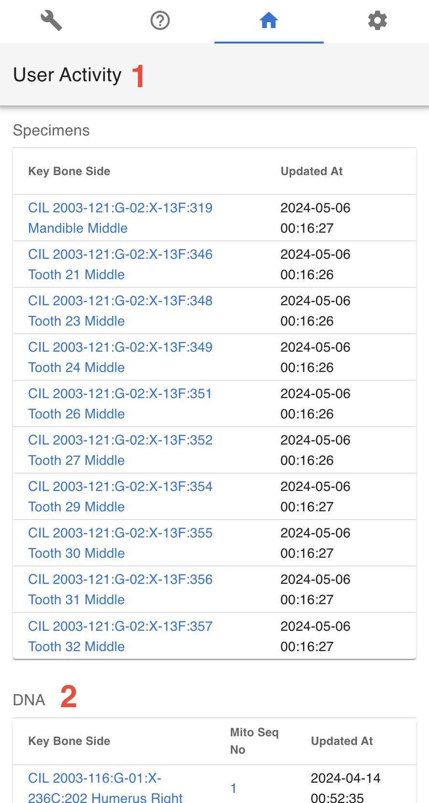

# Site Navigation

In this section we present the basic site navigation. This section provides you with the screenshots of the site and what the icons and symbols mean. The CoRA web application consists of the five basic site navigation layout components.

1. Header/Top Navigation
2. Left Side Drawer 
3. Right Side Drawer 
4. Application Container
5. Footer

   
## Header

### Components
The navigation bar consists of the CoRA icon, toggle the left sidebar button, project switcher dropdown, advance search bar, the notifications icon, user profile avatar, and the right sidebar button.
       

1. CoRA (1) - The CoRA icon take the user to the home page of the site.
2. Toggle the Left Side bar (2) - The Toggle button opens and close the left sidebar.
3. Project Switcher (3) - The Project switcher button allows the user to select the different projects the user is a part of.
4. Advance Search bar (4) - The Advance search bar allows the user to search the Skeletal Elements,DNA, Dental, Missing Person, Isotope and Individual Number. The user can search the Skeletal Element by - Bone, Composite key, Accession, Provenance 1, Provenace 2, Designator, External ID, Individual Number. The DNA can be searched by the Bone, Composite Key, Accession, Sample Number, Mito seq Number, Haplogroup, External Id, Individual Number. The Isotope can be searched  by Bone, Composite key, Accession, Provenance 1, Provenace 2, Designator, External ID, Individual Number. The Dental can be searched by Tooth and Dental Code. The Missing Person can be searched by Case manager, Case Status, Conflict, Genealogy status, First Name, Last Name. The Individual can be searched by Individual Number.                    
5. Search Input (5) - Once the search type is selected the user can enter the value in the search input.
6. Notification Icon (6) - The Notification icon show the notifications of the Export file, Import file, job completion and other user specific notification.
7. User Avatar (7) - The user avatar shows the user drop down. The user drop down has User Image, User Name and Role (1), the github CoRA docs (2), CoRA Forum (3), CoRA Slack (4), change password link (5), the CoRA-Docs (6), the About (7), the My Profile button (8) and the Logout button (9). The Org Profile button will only be available to the Org admin in which the Org Admin can change the settings of the project.    
       
   The header (1) shows the User Image, User Name, email and Role. Github CoRA docs (2) opens the github repo on which the user can check the documentation code. CoRA Forum (3) allows the user to leave comments and other related information about the cora eco system. 
   CoRA Slack (4) allows users and developers to communicate and have private group discussion. The change password link (5) allows the user to change the current password. Online help (6) opens the online help documentation of the CoRA web application, it includes the user manual and other important docs.
   The About (7) displays the meta data of the application and the browser.
   The My Profile button (8) open the user profile page in which the user can save the settings of their choice.
   The Logout button (9) logs out the user out of CoRA Web Application.
8. Right Sidebar Toggle Button (8) - The Right sidebar buttons toggles between the open and closed state of right sidebar.  

### Search Capability

#### Search by Skeletal Elements

##### Bone

With the Bone option, User can search specimens by writing their bone names. As seen in the image above, user can search for the specimen by the bone names such as Humerus, Tiba etc.
The SE eg Humerus, Tibia, Cranium indicates you are searching for the Skeletal elements either by bone Humerus or Tiba or Cranium etc.
At one time, you can only search for one bone name in this search category.

Below is the search result obtained from specimen search by bone 'Accessory Rib'.
 

##### Composite key

When searching by composite key, use the comma separator "," to differentiate between accession number, provenance1, provenance2 and designator fields.

Below is the search result obtained from specimen search by composite key **'CIL 2003-116,G-03,,,712'**.
 

The pattern for the composite search is 'Accession,Provenance1,Provenance2,Designator'. 
If any of fields are not there or if you want to skip some fields, then you can keep the fields empty and use the comma separator.

For example, in the below search criteria, we do not have Provenance 2. So we can lookup for the specimens with accession number, provenance 1 and designator with empty field for provenance 2 with ',' separator.
**CIL 2003-116,,X-219B,712**
 

Similarly, in the screenshot below you can see we have excluded provenance 1 and provenance 2 from our search but have kept the comma separator for them.
 
   
##### Accession

 
With the Accession option, User can search specimens by choosing the their Accession number from the drop down menu. As seen in the image above, user can search for the specimen from the Accession numbers such as '2016-230', '2016-231' etc
At one time, you can only search for one accession number in this search category.
   
Below is the search result obtained from specimen search by Accession number 'CIL 2003-116'.
   
 

##### Provenance 1
  
      
With the Provenance 1 option, User can search specimens by writing their Provenance 1. As seen in the image above, user can search for the specimen by providing the Provenance 1 such as G-21, G-212 etc.
The SE eg G-21 0r G-212 indicates you are searching for the Skeletal elements either by Provenance 1 'G-21' or 'G-212'
At one time, you can only search for one Provenance 1 in this search category.
Below is the search result obtained from specimen search by Provenance 1 'G-57E'.
   
##### Provenance 2

  
         
With the Provenance 2 option, User can search specimens by writing their Provenance 2. As seen in the image above, user can search for the specimen by providing the Provenance 2 such as X-1 etc.
The SE eg X-1 0r Trench 3 indicates you are searching for the Skeletal elements either by Provenance 2 'X-1' or 'Trench 3'
At one time, you can only search for one Provenance 2 in this search category.
Below is the search result obtained from specimen search by Provenance 2 'X-299C'.

   
##### Designator

  
            
With the Designator option, User can search specimens by writing their Designator. As seen in the image above, user can search for the specimen by providing the Designator such as 201, 602 etc.
The SE eg 201 or 602 indicates you are searching for the Skeletal elements either by Designator '201' or '602'.
At one time, you can only search for one Designator in this search category.
Below is the search result obtained from specimen search by Designator '003'.

##### Individual Number
   
  
               
With the Individual Number option, User can search specimens by writing their Individual Number. As seen in the image above, user can search for the specimen by providing the Individual Number such as I-01 etc.
While searching for the specimen using individual number, one has to add its Accession number together with the individual.
For example, in order to search for the specimen having I-01 individual number one has to type '2016-235-I-01' or 'CIL 2003-116-I-01'. 
At one time, you can only search for one Individual Number in this search category.
Below is the search result obtained from specimen search by Individual Number 'I-01' with Accession '2016-235'.

##### Tags
   
  
               
With the Tags option, User can search specimens by their Tag from the dropdown. As seen in the image above, user can search for the specimen by providing the Tag such as "Specimen".

At one time, you can select multiple Tags to search by in this search category.
Below is the search result obtained from specimen search by Tag "Specimen".
#### Search by DNA
   
The search criteria for DNA is similar to Skeletal Elements for Bone, Composite Key, Accession and Individual Number.

##### Sample Number

With the Sample Number option, User can search DNA by writing their Sample numbers. As seen in the image above, user can search for the DNA by the sample numbers such as 68A or 4619A.
The DNA eg 68A or 4619A indicates you are searching for the DNA either by sample numbers '68A' or '4619A' etc.
At one time, you can only search for one sample number in this search category.
   
Below is the search result obtained from DNA search by sample number '68A'.

 

##### Mito Seq Number
 
With the Mito Seq Number option, User can search DNA by writing their Mito Seq Numbers. As seen in the image above, user can search for the DNA by the Mito Seq Number such as 1 or 76.
The DNA eg 1 or 76 indicates you are searching for the DNA either by mito seq numbers '1' or '76' etc.
At one time, you can only search for one mito seq number in this search category.
         
Below is the search result obtained from DNA search by mito seq number '76'.

 

##### External ID
 
With the External ID option, User can search DNA by writing their External IDs. As seen in the image above, user can search for the DNA by the External ID such as 2004H201 or 2015HO860.
The DNA eg. AFDIL # like 2004H2001 or 2015HO860 indicates you are searching for the DNA either by external id '2004H2001' or '2015HO860' etc. In order to search for the DNA, you just have to give the external id without the lab name as shown below.

At one time, you can only search for one external id in this search category.
            
Below is the search result obtained from DNA search by external id '2015H1002'.

 

#### Search by Missing Person

The search criteria for Missing Person are for Case Manager, Case Status, Conflict, Genealogy Status, First Name and Last Name.

##### Case Manager

With the Case Manager option, user can select different case managers associated under the project and click on the search button will display missing person details under that selected case manager.

Below gif display missing person details assigned for case manager named as **Mr. Charlie Johnson**

##### Case Status

With the Case Status option, user can select different case status associated under the project and click on the search button will display missing person details under that selected case status.

Below gif display missing person details whose case status is **completed**.

##### Conflict

With the Conflict option, user can select different Conflict associated under the project and click on the search button will display missing person details under that selected conflict.

Below gif display missing person details assigned to conflict named **World War I**

##### Genealogy Status

With the Genealogy Status option, user can select different Genealogy status associated under the project and click on the search button will display missing person details under that selected genealogy status.

Below gif display missing person details of genealogy status as **completed**

##### First Name

With the First Name option, user can search for different case numbers associated with the given first name under a project and click on the search icon will display missing person details for that selected first name.

Below gif displays missing person details of first name as **Charlie**

## Left Side Drawer

### Module Navigaion Menu

The left side bar includes the various modules of the CoRA web application that the user can select. The left side bar will have modules according to the role of the user. The following section shows the left side bar for Anthropologist-
   
 
      
1. The Dashboard icon takes the user to the dashboard based on the user-role. If the user is Anthropologist then the Anthropologist dashboard will open and if the user iss Org-Admin the Org-Admin Dashboard will open.
   The dashboard page contains data visualization of the specimens data and dna module. 
   The data visualization has pie charts, bar charts, stacked bar charts and other visualization
   The view details button on each visualization shows the data associated with that visualization.
   
2. The Specimen icon open the specimen elements module features like New Specimen Elements, New Bone Group, Skeletal Elements Reports. The New Skeletal Elements opens the page to add the new skeletal element. The New Bone Group opens the page that allows the user to add new skeletal element bone group.
   The Reports dashboard opens the reports dashboard page which allows the user to generate the reports based on the skeletal elements details.
      
3. The DNA icon open the DNA features like Search the specimen element by DNA and Mitochondrial DNA - Advanced Report page. 
          
## Right Side Drawer

The Right side bar includes the 4 different tabs and each of the tabs includes the user specific settings. The following are the tabs in the right side bar -
   1.Layout Options Tab 
   2.Help Tab
   3.Activity Feed Tab
   4.General Settings Tab      
   
 
### Layout Options Tab  
   
Layout Options Tab  includes the Scheme(1), Drawer(2) and Footer (3).      
  
  

The Scheme option allows the user to select between the dark theme or light theme. The default theme is light theme. The dark theme color changes the top navigation bar color. The light theme changes the top navigation
color and the left side bar theme color to light.

The Layout Options (2) allows the user to make changes in the layout of the app. The following are the description of the options in layout-

   Toggle Side Bar (1)- The Toggle Sidebar checkbox open and close the left sidebar. If checked the left side bar will open and if unchecked the left sidebar will be closed.
   Left Sidebar Expand on Hover (2)- This option allows the user to allow the user to show the left sidebar menu on mouseover.
   Toggle Right Sidebar Slide (3)- This options allows the app container to move left. It allows the user to work simultaneously on right side bar tabs and the main app content.
   Toggle Right Sidebar Skin (4)- This options allows the user to toggle between the light and dark background theme on right side bar.

### Help Tab
   
Help Tab (2) - The Help tab allows the user to access the CoRA-Docs inside the right side bar.

    
The documentation of the CoRA application along with the user manual can be found in this tab. The Menu button can be clicked to select the different sections of the documentation.
   
### Activity Feed Tab

The Activity feed tab shows the 10 recent Skeletal Elements and DNA created and updated by the user.
       
        
The key can be of the skeletal element can be clicked which takes the user to the selected skeletal element so, that the user can easily access the recently added skeletal elements and update it if needed. This activity feed can also be found in user profile under the activity feed tab.
   
### General Tab 

The General Tab allows the user to customize the user settings. 
   

   
The Lines per page (1) allows the user to select the number of rows to be display for views with table. The user can set this value from the user profile as well.

The Skeletal Element setting (2) allows the user to set the Accession Number, Provenance 1 and Provenance 2. This value will auto fill the value whenever new skeletal element is created.

The DNA Profile settings (3) in the Gerenal tab allows the user to update the default laboratory and Default DNA Method. Once the user enter the value it will auto-populate the DNA association screen for Skeletal Elements.
   
   
## Application Container

The Application container is the main area which includes all the CoRA-Modules.
      

### Breadcrumbs
The Application container has Breadcrumbs (1) on the top left which shows on which page the user is currently working on. It helps the user to go back to the last page.
      
### Page title
The Title of the page (2) the user is working on.
      
### Action button group
The Action button group (3). This button may or may not be present based on the page the user is working on. If the page has no action this button will not be present.
        
## Footer

The footer consists of the logos and product information
