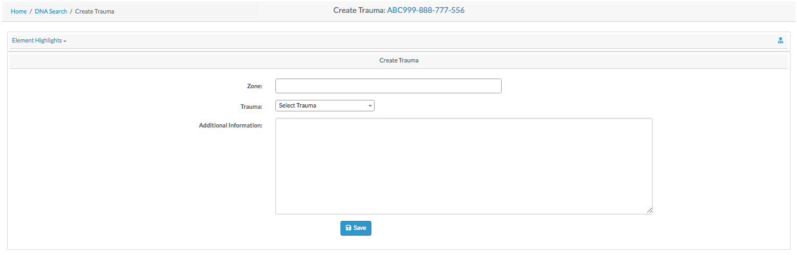
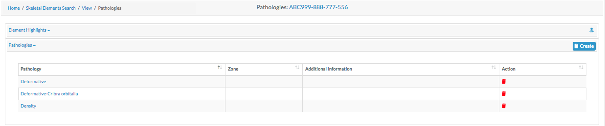
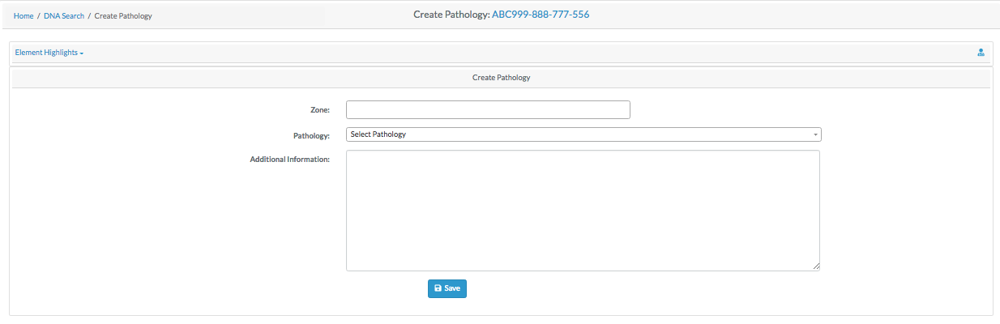

Specimen are individual human remains which can be categorized. Many of the modules on the site are focused on specimens and their details. This section will explore:

- Specimen Navigation
- Creating a New Specimen 
- Creating a New Specimen Group
- Specimen Search
- Specimen Details

##### Specimen Navigation

On the left side bar - you can access the main options for specimens. For Report Dashboard - please see the **Reports** documentation.

##### Creating a New Specimen

To create a new specimen - click the "New" link on the Specimens left navigation bar. You will be taken to the new specimen screen.

The fields to create a new specimen are:

- **Accession**
- Provenance Number 1
- Provenance Number 2
- **Designator**
- **Bone**
- **Side**
- **Completeness**

The bolded fields are required. Below are some fields with some validation rule
 
 Element  | Validation Rule  | Required/Optional
 ------------- | -------------| -------------
 Accession  |  Can only contain letters, numbers, dash and space | Required
 Provenance 1 | Can only contain letters, numbers, dash and space  | Optional
 Provenance 2  |  Can only contain letters, numbers, dash and space | Optional
 Designator | Can only contain letters and numbers | Required
  
 Once you have filled out all the fields, click the save button, and you will be taken to the Specimen View page.

##### Specimens View

This page is view only, here all fields related to the specimens are displayed. To further edit the new specimen, click the "Actions" button, and select edit. The screen will refresh will all fields being editable. The fields available for edit are:

- **Accession**
- Provenance 1
- Provenance 2
- **Designator**
- **Bone**
- **Side**
- **Completeness**
- Status of the bone, including:
  - Measured 
  - DNA Sampled 
  - Isotope Scanned
  - Inventory Completed 
  - Reviewed
  - CT Scanned
  - X-ray Scanned 
  - 3D Scanned
- Individual Number
- Identification Date
- Remains Status
- Remains Release Date

The bolded fields are required. Some of the fields along with their validation rules are as follows:

 Element  | Validation Rule  | Required/Optional
 ------------- | -------------| -------------
 Accession  |  Can only contain letters, numbers, dash and space | Required
 Provenance 1 | Can only contain letters, numbers, dash and space  | Optional
 Provenance 2  |  Can only contain letters, numbers, dash and space | Optional
 Designator | Can only contain Alphanumeric (letters and numbers) | Required
 Individual Number | Can only contain letters, numbers, dash and space | Optional
 Side  |  Either Left, Right, Middle or Unsided| Required
 Completeness | Either Complete or Incomplete | Required
 Measured  |  Boolean (True or False) | Optional
 DNA Sampled| Boolean (True or False) | Optional
 Isotope Scanned | Boolean (True or False) | Optional
 Inventory Completed |  Boolean (True or False) | Optional
 Reviewed| Boolean (True or False) | Optional
 CT Scanned | Boolean (True or False) | Optional
 X-ray Scanned| Boolean (True or False) | Optional
 3D Scanned | Boolean (True or False) | Optional
 Remain Status | Either In Lab or Released | Optional
Click "Save" When you are done making changes. 

To add another new specimen, clicks "Actions" followed by "Create".

##### New Bone Group

To add a new bone group - click "New Bone Group" on the left navbar. You will be taken to the "New Bone Group Page". 
Here you can create a superclass which can contain multiple specimens.

The fields to create a new bone group are:

- **Grouping**
- **Bones**
- **Accession**
- Provenance Number 1
- Provenance Number 2
- **Starting Designator**
- **Side**
- **Completeness**
- Trauma
- Pathology
- Taphonomy

The bolded fields are required. Below are some fields with some validation rule
 
  Element  | Validation Rule  | Required/Optional
  ------------- | -------------| -------------
  Grouping  |  Can only contain letters | Required
  Bones | UUID  | Required
                             
                                 

Once you have created a new bone group, you can edit the fields and click "Save" to update the bone group.

##### Specimens Search

The easiest way to search for specimens is to use the top search bar in the nav bar. To complete a search, first select the project you wish to search on the left-most select field, you will only be able to view projects which are assigned to your user profile. 

By default, "Bone" is selected as the search option. Select the desired search category before typing your search text into the search bar. Then click the magnifying glass to execute your search.

Once you complete your search, you are taken to the Specimens search screen. The following columns are visible for all the specimens search:

- Key
- Bone
- Side
- Bone Group
- Individual Number
- DNA Sampled
- Mito Sequence Number
- Measured
- Isotope Sampled
- Clavicle Triage
- CT Scanned
- Xray Scanned

There are some columns which are not displayed at the screen but can be made visible by checking the column visibility section. The names of those columns are given below:
- Inventoried
- Reviewed
- Inventoried By
- Inventoried At
- Reviewed By
- Reviewed At
- Created By
- Created At
- Updated By
- Updated At

On this page you can filter how many results are shown per page, as well as search the results.
To view the details of a skeletal elements, click on the key in the search results. You can also export the search results in Excel and PDF format. 

##### Specimen Detail View

 
 The skeletal elements detail view consists of the same fields when a new skeletal element is created:
 
- **Accession**
- Provenance 1
- Provenance 2
- **Designator**
- **Bone**
- **Side**
- **Completeness**
- Status of the bone, including:
  - Measured 
  - DNA Sampled 
  - Isotope Scanned
  - Inventory Completed 
  - Reviewed
  - CT Scanned
  - X-ray Scanned 
  - 3D Scanned
- Individual Number
- Identification Date
- Remains Status
- Remains Release Date

If you have correct permissions, you can click in actions button in the top right to either edit the specimen, or create a new one. (See Creating A new Specimen)

### Specimen Details  
When you are view the details of a specimen, you can click "Details" in the top left to select a specimen detail drilldown. Each of these selections will be described in detail.  

##### Biological Profile

There are 4 Biological Profile subcategories. 

##### Age

The biological profile age search is broken down in the "Element Highlights" and "Methods" sections. The element highlights section is read only and displays the following information about the selected bone:
- Bone
- Side
- Completeness
- Status of the bone, including:
   - Measured Status
   - DNA Sampled Status
   - Inventory Completed Status
   - Reviewed Status
 
The "Methods" section of the pane displays the age of the bone by chosen method. This requires that you have selected a method from the "Applicable Methods" select box. If no age is present, select the desired method in the "Applicable Methods" select box and click "Create". You will be taken to the Create Age Method page.

Fill in the desired fields for your selected Bone Age Method and click "Save". When you return to the Bone Age page you will see the age of the bone in the selected method.

##### Sex

The biological profile sex search is broken down in the "Element Highlights" and "Methods" sections. The element highlights section is read only and displays the following information about the selected bone:
- Bone
- Side
- Completeness
- Status of the bone, including:
   - Measured Status
   - DNA Sampled Status
   - Inventory Completed Status
   - Reviewed Status
 
 If no bone sex table is present under the "Methods" tab - click on "Create" after choosing the Desired sex method from the "Applicable Method" dropdown. You will be taken to the "Create Method" screen.
 

Select the desired options, and click "Save". You will be taken back to the Sex Biological Profile screen with the chosen method appearing in the "Methods" dropdown.

##### Stature

The biological profile stature search is broken down in the "Element Highlights" and "Methods" sections. The element highlights section is read only and displays the following information about the selected bone:
- Bone
- Side
- Completeness
- Status of the bone, including:
   - Measured Status
   - DNA Sampled Status
   - Inventory Completed Status
   - Reviewed Status

The bone stature detail shows the stature detail of the chosen bone. You must select a stature method for a stature to appear in the "Methods" tab.

##### Ancestry

The biological profile ancestry search is broken down in the "Element Highlights" and "Methods" sections. The element highlights section is read only and displays the following information about the selected bone:
- Bone
- Side
- Completeness
- Status of the bone, including:
   - Measured Status
   - DNA Sampled Status
   - Inventory Completed Status
   - Reviewed Status

The bone ancestry detail shows the stature detail of the chosen bone. You must select a stature method for a stature to appear in the "Methods" tab.

##### DNA Profile

The DNA Profile screen displays the following elements about a bone:

- **DNA Sample Number**
- **Lab**
- External Case #
- BTB Request Date
- BTB Results Date
- Disposition
- Sample Condition
- Weight Sample Remaining

The bolded elements are required.

On this screen, you can also view the "Mito", "auSTR", and "Y-STR" tabs.

##### Isotope Analysis

The Isotope Analysis is broken down in the "Element Highlights" and "Create Isotope" sections. The element highlights section is read only and displays the following information about the selected bone:
- Bone
- Side
- Completeness
- Status of the bone, including:
   - Measured Status
   - DNA Sampled Status
   - Inventory Completed Status
   - Reviewed Status

The 'Create Isotope' section allows to create a isotope for the given bone. This section ahs the following elements. 
- **Lab**
- External Case #
- **Isotope Sample Number**

The bolded elements are required.

##### Taphonomy

The taphonomy search is broken down in the "Element Highlights" and "Taphonomies" sections. The element highlights section is read only and displays the following information about the selected bone:
- Bone
- Side
- Completeness
- Status of the bone, including:
   - Measured Status
   - DNA Sampled Status
   - Inventory Completed Status
   - Reviewed Status

The Taphonomies section allows you to view Taphonomies for the given bone. To add Taphonomies, click the "Actions" button and then "Edit". 

Click Save when finished adding Taphonomies to be returned to the Taphonomy page.

##### Zonal Classification

The zonal search is broken down in the "Element Highlights" and "Zones" sections. The element highlights section is read only and displays the following information about the selected bone:

- Bone
- Side
- Completeness
- Status of the bone, including:
   - Measured Status
   - DNA Sampled Status
   - Inventory Completed Status
   - Reviewed Status
   
The Zones pane displays various zones of the bone. For example below are the following zones about the bone Radius:

- Lateral half of radial head
- Medial half of radial head
- Lateral portion of distal articulation
- Medial portion of distal articulation
- Proximal diaphysis
- Lateral half of diaphysis
- Medial half of diaphysis
- Superior half of distal third
- Lateral distal third
- Medial distal third
- Styloid process

These fields are read only - to edit then click "Actions" - then "Edit".
When you are finished making changes click save on the bottom of the page.

##### Measurements

The measurement search is broken down in the "Element Highlights" and "Measurements" sections. The element highlights section is read only and displays the following information about the selected bone:

- Bone
- Side
- Completeness
- Status of the bone, including:
   - Measured Status
   - DNA Sampled Status
   - Inventory Completed Status
   - Reviewed Status
  
The measurements pane display various measurements of the given bone. The following are the measurements for a given bone Radius:
- Rad_01 Maximum Length
- Rad_02 Maximum Diameter of the Radius at Midshaft
- Rad_03 Minimum Diameter of the Radius at Midshaft
- Rad_04 Maximum Diameter of the Head
- Rad_05 Anterior-Posterior (Sagittal) Diameter at Midshaft
- Rad_06 Medial-Lateral (Transverse) Diameter at Midshaft
- Rad_07 Maximum Diameter at the Radial Tuberosity
- Rad_08 Maximum Diameter of the Diaphysis Distal to the Radial Tuberosity
- Rad_09 Minimum Diameter of the Diaphysis Distal to the Radial Tuberosity
- Rad_10 Breadth of the Distal Epiphysis
  
  These fields are read only - to edit then click "Actions" - then "Edit".
  When you are finished making changes click save on the bottom of the page.

### Associations   
##### Articulations

The Articulations search is broken down in the "Element Highlights" and "Articulations" sections. The element highlights section is read only and displays the following information about the selected bone:

- Bone
- Side
- Completeness
- Status of the bone, including:
   - Measured Status
   - DNA Sampled Status
   - Inventory Completed Status
   - Reviewed Status
  
The articulations section is read-only, and shows articulation information for a given bone. To make edits, go to "Actions" "Edit". Click Save when finished adding articulation to be returned to the articulations page.
  

Once the articulation method is added, you are taken Articulation screen. The following columns are visible for all the Articulations:

- Key
- Bone
- Side
- Bone Group
- Individual Number
- DNA Sampled
- Mito Sequence Number
- Measured
- Isotope Sampled
- Clavicle Triage
- CT Scanned
- Xray Scanned

There are some columns which are not displayed at the screen but can be made visible by checking the column visibility section. The names of those columns are given below:
- Inventoried
- Reviewed
- Inventoried By
- Inventoried At
- Reviewed By
- Reviewed At
- Created By
- Created At
- Updated By
- Updated At

##### Pair Matching

The Pair Matching search is broken down in the "Element Highlights" and "Pair Matches" sections. The element highlights section is read only and displays the following information about the selected bone:

- Bone
- Side
- Completeness
- Status of the bone, including:
   - Measured Status
   - DNA Sampled Status
   - Inventory Completed Status
   - Reviewed Status
  
The Pair Matching section is read-only, and shows Pair Matches information for a given bone. To make edits, go to "Actions" "Edit". Click Save when finished adding pair matches to be returned to the Pair Matching page.
The columns in the Pair Matching are similar to the Articulation screen.

##### Refits

The Refits search is broken down in the "Element Highlights" and "Refits" sections. The element highlights section is read only and displays the following information about the selected bone:

- Bone
- Side
- Completeness
- Status of the bone, including:
   - Measured Status
   - DNA Sampled Status
   - Inventory Completed Status
   - Reviewed Status
  
The Refits section is read-only, and shows Refits information for a given bone. To make edits, go to "Actions" "Edit". Click Save when finished adding Refits to be returned to the Refits page.
### Pathology   

##### Trauma

The Trauma search is broken down in the "Element Highlights" and "Trauma" sections. The element highlights section is read only and displays the following information about the selected bone:

- Bone
- Side
- Completeness
- Status of the bone, including:
   - Measured Status
   - DNA Sampled Status
   - Inventory Completed Status
   - Reviewed Status
  
The Trauma section is read-only, and shows Trauma information for a given bone. To make edits, go to "Create". 

Click Save when finished adding Trauma to be returned to the Trauma page.

##### Pathology

The Pathology search is broken down in the "Element Highlights" and "Pathology" sections. The element highlights section is read only and displays the following information about the selected bone:

- Bone
- Side
- Completeness
- Status of the bone, including:
   - Measured Status
   - DNA Sampled Status
   - Inventory Completed Status
   - Reviewed Status
  
The Pathology section is read-only, and shows Pathology information for a given bone. To make edits to go "Actions" "Edit". 

Click Save when finished adding Trauma to be returned to the Trauma page.

##### Anomaly

The Anomaly search is broken down in the "Element Highlights" and "Anomaly" sections. The element highlights section is read only and displays the following information about the selected bone:

- Bone
- Side
- Completeness
- Status of the bone, including:
   - Measured Status
   - DNA Sampled Status
   - Inventory Completed Status
   - Reviewed Status
  
The Anomaly section is read-only, and shows Anomaly information for a given bone. To make edits, go to "Actions" "Edit". 

Click Save when finished adding Anomalies to be returned to the Anomaly page.

### Review

The review tab is a pane which displays all other sub reports in one area. All reports are editable in the pane.
For information on individual reports - see their detailed documentation.

