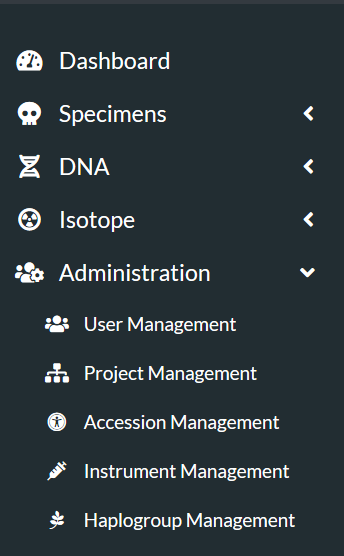
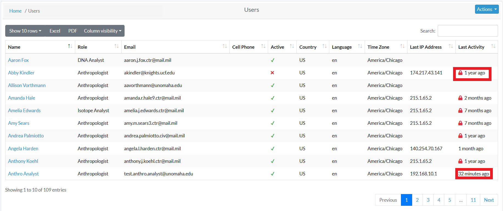
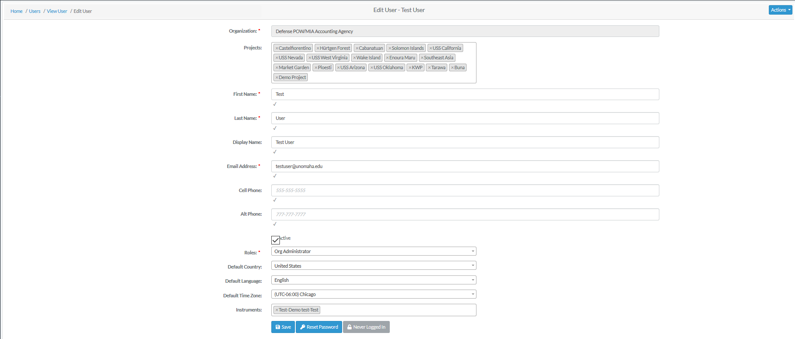
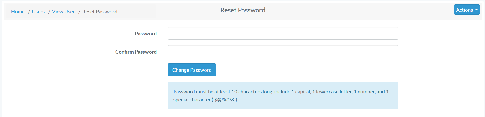

# Users Roles Permissions

User accounts can be created by Org Admins, and can be set up under various roles. Certain roles provide specific level of access to features on the website.

## User Roles

1. Org Administrator
2. Org Manager
3. Anthropologist
4. DNA Analyst
5. Anthropologist - Project Lead
6. Isotope Analyst
7. Historian 
8. Dentist
9. Intern

-------

To edit or create users, navigate to "Administration" - "User Management"

You will be taken to a list of all application users.

### Edit an Existing User

Click on their name in all user list. You will be taken to a read only page of their user profile. 

To Edit their Profile Information - Click "Actions" - "Edit". 

 
The following fields are available on the user edit screen:

- **Organization**
- Projects
- **First Name**
- **Last Name**
- Display Name
- **Email Address**
- Cell Phone
- Alt Phone
- **Active Profile Flag**
- **Roles**
- Default Country
- Default Language
- Default Time Zone
- Instruments
 
Bold fields are required. Click save when finished editing.
  
To Reset their Password - Click "Reset Password".

 
Enter the new password in both the fields and change password.

  

### User Permissions

A user's permissions are determined by the Role they have been assigned. A User may only have one role assigned.