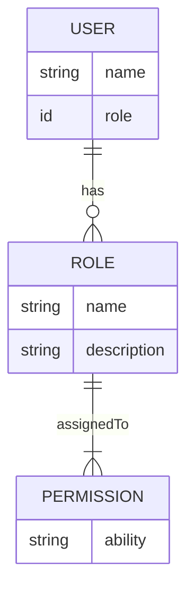
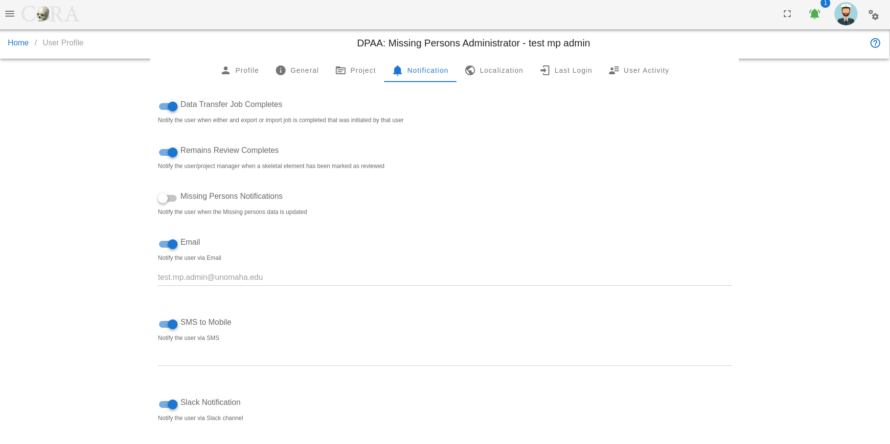

# User Roles Permissions

The CoRA application's authorization is structured around the concept of user, roles and permissions. What does this mean for you?
CoRA was designed with security and traceability in mind to handle both Authentication and Authorization within the application. Each User within
the organization has a role and these roles have permissions assigned to them. The roles can be that of Anthropologist, DNA analyst, Isotope Analyst, Manager, etc. Each model or resources within CoRA such as Specimen, DNA, Isotope, Missing Person, etc has browse (list), read, edit, add (create) and delete permissions.
Each role has a permission set that allows the user with that role to access specific functionaility within CoRA. The entiity-relationship diagram below shows this relationship.

## User

:material-account: Users in CoRA belong to a org and user accounts are created and typically assigned to projects by the org administrator.
Anyone who uses CoRA must have a user account and must be assigned a role (such as org administrator, anthropologist, dna analyst, isotope analyst, dentist, historian, etc). Each role is assigned a set of permissions that provides a specific level of authorization to features wothin CoRA. The users are responsible for managing and updating their user profile which are attributes that control user settings within CoRA.

## Roles

:material-account-tie-hat: Roles in CoRA is a container that holds a set of permissions. In CoRA permissions are assigned to a role which is done by the system.

### Roles Table

Following is a list of roles within CoRA.

1. Org Administrator
2. Manager
3. Anthropologist
5. Anthropologist - Project Lead
4. DNA Analyst
6. Isotope Analyst
7. Historian 
8. Dentist
9. Intern
10. Missing Persons Administrator
11. Missing Persons Case Manager

!!! tip

    The org administrator role should be restricted to one user within your organization.

## Permissions

:material-shield-account: Permissions in CoRA are set at the model or resource level. Each model or resources within CoRA such as Specimen, DNA, Isotope, Missing Person, etc has browse (list), read, edit, add (create) and delete permissions. Each role has a permission set that allows the user with that role the ability to access specific functionaility within CoRA.

## User Profile

CoRA has a very powerful and flexible design which allows every user to customize how they would like to use CoRA for their projects. Creating a good and friendly user experience is what CoRA strives for. Users can navigate to the user profile by clicking on the avatar icon on the top right corner. The User Profile screen is where you manage these settings. The information here is organized within tabs, each of these tabs is discussed below.

### About Profile

In the About tab the user can view their current details and can edit the Name, Cell Phone, Alternative Phone, Slack Channel. The Email and the Organization name are readonly.

### General

In the General tab the user can update the following

1. Lines per page, this will control the numbers of rows to display in data tables within CoRA. 
2. Welcome Screen, user can choose to display the Welcome Screen on startup when the user logs into the application. 
3. Help Slideout, user can choose to have help slide out the right sidebar with help on screens such as Specimen measurements, zones and methods.

### Project

In the Projects tab the user can update the following within expansion panels.

1. Project: 
    1. User can set the default project to use when the user logs into the application.
2. Specimen: 
    1. User can set the accession, provenance1 , provenance2 number that will be auto-populated on New Specimen screen. 
    2. The MRU List specimen is the number of Most Recently Used/Accessed (MRU List) Specimens to keep track of. 
    3. User can set a page direct to any Specimen association module after the creation of a new Specimen.
3. DNA
    1. The user can set the lab to be auto-populated on the DNA association screen for Specimen.
    2. Users can add a configurable default search option to use for quick search. 
    3. The DNA method will be auto-populated on Y-STR, auSTR DNA associations for Specimens based on the selections in the tab. 
    4. Also the user can choose to select an option that will use older DNA sample record information if a new DNA sample record exists but has NULL values.
4. Search: 
    1. User can set a default search option. 
    2. User can an save the last used Search By criteria and the search will be defaulted to this saved Search By criteria. 
    3. User can choose to open the Specimen screen in a new tab via the Search resulst screen.

### Notification

In the Notification tab the user can choose to receive a notification when 
1. Either an export or import job is completed that was initiated by that user.
2. When a specimen has been marked as reviewed,
3. When changes are made to the DPAA Priority field in Missing Persons records.
4. User can select which methods for notification they want to use. The notification can be through Email, SMS, or Slack.

### Localization

In the Localization tab the user can update their default County, Language and Timezone.

### Last Login

In the Last Login tab the user can view information such as last login time, Device, Total Number of logins, IP address and Password last changed.

### User Activity

In the User Activity tab the user can view the user activity feed for specimens as a table with columns such as Key, Name, Side, Completeness and Updated At details. Also there is the user activity feed table for DNA with the fields such as key, Mito sequence Number, Mito sequence subgroup and Update at columns with details.

