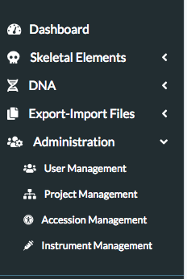
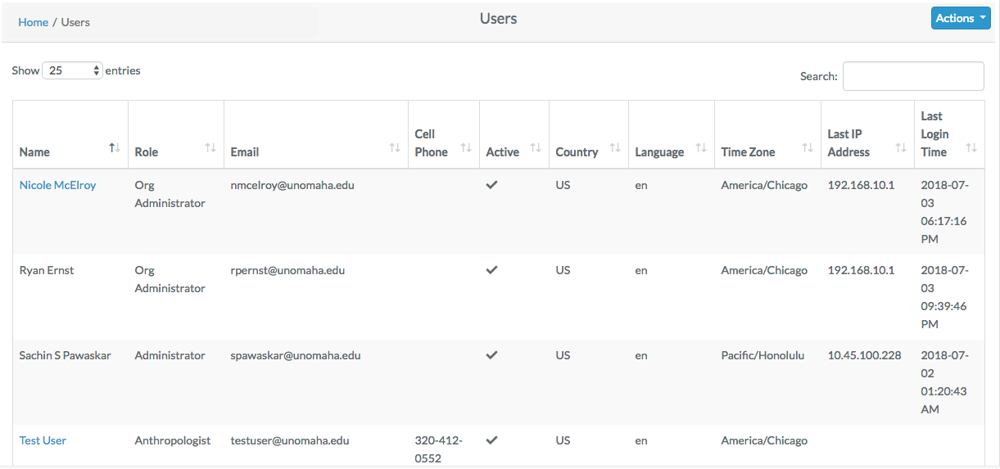
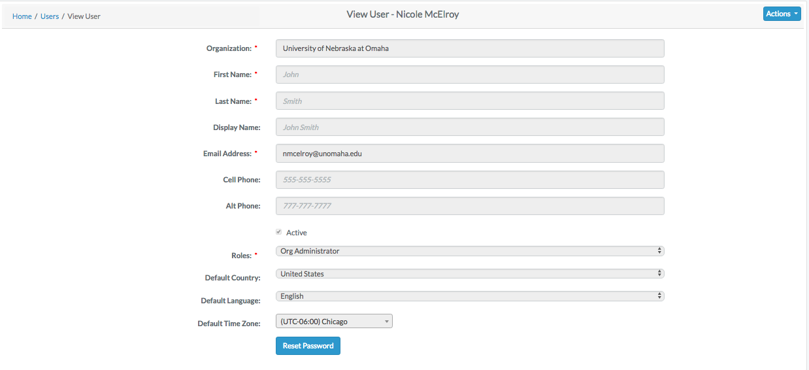
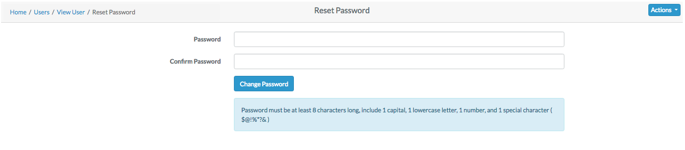

# Users Roles Permissions

To edit or create users, navigate to "Administration" - "User Management"

You will be taken to a list of all application users.

### Edit an Existing User

Click on their name in all user list. You will be taken to a read only page of their user profile. 

To Reset their Password - Click "Reset Password".

To Edit their Profile Information - Click "Actions" - "Edit". 

The following fields are available on the user edit screen:

 - **Organization**
 - **First Name**
 - **Last Name**
 - Display Name
 - **Email Address**
 - Cell Phone
 - Alt Phone
 - **Active Profile Flag**
 - **Roles**
 - **Default Country**
 - **Default Language**
 - **Default Time Zone**  
  Bold fields are required.
  
### Add a New User

Click on "Actions" - "Add". 

The following fields are available on the user create screen:
 - **First Name**
 - **Last Name**
 - **Email Address**
 - Cell Phone
 - **Active Profile Flag**
 - **Roles**
 - **Password**
 - **Confirm Password**  
   Bold fields are required. Click save when finished editing.

### User Permissions

A user's permissions are determined by the Role they have been assigned. A User may only have one role assigned.