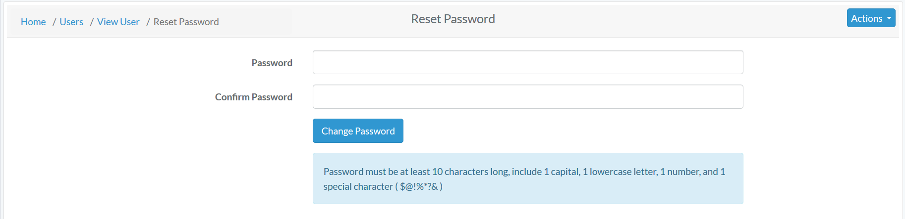

# Users Roles Permissions

To edit or create users, navigate to "Administration" - "User Management"

You will be taken to a list of all application users.

### Edit an Existing User

Click on their name in all user list. You will be taken to a read only page of their user profile. 

To Edit their Profile Information - Click "Actions" - "Edit". 

 
The following fields are available on the user edit screen:

- **Organization**
- Projects
- **First Name**
- **Last Name**
- Display Name
- **Email Address**
- Cell Phone
- Alt Phone
- **Active Profile Flag**
- **Roles**
- Default Country
- Default Language
- Default Time Zone
- Instruments
 
Bold fields are required. Click save when finished editing.
  
To Reset their Password - Click "Reset Password".

 
Enter the new password in both the fields and change password.

  

### User Permissions

A user's permissions are determined by the Role they have been assigned. A User may only have one role assigned.